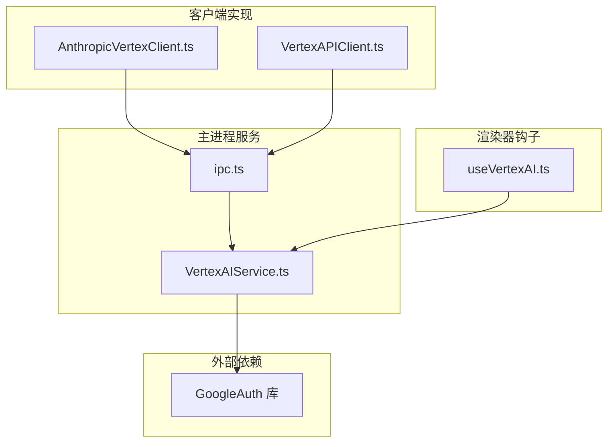
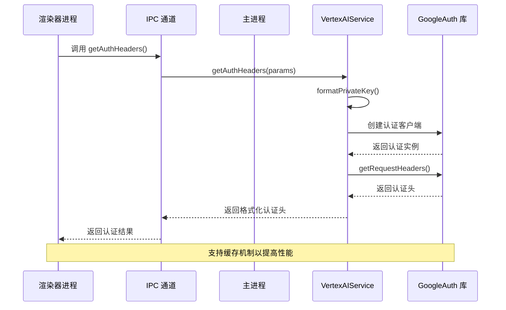
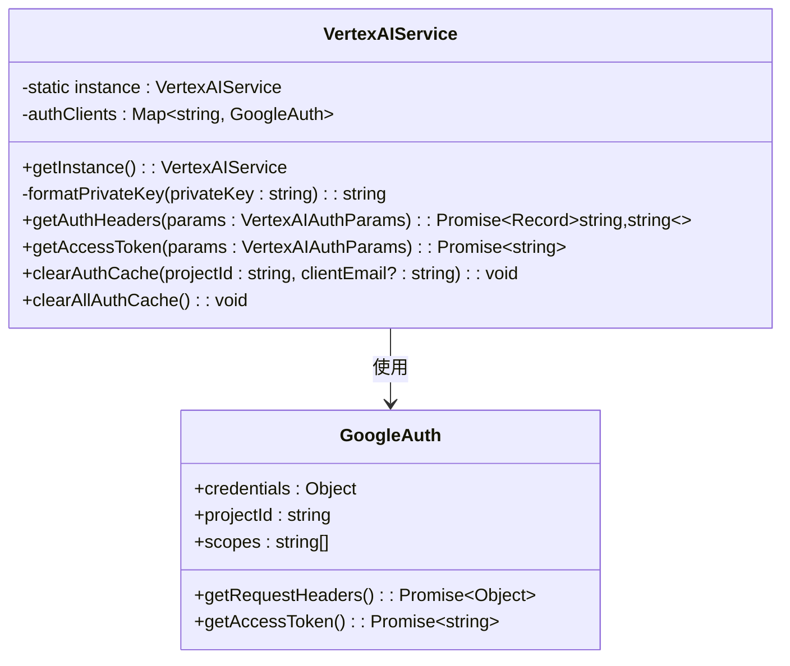
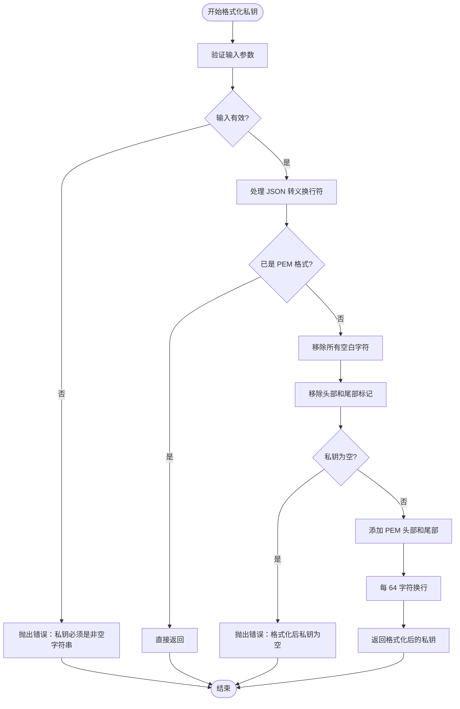
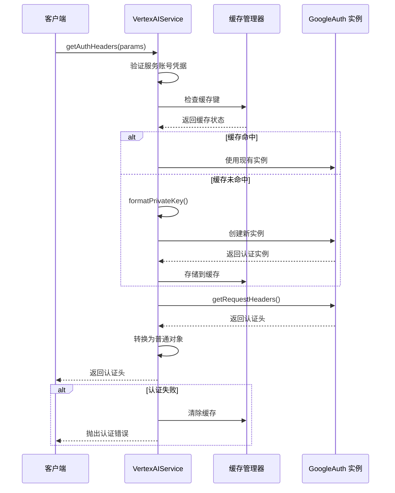
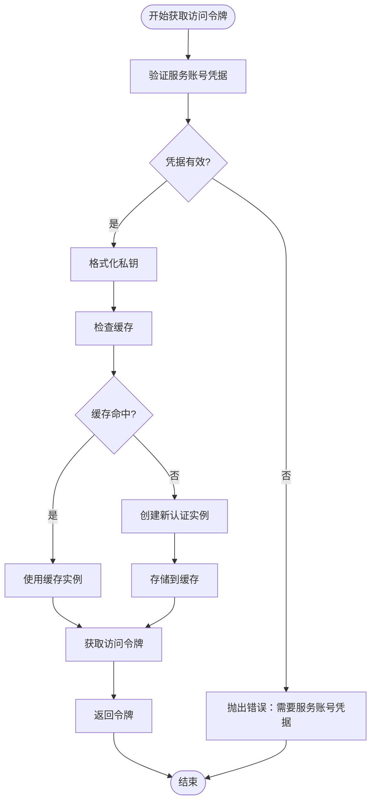
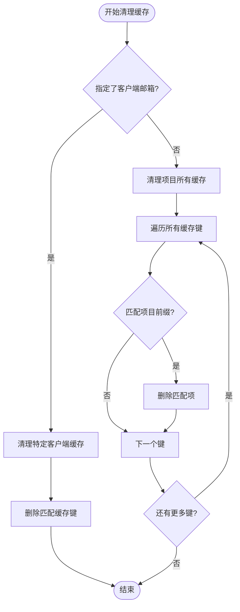
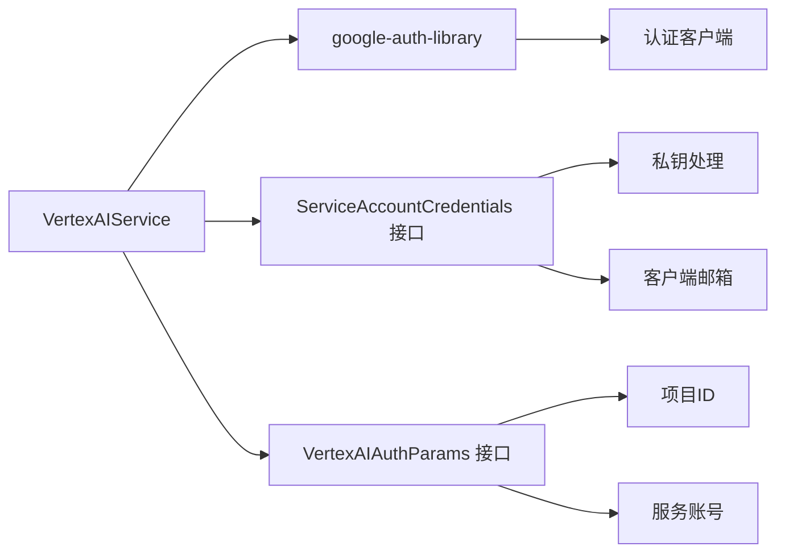
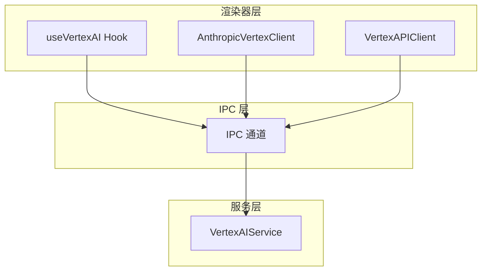

# Vertex AI 云服务提供商集成文档

<cite>
**本文档中引用的文件**
- [VertexAIService.ts](file://src/main/services/VertexAIService.ts)
- [ipc.ts](file://src/main/ipc.ts)
- [useVertexAI.ts](file://src/renderer/src/hooks/useVertexAI.ts)
- [AnthropicVertexClient.ts](file://src/renderer/src/aiCore/legacy/clients/anthropic/AnthropicVertexClient.ts)
- [VertexAPIClient.ts](file://src/renderer/src/aiCore/legacy/clients/gemini/VertexAPIClient.ts)
</cite>

## 目录
1. [简介](#简介)
2. [项目结构](#项目结构)
3. [核心组件](#核心组件)
4. [架构概览](#架构概览)
5. [详细组件分析](#详细组件分析)
6. [依赖关系分析](#依赖关系分析)
7. [性能考虑](#性能考虑)
8. [故障排除指南](#故障排除指南)
9. [结论](#结论)

## 简介

Cherry Studio 中的 Google Vertex AI 云服务提供商集成为开发者提供了与 Google Cloud Vertex AI 平台进行安全交互的能力。该集成采用基于服务账号密钥的认证机制，通过单例模式管理认证状态，并支持高效的缓存策略以优化性能。

本文档详细介绍了 Vertex AI 服务的核心功能，包括私钥格式化、认证头生成、访问令牌获取以及缓存管理等关键特性。

## 项目结构

Vertex AI 集成在 Cherry Studio 中的组织结构如下：

**图表来源**
- [VertexAIService.ts](file://src/main/services/VertexAIService.ts#L1-L174)
- [ipc.ts](file://src/main/ipc.ts#L97-L97)

**章节来源**
- [VertexAIService.ts](file://src/main/services/VertexAIService.ts#L1-L174)
- [ipc.ts](file://src/main/ipc.ts#L97-L97)

## 核心组件

### 服务账号认证接口

Vertex AI 集成定义了两个核心接口来处理认证凭据：

| 接口名称 | 描述 | 字段说明 |
|---------|------|----------|
| `ServiceAccountCredentials` | 服务账号凭据接口 | `privateKey`: 私钥字符串 `clientEmail`: 客户端邮箱地址 |
| `VertexAIAuthParams` | Vertex AI 认证参数接口 | `projectId`: Google Cloud 项目ID `serviceAccount`: 可选的服务账号凭据 |

### 认证范围常量

系统定义了必需的认证范围：
- **REQUIRED_VERTEX_AI_SCOPE**: `'https://www.googleapis.com/auth/cloud-platform'`

**章节来源**
- [VertexAIService.ts](file://src/main/services/VertexAIService.ts#L3-L13)

## 架构概览

Vertex AI 服务采用单例模式设计，通过 IPC 通道在主进程和渲染器进程之间提供认证服务：

**图表来源**
- [VertexAIService.ts](file://src/main/services/VertexAIService.ts#L63-L114)
- [ipc.ts](file://src/main/ipc.ts#L741-L743)

## 详细组件分析

### 单例模式实现

VertexAIService 采用经典的单例模式实现，确保整个应用程序中只有一个认证服务实例：

**图表来源**
- [VertexAIService.ts](file://src/main/services/VertexAIService.ts#L15-L174)

#### 实例化机制

单例模式的实现遵循以下逻辑：
1. 检查静态实例是否存在
2. 如果不存在，则创建新实例
3. 返回现有或新创建的实例

**章节来源**
- [VertexAIService.ts](file://src/main/services/VertexAIService.ts#L19-L23)

### 私钥格式化机制

`formatPrivateKey` 方法是 Vertex AI 集成的核心安全特性，负责将原始私钥字符串转换为标准的 PEM 格式：

**图表来源**
- [VertexAIService.ts](file://src/main/services/VertexAIService.ts#L29-L57)

#### 格式化步骤详解

1. **输入验证**: 确保私钥存在且为非空字符串
2. **转义处理**: 将 JSON 字符串中的 `\n` 转换为实际换行符
3. **格式检查**: 验证是否已包含 PEM 标记
4. **清理操作**: 移除所有空白字符和现有标记
5. **验证完整性**: 确保私钥内容不为空
6. **标准化输出**: 添加正确的 PEM 格式并按 64 字符分行

**章节来源**
- [VertexAIService.ts](file://src/main/services/VertexAIService.ts#L29-L57)

### 认证头生成机制

`getAuthHeaders` 方法实现了完整的认证流程，包括缓存管理和错误处理：

**图表来源**
- [VertexAIService.ts](file://src/main/services/VertexAIService.ts#L63-L114)

#### 缓存策略

认证头生成采用了基于 `projectId` 和 `clientEmail` 的复合缓存键策略：

| 缓存键格式 | 用途 | 示例 |
|-----------|------|------|
| `{projectId}-{clientEmail}` | 唯一标识特定项目和服务账号的认证实例 | `my-project-id-service-account@example.com` |

**章节来源**
- [VertexAIService.ts](file://src/main/services/VertexAIService.ts#L63-L114)

### 访问令牌获取机制

`getAccessToken` 方法提供了直接获取访问令牌的功能，适用于不需要完整认证头的场景：

**图表来源**
- [VertexAIService.ts](file://src/main/services/VertexAIService.ts#L117-L146)

**章节来源**
- [VertexAIService.ts](file://src/main/services/VertexAIService.ts#L117-L146)

### 缓存清理机制

Vertex AI 服务提供了两级缓存清理功能：

#### 单项目缓存清理

**图表来源**
- [VertexAIService.ts](file://src/main/services/VertexAIService.ts#L150-L169)

#### 全局缓存清理

`clearAllAuthCache` 方法提供了一次性清理所有认证缓存的功能，适用于重置整个认证状态的场景。

**章节来源**
- [VertexAIService.ts](file://src/main/services/VertexAIService.ts#L150-L169)

### IPC 通信注册

Vertex AI 服务通过 IPC 通道向渲染器进程暴露以下 API：

| IPC 方法名 | 功能描述 | 参数类型 | 返回类型 |
|-----------|----------|----------|----------|
| `VertexAI_GetAuthHeaders` | 获取认证头 | `VertexAIAuthParams` | `Promise<Record<string,string>>` |
| `VertexAI_GetAccessToken` | 获取访问令牌 | `VertexAIAuthParams` | `Promise<string>` |
| `VertexAI_ClearAuthCache` | 清理认证缓存 | `string, string?` | `void` |

**章节来源**
- [ipc.ts](file://src/main/ipc.ts#L742-L752)

## 依赖关系分析

### 外部依赖

Vertex AI 服务的核心依赖关系如下：

**图表来源**
- [VertexAIService.ts](file://src/main/services/VertexAIService.ts#L1-L13)

### 内部依赖

服务与其他 Cherry Studio 组件的集成关系：

**图表来源**
- [useVertexAI.ts](file://src/renderer/src/hooks/useVertexAI.ts#L1-L73)
- [AnthropicVertexClient.ts](file://src/renderer/src/aiCore/legacy/clients/anthropic/AnthropicVertexClient.ts#L85-L104)
- [VertexAPIClient.ts](file://src/renderer/src/aiCore/legacy/clients/gemini/VertexAPIClient.ts#L96-L143)

**章节来源**
- [VertexAIService.ts](file://src/main/services/VertexAIService.ts#L1-L13)
- [ipc.ts](file://src/main/ipc.ts#L97-L97)

## 性能考虑

### 缓存优化策略

Vertex AI 服务采用了多层次的性能优化策略：

1. **实例级缓存**: 基于 `projectId` 和 `clientEmail` 的组合键缓存认证实例
2. **内存管理**: 使用 `Map` 数据结构提供 O(1) 的缓存查找性能
3. **延迟初始化**: 仅在首次请求时创建认证实例
4. **自动清理**: 提供主动清理机制防止内存泄漏

### 错误恢复机制

服务实现了完善的错误处理和恢复机制：

- **认证失败处理**: 自动清除失效的缓存实例
- **格式化错误**: 提供详细的私钥格式化错误信息
- **网络异常**: 包装 GoogleAuth 库的网络错误

## 故障排除指南

### 常见问题及解决方案

#### 私钥格式化错误

**问题症状**: `Invalid private key format` 错误
**可能原因**: 
- 私钥字符串包含无效字符
- 私钥格式不正确
- JSON 转义处理不当

**解决方案**:
1. 验证私钥字符串的有效性
2. 确保私钥包含正确的 PEM 标记
3. 检查 JSON 转义字符的处理

#### 认证失败

**问题症状**: `Failed to authenticate with service account` 错误
**可能原因**:
- 服务账号凭据不正确
- 项目 ID 错误
- 网络连接问题

**解决方案**:
1. 验证服务账号凭据的完整性
2. 检查项目 ID 的正确性
3. 清理认证缓存并重新尝试

#### 缓存问题

**问题症状**: 重复的认证请求或过期的认证头
**解决方案**:
1. 使用 `clearAuthCache` 方法清理特定缓存
2. 使用 `clearAllAuthCache` 方法重置所有缓存
3. 检查缓存键的生成逻辑

**章节来源**
- [VertexAIService.ts](file://src/main/services/VertexAIService.ts#L92-L114)

## 结论

Cherry Studio 中的 Google Vertex AI 云服务提供商集成提供了一个安全、高效且易于使用的认证解决方案。通过单例模式管理认证状态，基于服务账号密钥的安全认证机制，以及智能的缓存策略，该集成能够满足现代应用程序对云服务集成的各种需求。

### 主要优势

1. **安全性**: 采用标准的 PEM 格式私钥处理，确保密钥安全
2. **性能**: 智能缓存机制减少重复认证开销
3. **可靠性**: 完善的错误处理和恢复机制
4. **易用性**: 简洁的 API 设计和清晰的错误信息

### 最佳实践建议

1. **定期清理缓存**: 在服务账号变更或认证失败时主动清理缓存
2. **错误监控**: 监控认证失败率和私钥格式化错误
3. **安全存储**: 确保服务账号凭据的安全存储和传输
4. **版本兼容**: 关注 GoogleAuth 库的更新和兼容性变化

该集成的设计充分体现了 Cherry Studio 对云服务集成的深度理解和专业实现，为开发者提供了可靠的基础服务。