# 云服务提供商

<cite>
**本文档引用的文件**
- [cherryin-provider.ts](file://packages/ai-sdk-provider/src/cherryin-provider.ts)
- [index.ts](file://packages/aiCore/src/index.ts)
- [types.ts](file://packages/aiCore/src/types.ts)
- [factory.ts](file://packages/aiCore/src/core/providers/factory.ts)
- [registry.ts](file://packages/aiCore/src/core/providers/registry.ts)
- [types.ts](file://packages/aiCore/src/core/providers/types.ts)
- [schemas.ts](file://packages/aiCore/src/core/providers/schemas.ts)
- [ProviderService.ts](file://src/renderer/src/services/ProviderService.ts)
- [ModelService.ts](file://src/renderer/src/services/ModelService.ts)
- [providers.ts](file://src/renderer/src/config/providers.ts)
- [providerConfig.ts](file://src/renderer/src/aiCore/provider/providerConfig.ts)
- [providerInitialization.ts](file://src/renderer/src/aiCore/provider/providerInitialization.ts)
- [anthropic-provider.ts](file://src/main/services/AnthropicService.ts)
</cite>

## 目录
1. [介绍](#介绍)
2. [核心架构与设计](#核心架构与设计)
3. [主流云服务集成](#主流云服务集成)
4. [认证机制实现](#认证机制实现)
5. [配置选项与超时设置](#配置选项与超时设置)
6. [错误处理策略](#错误处理策略)
7. [ProviderService与ModelService](#providerservice与modelservice)
8. [健康检查与故障转移](#健康检查与故障转移)
9. [初学者配置向导](#初学者配置向导)
10. [性能优化与高级配置](#性能优化与高级配置)

## 介绍

Cherry Studio 是一个先进的AI集成开发环境，它通过统一的接口支持多种主流云服务提供商，包括OpenAI、Anthropic、Google Gemini和Azure等。本文档旨在深入解析Cherry Studio的云服务提供商集成机制，为开发者提供从基础配置到高级优化的全面指导。

该系统的核心设计理念是通过一个统一的AI SDK接口来抽象不同云服务提供商的差异，使开发者能够以一致的方式与各种AI模型进行交互。这种设计不仅简化了集成过程，还为未来的扩展提供了灵活性。

**Section sources**
- [index.ts](file://packages/aiCore/src/index.ts#L1-L47)

## 核心架构与设计

Cherry Studio的云服务集成架构基于分层设计原则，将服务抽象、配置管理和实际调用分离。系统的核心是`aiCore`包，它提供了一个统一的AI SDK接口，作为所有云服务提供商的抽象层。

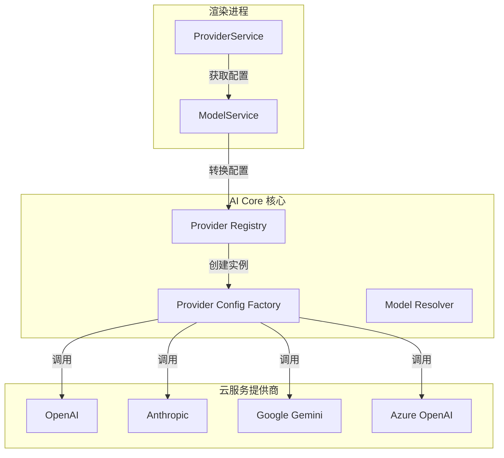
```mermaid
graph TB
subgraph "渲染进程"
ProviderService[ProviderService]
ModelService[ModelService]
end
subgraph "AI Core 核心"
ProviderRegistry[Provider Registry]
ProviderFactory[Provider Config Factory]
ModelResolver[Model Resolver]
end
subgraph "云服务提供商"
OpenAI[OpenAI]
Anthropic[Anthropic]
Google[Google Gemini]
Azure[Azure OpenAI]
end
ProviderService --> |获取配置| ModelService
ModelService --> |转换配置| ProviderRegistry
ProviderRegistry --> |创建实例| ProviderFactory
ProviderFactory --> |调用| OpenAI
ProviderFactory --> |调用| Anthropic
ProviderFactory --> |调用| Google
ProviderFactory --> |调用| Azure
```

**Diagram sources**
- [index.ts](file://packages/aiCore/src/index.ts#L1-L47)
- [registry.ts](file://packages/aiCore/src/core/providers/registry.ts#L1-L321)
- [factory.ts](file://packages/aiCore/src/core/providers/factory.ts#L1-L292)

**Section sources**
- [index.ts](file://packages/aiCore/src/index.ts#L1-L47)
- [registry.ts](file://packages/aiCore/src/core/providers/registry.ts#L1-L321)
- [factory.ts](file://packages/aiCore/src/core/providers/factory.ts#L1-L292)

## 主流云服务集成

Cherry Studio通过`aiCore`包的Provider系统支持多种主流云服务提供商。每个提供商都有其特定的配置方式和集成机制，但都遵循统一的接口规范。

### OpenAI集成

OpenAI是Cherry Studio支持的首要云服务提供商之一。系统通过`createOpenAI`函数创建OpenAI提供商实例，并支持多种配置选项。

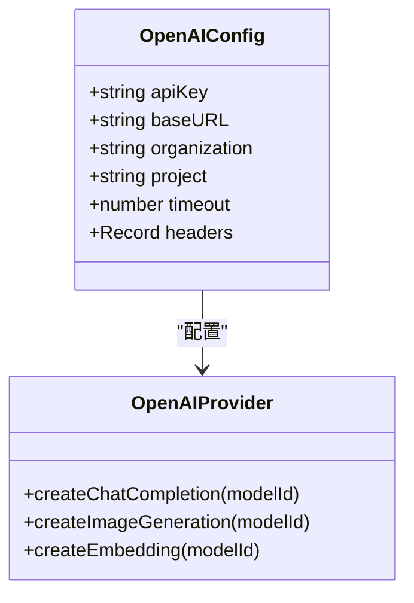
```mermaid
classDiagram
class OpenAIConfig {
+string apiKey
+string baseURL
+string organization
+string project
+number timeout
+Record<string, string> headers
}
class OpenAIProvider {
+createChatCompletion(modelId)
+createImageGeneration(modelId)
+createEmbedding(modelId)
}
OpenAIConfig --> OpenAIProvider : "配置"
```

**Diagram sources**
- [factory.ts](file://packages/aiCore/src/core/providers/factory.ts#L182-L206)
- [schemas.ts](file://packages/aiCore/src/core/providers/schemas.ts#L63-L69)

### Anthropic集成

Anthropic提供商通过`createAnthropic`函数进行初始化，支持Claude系列模型的调用。

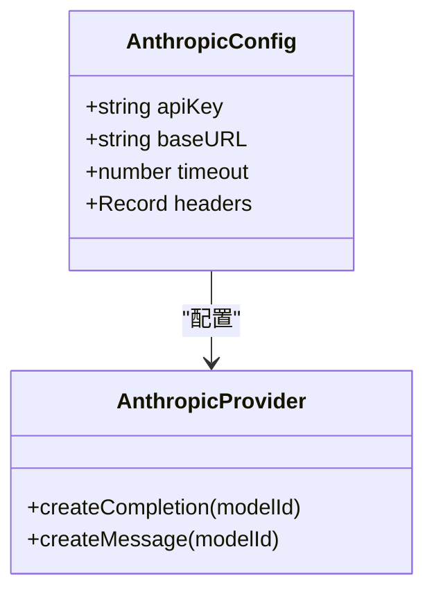
```mermaid
classDiagram
class AnthropicConfig {
+string apiKey
+string baseURL
+number timeout
+Record<string, string> headers
}
class AnthropicProvider {
+createCompletion(modelId)
+createMessage(modelId)
}
AnthropicConfig --> AnthropicProvider : "配置"
```

**Diagram sources**
- [factory.ts](file://packages/aiCore/src/core/providers/factory.ts#L208-L221)
- [schemas.ts](file://packages/aiCore/src/core/providers/schemas.ts#L90-L95)

### Google Gemini集成

Google Gemini提供商通过`createGoogleGenerativeAI`函数创建，支持Gemini系列模型。

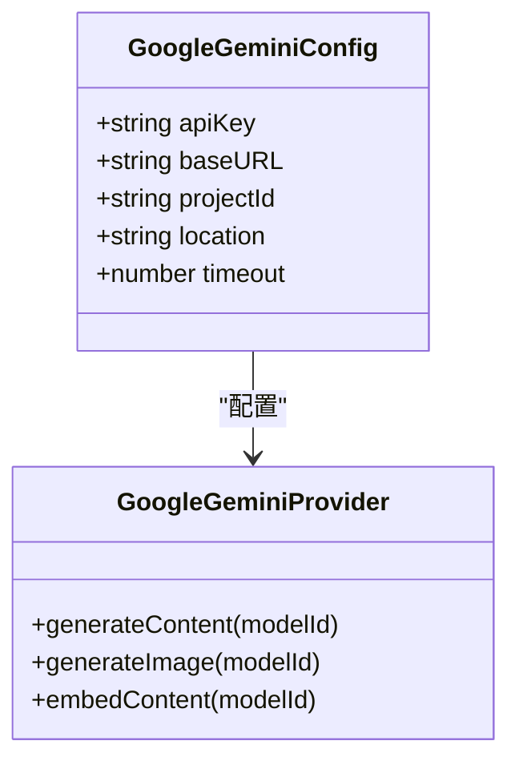
```mermaid
classDiagram
class GoogleGeminiConfig {
+string apiKey
+string baseURL
+string projectId
+string location
+number timeout
}
class GoogleGeminiProvider {
+generateContent(modelId)
+generateImage(modelId)
+embedContent(modelId)
}
GoogleGeminiConfig --> GoogleGeminiProvider : "配置"
```

**Diagram sources**
- [factory.ts](file://packages/aiCore/src/core/providers/factory.ts#L244-L259)
- [schemas.ts](file://packages/aiCore/src/core/providers/schemas.ts#L96-L101)

### Azure集成

Azure OpenAI服务通过`createAzure`函数进行集成，支持Azure特有的配置选项。

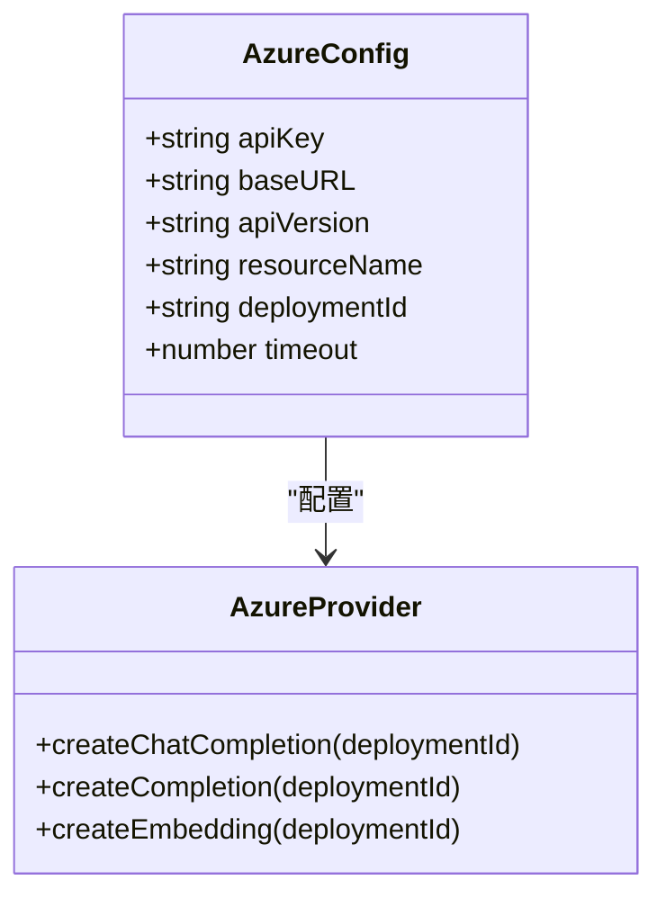
```mermaid
classDiagram
class AzureConfig {
+string apiKey
+string baseURL
+string apiVersion
+string resourceName
+string deploymentId
+number timeout
}
class AzureProvider {
+createChatCompletion(deploymentId)
+createCompletion(deploymentId)
+createEmbedding(deploymentId)
}
AzureConfig --> AzureProvider : "配置"
```

**Diagram sources**
- [factory.ts](file://packages/aiCore/src/core/providers/factory.ts#L223-L242)
- [schemas.ts](file://packages/aiCore/src/core/providers/schemas.ts#L108-L113)

**Section sources**
- [factory.ts](file://packages/aiCore/src/core/providers/factory.ts#L1-L292)
- [schemas.ts](file://packages/aiCore/src/core/providers/schemas.ts#L1-L219)

## 认证机制实现

Cherry Studio实现了多种认证机制来确保云服务提供商的安全访问，包括API Key管理、OAuth集成和安全存储。

### API Key管理

系统通过`ProviderConfigFactory`类管理API Key，支持多种认证方式：

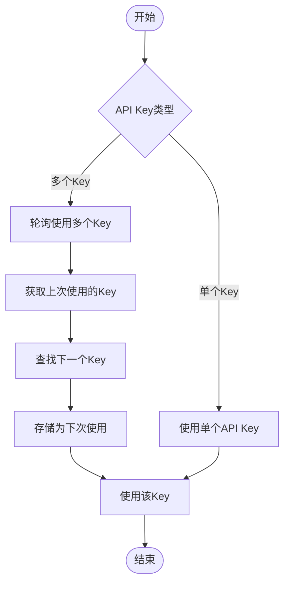
```mermaid
flowchart TD
Start([开始]) --> CheckApiKeyType{"API Key类型"}
CheckApiKeyType --> |单个Key| UseSingleKey["使用单个API Key"]
CheckApiKeyType --> |多个Key| RotateKeys["轮询使用多个Key"]
RotateKeys --> GetLastUsed["获取上次使用的Key"]
GetLastUsed --> FindNext["查找下一个Key"]
FindNext --> StoreNext["存储为下次使用"]
StoreNext --> UseKey["使用该Key"]
UseSingleKey --> UseKey
UseKey --> End([结束])
```

**Diagram sources**
- [providerConfig.ts](file://src/renderer/src/aiCore/provider/providerConfig.ts#L36-L56)
- [factory.ts](file://packages/aiCore/src/core/providers/factory.ts#L47-L67)

### OAuth集成

对于支持OAuth的提供商（如Anthropic），系统实现了完整的OAuth 2.0流程：

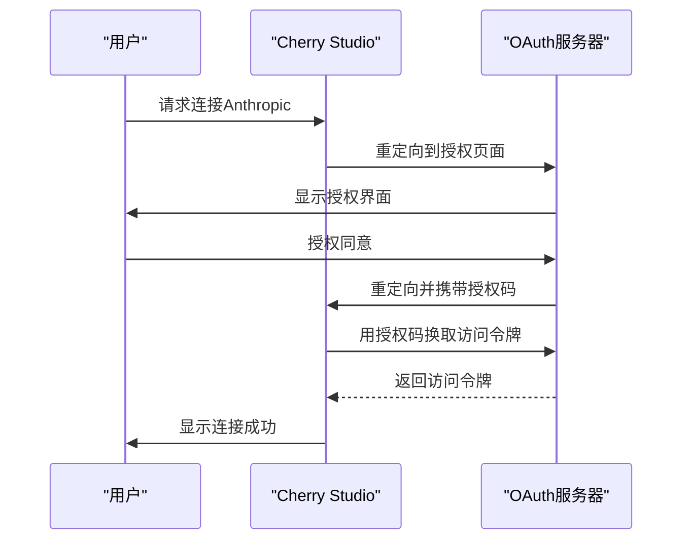
```mermaid
sequenceDiagram
participant User as "用户"
participant CherryStudio as "Cherry Studio"
participant OAuthServer as "OAuth服务器"
User->>CherryStudio : 请求连接Anthropic
CherryStudio->>OAuthServer : 重定向到授权页面
OAuthServer->>User : 显示授权界面
User->>OAuthServer : 授权同意
OAuthServer->>CherryStudio : 重定向并携带授权码
CherryStudio->>OAuthServer : 用授权码换取访问令牌
OAuthServer-->>CherryStudio : 返回访问令牌
CherryStudio->>User : 显示连接成功
```

**Diagram sources**
- [providerConfig.ts](file://src/renderer/src/aiCore/provider/providerConfig.ts#L330-L347)
- [AnthropicService.ts](file://src/main/services/AnthropicService.ts#L1-L20)

### 安全存储

所有认证信息都通过安全的方式存储和访问：

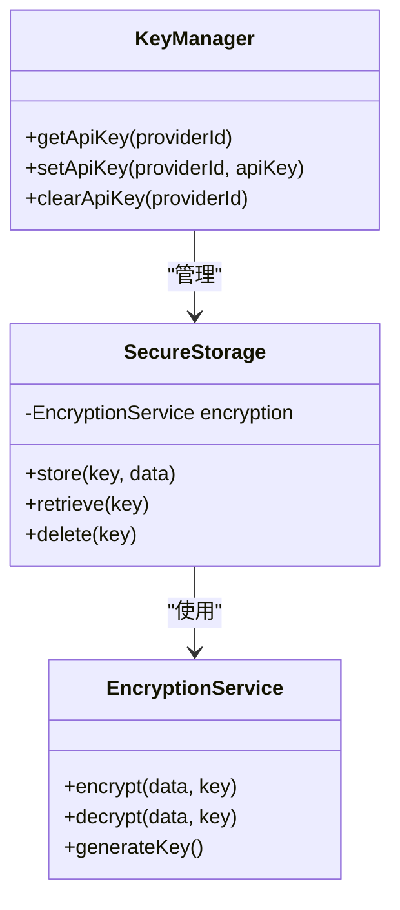
```mermaid
classDiagram
class SecureStorage {
-EncryptionService encryption
+store(key, data)
+retrieve(key)
+delete(key)
}
class EncryptionService {
+encrypt(data, key)
+decrypt(data, key)
+generateKey()
}
class KeyManager {
+getApiKey(providerId)
+setApiKey(providerId, apiKey)
+clearApiKey(providerId)
}
SecureStorage --> EncryptionService : "使用"
KeyManager --> SecureStorage : "管理"
```

**Diagram sources**
- [providerConfig.ts](file://src/renderer/src/aiCore/provider/providerConfig.ts#L36-L56)
- [AnthropicService.ts](file://src/main/services/AnthropicService.ts#L1-L20)

**Section sources**
- [providerConfig.ts](file://src/renderer/src/aiCore/provider/providerConfig.ts#L1-L350)
- [AnthropicService.ts](file://src/main/services/AnthropicService.ts#L1-L20)

## 配置选项与超时设置

Cherry Studio提供了丰富的配置选项和灵活的超时设置，以满足不同场景的需求。

### 配置选项

系统支持多种配置选项，通过`ProviderConfigBuilder`类进行管理：

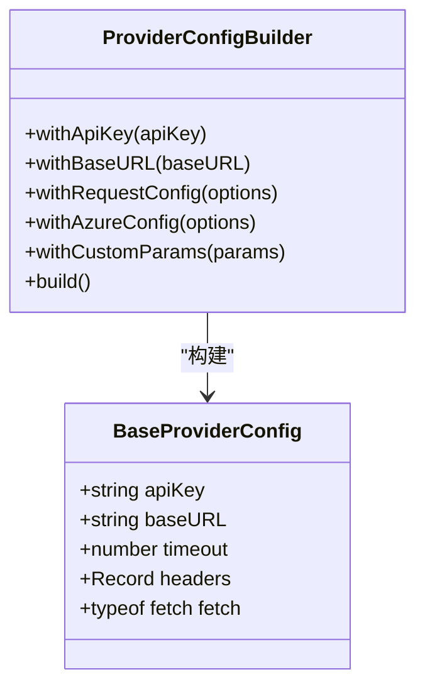
```mermaid
classDiagram
class ProviderConfigBuilder {
+withApiKey(apiKey)
+withBaseURL(baseURL)
+withRequestConfig(options)
+withAzureConfig(options)
+withCustomParams(params)
+build()
}
class BaseProviderConfig {
+string apiKey
+string baseURL
+number timeout
+Record<string, string> headers
+typeof fetch fetch
}
ProviderConfigBuilder --> BaseProviderConfig : "构建"
```

**Diagram sources**
- [factory.ts](file://packages/aiCore/src/core/providers/factory.ts#L42-L121)
- [types.ts](file://packages/aiCore/src/core/providers/types.ts#L11-L14)

### 超时设置

超时设置是确保系统稳定性的关键配置：

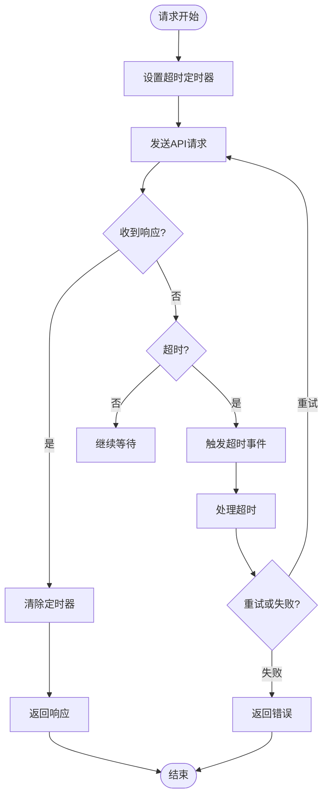
```mermaid
flowchart TD
Start([请求开始]) --> SetTimeout["设置超时定时器"]
SetTimeout --> SendRequest["发送API请求"]
SendRequest --> CheckResponse{"收到响应?"}
CheckResponse --> |是| ClearTimeout["清除定时器"]
CheckResponse --> |否| CheckTimeout{"超时?"}
CheckTimeout --> |否| WaitMore["继续等待"]
CheckTimeout --> |是| TriggerTimeout["触发超时事件"]
TriggerTimeout --> HandleTimeout["处理超时"]
HandleTimeout --> RetryOrFail{"重试或失败?"}
RetryOrFail --> |重试| SendRequest
RetryOrFail --> |失败| ReturnError["返回错误"]
ClearTimeout --> ReturnResponse["返回响应"]
ReturnResponse --> End([结束])
ReturnError --> End
```

**Diagram sources**
- [factory.ts](file://packages/aiCore/src/core/providers/factory.ts#L11-L14)
- [providerConfig.ts](file://src/renderer/src/aiCore/provider/providerConfig.ts#L161-L165)

**Section sources**
- [factory.ts](file://packages/aiCore/src/core/providers/factory.ts#L1-L292)
- [providerConfig.ts](file://src/renderer/src/aiCore/provider/providerConfig.ts#L1-L350)

## 错误处理策略

Cherry Studio实现了全面的错误处理策略，确保系统的稳定性和用户体验。

### 错误类型

系统定义了多种错误类型，用于区分不同的错误情况：

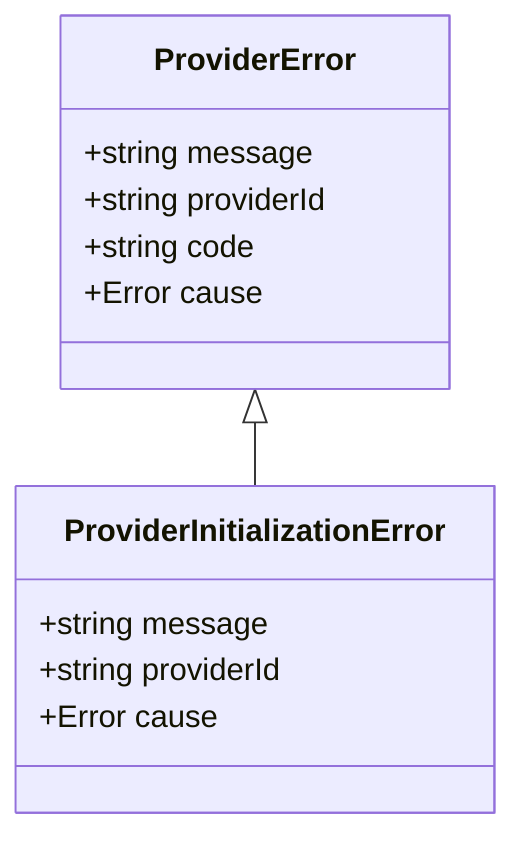
```mermaid
classDiagram
class ProviderError {
+string message
+string providerId
+string code
+Error cause
}
class ProviderInitializationError {
+string message
+string providerId
+Error cause
}
ProviderError <|-- ProviderInitializationError
```

**Diagram sources**
- [types.ts](file://packages/aiCore/src/core/providers/types.ts#L40-L51)
- [registry.ts](file://packages/aiCore/src/core/providers/registry.ts#L15-L24)

### 错误处理流程

错误处理遵循标准化的流程：

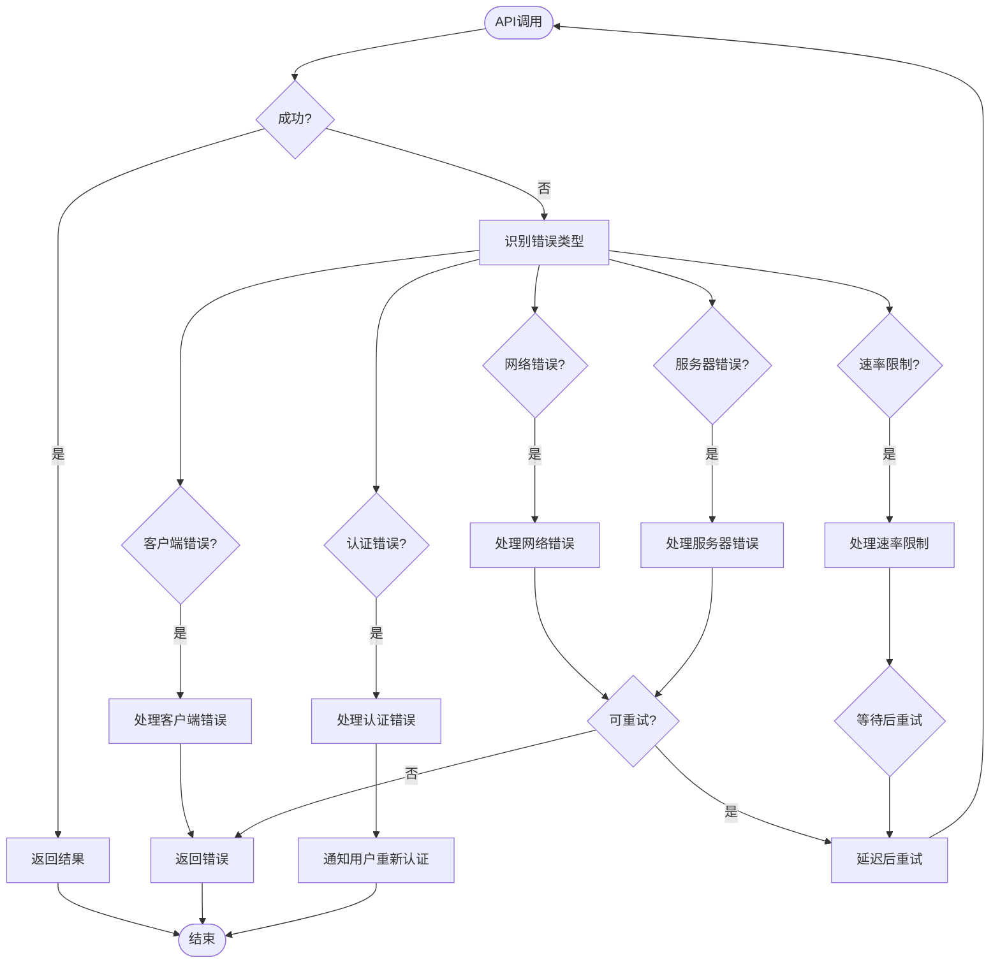
```mermaid
flowchart TD
Start([API调用]) --> Success{"成功?"}
Success --> |是| ReturnResult["返回结果"]
Success --> |否| IdentifyError["识别错误类型"]
IdentifyError --> NetworkError{"网络错误?"}
NetworkError --> |是| HandleNetwork["处理网络错误"]
IdentifyError --> AuthError{"认证错误?"}
AuthError --> |是| HandleAuth["处理认证错误"]
IdentifyError --> RateLimit{"速率限制?"}
RateLimit --> |是| HandleRateLimit["处理速率限制"]
IdentifyError --> ServerError{"服务器错误?"}
ServerError --> |是| HandleServer["处理服务器错误"]
IdentifyError --> ClientError{"客户端错误?"}
ClientError --> |是| HandleClient["处理客户端错误"]
HandleNetwork --> Retry{"可重试?"}
HandleAuth --> NotifyUser["通知用户重新认证"]
HandleRateLimit --> Wait{"等待后重试"}
HandleServer --> Retry
HandleClient --> ReturnError["返回错误"]
Retry --> |是| Delay["延迟后重试"]
Retry --> |否| ReturnError
Delay --> Start
ReturnResult --> End([结束])
ReturnError --> End
NotifyUser --> End
Wait --> Delay
```

**Diagram sources**
- [registry.ts](file://packages/aiCore/src/core/providers/registry.ts#L157-L159)
- [providerConfig.ts](file://src/renderer/src/aiCore/provider/providerConfig.ts#L231-L234)

**Section sources**
- [types.ts](file://packages/aiCore/src/core/providers/types.ts#L1-L97)
- [registry.ts](file://packages/aiCore/src/core/providers/registry.ts#L1-L321)

## ProviderService与ModelService

在渲染进程中，`ProviderService`和`ModelService`是管理和访问云服务提供商的核心服务。

### ProviderService

`ProviderService`负责提供与提供商相关的各种功能：

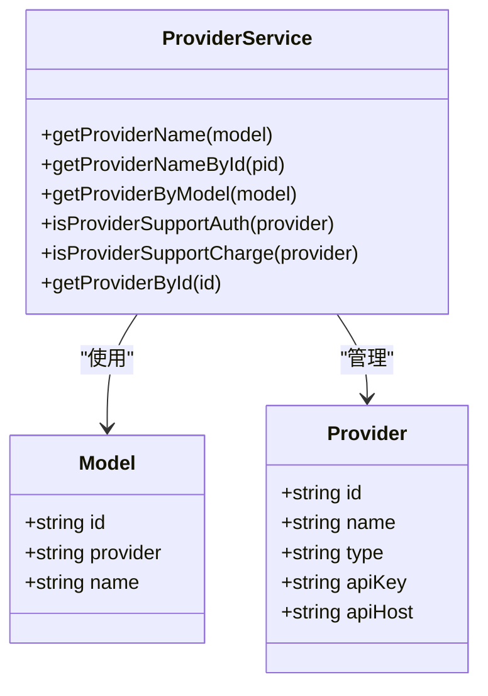
```mermaid
classDiagram
class ProviderService {
+getProviderName(model)
+getProviderNameById(pid)
+getProviderByModel(model)
+isProviderSupportAuth(provider)
+isProviderSupportCharge(provider)
+getProviderById(id)
}
class Model {
+string id
+string provider
+string name
}
class Provider {
+string id
+string name
+string type
+string apiKey
+string apiHost
}
ProviderService --> Model : "使用"
ProviderService --> Provider : "管理"
```

**Diagram sources**
- [ProviderService.ts](file://src/renderer/src/services/ProviderService.ts#L1-L58)
- [types.ts](file://src/renderer/src/types/provider.ts#L1-L10)

### ModelService

`ModelService`负责模型相关的操作：

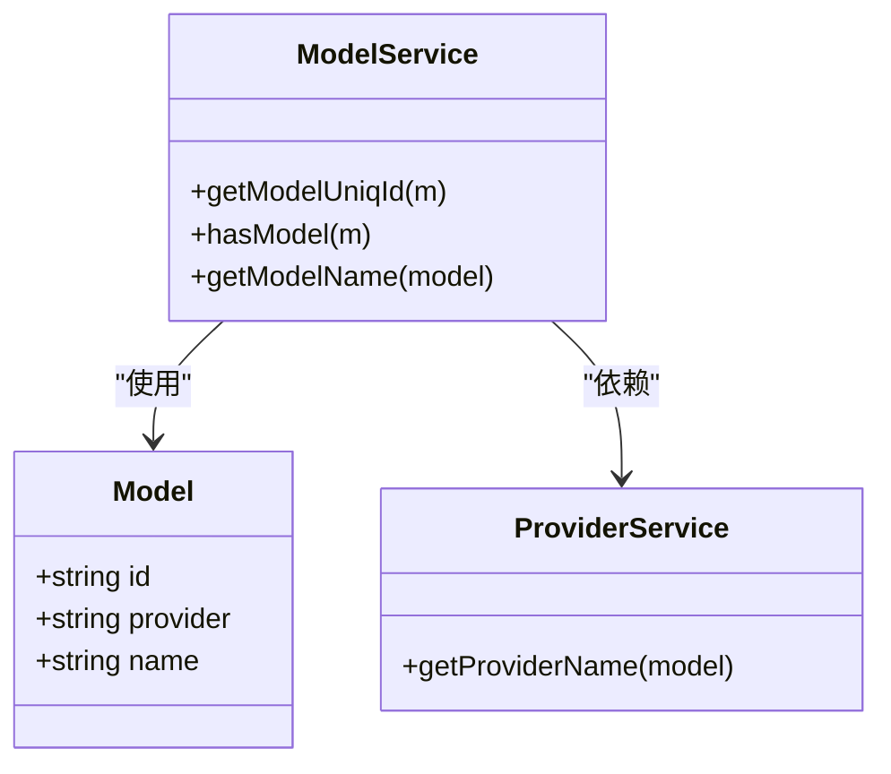
```mermaid
classDiagram
class ModelService {
+getModelUniqId(m)
+hasModel(m)
+getModelName(model)
}
class Model {
+string id
+string provider
+string name
}
class ProviderService {
+getProviderName(model)
}
ModelService --> Model : "使用"
ModelService --> ProviderService : "依赖"
```

**Diagram sources**
- [ModelService.ts](file://src/renderer/src/services/ModelService.ts#L1-L31)
- [ProviderService.ts](file://src/renderer/src/services/ProviderService.ts#L1-L58)

**Section sources**
- [ProviderService.ts](file://src/renderer/src/services/ProviderService.ts#L1-L58)
- [ModelService.ts](file://src/renderer/src/services/ModelService.ts#L1-L31)

## 健康检查与故障转移

Cherry Studio实现了健壮的健康检查和故障转移机制，确保服务的高可用性。

### 健康检查机制

系统定期对云服务提供商进行健康检查：

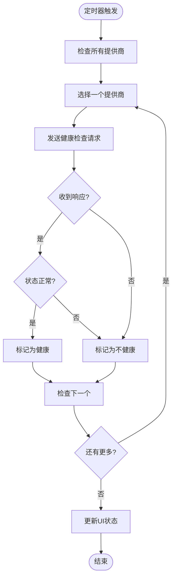
```mermaid
flowchart TD
Start([定时器触发]) --> CheckAllProviders["检查所有提供商"]
CheckAllProviders --> SelectProvider["选择一个提供商"]
SelectProvider --> SendHealthCheck["发送健康检查请求"]
SendHealthCheck --> CheckResponse{"收到响应?"}
CheckResponse --> |是| CheckStatus{"状态正常?"}
CheckStatus --> |是| MarkHealthy["标记为健康"]
CheckStatus --> |否| MarkUnhealthy["标记为不健康"]
CheckResponse --> |否| MarkUnhealthy
MarkHealthy --> NextProvider["检查下一个"]
MarkUnhealthy --> NextProvider
NextProvider --> MoreProviders{"还有更多?"}
MoreProviders --> |是| SelectProvider
MoreProviders --> |否| UpdateUI["更新UI状态"]
UpdateUI --> End([结束])
```

**Diagram sources**
- [providerConfig.ts](file://src/renderer/src/aiCore/provider/providerConfig.ts#L157-L270)
- [ProviderService.ts](file://src/renderer/src/services/ProviderService.ts#L1-L58)

### 故障转移策略

当某个提供商出现故障时，系统会自动切换到备用提供商：

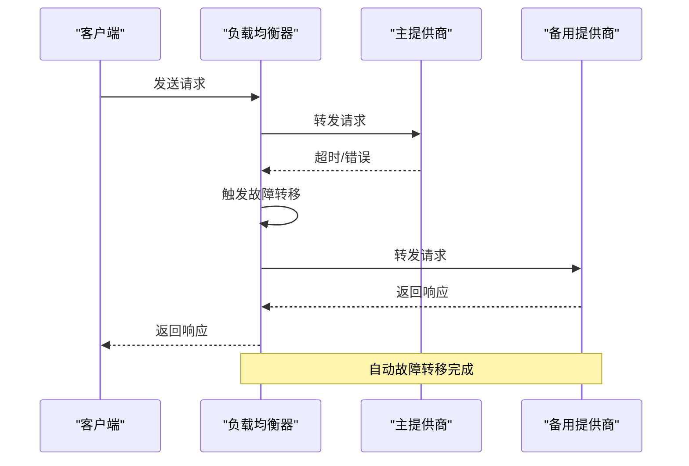
```mermaid
sequenceDiagram
participant Client as "客户端"
participant LoadBalancer as "负载均衡器"
participant Primary as "主提供商"
participant Secondary as "备用提供商"
Client->>LoadBalancer : 发送请求
LoadBalancer->>Primary : 转发请求
Primary-->>LoadBalancer : 超时/错误
LoadBalancer->>LoadBalancer : 触发故障转移
LoadBalancer->>Secondary : 转发请求
Secondary-->>LoadBalancer : 返回响应
LoadBalancer-->>Client : 返回响应
Note over LoadBalancer,Secondary : 自动故障转移完成
```

**Diagram sources**
- [registry.ts](file://packages/aiCore/src/core/providers/registry.ts#L214-L225)
- [providerConfig.ts](file://src/renderer/src/aiCore/provider/providerConfig.ts#L157-L270)

**Section sources**
- [registry.ts](file://packages/aiCore/src/core/providers/registry.ts#L1-L321)
- [providerConfig.ts](file://src/renderer/src/aiCore/provider/providerConfig.ts#L1-L350)

## 初学者配置向导

对于初学者，Cherry Studio提供了简单直观的配置向导。

### 配置步骤

1. **选择提供商**：在设置界面选择要集成的云服务提供商
2. **输入API Key**：在相应字段中输入您的API Key
3. **保存配置**：点击保存按钮完成配置

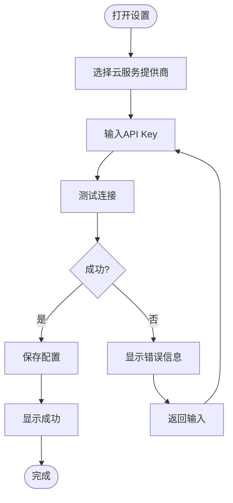
```mermaid
flowchart TD
Start([打开设置]) --> SelectProvider["选择云服务提供商"]
SelectProvider --> EnterApiKey["输入API Key"]
EnterApiKey --> TestConnection["测试连接"]
TestConnection --> Success{"成功?"}
Success --> |是| SaveConfig["保存配置"]
Success --> |否| ShowError["显示错误信息"]
ShowError --> BackToEnter["返回输入"]
SaveConfig --> ShowSuccess["显示成功"]
ShowSuccess --> End([完成])
BackToEnter --> EnterApiKey
```

**Diagram sources**
- [providers.ts](file://src/renderer/src/config/providers.ts#L68-L799)
- [providerConfig.ts](file://src/renderer/src/aiCore/provider/providerConfig.ts#L1-L350)

### 验证配置

配置完成后，系统会自动验证配置的有效性：

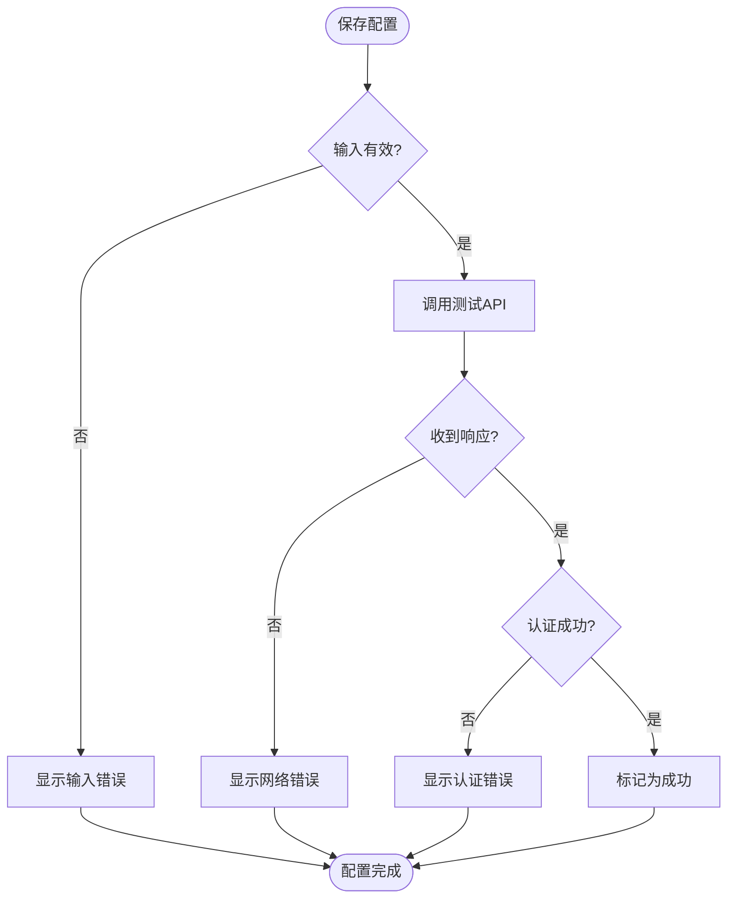
```mermaid
flowchart TD
Start([保存配置]) --> ValidateInput{"输入有效?"}
ValidateInput --> |否| ShowInputError["显示输入错误"]
ValidateInput --> |是| CallTestAPI["调用测试API"]
CallTestAPI --> CheckResponse{"收到响应?"}
CheckResponse --> |否| ShowNetworkError["显示网络错误"]
CheckResponse --> |是| CheckAuth{"认证成功?"}
CheckAuth --> |否| ShowAuthError["显示认证错误"]
CheckAuth --> |是| MarkSuccess["标记为成功"]
MarkSuccess --> End([配置完成])
ShowInputError --> End
ShowNetworkError --> End
ShowAuthError --> End
```

**Section sources**
- [providers.ts](file://src/renderer/src/config/providers.ts#L68-L799)
- [providerConfig.ts](file://src/renderer/src/aiCore/provider/providerConfig.ts#L1-L350)

## 性能优化与高级配置

对于有经验的开发者，Cherry Studio提供了多种性能优化和高级配置选项。

### 性能优化

1. **连接池**：复用HTTP连接，减少连接建立开销
2. **缓存机制**：缓存频繁请求的结果
3. **批量处理**：合并多个小请求为一个大请求

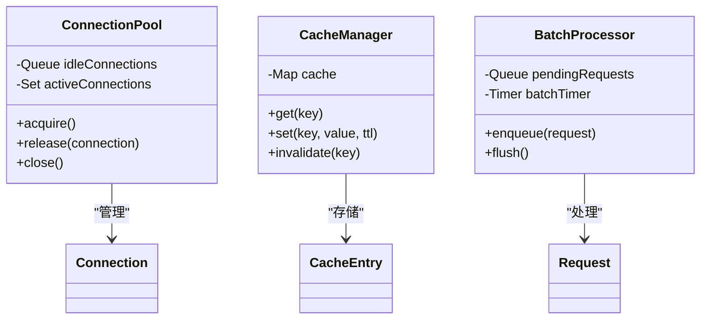
```mermaid
classDiagram
class ConnectionPool {
-Queue<Connection> idleConnections
-Set<Connection> activeConnections
+acquire()
+release(connection)
+close()
}
class CacheManager {
-Map<string, CacheEntry> cache
+get(key)
+set(key, value, ttl)
+invalidate(key)
}
class BatchProcessor {
-Queue<Request> pendingRequests
-Timer batchTimer
+enqueue(request)
+flush()
}
ConnectionPool --> Connection : "管理"
CacheManager --> CacheEntry : "存储"
BatchProcessor --> Request : "处理"
```

**Diagram sources**
- [factory.ts](file://packages/aiCore/src/core/providers/factory.ts#L80-L87)
- [providerConfig.ts](file://src/renderer/src/aiCore/provider/providerConfig.ts#L161-L165)

### 高级配置

高级配置选项包括：

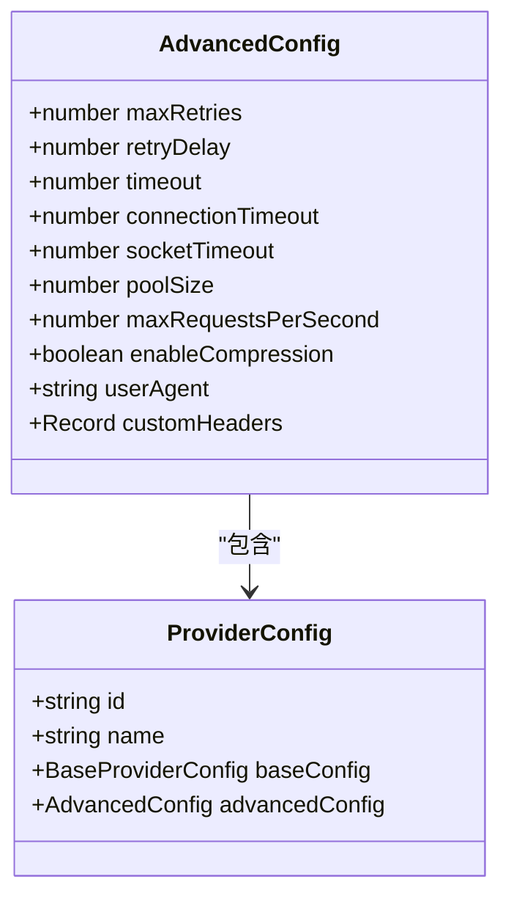
```mermaid
classDiagram
class AdvancedConfig {
+number maxRetries
+number retryDelay
+number timeout
+number connectionTimeout
+number socketTimeout
+number poolSize
+number maxRequestsPerSecond
+boolean enableCompression
+string userAgent
+Record<string, string> customHeaders
}
class ProviderConfig {
+string id
+string name
+BaseProviderConfig baseConfig
+AdvancedConfig advancedConfig
}
AdvancedConfig --> ProviderConfig : "包含"
```

**Diagram sources**
- [factory.ts](file://packages/aiCore/src/core/providers/factory.ts#L11-L17)
- [types.ts](file://packages/aiCore/src/core/providers/types.ts#L11-L14)

**Section sources**
- [factory.ts](file://packages/aiCore/src/core/providers/factory.ts#L1-L292)
- [types.ts](file://packages/aiCore/src/core/providers/types.ts#L1-L97)