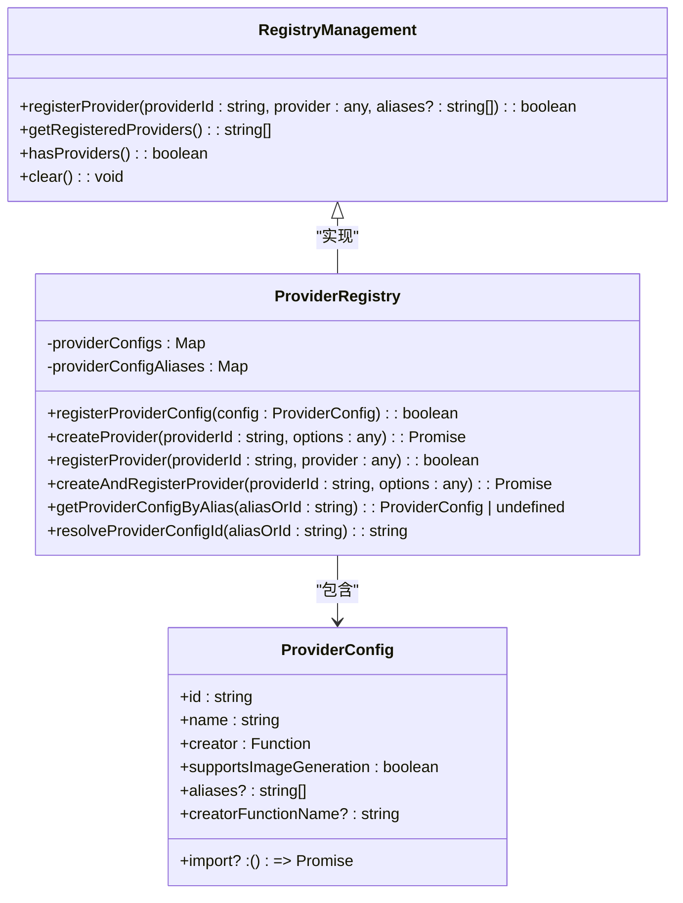

# 多LLM支持

<cite>
**本文档引用的文件**   
- [cherryin-provider.ts](file://packages/ai-sdk-provider/src/cherryin-provider.ts)
- [index.ts](file://packages/aiCore/src/index.ts)
- [models/index.ts](file://packages/aiCore/src/core/models/index.ts)
- [runtime/index.ts](file://packages/aiCore/src/core/runtime/index.ts)
- [providers/index.ts](file://packages/aiCore/src/core/providers/index.ts)
- [providers/factory.ts](file://packages/aiCore/src/core/providers/factory.ts)
- [providers/registry.ts](file://packages/aiCore/src/core/providers/registry.ts)
- [providers/types.ts](file://packages/aiCore/src/core/providers/types.ts)
- [runtime/executor.ts](file://packages/aiCore/src/core/runtime/executor.ts)
- [providers.ts](file://packages/shared/config/providers.ts)
</cite>

## 目录
1. [简介](#简介)
2. [AI SDK提供者架构](#ai-sdk提供者架构)
3. [提供商注册与管理](#提供商注册与管理)
4. [运行时执行器](#运行时执行器)
5. [模型解析器](#模型解析器)
6. [云服务支持](#云服务支持)
7. [本地模型支持](#本地模型支持)
8. [中间件管理](#中间件管理)
9. [快速入门指南](#快速入门指南)
10. [扩展自定义提供商](#扩展自定义提供商)

## 简介
Cherry Studio的多LLM支持功能为开发者提供了灵活的AI模型集成能力，支持多种云服务和本地模型。该系统基于Vercel AI SDK构建，实现了统一的AI Provider接口，允许用户通过简单的配置即可接入不同的AI服务提供商。本文档将详细介绍系统的架构设计、核心组件以及具体实现机制，为开发者提供全面的技术指导。

## AI SDK提供者架构
Cherry Studio的AI SDK提供者架构基于Vercel AI SDK的ProviderV2接口构建，实现了对多种AI服务的统一抽象。系统通过`cherryin-provider`模块提供对CherryIN平台的支持，该模块封装了对OpenAI、Anthropic和Gemini等服务的兼容性处理。

`cherryIn`提供者通过`createCherryIn`函数创建，接受包含API密钥、基础URL、自定义头部等配置的`CherryInProviderSettings`对象。该提供者能够根据模型ID的前缀自动识别服务类型：以`anthropic/`开头的模型ID将被路由到Anthropic兼容的API端点，以`google/`开头的模型ID将被路由到Gemini兼容的API端点，其余模型则默认使用OpenAI兼容的API端点。

**Section sources**
- [cherryin-provider.ts](file://packages/ai-sdk-provider/src/cherryin-provider.ts#L24-L349)

## 提供商注册与管理
Cherry Studio通过`RegistryManagement`系统实现提供商的注册与管理。该系统提供了完整的生命周期管理功能，包括提供商配置的注册、创建、注册到全局管理器以及清理等操作。

系统采用三步式注册流程：
1. **注册提供商配置**：通过`registerProviderConfig`函数将提供商的配置信息存储到全局配置映射中，配置包含提供商ID、名称、创建函数等信息。
2. **创建提供商实例**：通过`createProvider`函数根据配置创建实际的提供商实例，支持直接执行创建函数或动态导入模块后执行创建函数。
3. **注册到全局管理器**：通过`registerProvider`函数将创建的提供商实例注册到全局注册表中，使其可供系统其他部分使用。

系统还支持别名机制，允许为提供商配置设置多个别名，通过`providerConfigAliases`映射实现别名到真实ID的解析。这种设计提高了配置的灵活性，使用户可以通过不同的名称访问同一提供商。



**Diagram sources **
- [providers/registry.ts](file://packages/aiCore/src/core/providers/registry.ts#L1-L321)
- [providers/schemas.ts](file://packages/aiCore/src/core/providers/schemas.ts)

**Section sources**
- [providers/registry.ts](file://packages/aiCore/src/core/providers/registry.ts#L1-L321)
- [providers/index.ts](file://packages/aiCore/src/core/providers/index.ts#L1-L84)

## 运行时执行器
运行时执行器（RuntimeExecutor）是Cherry Studio AI核心功能的执行引擎，负责处理插件化的AI调用。执行器通过`createExecutor`和`createOpenAICompatibleExecutor`等工厂函数创建，接受提供商ID、配置选项和插件列表作为参数。

执行器的核心功能包括：
- **流式文本生成**：通过`streamText`方法实现，支持中间件处理。
- **文本生成**：通过`generateText`方法实现，支持中间件处理。
- **结构化对象生成**：通过`generateObject`和`streamObject`方法实现，支持中间件处理。
- **图像生成**：通过`generateImage`方法实现。

执行器采用插件引擎（PluginEngine）模式，通过`executeWithPlugins`和`executeStreamWithPlugins`等方法在执行过程中集成插件逻辑。执行器还负责解析模型，当传入的模型参数为字符串时，通过`globalModelResolver`解析为实际的模型实例。

```mermaid
classDiagram
class RuntimeExecutor {
-config : RuntimeConfig
-pluginEngine : PluginEngine
+streamText(params : streamTextParams, options? : { middlewares? : LanguageModelV2Middleware[] }) : Promise<ReturnType<typeof _streamText>>
+generateText(params : generateTextParams, options? : { middlewares? : LanguageModelV2Middleware[] }) : Promise<ReturnType<typeof _generateText>>
+generateObject(params : generateObjectParams, options? : { middlewares? : LanguageModelV2Middleware[] }) : Promise<ReturnType<typeof _generateObject>>
+streamObject(params : streamObjectParams, options? : { middlewares? : LanguageModelV2Middleware[] }) : Promise<ReturnType<typeof _streamObject>>
+generateImage(params : generateImageParams) : Promise<ReturnType<typeof _generateImage>>
-resolveModel(modelOrId : LanguageModel, middlewares? : LanguageModelV2Middleware[]) : Promise<LanguageModelV2>
-resolveImageModel(modelOrId : ImageModelV2 | string) : Promise<ImageModelV2>
+create(providerId : T, options : ModelConfig[T]['providerSettings'], plugins? : AiPlugin[]) : RuntimeExecutor[T]
+createOpenAICompatible(options : ModelConfig['openai-compatible']['providerSettings'], plugins : AiPlugin[]) : RuntimeExecutor<'openai-compatible'>
}
class PluginEngine {
-providerId : ProviderId
-plugins : AiPlugin[]
+usePlugins(plugins : AiPlugin[]) : void
+executeWithPlugins(method : string, params : any, executor : Function) : Promise<any>
+executeStreamWithPlugins(method : string, params : any, executor : Function) : Promise<any>
+executeImageWithPlugins(method : string, params : any, executor : Function) : Promise<any>
}
RuntimeExecutor --> PluginEngine : "使用"
```

**Diagram sources **
- [runtime/executor.ts](file://packages/aiCore/src/core/runtime/executor.ts#L1-L311)
- [runtime/index.ts](file://packages/aiCore/src/core/runtime/index.ts#L1-L118)

**Section sources**
- [runtime/executor.ts](file://packages/aiCore/src/core/runtime/executor.ts#L1-L311)
- [runtime/index.ts](file://packages/aiCore/src/core/runtime/index.ts#L1-L118)

## 模型解析器
模型解析器（ModelResolver）是Cherry Studio多LLM支持的核心组件之一，负责根据配置选择合适的提供商并创建相应的模型实例。系统通过`globalModelResolver`提供全局的模型解析服务。

模型解析器支持多种模型标识格式：
- 简单模型ID：如`gpt-4`，将使用默认提供商。
- 完整标识符：如`aihubmix:anthropic:claude-3.5-sonnet`，包含注册表ID、提供商ID和模型ID，允许精确指定模型来源。

解析过程考虑了多个因素，包括提供商配置、模型支持能力、中间件等。对于图像生成模型，解析器会检查提供商是否支持图像生成功能。解析器还支持通过别名访问模型，提高了配置的灵活性。

**Section sources**
- [models/index.ts](file://packages/aiCore/src/core/models/index.ts#L1-L10)
- [runtime/executor.ts](file://packages/aiCore/src/core/runtime/executor.ts#L238-L278)

## 云服务支持
Cherry Studio支持多种云服务提供商，包括OpenAI、Anthropic、Google Gemini、Azure OpenAI等。系统通过统一的配置接口简化了云服务的集成过程。

对于云服务提供商，系统提供了专门的配置工厂函数，如`createOpenAI`、`createAnthropic`、`createGoogle`和`createAzureOpenAI`，这些函数封装了各提供商的特定配置要求。例如，Azure OpenAI需要资源名称和API版本，而OpenAI支持组织和项目ID等可选参数。

认证机制采用标准的Bearer Token方式，API密钥通过`apiKey`参数或环境变量（如`CHERRYIN_API_KEY`）提供。系统还支持自定义请求头部和超时设置，允许用户根据需要调整请求行为。

**Section sources**
- [providers/factory.ts](file://packages/aiCore/src/core/providers/factory.ts#L1-L292)
- [cherryin-provider.ts](file://packages/ai-sdk-provider/src/cherryin-provider.ts#L37-L75)

## 本地模型支持
Cherry Studio同样支持多种本地模型运行时，包括Ollama、LM Studio、OVMS等。系统通过`openai-compatible`提供商类型实现对本地模型的集成，这些本地运行时通常提供与OpenAI API兼容的接口。

对于本地模型，用户需要配置基础URL指向本地运行时的API端点，并提供必要的认证信息。系统通过`createOpenAICompatible`函数简化了本地模型的配置过程，用户只需提供基础URL和API密钥即可完成集成。

本地模型支持与云服务支持共享相同的运行时执行器和插件系统，确保了功能的一致性。用户可以在云服务和本地模型之间无缝切换，只需更改配置即可。

**Section sources**
- [providers/factory.ts](file://packages/aiCore/src/core/providers/factory.ts#L282-L284)
- [runtime/index.ts](file://packages/aiCore/src/core/runtime/index.ts#L34-L39)

## 中间件管理
Cherry Studio的中间件管理系统允许开发者在AI调用过程中插入自定义逻辑。系统通过`AiPlugin`接口定义插件，支持多种钩子函数，如`resolveModel`、`configureContext`等。

中间件的执行由`PluginEngine`管理，支持前置（pre）和后置（post）执行顺序。系统内置了几个关键的中间件插件，如`_internal_resolveModel`用于模型解析，`_internal_configureContext`用于配置请求上下文。

开发者可以创建自定义插件来实现日志记录、性能监控、输入输出转换等功能。插件系统的设计确保了功能的可扩展性，同时保持了核心执行逻辑的简洁性。

**Section sources**
- [runtime/executor.ts](file://packages/aiCore/src/core/runtime/executor.ts#L47-L77)
- [core/plugins](file://packages/aiCore/src/core/plugins)

## 快速入门指南
对于初学者，Cherry Studio提供了简单的入门路径：

1. **安装依赖**：确保已安装`@cherrystudio/ai-core`和相关提供商包。
2. **配置提供商**：使用配置工厂函数创建提供商配置。
3. **创建执行器**：使用`createExecutor`函数创建运行时执行器。
4. **调用AI功能**：通过执行器的方法调用所需的AI功能。

示例代码：
```typescript
import { createExecutor, streamText } from '@cherrystudio/ai-core'
import { createOpenAI } from '@cherrystudio/ai-core/core/options'

// 创建OpenAI提供商配置
const openAIConfig = createOpenAI('your-api-key')

// 创建执行器
const executor = createExecutor('openai', openAIConfig)

// 流式生成文本
const result = await executor.streamText({
  model: 'gpt-4',
  prompt: 'Hello, world!'
})
```

**Section sources**
- [index.ts](file://packages/aiCore/src/index.ts#L1-L47)
- [providers/factory.ts](file://packages/aiCore/src/core/providers/factory.ts#L185-L206)

## 扩展自定义提供商
对于有经验的开发者，Cherry Studio提供了扩展自定义提供商的完整机制：

1. **定义提供商配置**：创建`ProviderConfig`对象，指定提供商ID、名称、创建函数等。
2. **注册提供商配置**：使用`registerProviderConfig`函数将配置注册到系统。
3. **创建和注册提供商**：使用`createAndRegisterProvider`函数完成创建和注册过程。

自定义提供商可以实现`ProviderV2`接口，提供语言模型、嵌入模型、图像模型等。系统支持动态导入提供商模块，允许在运行时加载新的提供商。

通过`ProviderConfigBuilder`类，开发者可以以类型安全的方式构建提供商配置，支持链式调用设置各种参数。这种设计确保了配置的正确性和可维护性。

**Section sources**
- [providers/registry.ts](file://packages/aiCore/src/core/providers/registry.ts#L214-L225)
- [providers/factory.ts](file://packages/aiCore/src/core/providers/factory.ts#L42-L121)