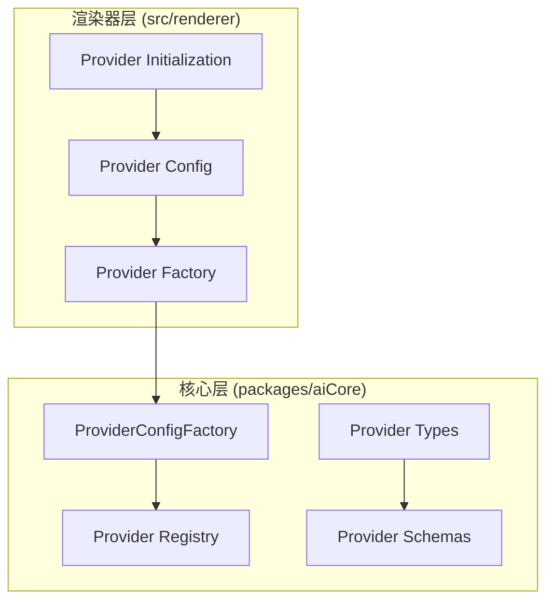
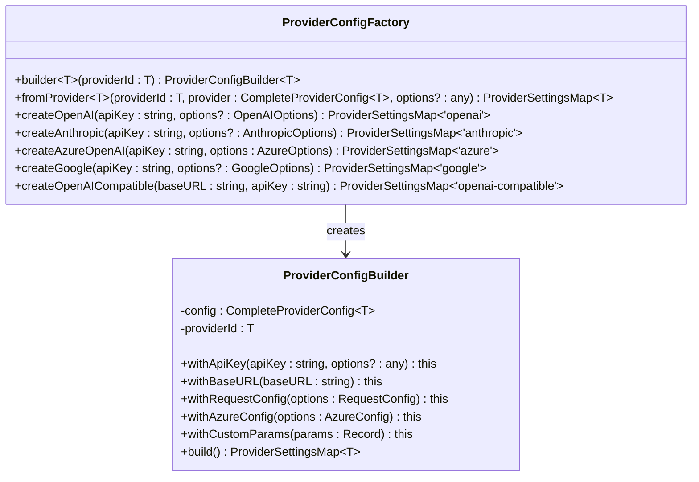
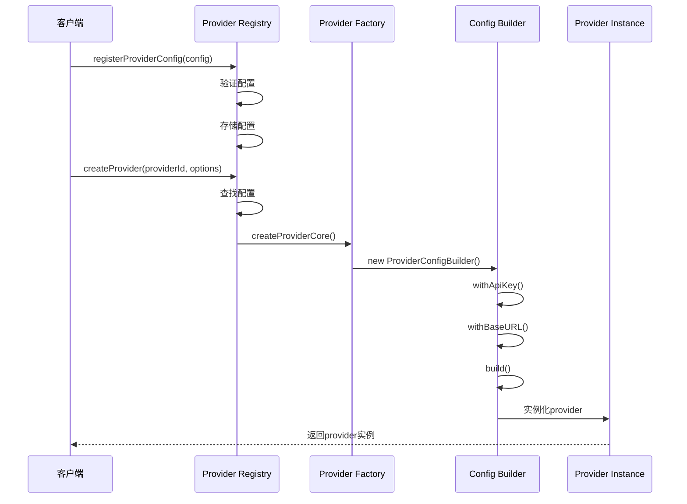
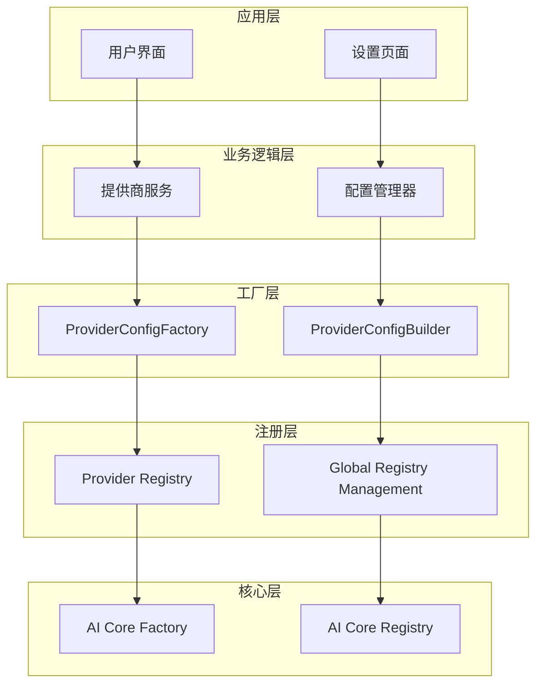
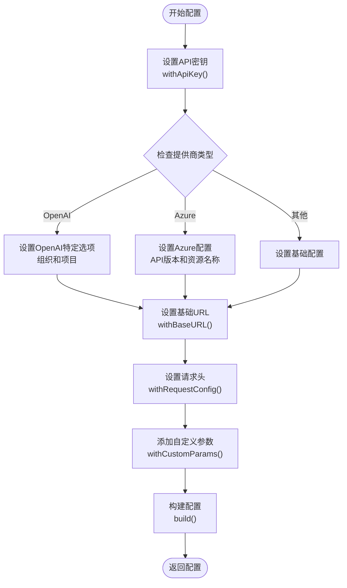
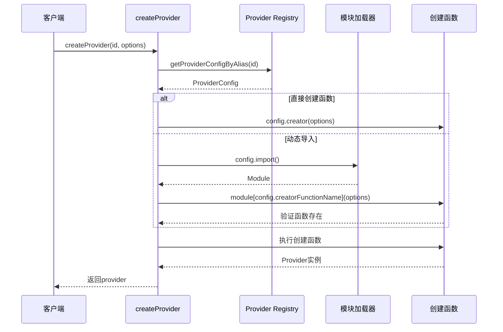
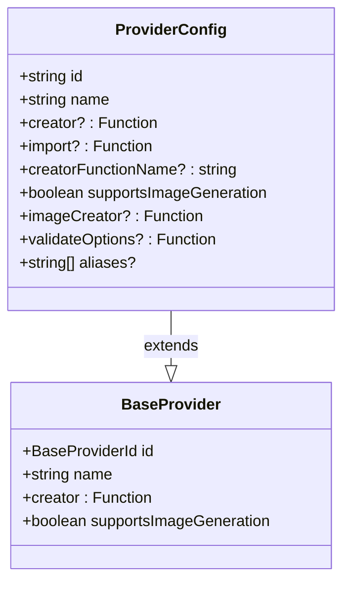
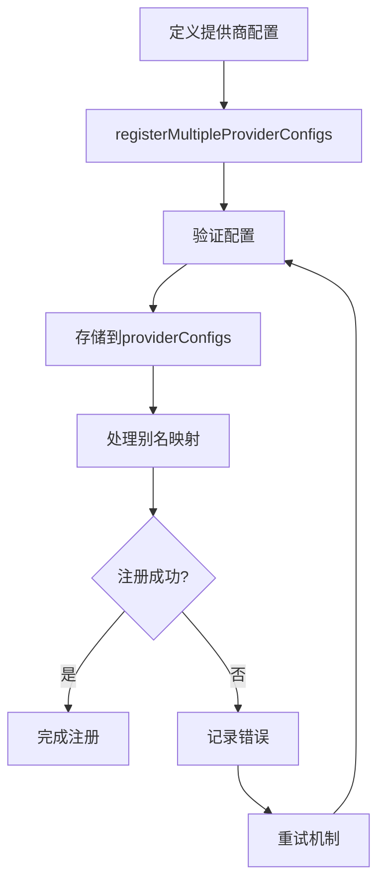
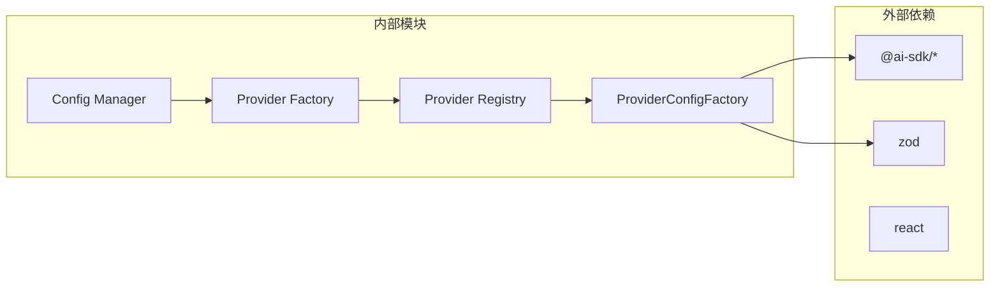
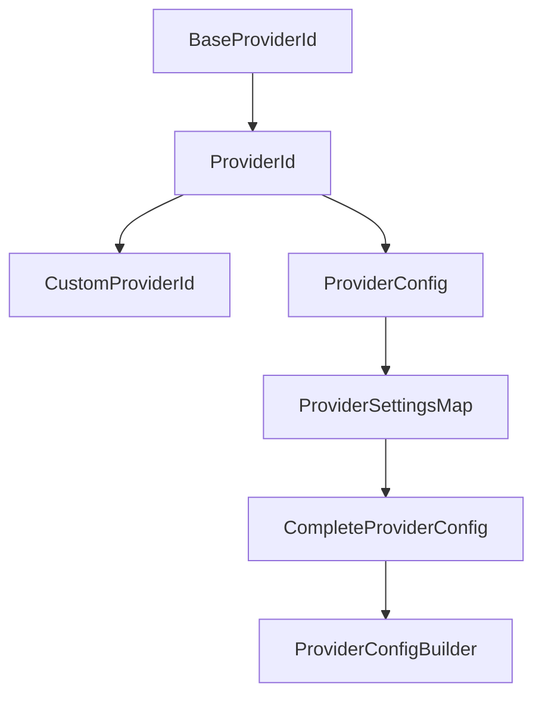

# Cherry Studio提供商工厂模式

<cite>
**本文档中引用的文件**
- [factory.ts](file://packages/aiCore/src/core/providers/factory.ts)
- [registry.ts](file://packages/aiCore/src/core/providers/registry.ts)
- [types.ts](file://packages/aiCore/src/core/providers/types.ts)
- [schemas.ts](file://packages/aiCore/src/core/providers/schemas.ts)
- [index.ts](file://packages/aiCore/src/core/providers/index.ts)
- [providerConfig.ts](file://src/renderer/src/aiCore/provider/providerConfig.ts)
- [factory.ts](file://src/renderer/src/aiCore/provider/factory.ts)
- [providerInitialization.ts](file://src/renderer/src/aiCore/provider/providerInitialization.ts)
- [registry-functionality.test.ts](file://packages/aiCore/src/core/providers/__tests__/registry-functionality.test.ts)
</cite>

## 目录
1. [简介](#简介)
2. [项目结构概览](#项目结构概览)
3. [核心组件分析](#核心组件分析)
4. [架构概览](#架构概览)
5. [详细组件分析](#详细组件分析)
6. [依赖关系分析](#依赖关系分析)
7. [性能考虑](#性能考虑)
8. [故障排除指南](#故障排除指南)
9. [结论](#结论)

## 简介

Cherry Studio采用了一套精心设计的提供商工厂模式，用于动态创建和管理各种AI服务提供商。该系统通过ProviderConfigFactory类提供类型安全的配置构建器，支持OpenAI、Anthropic、Azure等多种提供商的无缝集成。工厂模式的核心优势在于其灵活性和可扩展性，允许开发者轻松添加新的提供商而无需修改现有代码。

## 项目结构概览

Cherry Studio的提供商系统分为两个主要层次：



**图表来源**
- [factory.ts](file://packages/aiCore/src/core/providers/factory.ts#L1-L292)
- [registry.ts](file://packages/aiCore/src/core/providers/registry.ts#L1-L321)
- [factory.ts](file://src/renderer/src/aiCore/provider/factory.ts#L1-L115)

**章节来源**
- [index.ts](file://packages/aiCore/src/core/providers/index.ts#L46-L83)
- [index.ts](file://src/renderer/src/aiCore/provider/index.ts#L1-L10)

## 核心组件分析

### ProviderConfigFactory - 主要工厂类

ProviderConfigFactory是整个提供商系统的核心，提供了类型安全的配置构建功能：



**图表来源**
- [factory.ts](file://packages/aiCore/src/core/providers/factory.ts#L42-L292)

### Provider Registry - 配置管理系统

Provider Registry负责管理所有提供商的配置和实例化：



**图表来源**
- [registry.ts](file://packages/aiCore/src/core/providers/registry.ts#L128-L160)
- [factory.ts](file://packages/aiCore/src/core/providers/factory.ts#L131-L180)

**章节来源**
- [registry.ts](file://packages/aiCore/src/core/providers/registry.ts#L128-L225)
- [factory.ts](file://packages/aiCore/src/core/providers/factory.ts#L127-L292)

## 架构概览

Cherry Studio的提供商工厂模式采用了分层架构设计，确保了系统的可维护性和扩展性：



**图表来源**
- [factory.ts](file://src/renderer/src/aiCore/provider/factory.ts#L1-L115)
- [registry.ts](file://packages/aiCore/src/core/providers/registry.ts#L1-L321)

## 详细组件分析

### ProviderConfigBuilder - 链式配置构建器

ProviderConfigBuilder实现了流畅接口模式，支持链式调用构建复杂的提供商配置：

#### 核心配置方法

| 方法 | 参数 | 描述 | 类型安全 |
|------|------|------|----------|
| `withApiKey` | apiKey: string, options?: any | 设置API密钥，支持OpenAI组织和项目选项 | ✅ |
| `withBaseURL` | baseURL: string | 设置基础URL | ✅ |
| `withRequestConfig` | options: {headers?, fetch?} | 设置请求头和自定义fetch函数 | ✅ |
| `withAzureConfig` | options: {apiVersion?, resourceName?} | 设置Azure特定配置 | ✅ |
| `withCustomParams` | params: Record<string, any> | 添加自定义参数 | ✅ |
| `build` | 无 | 构建最终配置对象 | ✅ |

#### 高级配置特性



**图表来源**
- [factory.ts](file://packages/aiCore/src/core/providers/factory.ts#L47-L118)

### createProvider函数 - 动态实例化机制

createProvider函数是工厂模式的核心，负责根据配置动态创建提供商实例：

#### 实例化流程



**图表来源**
- [registry.ts](file://packages/aiCore/src/core/providers/registry.ts#L128-L159)

#### 支持的创建方式

| 创建方式 | 适用场景 | 示例 |
|----------|----------|------|
| 直接函数 | 内置提供商 | `createOpenAI` |
| 动态导入 | 外部提供商 | `@ai-sdk/anthropic` |
| 自定义函数 | 用户定义提供商 | `customProviderCreator` |

**章节来源**
- [registry.ts](file://packages/aiCore/src/core/providers/registry.ts#L128-L159)

### ProviderConfig - 配置定义

ProviderConfig接口定义了提供商配置的标准结构：



**图表来源**
- [schemas.ts](file://packages/aiCore/src/core/providers/schemas.ts#L182-L201)

**章节来源**
- [schemas.ts](file://packages/aiCore/src/core/providers/schemas.ts#L182-L201)

### 动态提供商注册系统

Cherry Studio支持运行时动态注册新的提供商：

#### 新提供商配置示例

```typescript
// AWS Bedrock提供商配置
{
  id: 'bedrock',
  name: 'Amazon Bedrock',
  import: () => import('@ai-sdk/amazon-bedrock'),
  creatorFunctionName: 'createAmazonBedrock',
  supportsImageGeneration: true,
  aliases: ['aws-bedrock']
}
```

#### 注册流程



**图表来源**
- [providerInitialization.ts](file://src/renderer/src/aiCore/provider/providerInitialization.ts#L104-L113)

**章节来源**
- [providerInitialization.ts](file://src/renderer/src/aiCore/provider/providerInitialization.ts#L10-L98)

## 依赖关系分析

### 核心依赖图



**图表来源**
- [factory.ts](file://packages/aiCore/src/core/providers/factory.ts#L1-L7)
- [registry.ts](file://packages/aiCore/src/core/providers/registry.ts#L1-L10)

### 类型系统依赖



**图表来源**
- [types.ts](file://packages/aiCore/src/core/providers/types.ts#L20-L39)
- [schemas.ts](file://packages/aiCore/src/core/providers/schemas.ts#L41-L50)

**章节来源**
- [types.ts](file://packages/aiCore/src/core/providers/types.ts#L1-L97)
- [schemas.ts](file://packages/aiCore/src/core/providers/schemas.ts#L1-L219)

## 性能考虑

### 缓存策略

- **配置缓存**: 所有提供商配置存储在Map中，提供O(1)查找性能
- **模块缓存**: 动态导入的模块会被浏览器缓存，避免重复加载
- **实例缓存**: 已创建的提供商实例可以被复用

### 异步优化

- **延迟加载**: 提供商模块按需加载，减少初始启动时间
- **并发处理**: 多个提供商可以同时初始化
- **错误隔离**: 单个提供商初始化失败不影响其他提供商

### 内存管理

- **弱引用**: 避免循环引用导致的内存泄漏
- **清理机制**: 提供完整的清理和重置功能
- **懒加载**: 配置和实例按需创建

## 故障排除指南

### 常见问题及解决方案

#### 1. 提供商未找到错误

**症状**: `ProviderConfig not found for id: xxx`

**原因**: 
- 提供商ID拼写错误
- 提供商未正确注册
- 别名未正确配置

**解决方案**:
```typescript
// 检查提供商是否存在
console.log(hasProviderConfig('openai')); // true/false

// 获取所有可用提供商
console.log(getAllProviderConfigs());

// 检查别名映射
console.log(getAllProviderConfigAliases());
```

#### 2. 创建函数未找到错误

**症状**: `Creator function "xxx" not found in imported module`

**原因**:
- 模块导入失败
- 函数名拼写错误
- 模块导出结构不正确

**解决方案**:
```typescript
// 验证模块导出
import('@ai-sdk/anthropic').then(module => {
  console.log(Object.keys(module));
});
```

#### 3. 配置验证失败

**症状**: 配置schema验证失败

**原因**:
- 缺少必需字段
- 字段类型不匹配
- ID冲突

**解决方案**:
```typescript
// 使用Zod schema验证
import { providerConfigSchema } from '@cherrystudio/ai-core/provider';
const result = providerConfigSchema.safeParse(config);
if (!result.success) {
  console.error(result.error);
}
```

**章节来源**
- [registry.ts](file://packages/aiCore/src/core/providers/registry.ts#L128-L159)
- [schemas.ts](file://packages/aiCore/src/core/providers/schemas.ts#L182-L201)

## 结论

Cherry Studio的提供商工厂模式展现了现代软件架构的最佳实践。通过分层设计、类型安全、动态注册和链式配置等特性，该系统实现了高度的灵活性和可扩展性。

### 主要优势

1. **类型安全**: 完整的TypeScript类型系统确保编译时错误检测
2. **可扩展性**: 支持动态添加新的提供商而无需修改核心代码
3. **灵活性**: 链式配置支持复杂的提供商定制需求
4. **性能**: 缓存和懒加载机制优化了运行时性能
5. **可维护性**: 清晰的职责分离和模块化设计便于维护

### 最佳实践建议

1. **遵循类型约定**: 使用提供的类型定义确保配置正确性
2. **合理使用别名**: 为常用提供商设置有意义的别名
3. **错误处理**: 实现完善的错误处理和日志记录
4. **性能监控**: 监控提供商加载和初始化性能
5. **文档维护**: 保持提供商配置文档的及时更新

这套工厂模式不仅满足了当前的需求，更为未来的扩展奠定了坚实的基础，是现代AI应用开发的优秀范例。