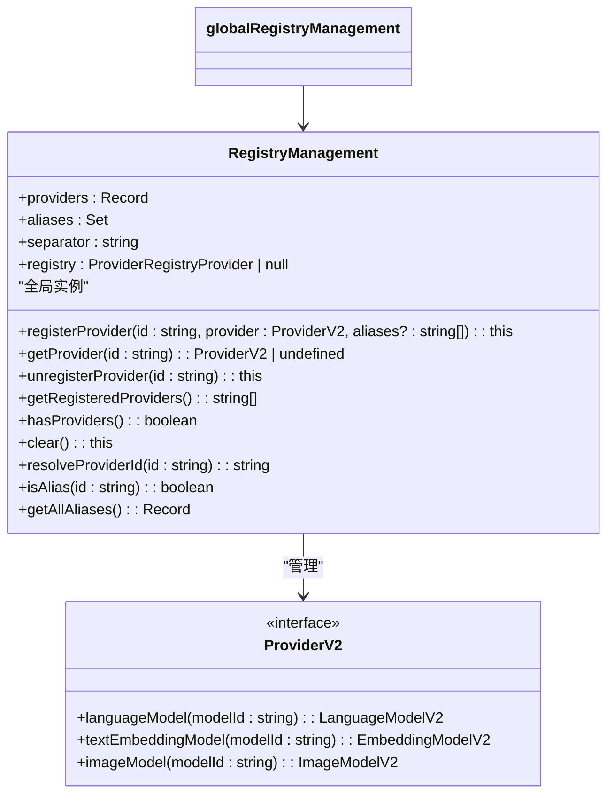
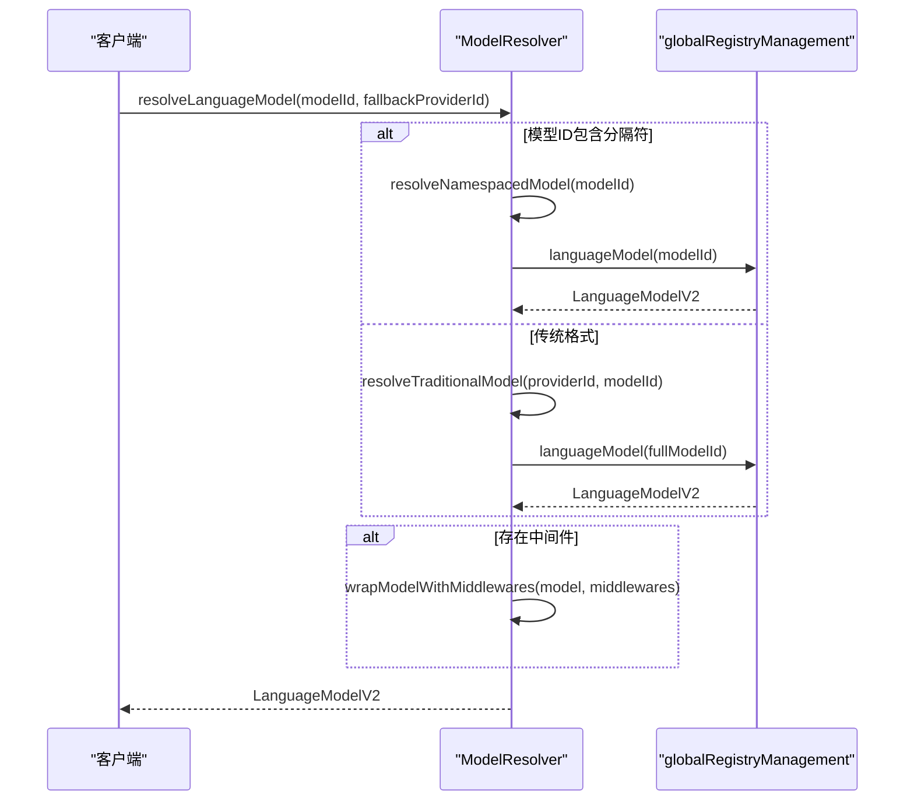
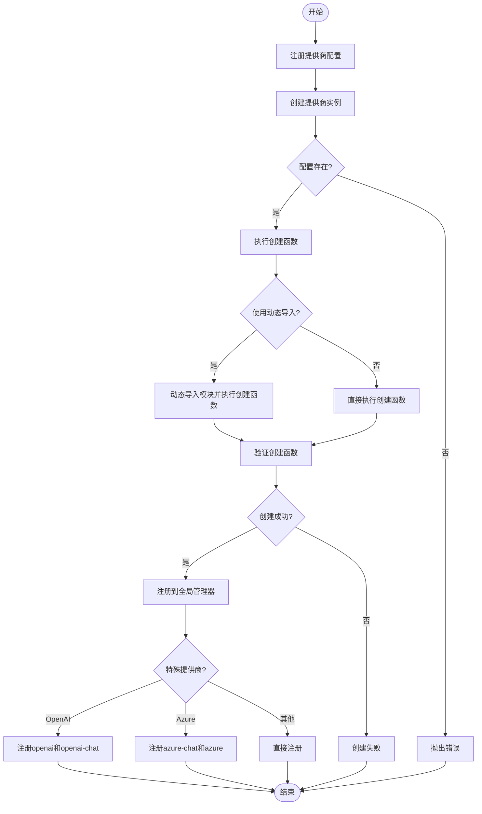
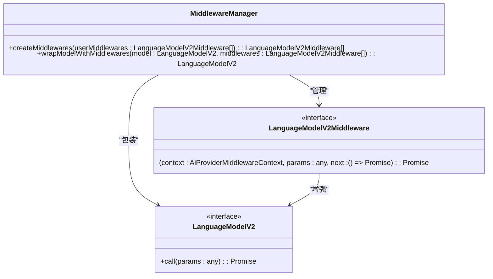
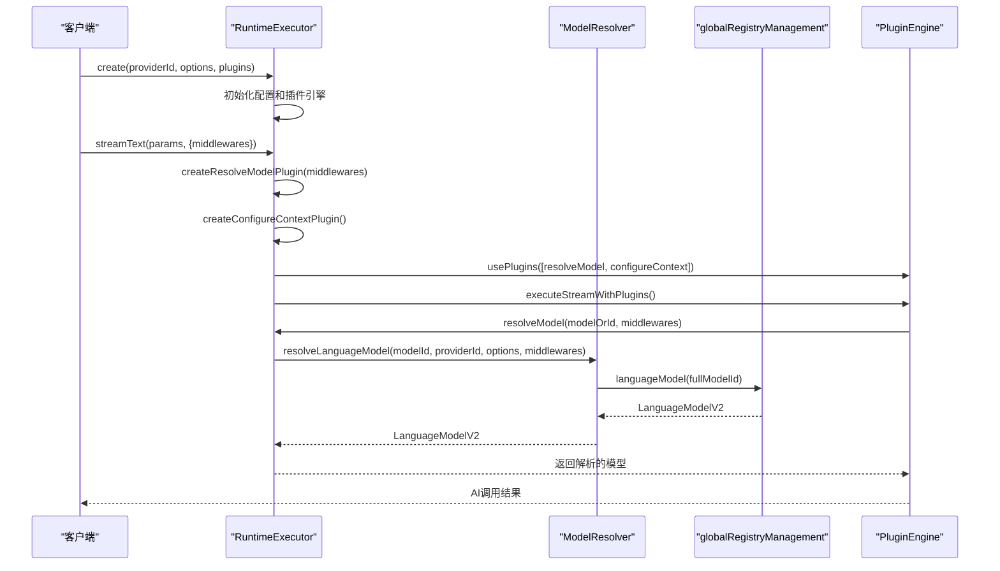
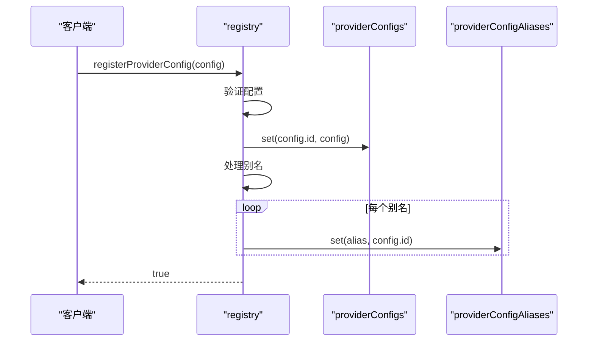
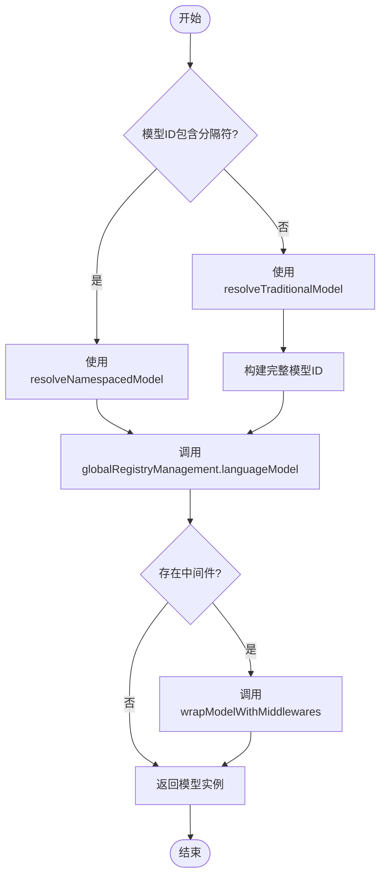
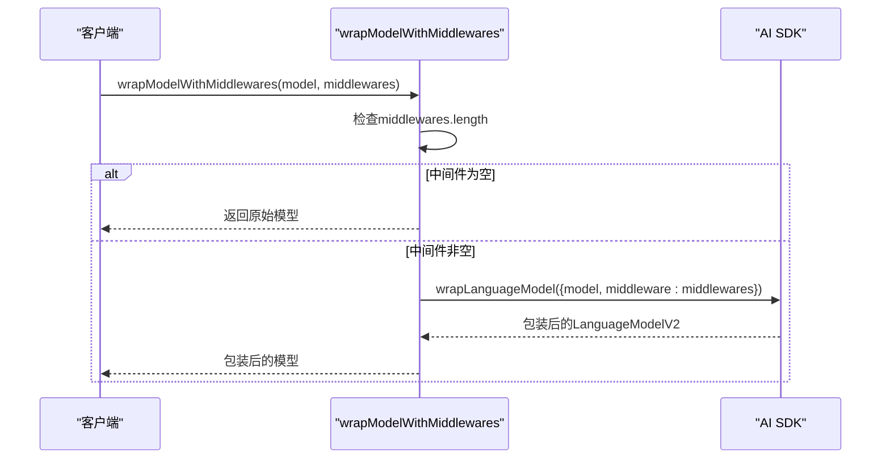

# 提供商架构

<cite>
**本文档引用的文件**
- [RegistryManagement.ts](file://packages/aiCore/src/core/providers/RegistryManagement.ts)
- [registry.ts](file://packages/aiCore/src/core/providers/registry.ts)
- [ModelResolver.ts](file://packages/aiCore/src/core/models/ModelResolver.ts)
- [wrapper.ts](file://packages/aiCore/src/core/middleware/wrapper.ts)
- [executor.ts](file://packages/aiCore/src/core/runtime/executor.ts)
- [manager.ts](file://packages/aiCore/src/core/middleware/manager.ts)
- [schemas.ts](file://packages/aiCore/src/core/providers/schemas.ts)
</cite>

## 目录
1. [架构概览](#架构概览)
2. [全局注册管理器](#全局注册管理器)
3. [模型解析器](#模型解析器)
4. [提供商工厂模式](#提供商工厂模式)
5. [中间件管理器](#中间件管理器)
6. [运行时执行器集成](#运行时执行器集成)
7. [实际应用示例](#实际应用示例)
8. [扩展与最佳实践](#扩展与最佳实践)

## 架构概览

Cherry Studio的提供商架构采用分层设计，核心组件包括全局注册管理器、模型解析器、提供商工厂模式和中间件管理器。该架构通过`globalRegistryManagement`实现提供商的注册、别名管理和实例检索，通过`ModelResolver`将模型ID解析为AI SDK的LanguageModel实例，并支持传统格式和命名空间格式。提供商工厂模式通过三步流程（注册配置、创建提供商、注册到全局管理器）实现动态提供商创建，而中间件管理器则通过包装和增强模型功能来扩展AI模型的能力。运行时执行器`RuntimeExecutor`集成了这些组件，为开发者提供统一的AI调用接口。

**架构来源**
- [RegistryManagement.ts](file://packages/aiCore/src/core/providers/RegistryManagement.ts)
- [ModelResolver.ts](file://packages/aiCore/src/core/models/ModelResolver.ts)
- [executor.ts](file://packages/aiCore/src/core/runtime/executor.ts)

## 全局注册管理器

全局注册管理器`globalRegistryManagement`是Cherry Studio提供商架构的核心，负责管理所有已注册的提供商实例。它基于AI SDK的`createProviderRegistry`实现，提供了一套完整的提供商生命周期管理功能。注册管理器使用`|`作为分隔符，避免与`:free`等后缀冲突。

注册管理器支持通过`registerProvider`方法注册提供商实例，并可同时注册多个别名。当注册一个提供商时，系统会创建主提供商记录，并将所有别名指向同一个提供商实例。`getProvider`方法用于获取已注册的提供商实例，而`unregisterProvider`方法则负责移除提供商及其相关别名。

注册管理器还提供了丰富的查询功能，包括`getRegisteredProviders`获取已注册提供商列表，`hasProviders`检查是否有已注册的提供商，以及`clear`方法清除所有提供商。别名管理功能通过`isAlias`检查是否为别名，`resolveProviderId`解析真实提供商ID，以及`getAllAliases`获取所有别名映射关系。



**图表来源**
- [RegistryManagement.ts](file://packages/aiCore/src/core/providers/RegistryManagement.ts)

**章节来源**
- [RegistryManagement.ts](file://packages/aiCore/src/core/providers/RegistryManagement.ts#L1-L222)

## 模型解析器

模型解析器`ModelResolver`是Cherry Studio架构中的关键组件，负责将模型ID解析为AI SDK的LanguageModel实例。它支持两种模型ID格式：传统格式（如'gpt-4'）和命名空间格式（如'anthropic>claude-3'），为开发者提供了灵活的模型引用方式。

`resolveLanguageModel`是模型解析器的核心方法，接受模型ID、回退提供商ID、提供商选项和中间件数组作为参数。对于命名空间格式的模型ID，解析器直接调用`resolveNamespacedModel`方法；对于传统格式，则使用`resolveTraditionalModel`方法构建完整的模型ID。解析器还集成了OpenAI模式选择逻辑，当回退提供商为'openai'或'azure'且模式为'chat'时，会自动调整提供商ID。

模型解析器不仅支持语言模型，还提供了`resolveTextEmbeddingModel`和`resolveImageModel`方法来解析文本嵌入模型和图像模型。这些方法遵循相同的解析逻辑，根据模型ID是否包含分隔符来决定使用命名空间或传统格式解析。



**图表来源**
- [ModelResolver.ts](file://packages/aiCore/src/core/models/ModelResolver.ts#L1-L125)

**章节来源**
- [ModelResolver.ts](file://packages/aiCore/src/core/models/ModelResolver.ts#L1-L125)

## 提供商工厂模式

提供商工厂模式是Cherry Studio实现动态提供商创建的核心机制，采用三步流程：注册配置、创建提供商和注册到全局管理器。这种模式通过`ProviderConfig`配置对象来定义提供商的创建逻辑，支持直接执行创建函数或动态导入模块执行创建函数。

`registerProviderConfig`方法负责注册提供商配置，存储提供商ID、名称、创建函数等信息，并处理别名映射。当需要创建提供商时，`createProvider`方法会根据提供商ID查找对应的配置，然后执行创建逻辑。创建成功后，`registerProvider`方法将提供商实例注册到全局注册管理器中。

工厂模式特别处理了OpenAI和Azure等特殊提供商的逻辑。对于OpenAI，系统会同时注册默认的`openai`和`openai-chat`变体；对于Azure，则会注册`azure-chat`变体和默认的`azure`响应模式提供商。这种设计确保了不同API模式的兼容性。



**图表来源**
- [registry.ts](file://packages/aiCore/src/core/providers/registry.ts#L1-L321)

**章节来源**
- [registry.ts](file://packages/aiCore/src/core/providers/registry.ts#L93-L225)

## 中间件管理器

中间件管理器是Cherry Studio扩展AI模型功能的关键组件，通过`wrapModelWithMiddlewares`函数将中间件应用到LanguageModel上。中间件管理器采用灵活的执行结构，每个中间件是一个接收上下文、参数和`next`函数的异步函数，允许在模型调用前后执行自定义逻辑。

`createMiddlewares`函数是中间件管理器的核心，负责创建和管理中间件链。它接收用户提供的中间件数组，并可以在此基础上添加默认中间件。中间件链的执行由`MiddlewareExecutor`管理，确保`next`函数的正确调用顺序，并处理异步操作和错误捕获。

中间件包装过程通过AI SDK的`wrapLanguageModel`函数实现，将原始模型和中间件数组包装成一个新的LanguageModel实例。这种包装机制允许在不修改原始模型实现的情况下，添加日志记录、性能监控、请求重试等增强功能。



**图表来源**
- [wrapper.ts](file://packages/aiCore/src/core/middleware/wrapper.ts)
- [manager.ts](file://packages/aiCore/src/core/middleware/manager.ts)

**章节来源**
- [wrapper.ts](file://packages/aiCore/src/core/middleware/wrapper.ts#L1-L24)
- [manager.ts](file://packages/aiCore/src/core/middleware/manager.ts#L1-L17)

## 运行时执行器集成

运行时执行器`RuntimeExecutor`是Cherry Studio提供商架构的集成中心，将全局注册管理器、模型解析器和中间件管理器的功能整合到一个统一的接口中。执行器通过静态工厂方法`create`和`createOpenAICompatible`创建，接收提供商ID、配置选项和插件数组作为参数。

执行器的核心功能是`resolveModel`方法，它利用`globalModelResolver`将模型ID解析为LanguageModel实例，并应用指定的中间件。当调用`streamText`、`generateText`等AI方法时，执行器会根据模型类型决定是否使用`_internal_resolveModel`插件来解析模型。

执行器还实现了`_internal_configureContext`插件，将执行器实例注入到请求上下文中，使插件能够访问执行器的功能。对于图像生成等特殊操作，执行器使用`_internal_resolveImageModel`插件来解析图像模型。



**图表来源**
- [executor.ts](file://packages/aiCore/src/core/runtime/executor.ts#L1-L311)

**章节来源**
- [executor.ts](file://packages/aiCore/src/core/runtime/executor.ts#L1-L311)

## 实际应用示例

### 提供商注册流程

提供商注册流程从配置注册开始，通过`registerProviderConfig`方法将提供商配置存储到全局配置映射中。配置包含提供商ID、名称、创建函数和别名等信息。注册成功后，系统会处理别名映射，确保所有别名正确指向提供商ID。



**图表来源**
- [registry.ts](file://packages/aiCore/src/core/providers/registry.ts#L93-L119)

### 模型解析过程

模型解析过程展示了`ModelResolver`如何将模型ID转换为LanguageModel实例。对于传统格式的模型ID，解析器会结合回退提供商ID和分隔符构建完整的模型ID；对于命名空间格式，则直接使用提供的ID。



**图表来源**
- [ModelResolver.ts](file://packages/aiCore/src/core/models/ModelResolver.ts#L22-L49)

### 中间件应用

中间件应用过程展示了如何将中间件链包装到原始模型上。`wrapModelWithMiddlewares`函数检查中间件数组是否为空，如果非空则使用AI SDK的`wrapLanguageModel`函数创建包装后的模型。



**图表来源**
- [wrapper.ts](file://packages/aiCore/src/core/middleware/wrapper.ts#L11-L23)

## 扩展与最佳实践

### 自定义提供商扩展

要扩展自定义提供商，开发者应首先定义`ProviderConfig`配置对象，包含提供商ID、名称、创建函数和可选的别名。提供商ID必须是自定义ID，不能与基础提供商ID冲突。创建函数可以是直接函数或通过动态导入执行的函数。

```typescript
const customProviderConfig: ProviderConfig = {
  id: 'my-custom-provider',
  name: 'My Custom Provider',
  creator: (options) => {
    // 创建并返回提供商实例
    return createCustomProvider(options);
  },
  aliases: ['custom', 'my-provider']
};
```

**章节来源**
- [schemas.ts](file://packages/aiCore/src/core/providers/schemas.ts#L182-L218)

### 最佳实践

1. **使用别名提高可读性**：为常用提供商配置别名，使代码更具可读性。
2. **合理使用中间件**：将通用功能（如日志记录、性能监控）实现为中间件，避免重复代码。
3. **正确处理错误**：在创建和注册提供商时妥善处理错误，提供清晰的错误信息。
4. **遵循配置验证**：确保提供商配置符合`providerConfigSchema`的验证规则。
5. **利用运行时执行器**：使用`RuntimeExecutor`的工厂方法创建执行器，享受类型安全和插件集成的好处。

**章节来源**
- [registry.ts](file://packages/aiCore/src/core/providers/registry.ts)
- [ModelResolver.ts](file://packages/aiCore/src/core/models/ModelResolver.ts)
- [executor.ts](file://packages/aiCore/src/core/runtime/executor.ts)