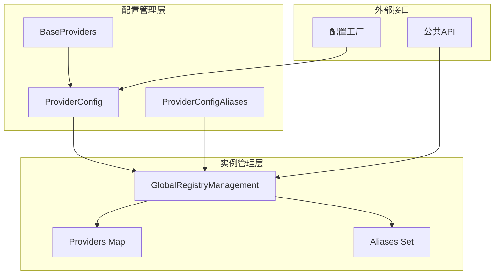
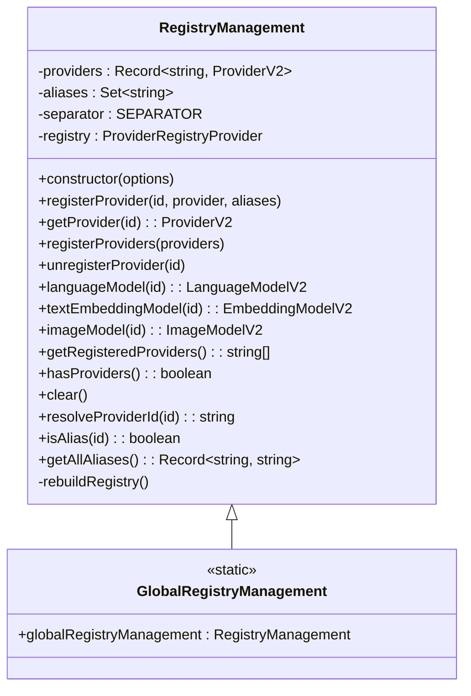
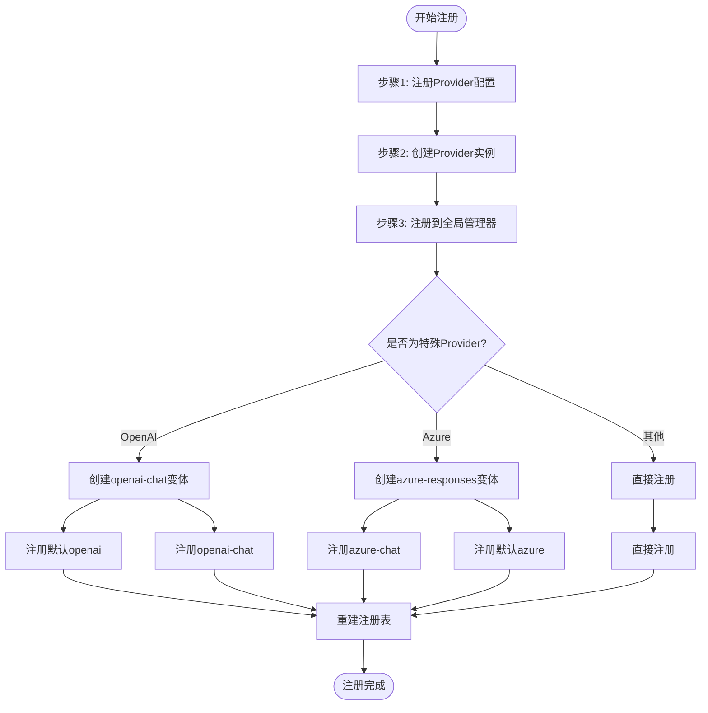
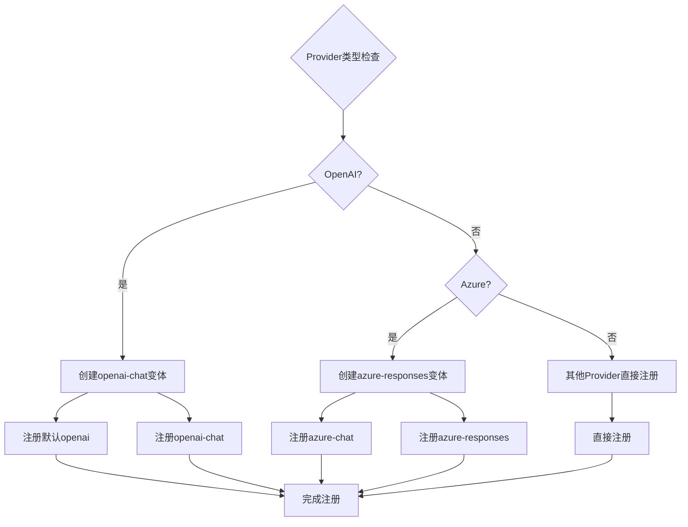
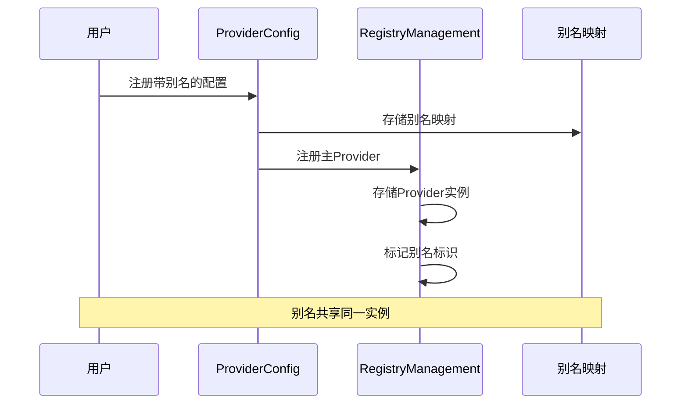
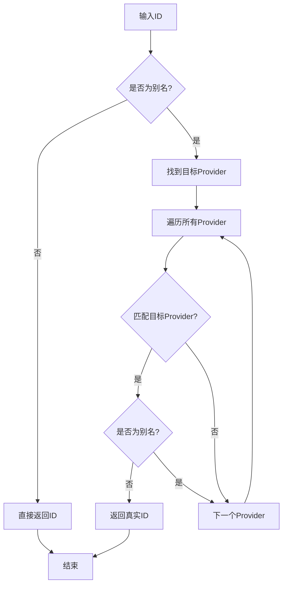

# Cherry Studio提供商注册管理

<cite>
**本文档中引用的文件**
- [RegistryManagement.ts](file://packages/aiCore/src/core/providers/RegistryManagement.ts)
- [registry.ts](file://packages/aiCore/src/core/providers/registry.ts)
- [schemas.ts](file://packages/aiCore/src/core/providers/schemas.ts)
- [registry-functionality.test.ts](file://packages/aiCore/src/core/providers/__tests__/registry-functionality.test.ts)
- [factory.ts](file://packages/aiCore/src/core/providers/factory.ts)
- [index.ts](file://packages/aiCore/src/core/providers/index.ts)
</cite>

## 目录
1. [简介](#简介)
2. [系统架构概览](#系统架构概览)
3. [核心组件分析](#核心组件分析)
4. [提供商注册流程](#提供商注册流程)
5. [别名管理系统](#别名管理系统)
6. [特殊提供商处理](#特殊提供商处理)
7. [实用工具函数](#实用工具函数)
8. [最佳实践指南](#最佳实践指南)
9. [故障排除](#故障排除)
10. [总结](#总结)

## 简介

Cherry Studio的提供商注册管理系统是一个高度模块化的架构，负责统一管理各种AI服务提供商的注册、配置和实例化。该系统基于AI SDK原生的Provider注册机制，提供了强大的扩展性和灵活性，支持从基础提供商（如OpenAI、Anthropic）到自定义提供商的全面管理。

系统的核心设计理念是分离配置管理和实例管理，通过两层架构实现：
- **配置层**：负责提供商的基础配置信息存储和别名管理
- **实例层**：负责实际的Provider实例注册和模型获取

## 系统架构概览



**图表来源**
- [RegistryManagement.ts](file://packages/aiCore/src/core/providers/RegistryManagement.ts#L15-L221)
- [registry.ts](file://packages/aiCore/src/core/providers/registry.ts#L67-L70)

## 核心组件分析

### RegistryManagement类

RegistryManagement是整个注册管理系统的核心类，负责维护提供商实例的注册表。



**图表来源**
- [RegistryManagement.ts](file://packages/aiCore/src/core/providers/RegistryManagement.ts#L15-L214)

#### 核心属性说明

| 属性 | 类型 | 描述 | 默认值 |
|------|------|------|--------|
| `providers` | `Record<string, ProviderV2>` | 存储所有已注册的Provider实例 | `{}` |
| `aliases` | `Set<string>` | 记录所有别名标识符 | `new Set()` |
| `separator` | `SEPARATOR` | 模型ID分隔符，默认为`\|` | `\|` |
| `registry` | `ProviderRegistryProvider \| null` | AI SDK原生注册表实例 | `null` |

**章节来源**
- [RegistryManagement.ts](file://packages/aiCore/src/core/providers/RegistryManagement.ts#L16-L20)

### 全局注册管理器

全局注册管理器`globalRegistryManagement`是RegistryManagement类的单例实例，位于包的根级别，为整个应用提供统一的提供商管理入口。

```typescript
// 全局注册表管理器实例
export const globalRegistryManagement = new RegistryManagement()
```

**章节来源**
- [RegistryManagement.ts](file://packages/aiCore/src/core/providers/RegistryManagement.ts#L221)

## 提供商注册流程

### 完整注册流程图



**图表来源**
- [registry.ts](file://packages/aiCore/src/core/providers/registry.ts#L164-L208)

### 步骤1：注册Provider配置

注册Provider配置是注册流程的第一步，负责存储提供商的基本信息和创建函数。

#### registerProviderConfig函数

```typescript
export function registerProviderConfig(config: ProviderConfig): boolean
```

**功能特性：**
- 验证配置完整性
- 处理别名映射
- 支持动态覆盖现有配置
- 提供详细的错误日志

**配置验证规则：**
- 必须包含`id`和`name`字段
- 必须提供`creator`函数或`import`配置
- 自定义ID不能与基础提供商ID冲突

**章节来源**
- [registry.ts](file://packages/aiCore/src/core/providers/registry.ts#L92-L122)

### 步骤2：创建Provider实例

创建Provider实例是根据配置信息实际生成可用的Provider对象。

#### createProvider函数

```typescript
export async function createProvider(providerId: string, options: any): Promise<any>
```

**支持两种创建方式：**
1. **直接创建**：通过配置中的`creator`函数直接创建
2. **动态导入**：通过`import`函数动态加载模块后调用指定函数

**章节来源**
- [registry.ts](file://packages/aiCore/src/core/providers/registry.ts#L127-L160)

### 步骤3：注册到全局管理器

最终将创建好的Provider实例注册到全局管理器中。

#### registerProvider函数

```typescript
export function registerProvider(providerId: string, provider: any): boolean
```

**特殊Provider处理逻辑：**



**图表来源**
- [registry.ts](file://packages/aiCore/src/core/providers/registry.ts#L176-L201)

**章节来源**
- [registry.ts](file://packages/aiCore/src/core/providers/registry.ts#L164-L208)

## 别名管理系统

别名系统是Cherry Studio提供商注册管理的重要特性，允许为同一个Provider实例创建多个访问入口。

### 别名注册机制



**图表来源**
- [RegistryManagement.ts](file://packages/aiCore/src/core/providers/RegistryManagement.ts#L33-L38)

### 别名解析算法

resolveProviderId方法实现了智能的别名解析逻辑：



**图表来源**
- [RegistryManagement.ts](file://packages/aiCore/src/core/providers/RegistryManagement.ts#L185-L195)

**章节来源**
- [RegistryManagement.ts](file://packages/aiCore/src/core/providers/RegistryManagement.ts#L184-L213)

## 特殊提供商处理

### OpenAI提供商特殊处理

OpenAI提供商具有独特的API设计，因此需要特殊的处理逻辑：

```typescript
// OpenAI特殊处理：创建两个变体
if (providerId === 'openai') {
    // 注册默认 openai
    globalRegistryManagement.registerProvider(providerId, provider, aliases)
    
    // 创建并注册 openai-chat 变体
    const openaiChatProvider = customProvider({
        fallbackProvider: {
            ...provider,
            languageModel: (modelId: string) => provider.chat(modelId)
        }
    })
    globalRegistryManagement.registerProvider(`${providerId}-chat`, openaiChatProvider)
}
```

**特点：**
- 默认行为调用`provider.languageModel()`
- `openai-chat`变体强制调用`provider.chat(modelId)`
- 保持向后兼容性

**章节来源**
- [registry.ts](file://packages/aiCore/src/core/providers/registry.ts#L176-L188)

### Azure提供商特殊处理

Azure提供商的处理逻辑与OpenAI相反：

```typescript
// Azure特殊处理：创建两个变体
else if (providerId === 'azure') {
    globalRegistryManagement.registerProvider(`${providerId}-chat`, provider, aliases)
    
    // 跟上面相反,creator产出的默认会调用chat
    const azureResponsesProvider = customProvider({
        fallbackProvider: {
            ...provider,
            languageModel: (modelId: string) => provider.responses(modelId)
        }
    })
    globalRegistryManagement.registerProvider(providerId, azureResponsesProvider)
}
```

**特点：**
- 默认行为调用`provider.chat()`
- `azure`变体强制调用`provider.responses(modelId)`
- 适应Azure的API设计差异

**章节来源**
- [registry.ts](file://packages/aiCore/src/core/providers/registry.ts#L189-L198)

## 实用工具函数

### 基础查询函数

| 函数名 | 返回类型 | 功能描述 |
|--------|----------|----------|
| `getInitializedProviders()` | `string[]` | 获取所有已初始化的Provider ID列表 |
| `hasInitializedProviders()` | `boolean` | 检查是否存在已初始化的Providers |
| `getSupportedProviders()` | `Array<{id: string, name: string}>` | 获取支持的Provider列表 |
| `getLanguageModel(id)` | `LanguageModelV2` | 获取语言模型实例 |
| `getTextEmbeddingModel(id)` | `EmbeddingModelV2<string>` | 获取文本嵌入模型实例 |
| `getImageModel(id)` | `ImageModelV2` | 获取图像模型实例 |

**章节来源**
- [registry.ts](file://packages/aiCore/src/core/providers/registry.ts#L31-L62)

### 配置查询函数

| 函数名 | 返回类型 | 功能描述 |
|--------|----------|----------|
| `hasProviderConfig(id)` | `boolean` | 检查是否存在Provider配置 |
| `getProviderConfig(id)` | `ProviderConfig \| undefined` | 获取Provider配置 |
| `hasProviderConfigByAlias(aliasOrId)` | `boolean` | 通过别名或ID检查配置存在性 |
| `getProviderConfigByAlias(aliasOrId)` | `ProviderConfig \| undefined` | 通过别名或ID获取配置 |
| `resolveProviderConfigId(aliasOrId)` | `string` | 解析真实的ProviderConfig ID |
| `isProviderConfigAlias(id)` | `boolean` | 检查是否为ProviderConfig别名 |
| `getAllProviderConfigs()` | `ProviderConfig[]` | 获取所有Provider配置 |
| `getAllProviderConfigAliases()` | `Record<string, string>` | 获取所有ProviderConfig别名映射 |

**章节来源**
- [registry.ts](file://packages/aiCore/src/core/providers/registry.ts#L240-L299)

### 清理和重置函数

| 函数名 | 功能描述 |
|--------|----------|
| `cleanup()` | 清理所有Provider配置和已注册的providers，重新初始化内置配置 |
| `clearAllProviders()` | 仅清除所有已注册的providers |

**章节来源**
- [registry.ts](file://packages/aiCore/src/core/providers/registry.ts#L304-L315)

## 最佳实践指南

### 1. 自定义Provider注册最佳实践

#### 基本配置结构

```typescript
// 推荐的Provider配置结构
const customProviderConfig: ProviderConfig = {
    id: 'your-custom-provider',
    name: 'Your Custom Provider',
    creator: (options) => {
        // 实现你的Provider创建逻辑
        return createCustomProvider(options);
    },
    supportsImageGeneration: false,
    aliases: ['custom-short', 'my-provider']
};
```

#### 动态导入配置

```typescript
// 对于大型Provider，推荐使用动态导入
const dynamicProviderConfig: ProviderConfig = {
    id: 'external-provider',
    name: 'External Provider',
    import: () => import('./external-provider-module'),
    creatorFunctionName: 'createExternalProvider',
    supportsImageGeneration: true
};
```

### 2. 错误处理策略

#### Provider初始化错误处理

```typescript
try {
    const success = await createAndRegisterProvider('your-provider', options);
    if (!success) {
        console.error('Provider registration failed');
        // 实施降级策略
    }
} catch (error) {
    if (error instanceof ProviderInitializationError) {
        console.error('Provider initialization error:', error.message);
        // 处理特定错误类型
    } else {
        console.error('Unexpected error:', error);
    }
}
```

### 3. 性能优化建议

#### 批量注册

```typescript
// 推荐使用批量注册而非逐个注册
const configs: ProviderConfig[] = [
    // 多个Provider配置
];

const successCount = registerMultipleProviderConfigs(configs);
console.log(`Successfully registered ${successCount} providers`);
```

#### 避免频繁重建

系统会在每次注册操作后自动重建注册表，对于大量注册场景，建议：
- 使用`registerProviders`进行批量注册
- 避免在循环中频繁调用注册函数

### 4. 测试和调试

#### 检查注册状态

```typescript
// 调试注册状态
console.log('已注册的Providers:', getInitializedProviders());
console.log('Provider配置:', getAllProviderConfigs());
console.log('别名映射:', getAllProviderConfigAliases());
```

#### 验证Provider可用性

```typescript
// 验证Provider是否可正常使用
const providerId = 'your-provider';
if (hasProviderConfig(providerId)) {
    const config = getProviderConfig(providerId);
    console.log('Provider配置:', config);
    
    if (hasInitializedProviders()) {
        const models = getInitializedProviders();
        console.log('可用模型:', models);
    }
}
```

## 故障排除

### 常见问题及解决方案

#### 1. Provider注册失败

**症状：** `createAndRegisterProvider`返回false

**可能原因：**
- 配置信息不完整
- Provider创建函数抛出异常
- API密钥无效

**解决方法：**
```typescript
// 添加详细错误日志
try {
    const success = await createAndRegisterProvider('provider-id', options);
    if (!success) {
        console.error('Provider registration failed');
        console.log('Available providers:', getInitializedProviders());
    }
} catch (error) {
    console.error('Registration error:', error);
}
```

#### 2. 模型解析错误

**症状：** 调用模型时出现"Model not found"错误

**可能原因：**
- Provider未正确注册
- 模型ID格式错误
- 分隔符使用不当

**解决方法：**
```typescript
// 检查Provider注册状态
if (!hasInitializedProviders()) {
    console.error('No providers registered');
}

// 使用正确的模型ID格式
const modelId = `${providerId}|${model}`;
const model = getLanguageModel(modelId);
```

#### 3. 别名解析问题

**症状：** 别名无法正确解析为真实ID

**诊断方法：**
```typescript
// 检查别名映射
const aliases = getAllProviderConfigAliases();
console.log('别名映射:', aliases);

// 验证别名解析
const realId = resolveProviderConfigId('your-alias');
console.log('解析结果:', realId);
```

#### 4. 内存泄漏问题

**症状：** 长时间运行后内存占用过高

**预防措施：**
- 定期调用`cleanup()`清理不需要的Provider
- 使用`clearAllProviders()`重置状态
- 避免重复注册相同Provider

**章节来源**
- [registry.ts](file://packages/aiCore/src/core/providers/registry.ts#L304-L315)

## 总结

Cherry Studio的提供商注册管理系统是一个设计精良、功能完备的架构，具有以下核心优势：

### 主要特性

1. **双层架构设计**：清晰分离配置管理和实例管理
2. **别名系统支持**：灵活的多入口访问机制
3. **特殊Provider处理**：针对OpenAI、Azure等平台的专门优化
4. **类型安全保障**：基于Zod的配置验证和TypeScript类型推导
5. **扩展性强**：支持自定义Provider的无缝集成

### 技术亮点

- **智能别名解析**：通过`resolveProviderId`实现高效的别名管理
- **自动注册表重建**：每次变更后自动更新AI SDK兼容的注册表
- **批量操作支持**：提供`registerMultipleProviderConfigs`等批量处理函数
- **完善的错误处理**：详细的错误日志和异常类型定义

### 应用价值

该系统为Cherry Studio提供了强大而灵活的AI服务提供商管理能力，不仅支持现有的主流AI平台，还为未来的扩展预留了充足的空间。通过标准化的注册流程和丰富的工具函数，开发者可以轻松地集成新的AI服务提供商，同时保持系统的稳定性和可维护性。

对于初学者，系统提供了直观的API和详细的错误提示；对于有经验的开发者，系统暴露了足够的灵活性和控制力，支持复杂的定制需求。这种平衡使得Cherry Studio的提供商注册管理系统成为了一个既易用又强大的解决方案。