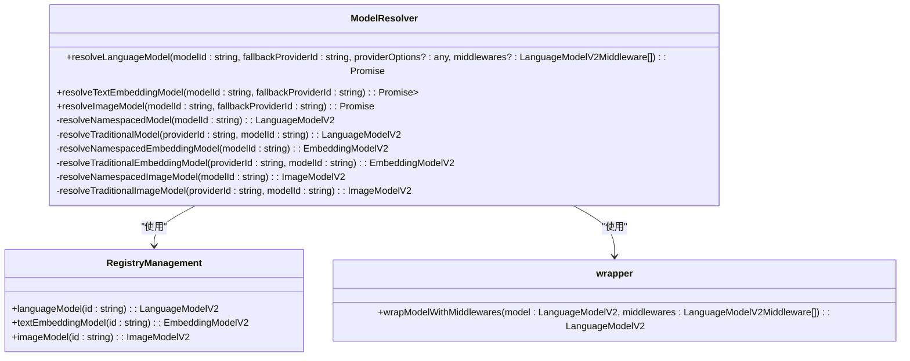
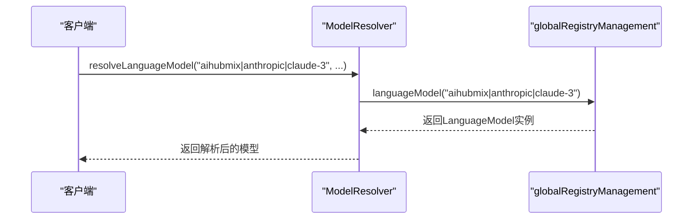
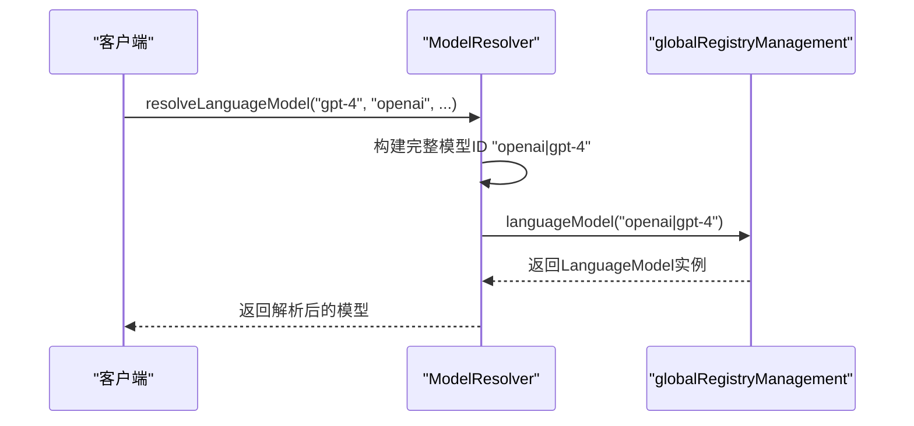
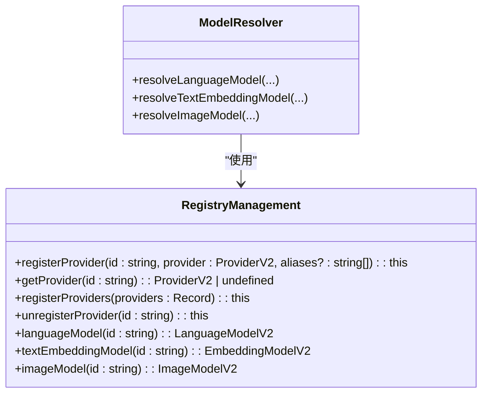
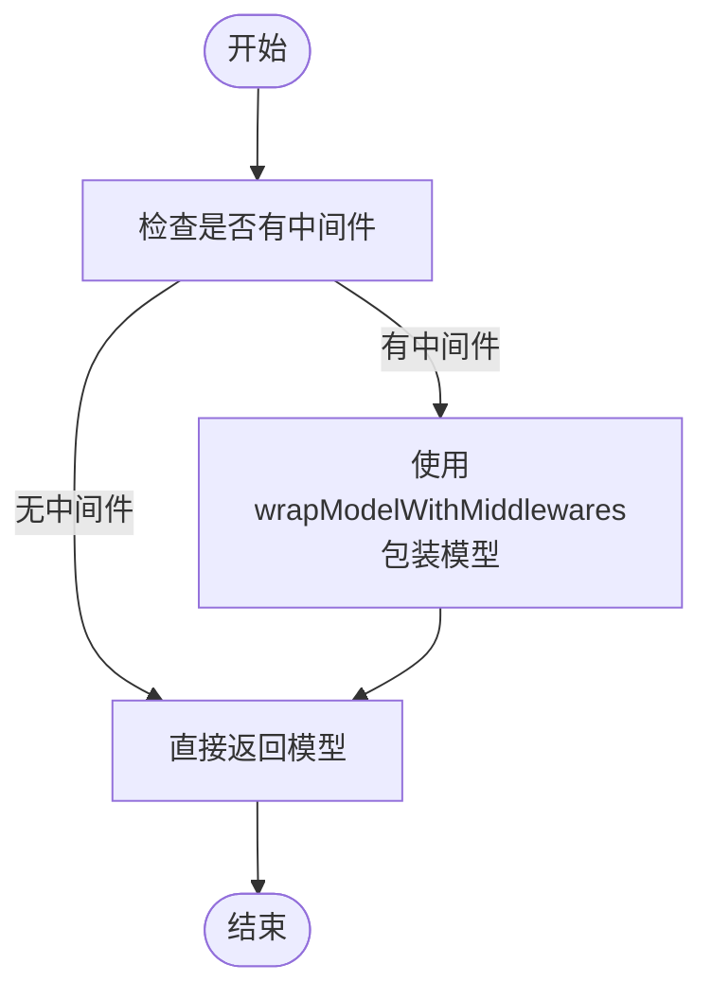
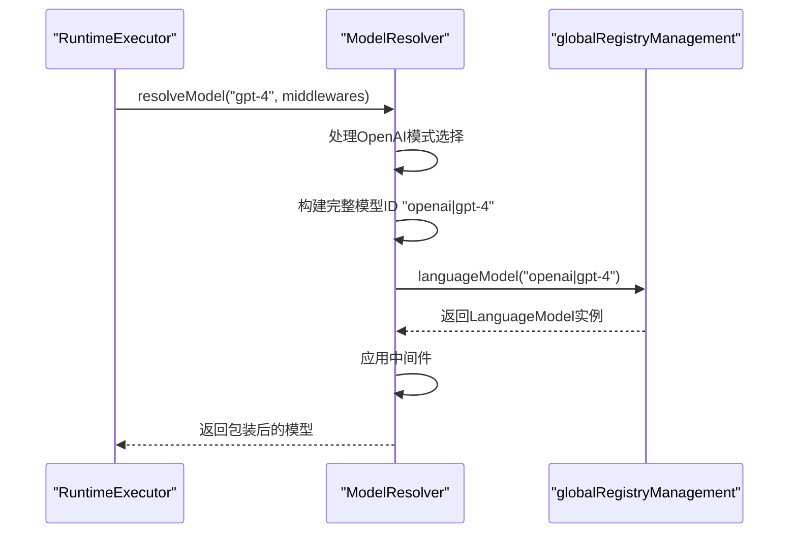
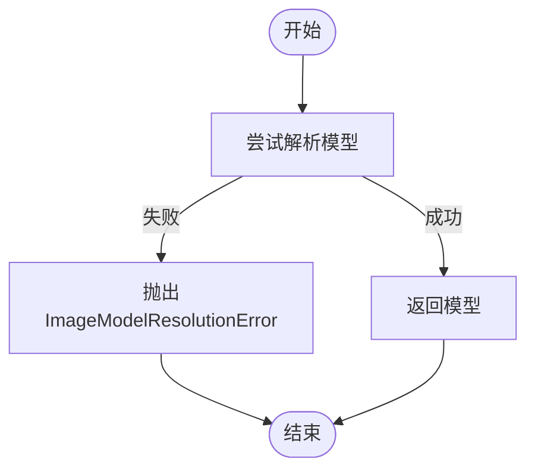

# 模型解析机制

<cite>
**本文档引用的文件**  
- [ModelResolver.ts](file://packages/aiCore/src/core/models/ModelResolver.ts)
- [RegistryManagement.ts](file://packages/aiCore/src/core/providers/RegistryManagement.ts)
- [wrapper.ts](file://packages/aiCore/src/core/middleware/wrapper.ts)
- [executor.ts](file://packages/aiCore/src/core/runtime/executor.ts)
</cite>

## 目录
1. [简介](#简介)
2. [核心组件](#核心组件)
3. [解析流程详解](#解析流程详解)
4. [命名空间与传统格式解析差异](#命名空间与传统格式解析差异)
5. [全局注册管理器协同工作](#全局注册管理器协同工作)
6. [中间件应用机制](#中间件应用机制)
7. [实际使用示例](#实际使用示例)
8. [错误处理](#错误处理)
9. [最佳实践](#最佳实践)

## 简介
Cherry Studio的模型解析机制是AI核心功能的重要组成部分，负责将模型ID解析为AI SDK的LanguageModel实例。该机制支持两种格式的模型ID：传统格式（如'gpt-4'）和命名空间格式（如'anthropic>claude-3'）。通过ModelResolver类实现，该机制能够根据fallbackProviderId和providerOptions确定最终的providerId，并处理OpenAI模式选择等特殊逻辑。

**Section sources**
- [ModelResolver.ts](file://packages/aiCore/src/core/models/ModelResolver.ts#L1-L6)

## 核心组件
模型解析机制的核心是ModelResolver类，它负责将模型ID解析为AI SDK的LanguageModel实例。该类提供了resolveLanguageModel、resolveTextEmbeddingModel和resolveImageModel等方法，用于解析不同类型的语言模型。



**Diagram sources**
- [ModelResolver.ts](file://packages/aiCore/src/core/models/ModelResolver.ts#L12-L118)
- [RegistryManagement.ts](file://packages/aiCore/src/core/providers/RegistryManagement.ts#L16-L221)
- [wrapper.ts](file://packages/aiCore/src/core/middleware/wrapper.ts#L10-L22)

**Section sources**
- [ModelResolver.ts](file://packages/aiCore/src/core/models/ModelResolver.ts#L12-L124)

## 解析流程详解
模型解析流程从resolveLanguageModel方法开始，该方法是ModelResolver类的核心方法。它接收模型ID、fallbackProviderId、providerOptions和middlewares作为参数，并返回一个Promise<LanguageModelV2>。

```mermaid
flowchart TD
Start([开始]) --> CheckFormat["检查模型ID格式"]
CheckFormat --> |包含分隔符| ResolveNamespaced["解析命名空间格式"]
CheckFormat --> |不包含分隔符| ResolveTraditional["解析传统格式"]
ResolveNamespaced --> ApplyMiddleware["应用中间件"]
ResolveTraditional --> ApplyMiddleware
ApplyMiddleware --> ReturnModel["返回模型实例"]
ReturnModel --> End([结束])
subgraph "特殊逻辑处理"
CheckProvider["检查providerId"]
CheckProvider --> |openai或azure且mode为chat| ModifyProviderId["修改providerId为{providerId}-chat"]
ModifyProviderId --> CheckFormat
end
Start --> CheckProvider
```

**Diagram sources**
- [ModelResolver.ts](file://packages/aiCore/src/core/models/ModelResolver.ts#L22-L48)

**Section sources**
- [ModelResolver.ts](file://packages/aiCore/src/core/models/ModelResolver.ts#L22-L48)

## 命名空间与传统格式解析差异
模型解析机制支持两种格式的模型ID：命名空间格式和传统格式。这两种格式的解析方式有所不同。

### 命名空间格式解析
命名空间格式的模型ID包含分隔符（默认为'|'），例如'aihubmix|anthropic|claude-3'。解析时直接使用globalRegistryManagement.languageModel方法获取模型实例。



**Diagram sources**
- [ModelResolver.ts](file://packages/aiCore/src/core/models/ModelResolver.ts#L77-L78)

### 传统格式解析
传统格式的模型ID不包含分隔符，例如'gpt-4'。解析时需要将fallbackProviderId和modelId组合成完整的模型ID，然后使用globalRegistryManagement.languageModel方法获取模型实例。



**Diagram sources**
- [ModelResolver.ts](file://packages/aiCore/src/core/models/ModelResolver.ts#L84-L87)

**Section sources**
- [ModelResolver.ts](file://packages/aiCore/src/core/models/ModelResolver.ts#L77-L87)

## 全局注册管理器协同工作
模型解析器与全局注册管理器（globalRegistryManagement）协同工作，通过RegistryManagement类提供的方法来获取模型实例。RegistryManagement类负责管理已注册的provider实例，并提供languageModel、textEmbeddingModel和imageModel等方法来获取相应的模型。



**Diagram sources**
- [RegistryManagement.ts](file://packages/aiCore/src/core/providers/RegistryManagement.ts#L16-L221)

**Section sources**
- [RegistryManagement.ts](file://packages/aiCore/src/core/providers/RegistryManagement.ts#L16-L221)

## 中间件应用机制
在模型解析完成后，如果提供了中间件数组，则会使用wrapModelWithMiddlewares函数将中间件应用到最终的模型上。这个过程确保了中间件能够在模型调用前后执行特定的逻辑。



**Diagram sources**
- [ModelResolver.ts](file://packages/aiCore/src/core/models/ModelResolver.ts#L43-L45)
- [wrapper.ts](file://packages/aiCore/src/core/middleware/wrapper.ts#L10-L22)

**Section sources**
- [ModelResolver.ts](file://packages/aiCore/src/core/models/ModelResolver.ts#L43-L45)
- [wrapper.ts](file://packages/aiCore/src/core/middleware/wrapper.ts#L10-L22)

## 实际使用示例
以下是模型解析机制在实际代码中的使用示例：



**Diagram sources**
- [executor.ts](file://packages/aiCore/src/core/runtime/executor.ts#L237-L253)

**Section sources**
- [executor.ts](file://packages/aiCore/src/core/runtime/executor.ts#L237-L253)

## 错误处理
当模型解析失败时，系统会抛出相应的错误。例如，在resolveImageModel方法中，如果无法解析图像模型，会抛出ImageModelResolutionError异常。



**Diagram sources**
- [executor.ts](file://packages/aiCore/src/core/runtime/executor.ts#L258-L277)

**Section sources**
- [executor.ts](file://packages/aiCore/src/core/runtime/executor.ts#L258-L277)

## 最佳实践
为了有效使用模型解析机制，建议遵循以下最佳实践：
1. 使用命名空间格式的模型ID以提高可读性和可维护性
2. 在需要特殊处理时，利用providerOptions参数传递配置选项
3. 合理使用中间件来增强模型功能
4. 确保在使用前正确注册provider实例到全局注册管理器

**Section sources**
- [ModelResolver.ts](file://packages/aiCore/src/core/models/ModelResolver.ts#L1-L124)
- [RegistryManagement.ts](file://packages/aiCore/src/core/providers/RegistryManagement.ts#L1-L222)
- [wrapper.ts](file://packages/aiCore/src/core/middleware/wrapper.ts#L1-L24)
- [executor.ts](file://packages/aiCore/src/core/runtime/executor.ts#L237-L277)