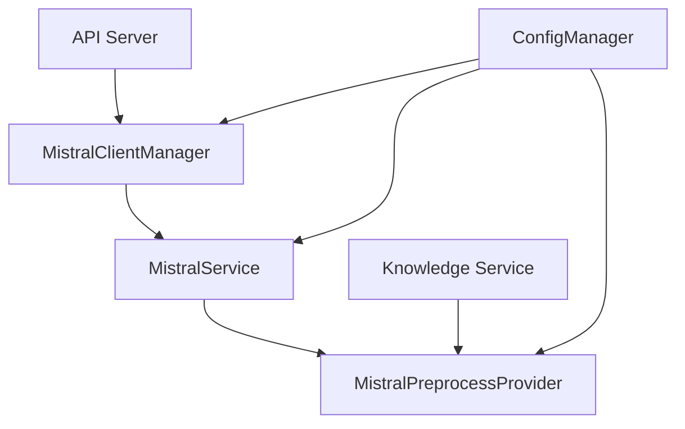
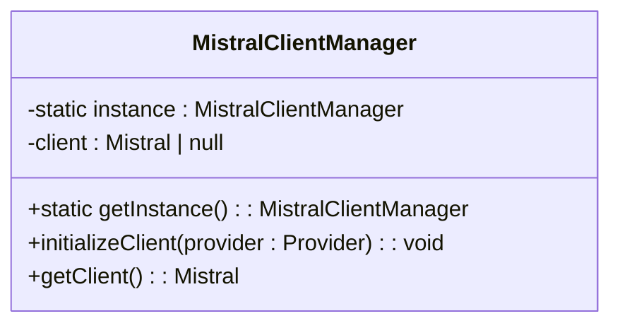
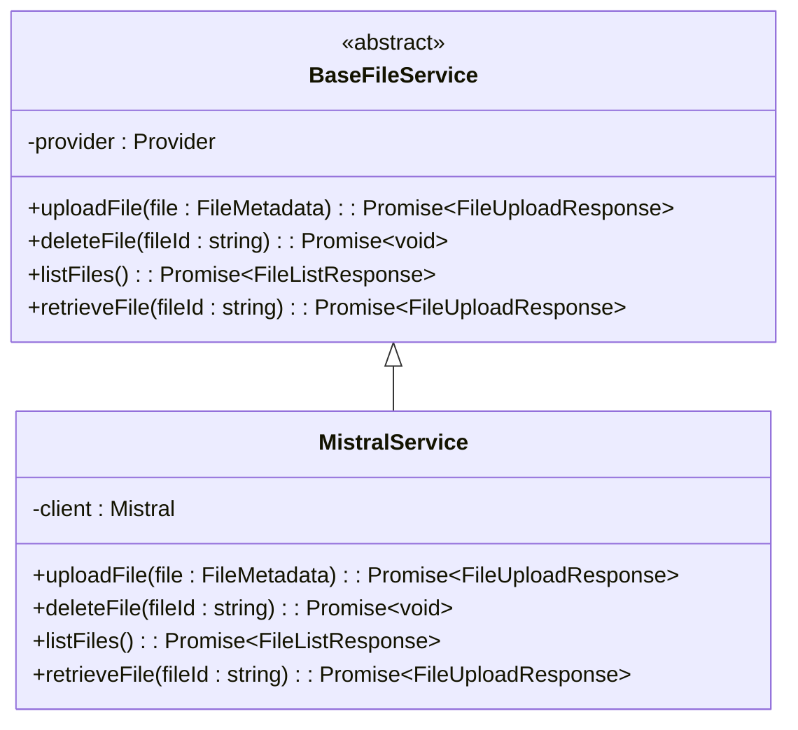
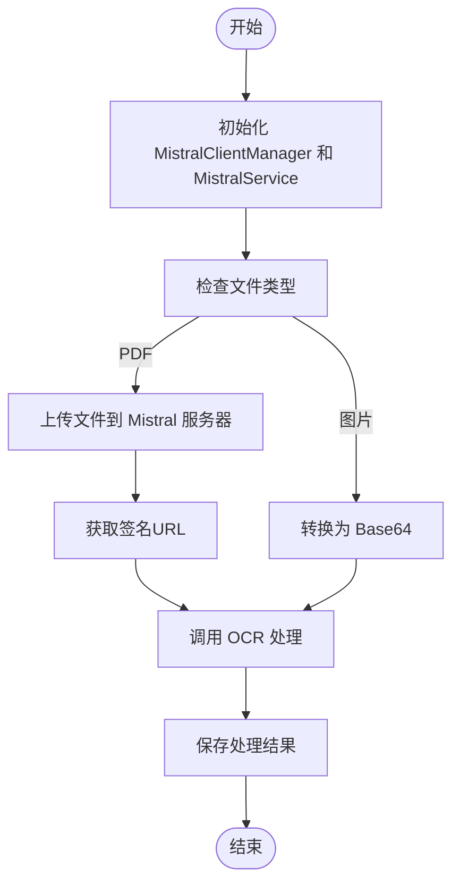
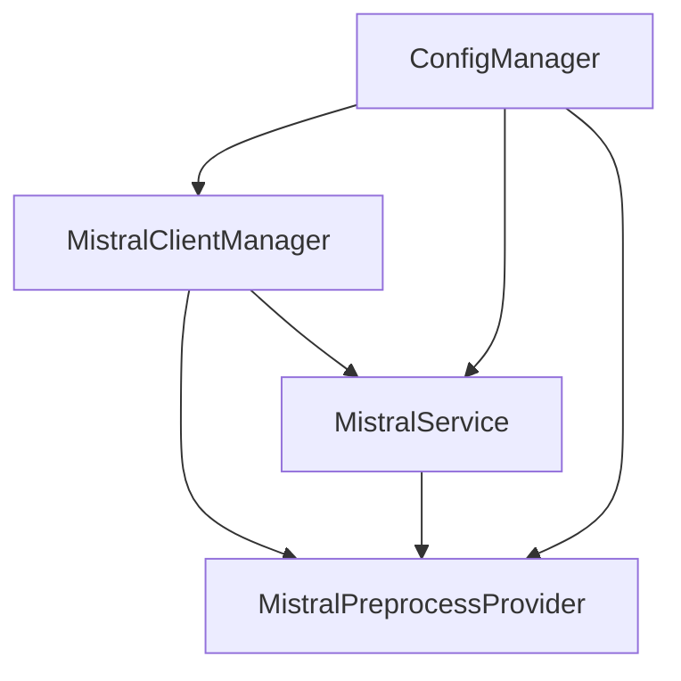

# Mistral 本地集成

<cite>
**本文档中引用的文件**  
- [MistralClientManager.ts](file://src/main/services/MistralClientManager.ts)
- [MistralService.ts](file://src/main/services/remotefile/MistralService.ts)
- [MistralPreprocessProvider.ts](file://src/main/knowledge/preprocess/MistralPreprocessProvider.ts)
- [BaseFileService.ts](file://src/main/services/remotefile/BaseFileService.ts)
- [index.ts](file://src/main/apiServer/utils/index.ts)
</cite>

## 目录
1. [简介](#简介)
2. [项目结构](#项目结构)
3. [核心组件](#核心组件)
4. [架构概述](#架构概述)
5. [详细组件分析](#详细组件分析)
6. [依赖分析](#依赖分析)
7. [性能考虑](#性能考虑)
8. [故障排除指南](#故障排除指南)
9. [结论](#结论)

## 简介
本文档详细介绍了Mistral本地模型集成的实现机制，重点阐述了MistralClientManager的单例模式实现和客户端初始化流程。文档涵盖了如何使用@mistralai/mistralai SDK与本地Mistral服务器建立连接，包括API密钥和服务器URL的配置。同时描述了从配置管理到客户端请求的完整服务间调用关系，提供了实际代码库中的具体示例，包括错误处理（如客户端未初始化）和连接管理。文档还说明了Mistral模型在系统中的注册方式和配置选项，为初学者提供了连接本地Mistral实例的步骤指南，为有经验的开发者提供了连接池管理和性能调优的技术深度。

## 项目结构
项目结构中与Mistral集成相关的核心组件位于src/main/services目录下，主要包括MistralClientManager.ts用于管理Mistral客户端的单例实例，以及remotefile目录下的MistralService.ts用于处理文件上传、下载等远程文件操作。知识预处理模块位于src/main/knowledge/preprocess目录下，其中MistralPreprocessProvider.ts实现了基于Mistral模型的预处理功能。这些组件通过统一的Provider接口进行配置管理，确保了配置的一致性和可维护性。



**Diagram sources**
- [MistralClientManager.ts](file://src/main/services/MistralClientManager.ts#L4-L33)
- [MistralService.ts](file://src/main/services/remotefile/MistralService.ts#L13-L107)
- [MistralPreprocessProvider.ts](file://src/main/knowledge/preprocess/MistralPreprocessProvider.ts#L21-L47)

**Section sources**
- [MistralClientManager.ts](file://src/main/services/MistralClientManager.ts#L1-L34)
- [MistralService.ts](file://src/main/services/remotefile/MistralService.ts#L1-L108)
- [MistralPreprocessProvider.ts](file://src/main/knowledge/preprocess/MistralPreprocessProvider.ts#L1-L193)

## 核心组件
Mistral集成的核心组件包括MistralClientManager、MistralService和MistralPreprocessProvider。MistralClientManager实现了单例模式，确保在整个应用程序中只有一个Mistral客户端实例，避免了资源浪费和连接冲突。MistralService继承自BaseFileService，提供了文件上传、下载、删除和列出等操作的具体实现。MistralPreprocessProvider则利用MistralService和MistralClientManager来实现文档预处理功能，特别是PDF文件的OCR处理。

**Section sources**
- [MistralClientManager.ts](file://src/main/services/MistralClientManager.ts#L4-L33)
- [MistralService.ts](file://src/main/services/remotefile/MistralService.ts#L13-L107)
- [MistralPreprocessProvider.ts](file://src/main/knowledge/preprocess/MistralPreprocessProvider.ts#L21-L47)

## 架构概述
Mistral本地集成的架构采用分层设计，最底层是@mistralai/mistralai SDK，提供了与Mistral服务器通信的基础能力。中间层是MistralClientManager，作为单例模式的客户端管理器，负责创建和管理Mistral客户端实例。上层是各种服务类，如MistralService和MistralPreprocessProvider，它们使用MistralClientManager提供的客户端实例来执行具体的业务逻辑。配置管理通过Provider接口统一进行，确保了配置的一致性和可维护性。

```mermaid
graph TD
A[@mistralai/mistralai SDK] --> B[MistralClientManager]
B --> C[MistralService]
B --> D[MistralPreprocessProvider]
E[ConfigManager] --> B
E --> C
E --> D
C --> F[文件操作]
D --> G[文档预处理]
```

**Diagram sources**
- [MistralClientManager.ts](file://src/main/services/MistralClientManager.ts#L4-L33)
- [MistralService.ts](file://src/main/services/remotefile/MistralService.ts#L13-L107)
- [MistralPreprocessProvider.ts](file://src/main/knowledge/preprocess/MistralPreprocessProvider.ts#L21-L47)

## 详细组件分析

### MistralClientManager 分析
MistralClientManager是Mistral集成的核心组件，采用单例模式确保全局唯一实例。它负责初始化和管理Mistral客户端，提供统一的访问接口。

#### 单例模式实现


**Diagram sources**
- [MistralClientManager.ts](file://src/main/services/MistralClientManager.ts#L4-L33)

**Section sources**
- [MistralClientManager.ts](file://src/main/services/MistralClientManager.ts#L1-L34)

### MistralService 分析
MistralService是处理Mistral服务器文件操作的服务类，继承自BaseFileService抽象类，实现了具体的文件上传、下载、删除和列出功能。

#### 服务类继承关系


**Diagram sources**
- [BaseFileService.ts](file://src/main/services/remotefile/BaseFileService.ts#L3-L13)
- [MistralService.ts](file://src/main/services/remotefile/MistralService.ts#L13-L107)

**Section sources**
- [BaseFileService.ts](file://src/main/services/remotefile/BaseFileService.ts#L1-L14)
- [MistralService.ts](file://src/main/services/remotefile/MistralService.ts#L1-L108)

### MistralPreprocessProvider 分析
MistralPreprocessProvider是知识预处理模块中的具体实现类，利用MistralService和MistralClientManager来处理文档预处理任务，特别是PDF文件的OCR处理。

#### 预处理流程


**Diagram sources**
- [MistralPreprocessProvider.ts](file://src/main/knowledge/preprocess/MistralPreprocessProvider.ts#L21-L47)

**Section sources**
- [MistralPreprocessProvider.ts](file://src/main/knowledge/preprocess/MistralPreprocessProvider.ts#L1-L193)

## 依赖分析
Mistral集成组件之间的依赖关系清晰，MistralClientManager作为核心依赖被MistralService和MistralPreprocessProvider共同使用。MistralService依赖于MistralClientManager获取客户端实例，而MistralPreprocessProvider则同时依赖于MistralClientManager和MistralService。这种依赖关系确保了客户端实例的统一管理和资源的有效利用。



**Diagram sources**
- [MistralClientManager.ts](file://src/main/services/MistralClientManager.ts#L4-L33)
- [MistralService.ts](file://src/main/services/remotefile/MistralService.ts#L13-L107)
- [MistralPreprocessProvider.ts](file://src/main/knowledge/preprocess/MistralPreprocessProvider.ts#L21-L47)

**Section sources**
- [MistralClientManager.ts](file://src/main/services/MistralClientManager.ts#L1-L34)
- [MistralService.ts](file://src/main/services/remotefile/MistralService.ts#L1-L108)
- [MistralPreprocessProvider.ts](file://src/main/knowledge/preprocess/MistralPreprocessProvider.ts#L1-L193)

## 性能考虑
在Mistral集成的性能优化方面，单例模式的使用避免了重复创建客户端实例的开销，提高了资源利用率。连接池管理通过MistralClientManager的单例实例实现，确保了连接的复用。对于大文件处理，建议采用分块上传策略，避免内存溢出。错误处理机制完善，能够有效处理网络异常和服务器错误，确保系统的稳定性。

## 故障排除指南
当遇到Mistral客户端未初始化的错误时，应首先检查MistralClientManager的getInstance()方法是否正确调用，以及initializeClient()方法是否在使用客户端之前被调用。对于连接问题，需要验证API密钥和服务器URL的正确性。文件上传失败时，应检查文件路径和权限，以及服务器的存储空间。通过日志服务可以获取详细的错误信息，帮助快速定位和解决问题。

**Section sources**
- [MistralClientManager.ts](file://src/main/services/MistralClientManager.ts#L28-L30)
- [MistralService.ts](file://src/main/services/remotefile/MistralService.ts#L43-L49)
- [MistralPreprocessProvider.ts](file://src/main/knowledge/preprocess/MistralPreprocessProvider.ts#L49-L52)

## 结论
Mistral本地集成通过MistralClientManager的单例模式实现了客户端的统一管理，确保了资源的有效利用和连接的稳定性。MistralService和MistralPreprocessProvider组件通过清晰的依赖关系和职责划分，实现了文件操作和文档预处理功能。配置管理通过Provider接口统一进行，保证了配置的一致性和可维护性。整体架构设计合理，性能优化到位，错误处理机制完善，为Mistral模型的本地集成提供了可靠的技术支持。