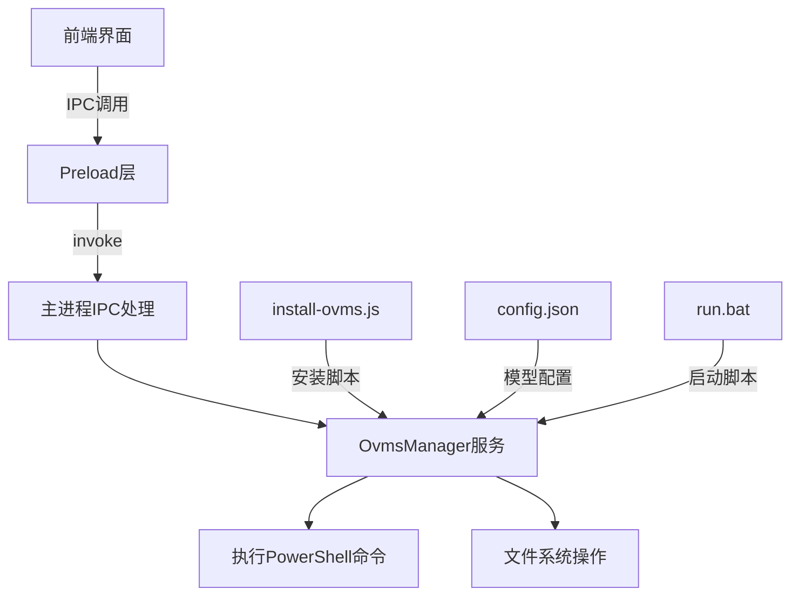
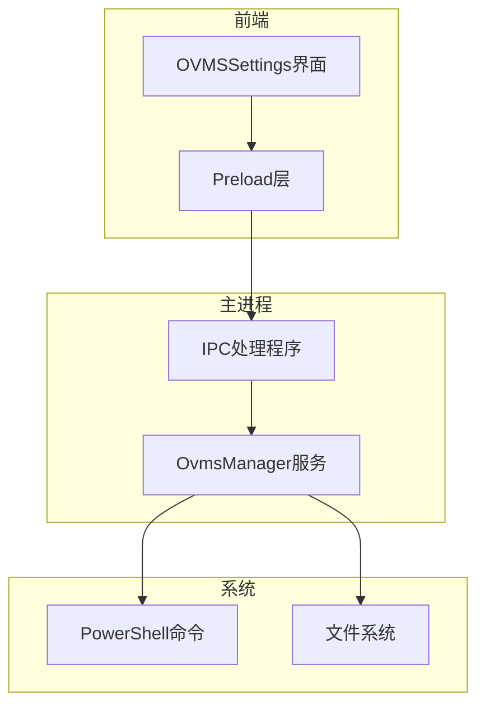
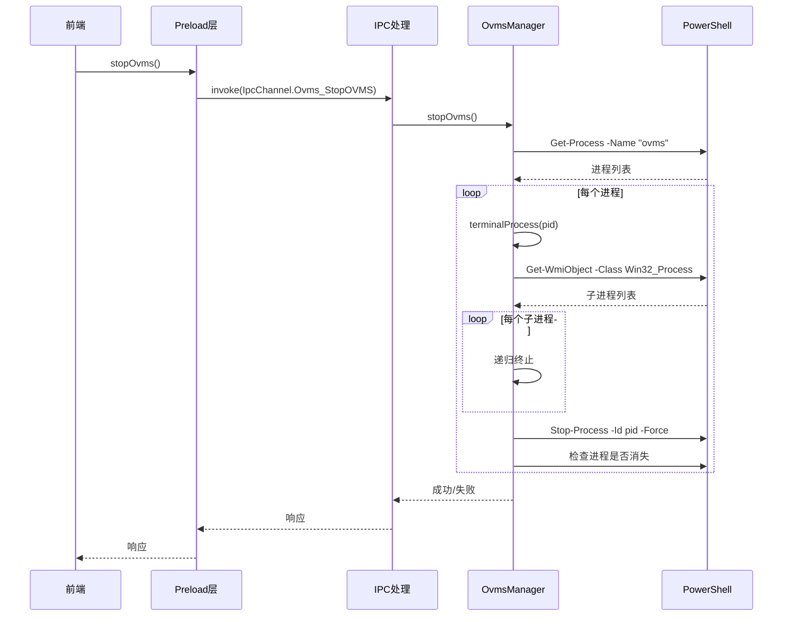
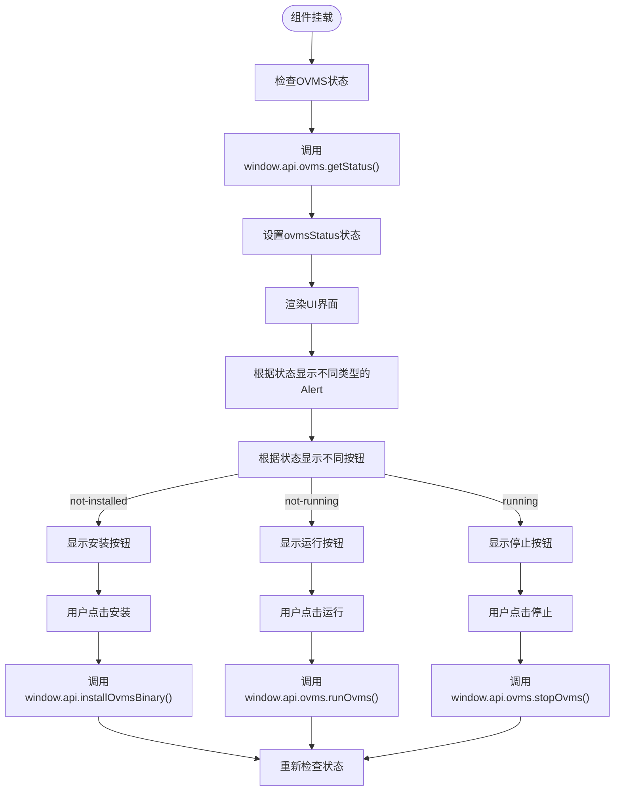
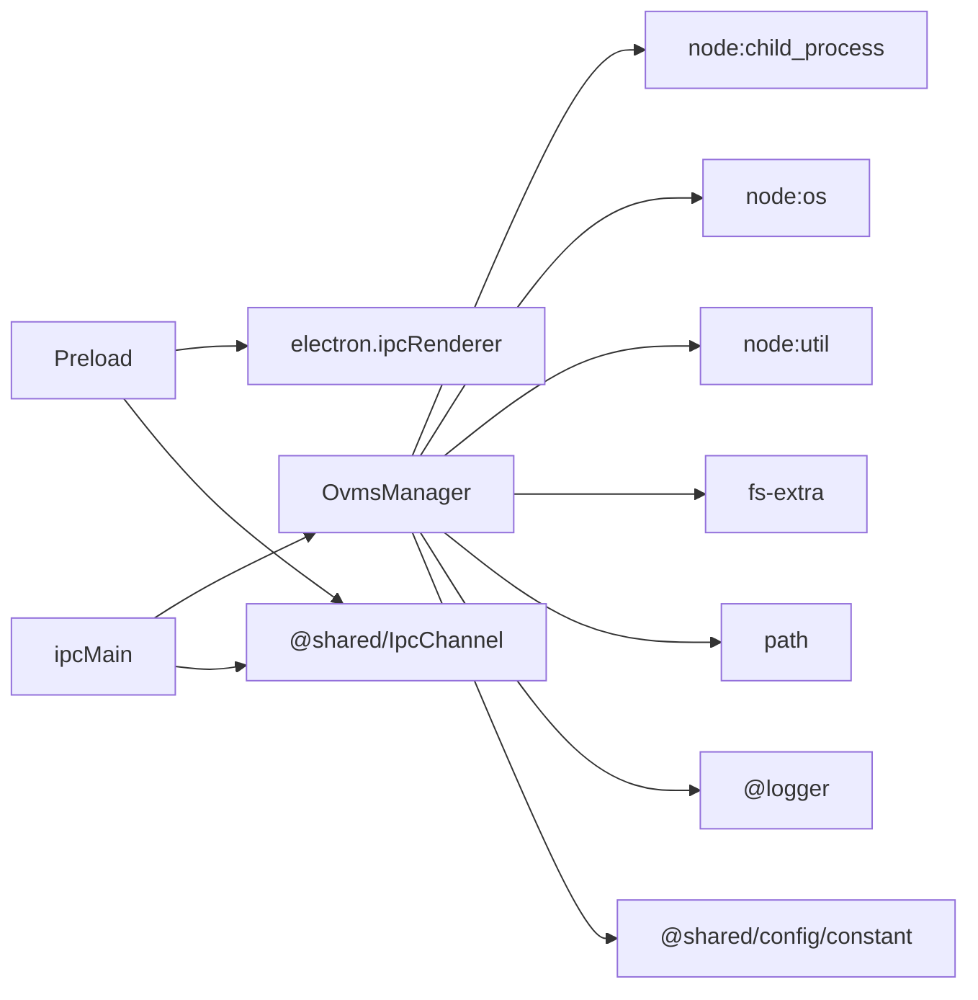

# OVMS 集成

<cite>
**本文档引用的文件**   
- [install-ovms.js](file://resources/scripts/install-ovms.js)
- [OvmsManager.ts](file://src/main/services/OvmsManager.ts)
- [OVMSSettings.tsx](file://src/renderer/src/pages/settings/ProviderSettings/OVMSSettings.tsx)
- [index.ts](file://src/preload/index.ts)
- [ipc.ts](file://src/main/ipc.ts)
- [constant.ts](file://packages/shared/config/constant.ts)
</cite>

## 目录
1. [简介](#简介)
2. [项目结构](#项目结构)
3. [核心组件](#核心组件)
4. [架构概述](#架构概述)
5. [详细组件分析](#详细组件分析)
6. [依赖分析](#依赖分析)
7. [性能考虑](#性能考虑)
8. [故障排除指南](#故障排除指南)
9. [结论](#结论)

## 简介
本文档详细说明了OVMS（OpenVINO Model Server）在Cherry Studio项目中的集成机制。文档涵盖了OVMS的安装、启动、停止和状态监控流程，阐述了通过OvmsManager服务与OVMS进程的交互协议，包括使用PowerShell命令进行进程管理和状态检查。同时描述了前端OVMSSettings界面如何通过IPC调用与主进程通信，实现安装、运行和停止功能。文档提供了来自实际代码库的具体示例，包括错误处理、状态转换和用户反馈，为初学者提供OVMS配置和故障排除指南，为有经验的开发者提供性能优化和自定义部署的技术深度。

## 项目结构
Cherry Studio项目中的OVMS集成主要分布在以下几个目录中：
- `resources/scripts/`: 包含`install-ovms.js`脚本，负责OVMS的安装和配置。
- `src/main/services/`: 包含`OvmsManager.ts`，是管理OVMS进程的核心服务类。
- `src/renderer/src/pages/settings/ProviderSettings/`: 包含`OVMSSettings.tsx`，是前端用户界面，用于与OVMS交互。
- `src/preload/`: 包含`index.ts`，定义了前端可调用的IPC接口。
- `src/main/`: 包含`ipc.ts`，注册了主进程中的IPC处理程序。

**Diagram sources**
- [OVMSSettings.tsx](file://src/renderer/src/pages/settings/ProviderSettings/OVMSSettings.tsx)
- [index.ts](file://src/preload/index.ts)
- [ipc.ts](file://src/main/ipc.ts)
- [OvmsManager.ts](file://src/main/services/OvmsManager.ts)
- [install-ovms.js](file://resources/scripts/install-ovms.js)

**Section sources**
- [OVMSSettings.tsx](file://src/renderer/src/pages/settings/ProviderSettings/OVMSSettings.tsx)
- [index.ts](file://src/preload/index.ts)
- [ipc.ts](file://src/main/ipc.ts)
- [OvmsManager.ts](file://src/main/services/OvmsManager.ts)
- [install-ovms.js](file://resources/scripts/install-ovms.js)

## 核心组件
OVMS集成的核心组件是`OvmsManager`类，它封装了与OVMS进程的所有交互。该类提供了安装、启动、停止、状态检查和模型管理等关键功能。`OvmsManager`通过调用PowerShell命令来管理进程，并通过文件系统操作来配置OVMS。前端通过IPC机制调用`OvmsManager`提供的方法，实现了用户友好的界面控制。

**Section sources**
- [OvmsManager.ts](file://src/main/services/OvmsManager.ts)

## 架构概述
OVMS集成的架构采用分层设计，前端界面通过Electron的IPC机制与主进程通信。主进程中的`OvmsManager`服务负责具体的业务逻辑，包括进程管理和文件操作。`OvmsManager`通过调用Node.js的`child_process`模块执行PowerShell命令，实现对OVMS进程的精确控制。整个架构确保了前端与后端的解耦，提高了系统的可维护性和安全性。

**Diagram sources**
- [OvmsManager.ts](file://src/main/services/OvmsManager.ts)
- [ipc.ts](file://src/main/ipc.ts)
- [index.ts](file://src/preload/index.ts)

## 详细组件分析

### OvmsManager 服务分析
`OvmsManager`是OVMS集成的核心，它提供了以下主要功能：

#### 进程管理
`OvmsManager`通过PowerShell命令精确管理OVMS进程。`terminalProcess`方法递归终止指定PID的进程及其所有子进程，确保进程被彻底清理。该方法首先检查进程是否运行，然后查找并终止所有子进程，最后终止父进程，并等待进程完全消失。

**Diagram sources**
- [OvmsManager.ts](file://src/main/services/OvmsManager.ts#L37-L96)
- [ipc.ts](file://src/main/ipc.ts#L1073-L1083)

#### 状态监控
`getOvmsStatus`方法通过检查OVMS可执行文件的存在和进程运行状态，确定OVMS的当前状态。该方法返回三种状态：'not-installed'、'not-running'或'running'，为前端提供了清晰的状态指示。

#### 模型管理
`OvmsManager`提供了完整的模型管理功能，包括添加模型、检查模型存在性、更新模型配置等。`addModel`方法通过调用`ovdnd.exe`下载模型，并更新`config.json`文件，实现了模型的动态管理。

**Section sources**
- [OvmsManager.ts](file://src/main/services/OvmsManager.ts)

### 前端界面分析
`OVMSSettings`组件是用户与OVMS交互的主要界面。它通过调用`window.api.ovms`提供的IPC接口，实现了安装、运行和停止OVMS的功能。组件根据`ovmsStatus`状态显示不同的按钮和提示信息，为用户提供直观的操作体验。

**Diagram sources**
- [OVMSSettings.tsx](file://src/renderer/src/pages/settings/ProviderSettings/OVMSSettings.tsx)

**Section sources**
- [OVMSSettings.tsx](file://src/renderer/src/pages/settings/ProviderSettings/OVMSSettings.tsx)

## 依赖分析
OVMS集成依赖于多个核心模块和外部工具：

**Diagram sources**
- [OvmsManager.ts](file://src/main/services/OvmsManager.ts)
- [index.ts](file://src/preload/index.ts)
- [ipc.ts](file://src/main/ipc.ts)

**Section sources**
- [OvmsManager.ts](file://src/main/services/OvmsManager.ts)
- [index.ts](file://src/preload/index.ts)
- [ipc.ts](file://src/main/ipc.ts)

## 性能考虑
OVMS集成在性能方面主要考虑以下几点：
1. **进程管理效率**：`terminalProcess`方法通过递归方式确保所有子进程被正确终止，避免了僵尸进程的产生。
2. **异步操作**：所有文件系统和进程操作均采用异步方式，避免阻塞主进程，保证了应用的响应性。
3. **资源清理**：在安装和停止操作中，都会进行彻底的资源清理，防止磁盘空间被无谓占用。
4. **超时机制**：在进程终止操作中加入了5秒超时机制，防止操作无限期挂起。

## 故障排除指南
### 常见问题及解决方案
1. **安装失败 (错误代码 101)**：确保CPU为Intel(R) Core(TM) Ultra系列。
2. **安装失败 (错误代码 102)**：OVMS仅支持Windows平台。
3. **安装失败 (错误代码 103)**：检查网络连接，确保可以访问下载URL。
4. **启动失败**：检查`run.bat`文件是否存在，以及`config.json`文件是否正确。
5. **进程无法停止**：可能有子进程未被正确终止，检查`terminalProcess`方法的执行日志。

### 日志分析
`OvmsManager`使用`loggerService`记录详细的日志信息，包括：
- 进程检查和终止的详细步骤
- 文件系统操作的成功与失败
- 模型下载和配置的进度
通过分析日志，可以快速定位问题所在。

**Section sources**
- [OvmsManager.ts](file://src/main/services/OvmsManager.ts)
- [loggerService.ts](file://src/main/services/LoggerService.ts)

## 结论
OVMS集成通过`OvmsManager`服务实现了对OpenVINO Model Server的全面管理。该集成利用Electron的IPC机制，将前端界面与后端进程管理解耦，提供了用户友好的操作界面。通过PowerShell命令和文件系统操作，实现了对OVMS进程的精确控制。整个系统设计合理，具有良好的可维护性和扩展性，为Cherry Studio项目提供了强大的AI模型服务能力。