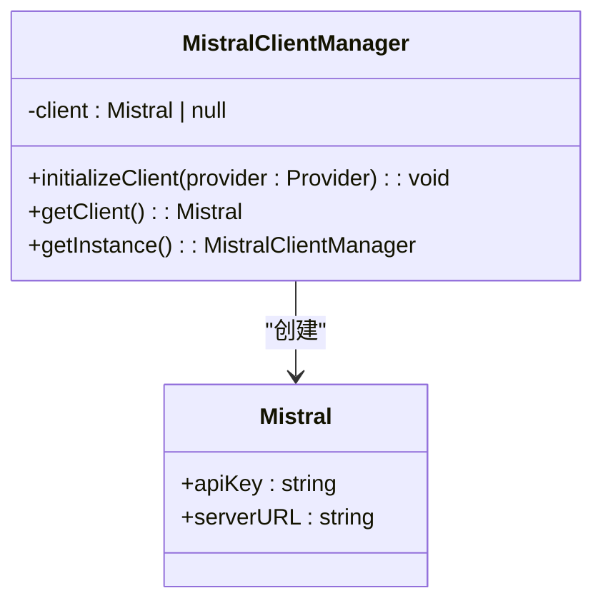
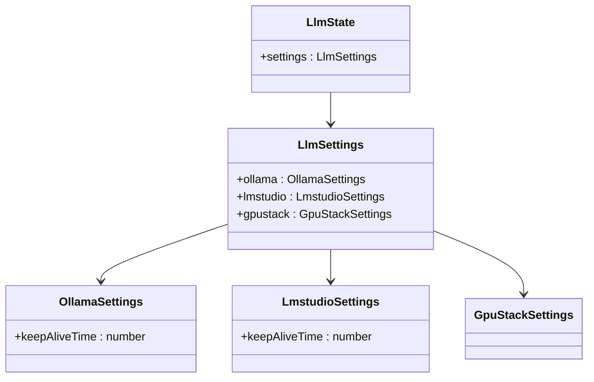
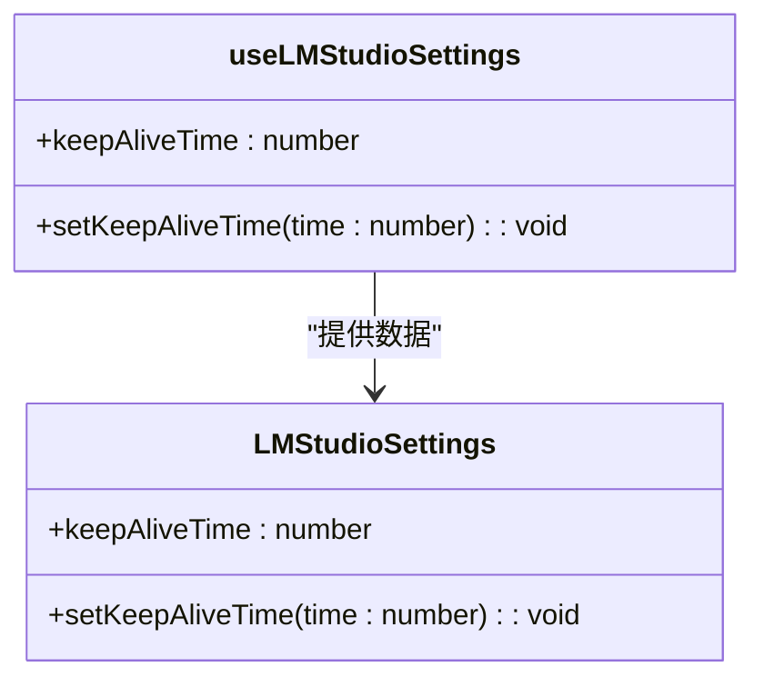
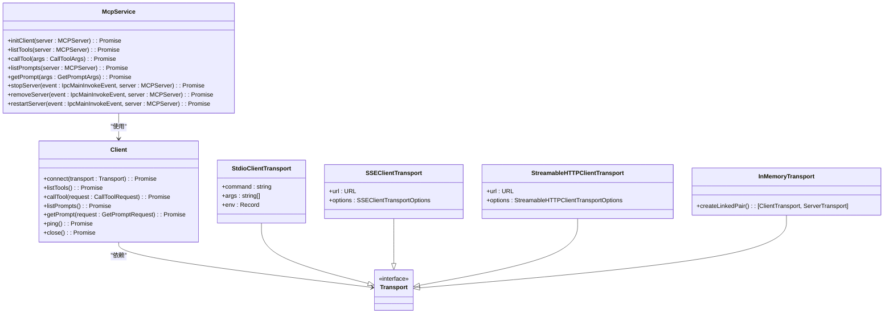
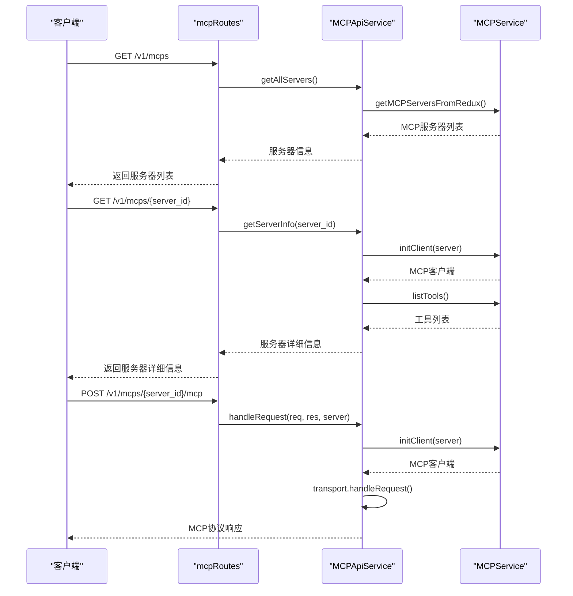
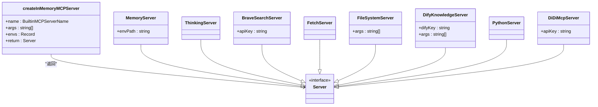
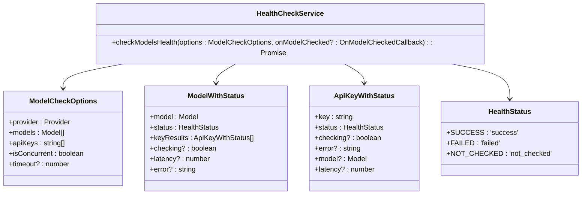
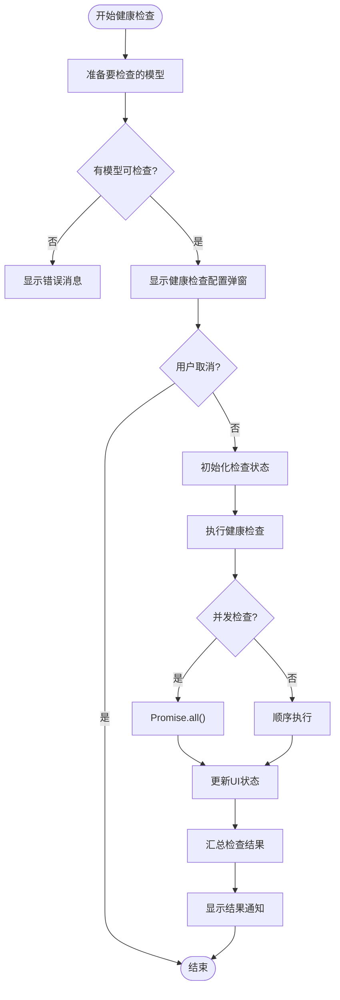
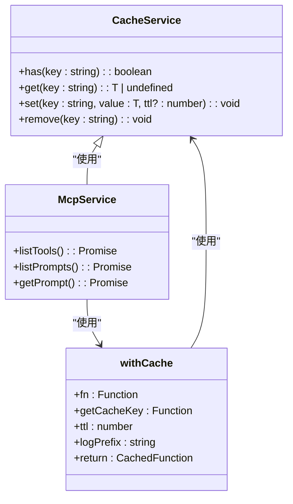

# 本地模型支持

<cite>
**本文档引用的文件**   
- [OvmsManager.ts](file://src/main/services/OvmsManager.ts)
- [MCPService.ts](file://src/main/services/MCPService.ts)
- [mcp.ts](file://src/main/apiServer/services/mcp.ts)
- [mcp.ts](file://src/main/apiServer/routes/mcp.ts)
- [models.ts](file://src/main/apiServer/services/models.ts)
- [MistralClientManager.ts](file://src/main/services/MistralClientManager.ts)
- [llm.ts](file://src/renderer/store/llm.ts)
- [useLMStudio.ts](file://src/renderer/hooks/useLMStudio.ts)
- [LMStudioSettings.tsx](file://src/renderer/pages/settings/ProviderSettings/LMStudioSettings.tsx)
- [healthCheck.ts](file://src/renderer/utils/healthCheck.ts)
- [HealthCheckService.ts](file://src/renderer/services/HealthCheckService.ts)
- [useHealthCheck.ts](file://src/renderer/pages/settings/ProviderSettings/ModelList/useHealthCheck.ts)
- [OVMSClient.ts](file://src/renderer/aiCore/legacy/clients/ovms/OVMSClient.ts)
- [ovmsConfig.tsx](file://src/renderer/pages/paintings/config/ovmsConfig.tsx)
- [factory.ts](file://src/main/mcpServers/factory.ts)
- [mcp.ts](file://src/main/apiServer/utils/mcp.ts)
</cite>

## 目录
1. [简介](#简介)
2. [本地模型服务集成](#本地模型服务集成)
3. [MCP协议交互机制](#mcp协议交互机制)
4. [本地模型发现与连接](#本地模型发现与连接)
5. [资源管理与性能监控](#资源管理与性能监控)
6. [配置指南](#配置指南)
7. [结论](#结论)

## 简介
Cherry Studio 提供了对多种本地模型服务的全面支持，包括 Ollama、LM Studio、OVMS 和 Mistral 等。本系统通过 Model Context Protocol (MCP) 实现与本地模型服务器的通信，提供了一套完整的模型管理、服务启动、状态监控和资源管理机制。系统架构分为前端渲染层和主进程服务层，通过 Electron 框架实现跨平台运行。

系统核心功能包括：
- 本地模型服务的自动发现和连接管理
- 基于 MCP 协议的标准化通信接口
- 模型健康状态检查和性能监控
- 资源管理和配置持久化
- 用户友好的配置界面和状态可视化

**Section sources**
- [OvmsManager.ts](file://src/main/services/OvmsManager.ts#L1-L588)
- [MCPService.ts](file://src/main/services/MCPService.ts#L1-L923)

## 本地模型服务集成

### OVMS 集成
OVMS (OpenVINO Model Server) 是 Cherry Studio 支持的重要本地模型服务之一。系统通过 `OvmsManager` 类实现对 OVMS 服务的完整生命周期管理，包括服务启动、停止、模型管理等功能。

```mermaid
classDiagram
class OvmsManager {
+getOvmsStatus() Promise<'not-installed' | 'not-running' | 'running'>
+runOvms() Promise<{ success : boolean; message? : string }>
+stopOvms() Promise<{ success : boolean; message? : string }>
+addModel(modelName : string, modelId : string, modelSource : string, task : string) Promise<{ success : boolean; message? : string }>
+getModels() Promise<ModelConfig[]>
+checkModelExists(modelId : string) Promise<boolean>
}
class ModelConfig {
+name : string
+base_path : string
}
OvmsManager --> ModelConfig : "返回"
```

**Diagram sources**
- [OvmsManager.ts](file://src/main/services/OvmsManager.ts#L29-L587)

`OvmsManager` 提供了以下核心功能：
- **服务状态管理**：通过 `getOvmsStatus` 方法检查 OVMS 服务的安装和运行状态
- **服务启动/停止**：通过 `runOvms` 和 `stopOvms` 方法控制服务的生命周期
- **模型管理**：通过 `addModel` 方法添加新模型，支持从 Hugging Face、ModelScope 等源下载
- **模型发现**：通过 `getModels` 方法获取已安装的模型列表，特别针对图像生成模型进行过滤

**Section sources**
- [OvmsManager.ts](file://src/main/services/OvmsManager.ts#L29-L587)
- [ovmsConfig.tsx](file://src/renderer/pages/paintings/config/ovmsConfig.tsx#L42-L70)

### Mistral 集成
对于 Mistral 模型，系统通过 `MistralClientManager` 实现客户端管理。该类采用单例模式，确保在整个应用生命周期中只有一个客户端实例。



**Diagram sources**
- [MistralClientManager.ts](file://src/main/services/MistralClientManager.ts#L4-L33)

`MistralClientManager` 的主要功能包括：
- **客户端初始化**：通过 `initializeClient` 方法使用提供者的 API 密钥和服务器 URL 初始化客户端
- **客户端获取**：通过 `getClient` 方法获取已初始化的客户端实例
- **单例模式**：通过 `getInstance` 方法确保全局唯一实例

**Section sources**
- [MistralClientManager.ts](file://src/main/services/MistralClientManager.ts#L4-L33)

### Ollama 和 LM Studio 集成
系统通过 Redux 状态管理来配置 Ollama 和 LM Studio 的特定设置。在 `llm.ts` 状态文件中，定义了这些服务的配置选项。



**Diagram sources**
- [llm.ts](file://src/renderer/store/llm.ts#L47-L85)

对于 LM Studio，系统提供了专门的 Hook 和设置组件来管理其配置：



**Diagram sources**
- [useLMStudio.ts](file://src/renderer/hooks/useLMStudio.ts#L5-L18)
- [LMStudioSettings.tsx](file://src/renderer/pages/settings/ProviderSettings/LMStudioSettings.tsx#L1-L36)

**Section sources**
- [llm.ts](file://src/renderer/store/llm.ts#L47-L85)
- [useLMStudio.ts](file://src/renderer/hooks/useLMStudio.ts#L5-L18)
- [LMStudioSettings.tsx](file://src/renderer/pages/settings/ProviderSettings/LMStudioSettings.tsx#L1-L36)

## MCP协议交互机制

### MCP服务架构
MCP (Model Context Protocol) 是 Cherry Studio 与本地模型服务器通信的核心协议。系统通过 `MCPService` 类实现 MCP 客户端功能，支持多种传输方式，包括 STDIO、SSE、Streamable HTTP 和 In-Memory 传输。



**Diagram sources**
- [MCPService.ts](file://src/main/services/MCPService.ts#L136-L923)

**Section sources**
- [MCPService.ts](file://src/main/services/MCPService.ts#L136-L923)

### MCP API 服务
系统通过 Express 框架提供 RESTful API 接口，用于管理 MCP 服务器。`mcpApiService` 处理所有与 MCP 服务器相关的 HTTP 请求。



**Diagram sources**
- [mcp.ts](file://src/main/apiServer/routes/mcp.ts#L1-L156)
- [mcp.ts](file://src/main/apiServer/services/mcp.ts#L40-L185)

**Section sources**
- [mcp.ts](file://src/main/apiServer/routes/mcp.ts#L1-L156)
- [mcp.ts](file://src/main/apiServer/services/mcp.ts#L40-L185)

### 内存服务器工厂
系统支持多种内置的 MCP 服务器，通过工厂模式创建。`createInMemoryMCPServer` 函数根据服务器名称创建相应的服务器实例。



**Diagram sources**
- [factory.ts](file://src/main/mcpServers/factory.ts#L17-L55)

**Section sources**
- [factory.ts](file://src/main/mcpServers/factory.ts#L17-L55)

## 本地模型发现与连接

### 模型发现机制
系统通过多种方式发现本地模型服务。对于 OVMS，通过检查特定目录下的配置文件来发现已安装的模型。

```mermaid
flowchart TD
Start([开始]) --> CheckConfig["检查 config.json 文件"]
CheckConfig --> ConfigExists{"配置文件存在?"}
ConfigExists --> |否| ReturnEmpty["返回空数组"]
ConfigExists --> |是| ReadConfig["读取配置文件"]
ReadConfig --> HasModels{"包含模型列表?"}
HasModels --> |否| ReturnEmpty
HasModels --> |是| FilterModels["过滤图像生成模型"]
FilterModels --> LogResult["记录发现的模型数量"]
LogResult --> ReturnModels["返回模型列表"]
ReturnEmpty --> End([结束])
ReturnModels --> End
```



**Diagram sources**
- [OvmsManager.ts](file://src/main/services/OvmsManager.ts#L550-L584)

**Section sources**
- [OvmsManager.ts](file://src/main/services/OvmsManager.ts#L550-L584)

### 连接配置
系统通过 MCP 服务器配置来管理连接信息。每个 MCP 服务器配置包含以下信息：
- **ID**：服务器唯一标识符
- **名称**：服务器名称
- **类型**：传输类型 (stdio, http, sse, streamableHttp)
- **基础 URL**：服务器地址
- **命令**：启动命令
- **参数**：启动参数
- **环境变量**：运行时环境变量
- **活动状态**：是否启用

连接过程包括以下步骤：
1. 根据服务器配置创建相应的传输实例
2. 初始化 MCP 客户端
3. 建立连接
4. 设置通知处理器
5. 缓存客户端实例

**Section sources**
- [MCPService.ts](file://src/main/services/MCPService.ts#L171-L459)

### 状态监控
系统提供了全面的状态监控机制，包括服务状态、模型健康状态和资源使用情况。

#### 服务状态监控
通过 `getOvmsStatus` 方法监控 OVMS 服务状态，返回三种可能的状态：
- `not-installed`：服务未安装
- `not-running`：服务已安装但未运行
- `running`：服务正在运行

#### 模型健康检查
系统提供了一套完整的模型健康检查机制，通过 `HealthCheckService` 实现。



**Diagram sources**
- [HealthCheckService.ts](file://src/renderer/services/HealthCheckService.ts#L49-L94)
- [healthCheck.ts](file://src/renderer/utils/healthCheck.ts#L1-L79)
- [types/healthCheck.ts](file://src/renderer/types/healthCheck.ts#L1-L53)

健康检查流程如下：



**Diagram sources**
- [useHealthCheck.ts](file://src/renderer/pages/settings/ProviderSettings/ModelList/useHealthCheck.ts#L19-L95)

**Section sources**
- [HealthCheckService.ts](file://src/renderer/services/HealthCheckService.ts#L49-L94)
- [healthCheck.ts](file://src/renderer/utils/healthCheck.ts#L1-L79)
- [types/healthCheck.ts](file://src/renderer/types/healthCheck.ts#L1-L53)
- [useHealthCheck.ts](file://src/renderer/pages/settings/ProviderSettings/ModelList/useHealthCheck.ts#L19-L95)

## 资源管理与性能监控

### 资源管理
系统通过 `CacheService` 实现资源缓存，提高性能并减少重复操作。缓存机制应用于多个关键操作：



**Diagram sources**
- [MCPService.ts](file://src/main/services/MCPService.ts#L111-L134)

缓存策略包括：
- **工具列表缓存**：5分钟 TTL
- **提示列表缓存**：60分钟 TTL
- **获取提示缓存**：30分钟 TTL

**Section sources**
- [MCPService.ts](file://src/main/services/MCPService.ts#L111-L134)

### 性能监控
系统通过日志服务和性能指标收集来监控系统性能。关键性能指标包括：
- 服务启动时间
- 模型加载时间
- 请求处理时间
- 内存使用情况
- CPU 使用率

日志服务提供上下文感知的日志记录，便于问题排查和性能分析。

**Section sources**
- [MCPService.ts](file://src/main/services/MCPService.ts#L62-L101)
- [OvmsManager.ts](file://src/main/services/OvmsManager.ts#L10-L11)

## 配置指南

### 初学者配置指南
对于初学者，配置本地模型支持非常简单：

1. **安装本地模型服务**：
   - 对于 OVMS，系统会自动管理安装和更新
   - 对于其他服务，确保服务已正确安装并运行

2. **添加模型**：
   - 在设置界面中选择相应的模型服务
   - 输入模型 ID 和名称
   - 选择模型源（Hugging Face、ModelScope 等）
   - 选择任务类型（文本生成、嵌入、重排序、图像生成等）

3. **配置连接**：
   - 确保服务正在运行
   - 在 Cherry Studio 中，系统会自动发现本地模型服务
   - 如果需要手动配置，输入服务的 URL 和端口

4. **测试连接**：
   - 使用内置的健康检查功能测试模型连接
   - 查看状态指示器确认模型是否可用

### 高级配置与性能调优
对于有经验的开发者，可以进行更深入的配置和性能调优：

1. **自定义模型集成**：
   - 创建自定义的 MCP 服务器配置
   - 实现自定义的传输方式
   - 扩展内置服务器功能

2. **性能调优**：
   - 调整缓存 TTL 值以平衡性能和数据新鲜度
   - 优化模型加载策略
   - 配置资源限制和超时设置

3. **高级监控**：
   - 集成外部监控工具
   - 设置自定义性能指标
   - 实现详细的日志分析

4. **安全性配置**：
   - 配置 OAuth 认证
   - 管理 API 密钥
   - 设置访问控制

**Section sources**
- [OvmsManager.ts](file://src/main/services/OvmsManager.ts#L350-L428)
- [MCPService.ts](file://src/main/services/MCPService.ts#L171-L459)
- [llm.ts](file://src/renderer/store/llm.ts#L47-L85)

## 结论
Cherry Studio 的本地模型支持功能提供了一套完整、灵活且易于使用的解决方案。通过 MCP 协议，系统能够与多种本地模型服务无缝集成，为用户提供强大的 AI 能力。系统架构设计合理，分离了前端界面和后端服务，确保了良好的可维护性和扩展性。

对于初学者，系统提供了简单直观的配置界面，使本地模型的使用变得非常容易。对于有经验的开发者，系统提供了丰富的 API 和扩展点，支持自定义集成和性能调优。

未来的发展方向可能包括：
- 支持更多类型的本地模型服务
- 增强性能监控和分析功能
- 提供更智能的模型管理和优化建议
- 加强安全性和访问控制机制

通过持续优化和扩展，Cherry Studio 将成为本地 AI 模型管理的领先平台。