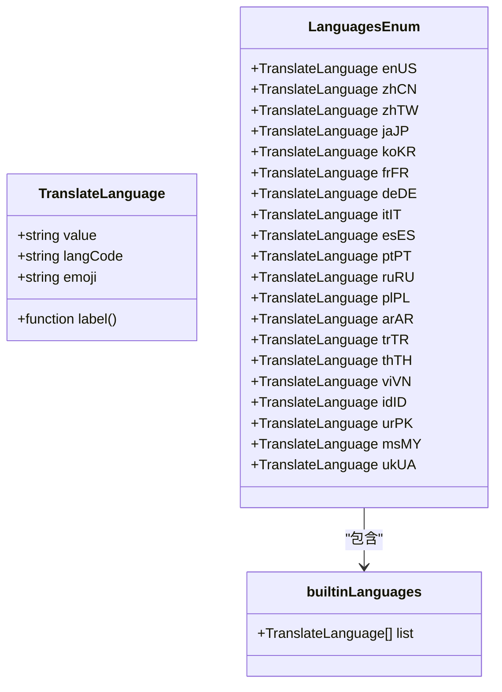
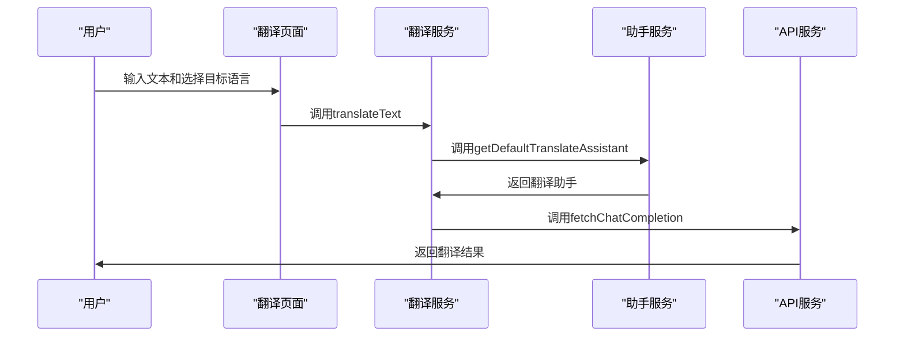
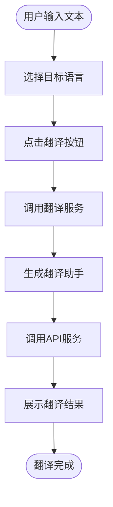
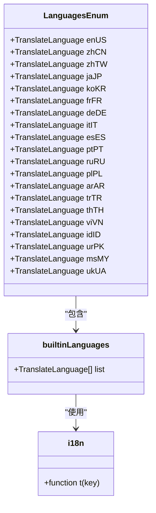
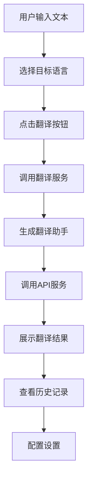
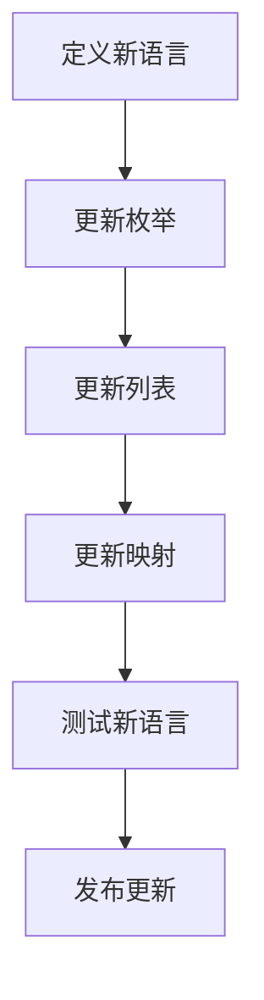

# AI翻译

<cite>
**本文档引用的文件**   
- [translate.ts](file://src/renderer/src/config/translate.ts)
- [TranslateService.ts](file://src/renderer/src/services/TranslateService.ts)
- [AssistantService.ts](file://src/renderer/src/services/AssistantService.ts)
- [useTranslate.ts](file://src/renderer/src/hooks/useTranslate.ts)
- [TranslatePage.tsx](file://src/renderer/src/pages/translate/TranslatePage.tsx)
- [TranslateSettings.tsx](file://src/renderer/src/pages/translate/TranslateSettings.tsx)
- [types/index.ts](file://src/renderer/src/types/index.ts)
- [i18n/index.ts](file://src/renderer/src/i18n/index.ts)
</cite>

## 目录
1. [简介](#简介)
2. [内置语言支持与多语言配置](#内置语言支持与多语言配置)
3. [翻译助手预设配置](#翻译助手预设配置)
4. [用户界面集成](#用户界面集成)
5. [语言枚举与国际化系统](#语言枚举与国际化系统)
6. [使用示例](#使用示例)
7. [扩展方法与优化建议](#扩展方法与优化建议)

## 简介
Cherry Studio的AI翻译功能为用户提供了一个强大的实时翻译解决方案，集成了先进的AI模型和直观的用户界面。该功能不仅支持多种语言的互译，还通过智能助手和多语言配置系统，实现了高效、准确的翻译体验。本文档详细说明了翻译功能的实现机制，包括内置语言支持列表、多语言配置系统、翻译助手的预设配置、用户界面的集成方式、语言枚举和国际化系统的管理，以及如何扩展新语言支持和优化翻译质量。

## 内置语言支持与多语言配置
Cherry Studio的AI翻译功能支持多种内置语言，这些语言通过`LanguagesEnum`枚举和`builtinLanguages`列表进行管理。每个语言对象包含语言名称、语言代码、标签和表情符号等属性。内置语言列表包括英语、简体中文、繁体中文、日语、韩语、法语、德语、意大利语、西班牙语、葡萄牙语、俄语、波兰语、阿拉伯语、土耳其语、泰语、越南语、印度尼西亚语、乌尔都语、马来语和乌克兰语。

**Diagram sources**
- [translate.ts](file://src/renderer/src/config/translate.ts#L4-L176)

**Section sources**
- [translate.ts](file://src/renderer/src/config/translate.ts#L4-L176)

## 翻译助手预设配置
翻译助手的预设配置通过`getDefaultTranslateAssistant`函数实现，该函数创建一个特定于翻译任务的助手对象。助手对象包含模型、设置、提示词、目标语言和内容等属性。翻译助手的特殊数据模型和工作流程如下：

1. **模型选择**：翻译助手使用`getTranslateModel`函数获取当前配置的翻译模型。
2. **设置配置**：翻译助手的温度设置为0.7，以确保翻译结果的稳定性和准确性。
3. **提示词生成**：翻译助手根据目标语言和输入文本生成提示词，提示词模板存储在`translateModelPrompt`中。
4. **内容生成**：翻译助手的内容根据模型类型生成，对于QwenMT模型，直接使用输入文本；对于其他模型，使用提示词模板生成内容。

**Diagram sources**
- [TranslateService.ts](file://src/renderer/src/services/TranslateService.ts#L32-L88)
- [AssistantService.ts](file://src/renderer/src/services/AssistantService.ts#L58-L97)

**Section sources**
- [TranslateService.ts](file://src/renderer/src/services/TranslateService.ts#L32-L88)
- [AssistantService.ts](file://src/renderer/src/services/AssistantService.ts#L58-L97)

## 用户界面集成
用户界面的翻译页面（TranslatePage）通过React组件和Ant Design库实现，集成了AI模型进行实时翻译。翻译页面的主要功能包括：

1. **文本输入**：用户可以在输入框中输入需要翻译的文本。
2. **目标语言选择**：用户可以通过下拉菜单选择目标语言。
3. **翻译按钮**：点击翻译按钮后，系统会调用翻译服务进行翻译。
4. **结果展示**：翻译结果在输出框中实时展示，支持Markdown渲染。
5. **历史记录**：用户可以查看和管理翻译历史记录。
6. **设置**：用户可以配置翻译设置，如自动复制、滚动同步、双向翻译等。

**Diagram sources**
- [TranslatePage.tsx](file://src/renderer/src/pages/translate/TranslatePage.tsx#L62-L1039)

**Section sources**
- [TranslatePage.tsx](file://src/renderer/src/pages/translate/TranslatePage.tsx#L62-L1039)

## 语言枚举与国际化系统
Cherry Studio通过`LanguagesEnum`和`builtinLanguages`管理内置语言列表，并通过i18n国际化系统实现界面语言与翻译语言的同步。`LanguagesEnum`枚举定义了所有支持的语言，`builtinLanguages`列表包含了所有内置语言对象。i18n系统通过`i18n.t`函数实现多语言文本的翻译，确保用户界面的文本能够根据用户的语言设置进行动态切换。

**Diagram sources**
- [translate.ts](file://src/renderer/src/config/translate.ts#L151-L176)
- [i18n/index.ts](file://src/renderer/src/i18n/index.ts#L1-L57)

**Section sources**
- [translate.ts](file://src/renderer/src/config/translate.ts#L151-L176)
- [i18n/index.ts](file://src/renderer/src/i18n/index.ts#L1-L57)

## 使用示例
以下是一个使用Cherry Studio AI翻译功能的示例：

1. **文本输入**：用户在输入框中输入需要翻译的文本，例如“Hello, world!”。
2. **目标语言选择**：用户选择目标语言为“简体中文”。
3. **翻译**：点击翻译按钮，系统调用翻译服务进行翻译。
4. **结果展示**：翻译结果“你好，世界！”在输出框中实时展示。
5. **历史记录**：用户可以在历史记录中查看和管理之前的翻译记录。
6. **设置**：用户可以配置自动复制、滚动同步、双向翻译等设置。

**Diagram sources**
- [TranslatePage.tsx](file://src/renderer/src/pages/translate/TranslatePage.tsx#L62-L1039)

**Section sources**
- [TranslatePage.tsx](file://src/renderer/src/pages/translate/TranslatePage.tsx#L62-L1039)

## 扩展方法与优化建议
### 添加新语言支持
开发者可以通过以下步骤添加新语言支持：

1. **定义新语言**：在`translate.ts`文件中定义新的语言对象，包含语言名称、语言代码、标签和表情符号。
2. **更新枚举**：将新语言添加到`LanguagesEnum`枚举中。
3. **更新列表**：将新语言添加到`builtinLanguages`列表中。
4. **更新映射**：如果需要，更新`QwenMTMap`映射，以支持QwenMT模型的翻译。

### 翻译质量优化建议
1. **模型选择**：选择适合翻译任务的高质量模型，如QwenMT模型。
2. **温度设置**：适当调整温度参数，以平衡翻译的准确性和多样性。
3. **提示词优化**：优化提示词模板，确保翻译结果符合预期。
4. **错误处理**：增加错误处理机制，确保翻译过程中出现错误时能够及时反馈给用户。
5. **性能优化**：优化API调用和数据处理流程，提高翻译速度和响应时间。

**Diagram sources**
- [translate.ts](file://src/renderer/src/config/translate.ts#L4-L287)

**Section sources**
- [translate.ts](file://src/renderer/src/config/translate.ts#L4-L287)