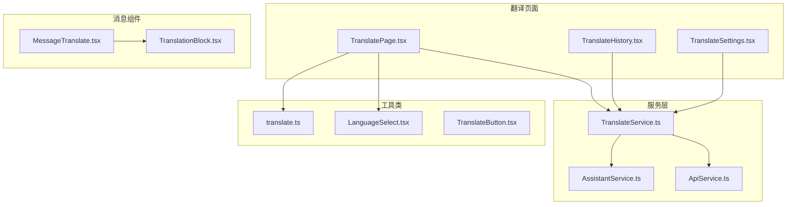
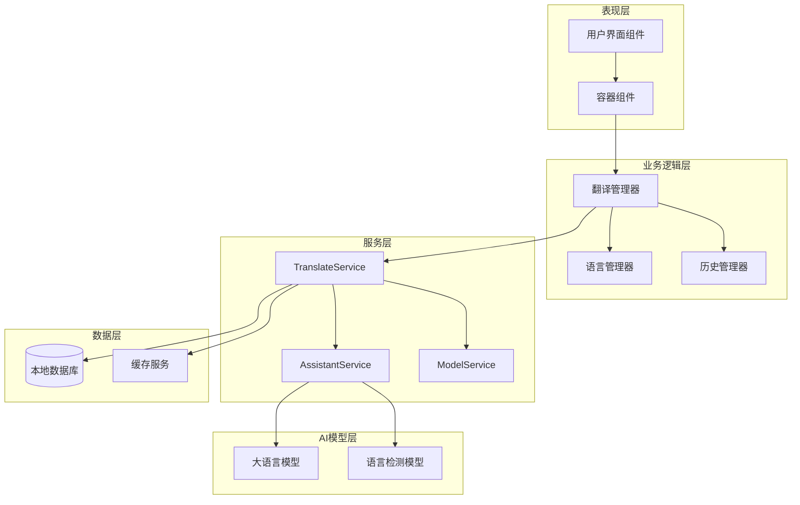
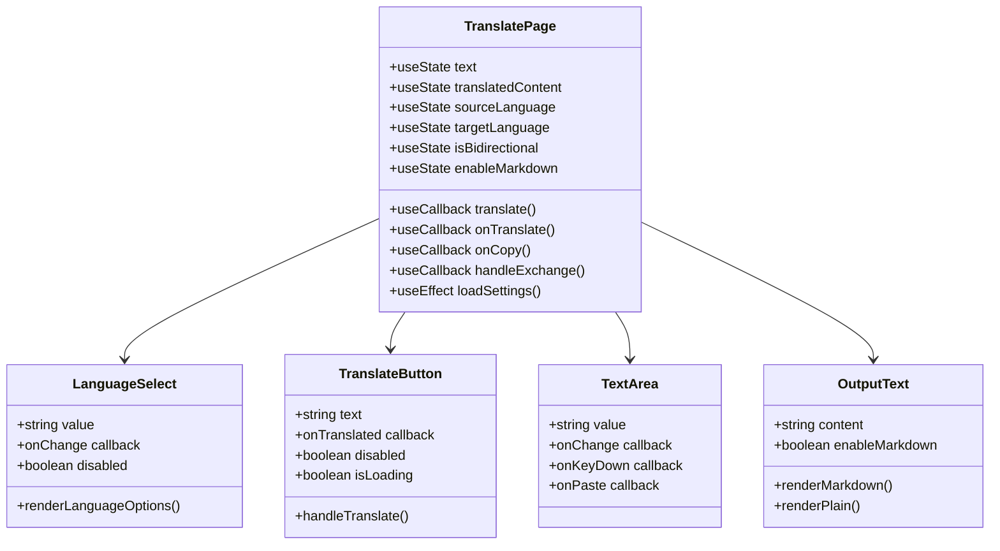
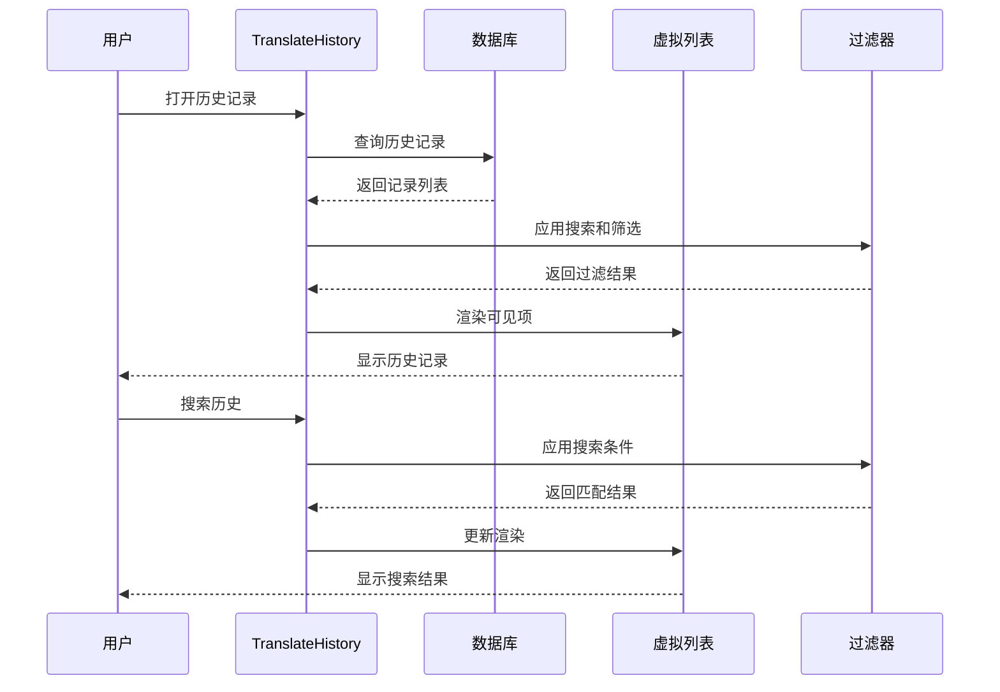
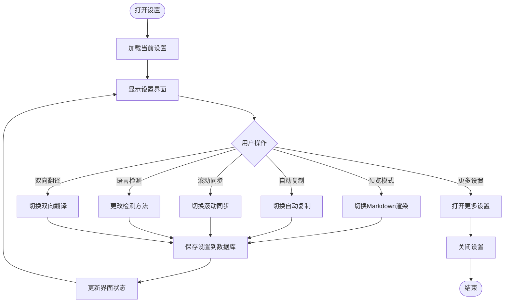
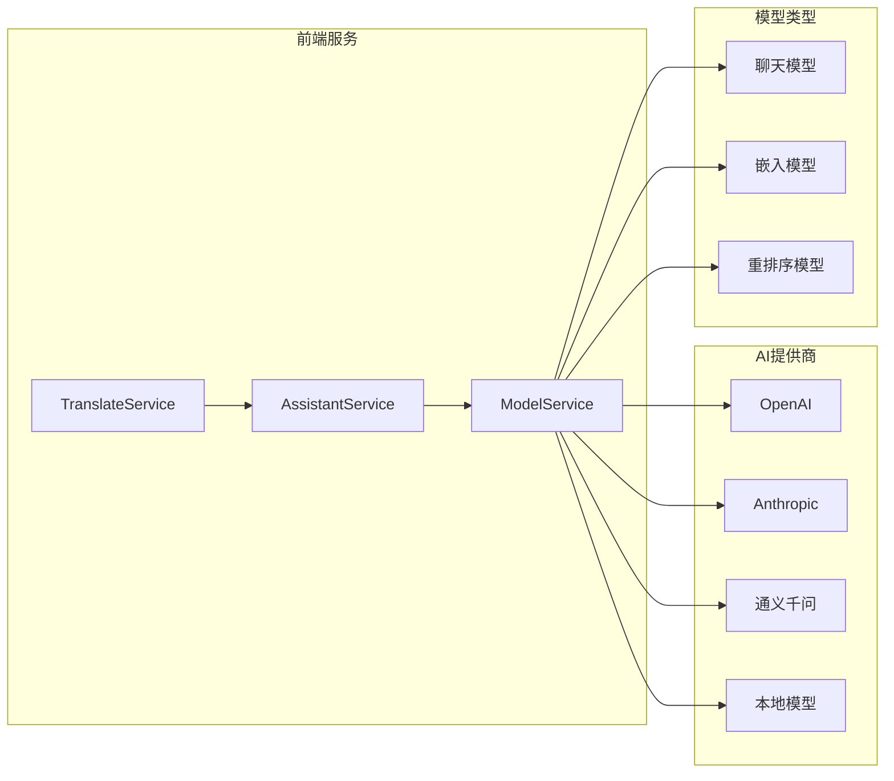
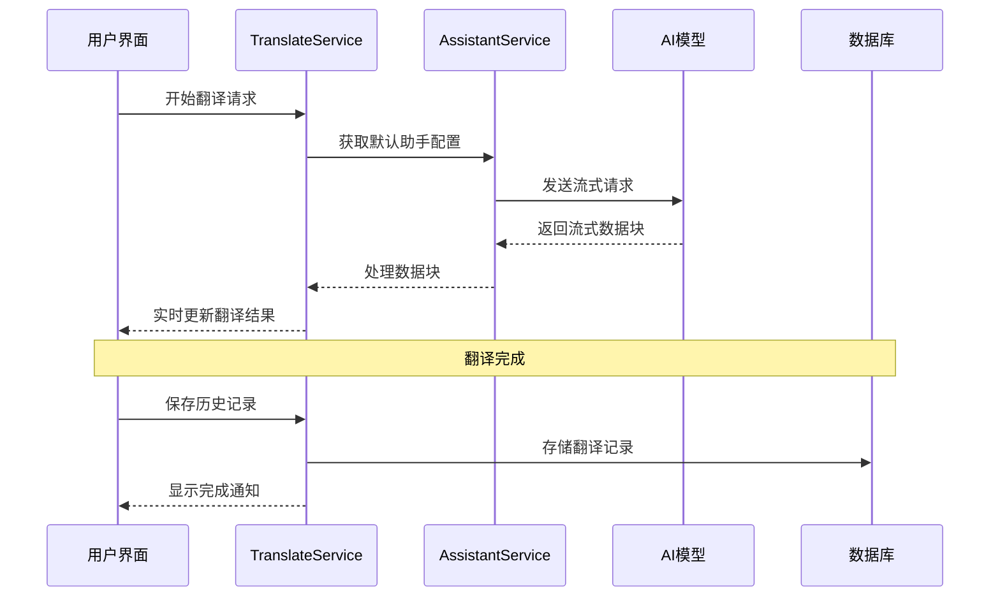
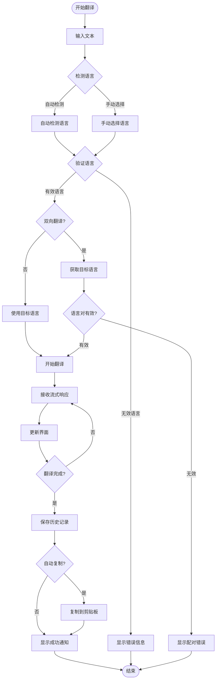
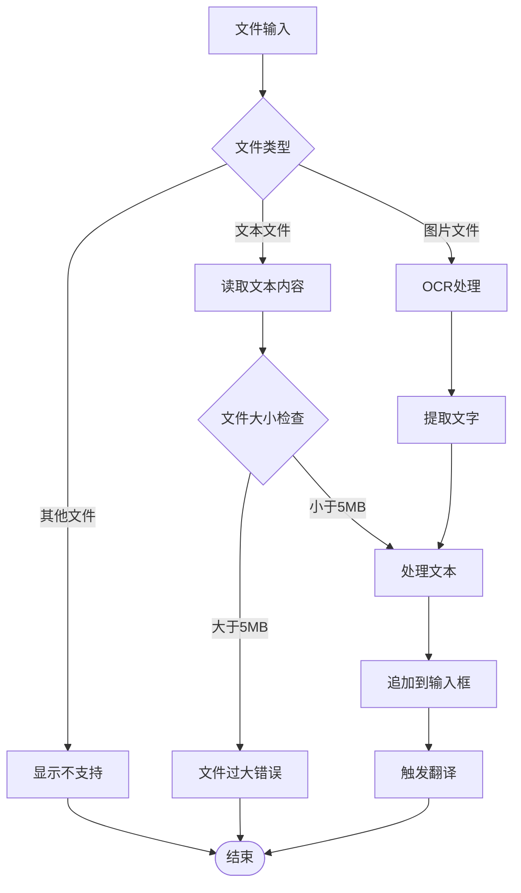

# 翻译界面

<cite>
**本文档中引用的文件**
- [TranslatePage.tsx](file://src/renderer/src/pages/translate/TranslatePage.tsx)
- [TranslateHistory.tsx](file://src/renderer/src/pages/translate/TranslateHistory.tsx)
- [TranslateSettings.tsx](file://src/renderer/src/pages/translate/TranslateSettings.tsx)
- [TranslateService.ts](file://src/renderer/src/services/TranslateService.ts)
- [LanguageSelect.tsx](file://src/renderer/src/components/LanguageSelect.tsx)
- [TranslateButton.tsx](file://src/renderer/src/components/TranslateButton.tsx)
- [translate.ts](file://src/renderer/src/utils/translate.ts)
- [MessageTranslate.tsx](file://src/renderer/src/pages/home/Messages/MessageTranslate.tsx)
- [TranslationBlock.tsx](file://src/renderer/src/pages/home/Messages/Blocks/TranslationBlock.tsx)
</cite>

## 目录
1. [简介](#简介)
2. [项目结构](#项目结构)
3. [核心组件](#核心组件)
4. [架构概览](#架构概览)
5. [详细组件分析](#详细组件分析)
6. [AI模型服务集成](#ai模型服务集成)
7. [界面交互流程](#界面交互流程)
8. [性能考虑](#性能考虑)
9. [故障排除指南](#故障排除指南)
10. [结论](#结论)

## 简介

Cherry Studio的翻译功能提供了一个现代化、高效的多语言翻译界面，支持实时翻译流式响应、历史记录管理和个性化设置。该系统采用React技术栈构建，集成了多种AI模型服务，为用户提供流畅的翻译体验。

## 项目结构

翻译功能的核心文件组织如下：

**图表来源**
- [TranslatePage.tsx](file://src/renderer/src/pages/translate/TranslatePage.tsx#L1-L50)
- [TranslateHistory.tsx](file://src/renderer/src/pages/translate/TranslateHistory.tsx#L1-L50)
- [TranslateSettings.tsx](file://src/renderer/src/pages/translate/TranslateSettings.tsx#L1-L50)

## 核心组件

### TranslatePage 主翻译页面

TranslatePage是翻译功能的主要界面组件，提供了完整的翻译工作流：

- **文本输入区域**：支持拖拽、粘贴和文件上传
- **语言选择器**：支持自动检测和手动选择
- **翻译结果显示**：支持Markdown格式渲染
- **操作按钮**：翻译、停止、复制等功能
- **历史记录抽屉**：查看翻译历史
- **设置面板**：个性化配置选项

### TranslateHistory 历史记录组件

TranslateHistory组件管理并展示用户的翻译历史记录：

- **虚拟列表**：高效处理大量历史记录
- **搜索功能**：支持按内容、语言、时间搜索
- **收藏功能**：标记重要翻译记录
- **删除功能**：单条和批量删除
- **导入导出**：支持历史记录备份

### TranslateSettings 设置组件

TranslateSettings提供个性化的翻译设置选项：

- **预览模式**：启用/禁用Markdown渲染
- **自动复制**：翻译完成后自动复制到剪贴板
- **滚动同步**：输入框和输出框同步滚动
- **语言检测方法**：支持自动、Franc算法、LLM检测
- **双向翻译**：配置语言对和切换功能

**章节来源**
- [TranslatePage.tsx](file://src/renderer/src/pages/translate/TranslatePage.tsx#L61-L835)
- [TranslateHistory.tsx](file://src/renderer/src/pages/translate/TranslateHistory.tsx#L34-L324)
- [TranslateSettings.tsx](file://src/renderer/src/pages/translate/TranslateSettings.tsx#L14-L200)

## 架构概览

翻译系统的整体架构采用分层设计：

**图表来源**
- [TranslatePage.tsx](file://src/renderer/src/pages/translate/TranslatePage.tsx#L1-L100)
- [TranslateService.ts](file://src/renderer/src/services/TranslateService.ts#L1-L100)

## 详细组件分析

### TranslatePage 组件详细分析

TranslatePage组件是翻译功能的核心控制器，负责协调各个子组件的工作：

**图表来源**
- [TranslatePage.tsx](file://src/renderer/src/pages/translate/TranslatePage.tsx#L61-L200)
- [LanguageSelect.tsx](file://src/renderer/src/components/LanguageSelect.tsx#L1-L44)
- [TranslateButton.tsx](file://src/renderer/src/components/TranslateButton.tsx#L1-L77)

#### 文本输入区功能

文本输入区支持多种输入方式：

- **直接输入**：通过键盘输入文本
- **拖拽上传**：支持文件拖拽到输入区域
- **粘贴上传**：支持剪贴板内容识别和处理
- **文件上传**：支持文本文件和图片文件（OCR）
- **快捷键**：支持Enter键快速翻译

#### 翻译结果显示区

输出区域提供灵活的显示选项：

- **纯文本模式**：直接显示翻译结果
- **Markdown模式**：支持富文本格式渲染
- **滚动同步**：输入框和输出框同步滚动
- **复制功能**：一键复制翻译结果

**章节来源**
- [TranslatePage.tsx](file://src/renderer/src/pages/translate/TranslatePage.tsx#L61-L835)

### TranslateHistory 组件详细分析

TranslateHistory组件采用虚拟列表技术处理大量历史记录：

**图表来源**
- [TranslateHistory.tsx](file://src/renderer/src/pages/translate/TranslateHistory.tsx#L34-L200)

#### 历史记录管理功能

- **实时查询**：使用dexie-react-hooks实现响应式查询
- **智能过滤**：支持关键词、日期、收藏状态过滤
- **性能优化**：虚拟列表减少DOM节点数量
- **数据持久化**：本地数据库存储历史记录

**章节来源**
- [TranslateHistory.tsx](file://src/renderer/src/pages/translate/TranslateHistory.tsx#L34-L324)

### TranslateSettings 组件详细分析

TranslateSettings组件提供丰富的个性化配置选项：

**图表来源**
- [TranslateSettings.tsx](file://src/renderer/src/pages/translate/TranslateSettings.tsx#L14-L200)

**章节来源**
- [TranslateSettings.tsx](file://src/renderer/src/pages/translate/TranslateSettings.tsx#L14-L200)

## AI模型服务集成

翻译功能与AI模型服务的集成实现了实时翻译流式响应：

### 服务架构

**图表来源**
- [TranslateService.ts](file://src/renderer/src/services/TranslateService.ts#L1-L100)

### 流式响应机制

翻译服务支持实时流式响应，提供即时反馈：

**图表来源**
- [TranslateService.ts](file://src/renderer/src/services/TranslateService.ts#L32-L88)

### 语言检测算法

系统支持多种语言检测方法：

| 检测方法 | 适用场景 | 性能特点 | 准确度 |
|---------|---------|---------|--------|
| 自动检测 | 混合文本 | 动态选择最优方法 | 高 |
| Franc算法 | 短文本 | 快速检测，基于统计 | 中等 |
| LLM检测 | 长文本 | 上下文感知，语义理解 | 高 |
| 令牌阈值 | 大小判断 | 基于文本长度选择 | 中等 |

**章节来源**
- [TranslateService.ts](file://src/renderer/src/services/TranslateService.ts#L1-L245)
- [translate.ts](file://src/renderer/src/utils/translate.ts#L27-L74)

## 界面交互流程

### 完整翻译流程

从文本输入到结果输出的完整用户旅程：

**图表来源**
- [TranslatePage.tsx](file://src/renderer/src/pages/translate/TranslatePage.tsx#L226-L284)
- [translate.ts](file://src/renderer/src/utils/translate.ts#L27-L74)

### 文件处理流程

支持多种文件类型的翻译处理：

**图表来源**
- [TranslatePage.tsx](file://src/renderer/src/pages/translate/TranslatePage.tsx#L530-L562)

**章节来源**
- [TranslatePage.tsx](file://src/renderer/src/pages/translate/TranslatePage.tsx#L226-L284)
- [TranslatePage.tsx](file://src/renderer/src/pages/translate/TranslatePage.tsx#L530-L562)

## 性能考虑

### 优化策略

1. **虚拟列表**：TranslateHistory使用虚拟列表技术处理大量历史记录
2. **防抖节流**：翻译回调函数使用throttle优化性能
3. **延迟加载**：使用useDeferredValue优化搜索体验
4. **内存管理**：及时清理翻译状态和事件监听器
5. **缓存机制**：本地缓存常用设置和语言配置

### 错误处理

系统实现了完善的错误处理机制：

- **网络错误**：重试机制和降级策略
- **模型错误**：提供友好的错误提示
- **数据错误**：输入验证和边界情况处理
- **用户体验**：渐进式加载和状态反馈

## 故障排除指南

### 常见问题及解决方案

| 问题类型 | 症状 | 可能原因 | 解决方案 |
|---------|------|---------|---------|
| 翻译失败 | 无响应或错误提示 | 网络连接、模型不可用 | 检查网络，切换模型 |
| 语言检测失败 | 自动检测返回未知语言 | 文本过短或格式问题 | 手动选择语言 |
| 历史记录丢失 | 历史记录无法加载 | 数据库损坏 | 重新初始化数据库 |
| 性能缓慢 | 界面卡顿 | 历史记录过多 | 清理历史记录 |

### 调试技巧

1. **开发者工具**：使用浏览器开发者工具监控网络请求
2. **日志系统**：查看应用日志了解详细错误信息
3. **状态检查**：检查Redux状态和组件状态
4. **性能分析**：使用React Profiler分析性能瓶颈

**章节来源**
- [TranslatePage.tsx](file://src/renderer/src/pages/translate/TranslatePage.tsx#L161-L210)

## 结论

Cherry Studio的翻译功能提供了一个完整、高效的翻译解决方案。通过模块化的设计、强大的AI集成和优秀的用户体验，该系统能够满足各种翻译需求。主要特点包括：

1. **完整的翻译工作流**：从输入到输出的无缝体验
2. **灵活的配置选项**：满足不同用户的个性化需求
3. **高性能的实现**：优化的组件设计和数据处理
4. **可靠的错误处理**：完善的异常处理和用户反馈
5. **可扩展的架构**：支持多种AI模型和服务提供商

该翻译界面为开发者提供了良好的参考，展示了现代Web应用中AI功能集成的最佳实践。通过合理的组件拆分、清晰的职责划分和高效的性能优化，为用户提供了优质的翻译体验。