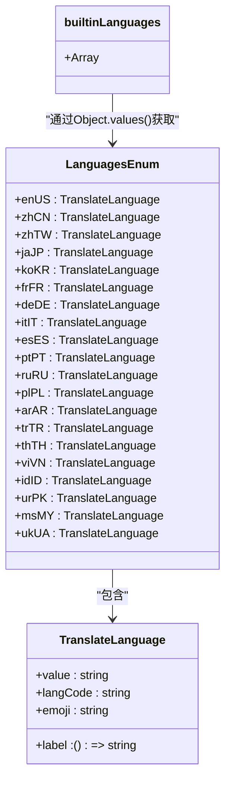
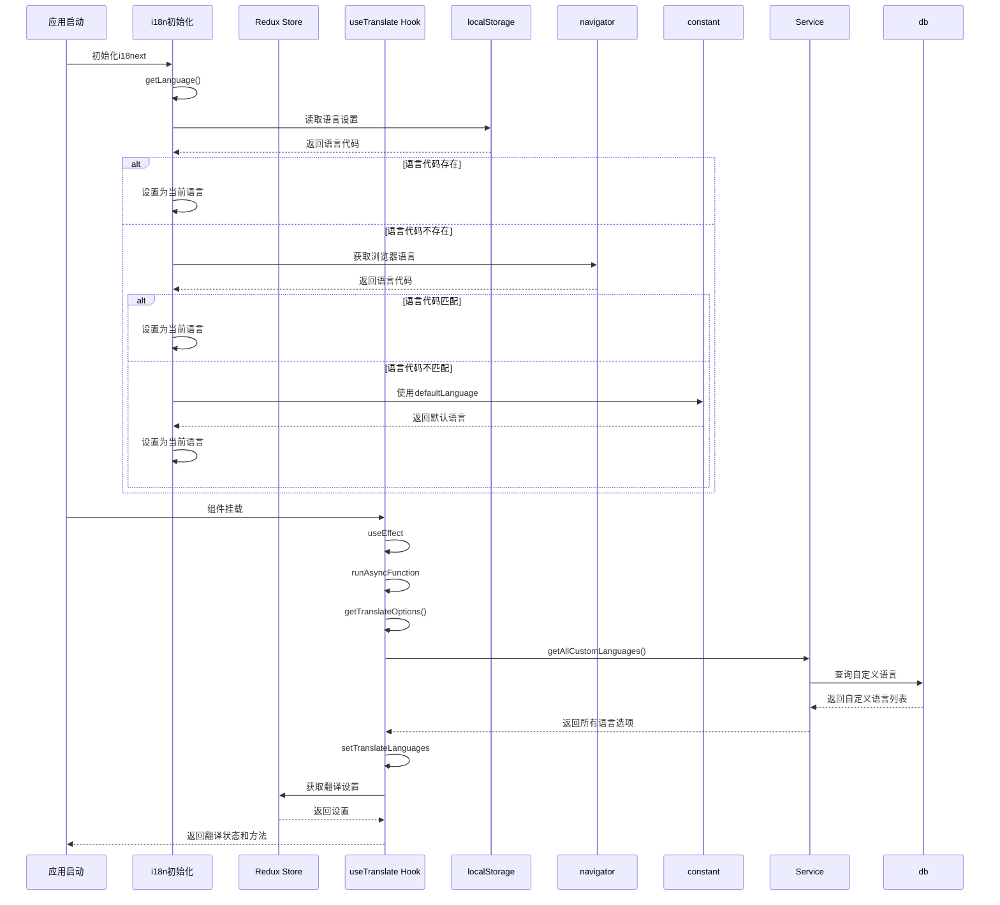
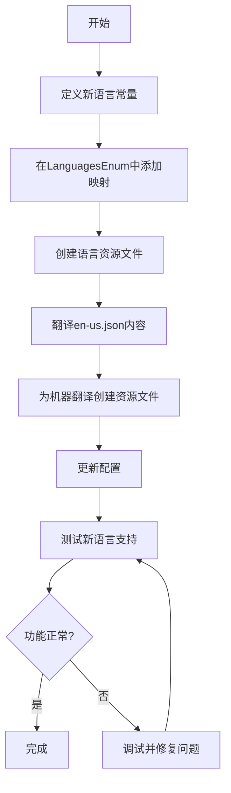

# 翻译配置

<cite>
**本文档引用的文件**   
- [translate.ts](file://src/renderer/src/config/translate.ts)
- [index.ts](file://src/renderer/src/i18n/index.ts)
- [useTranslate.ts](file://src/renderer/src/hooks/useTranslate.ts)
- [languages.ts](file://packages/shared/config/languages.ts)
- [translate.ts](file://src/renderer/src/utils/translate.ts)
- [TranslateService.ts](file://src/renderer/src/services/TranslateService.ts)
- [en-us.json](file://src/renderer/src/i18n/locales/en-us.json)
- [zh-cn.json](file://src/renderer/src/i18n/locales/zh-cn.json)
- [zh-tw.json](file://src/renderer/src/i18n/locales/zh-tw.json)
- [de-de.json](file://src/renderer/src/i18n/translate/de-de.json)
- [es-es.json](file://src/renderer/src/i18n/translate/es-es.json)
- [fr-fr.json](file://src/renderer/src/i18n/translate/fr-fr.json)
- [ja-jp.json](file://src/renderer/src/i18n/translate/ja-jp.json)
- [pt-pt.json](file://src/renderer/src/i18n/translate/pt-pt.json)
- [ru-ru.json](file://src/renderer/src/i18n/translate/ru-ru.json)
- [constant.ts](file://src/renderer/src/config/constant.ts)
- [translate.ts](file://src/renderer/src/store/translate.ts)
</cite>

## 目录
1. [简介](#简介)
2. [内置语言列表与语言枚举](#内置语言列表与语言枚举)
3. [国际化系统与多语言资源](#国际化系统与多语言资源)
4. [翻译配置初始化](#翻译配置初始化)
5. [添加新语言支持](#添加新语言支持)
6. [最佳实践与常见问题](#最佳实践与常见问题)

## 简介
Cherry Studio的翻译功能配置系统通过`translate.ts`文件中的`builtinLanguages`和`LanguagesEnum`定义了内置语言列表，并通过i18n国际化系统实现了界面语言与翻译语言的同步。该系统支持多语言资源文件的组织与加载，允许用户配置默认源语言和目标语言，并在应用启动时进行初始化。开发者可以通过注册语言代码、创建资源文件和更新配置来添加新语言支持。

**Section sources**
- [translate.ts](file://src/renderer/src/config/translate.ts#L1-L288)
- [index.ts](file://src/renderer/src/i18n/index.ts#L1-L58)

## 内置语言列表与语言枚举
在`src/renderer/src/config/translate.ts`文件中，定义了`builtinLanguages`数组和`LanguagesEnum`枚举，用于管理Cherry Studio支持的翻译语言。

`LanguagesEnum`是一个常量枚举，将语言代码映射到具体的语言对象，每个语言对象包含`value`（语言名称）、`langCode`（语言代码）、`label`（标签函数）和`emoji`（表情符号）等属性。例如，英语的定义如下：
```typescript
export const ENGLISH: TranslateLanguage = {
  value: 'English',
  langCode: 'en-us',
  label: () => i18n.t('languages.english'),
  emoji: '🇬🇧'
}
```

`builtinLanguages`数组通过`Object.values(LanguagesEnum)`获取所有内置语言对象，形成一个可用的语言列表。该数组在应用中被广泛使用，例如在语言选择器中显示所有可用语言。

此外，系统还定义了`builtinLangCodeList`常量，它是`builtinLanguages`中所有语言代码的数组，用于快速检查某个语言代码是否被支持。



**Diagram sources **
- [translate.ts](file://src/renderer/src/config/translate.ts#L151-L174)

**Section sources**
- [translate.ts](file://src/renderer/src/config/translate.ts#L1-L288)

## 国际化系统与多语言资源
Cherry Studio使用i18next作为其国际化系统，实现了界面语言与翻译语言的同步。该系统通过`i18n/index.ts`文件进行初始化和配置。

多语言资源文件组织在`src/renderer/src/i18n/locales/`目录下，每个支持的语言都有一个对应的JSON文件，如`en-us.json`、`zh-cn.json`和`zh-tw.json`。这些文件包含了应用中所有需要翻译的文本，以键值对的形式组织。例如，英语资源文件中的语言相关键值对如下：
```json
{
  "languages": {
    "unknown": "Unknown",
    "english": "English",
    "chinese": "Chinese",
    "chinese-traditional": "Chinese (Traditional)",
    "japanese": "Japanese",
    "korean": "Korean",
    "french": "French",
    "german": "German",
    "italian": "Italian",
    "spanish": "Spanish",
    "portuguese": "Portuguese",
    "russian": "Russian",
    "polish": "Polish",
    "arabic": "Arabic",
    "turkish": "Turkish",
    "thai": "Thai",
    "vietnamese": "Vietnamese",
    "indonesian": "Indonesian",
    "urdu": "Urdu",
    "malay": "Malay",
    "ukrainian": "Ukrainian"
  }
}
```

对于机器翻译支持的语言，系统在`src/renderer/src/i18n/translate/`目录下提供了额外的翻译资源文件，如`de-de.json`、`es-es.json`、`fr-fr.json`、`ja-jp.json`、`pt-pt.json`和`ru-ru.json`。这些文件包含了将界面文本翻译成相应语言所需的翻译。

i18n系统的初始化过程如下：
1. 导入所有支持语言的资源文件
2. 创建资源对象，将语言代码映射到对应的翻译资源
3. 使用`i18n.use(initReactI18next).init()`方法初始化i18next
4. 设置默认语言、回退语言和插值选项

```mermaid
graph TD
A[i18n初始化] --> B[导入资源文件]
B --> C[enUS: en-us.json]
B --> D[zhCN: zh-cn.json]
B --> E[zhTW: zh-tw.json]
B --> F[deDE: de-de.json]
B --> G[esES: es-es.json]
B --> H[frFR: fr-fr.json]
B --> I[jaJP: ja-jp.json]
B --> J[ptPT: pt-pt.json]
B --> K[ruRU: ru-ru.json]
A --> L[创建资源对象]
L --> M[resources]
A --> N[初始化i18next]
N --> O[lng: getLanguage()]
N --> P[fallbackLng: defaultLanguage]
N --> Q[interpolation]
O --> R[获取语言]
R --> S[localStorage.getItem('language')]
R --> T[navigator.language]
R --> U[defaultLanguage]
```

**Diagram sources **
- [index.ts](file://src/renderer/src/i18n/index.ts#L1-L58)
- [en-us.json](file://src/renderer/src/i18n/locales/en-us.json)
- [zh-cn.json](file://src/renderer/src/i18n/locales/zh-cn.json)
- [zh-tw.json](file://src/renderer/src/i18n/locales/zh-tw.json)
- [de-de.json](file://src/renderer/src/i18n/translate/de-de.json)
- [es-es.json](file://src/renderer/src/i18n/translate/es-es.json)
- [fr-fr.json](file://src/renderer/src/i18n/translate/fr-fr.json)
- [ja-jp.json](file://src/renderer/src/i18n/translate/ja-jp.json)
- [pt-pt.json](file://src/renderer/src/i18n/translate/pt-pt.json)
- [ru-ru.json](file://src/renderer/src/i18n/translate/ru-ru.json)

**Section sources**
- [index.ts](file://src/renderer/src/i18n/index.ts#L1-L58)
- [en-us.json](file://src/renderer/src/i18n/locales/en-us.json)
- [zh-cn.json](file://src/renderer/src/i18n/locales/zh-cn.json)
- [zh-tw.json](file://src/renderer/src/i18n/locales/zh-tw.json)

## 翻译配置初始化
翻译配置的初始化过程在应用启动时自动进行，主要涉及默认源语言和目标语言的设置。

系统通过`getLanguage()`函数确定应用的界面语言，该函数的优先级顺序为：
1. 从`localStorage`中读取用户上次选择的语言
2. 使用浏览器的`navigator.language`作为默认语言
3. 如果以上都不可用，则使用`defaultLanguage`常量作为最终回退

`defaultLanguage`常量在`src/renderer/src/config/constant.ts`文件中定义，通常设置为`zh-cn`或`en-us`。

翻译功能的核心配置通过`useTranslate`自定义Hook进行管理。该Hook使用`useAppSelector`从Redux store中获取翻译相关的设置，并通过`useState`管理可用的翻译语言列表。在组件挂载时，`useEffect`钩子会调用`getTranslateOptions()`函数异步加载所有可用的翻译语言选项，包括内置语言和用户自定义的语言。



**Diagram sources **
- [index.ts](file://src/renderer/src/i18n/index.ts#L36-L57)
- [useTranslate.ts](file://src/renderer/src/hooks/useTranslate.ts#L21-L70)
- [translate.ts](file://src/renderer/src/utils/translate.ts#L248-L263)
- [constant.ts](file://src/renderer/src/config/constant.ts#L1-L44)

**Section sources**
- [index.ts](file://src/renderer/src/i18n/index.ts#L36-L57)
- [useTranslate.ts](file://src/renderer/src/hooks/useTranslate.ts#L21-L70)
- [translate.ts](file://src/renderer/src/utils/translate.ts#L248-L263)

## 添加新语言支持
为Cherry Studio添加新语言支持需要以下几个步骤：

### 1. 语言代码注册
首先，在`src/renderer/src/config/translate.ts`文件中定义新的语言常量。例如，要添加法语支持，可以添加以下代码：
```typescript
export const FRENCH: TranslateLanguage = {
  value: 'French',
  langCode: 'fr-fr',
  label: () => i18n.t('languages.french'),
  emoji: '🇫🇷'
}
```
然后，在`LanguagesEnum`中添加该语言的映射：
```typescript
export const LanguagesEnum = {
  // ... existing languages
  frFR: FRENCH,
  // ... other languages
} as const
```

### 2. 资源文件创建
在`src/renderer/src/i18n/locales/`目录下创建新的语言资源文件`fr-fr.json`，并复制`en-us.json`的内容作为基础。然后将所有文本翻译成法语。对于机器翻译支持的语言，还需要在`src/renderer/src/i18n/translate/`目录下创建`fr-fr.json`文件，包含将界面文本翻译成法语的翻译。

### 3. 配置更新
确保新语言的配置已正确更新。系统会自动通过`builtinLanguages`数组包含新添加的语言。如果需要支持自定义语言，可以通过`TranslateService`提供的`addCustomLanguage`、`updateCustomLanguage`和`deleteCustomLanguage`方法进行管理。

### 4. 测试与验证
完成上述步骤后，重启应用并测试新语言的支持情况。可以在设置中选择新语言，验证界面文本是否正确翻译，以及翻译功能是否正常工作。



**Diagram sources **
- [translate.ts](file://src/renderer/src/config/translate.ts#L1-L288)
- [en-us.json](file://src/renderer/src/i18n/locales/en-us.json)
- [TranslateService.ts](file://src/renderer/src/services/TranslateService.ts#L98-L164)

**Section sources**
- [translate.ts](file://src/renderer/src/config/translate.ts#L1-L288)
- [TranslateService.ts](file://src/renderer/src/services/TranslateService.ts#L98-L164)

## 最佳实践与常见问题
### 最佳实践
1. **保持语言代码一致性**：始终使用标准的语言代码格式（如`zh-cn`、`en-us`），避免使用非标准的变体。
2. **及时更新资源文件**：当应用界面发生变化时，及时更新所有语言的资源文件，确保所有文本都有对应的翻译。
3. **使用i18n.t()进行文本翻译**：在代码中使用`i18n.t()`函数获取翻译文本，而不是硬编码文本。
4. **测试多语言支持**：在不同语言环境下测试应用，确保界面布局和功能正常。

### 常见问题及解决方案
1. **新添加的语言未显示**：
   - 检查`LanguagesEnum`中是否正确添加了新语言的映射
   - 确认`builtinLanguages`数组是否包含了新语言
   - 重启应用以确保配置重新加载

2. **界面文本未翻译**：
   - 检查对应语言的资源文件中是否存在相应的键值对
   - 确认键名是否正确，与代码中的`i18n.t()`调用匹配
   - 检查是否有拼写错误或大小写不匹配

3. **翻译功能无法使用**：
   - 确认目标语言是否在`builtinLanguages`列表中
   - 检查网络连接是否正常
   - 验证所使用的AI模型是否支持翻译功能

4. **自定义语言管理问题**：
   - 使用`TranslateService`提供的方法进行自定义语言的增删改查
   - 确保自定义语言的`langCode`唯一，避免冲突
   - 在删除自定义语言前，检查是否有依赖该语言的配置

**Section sources**
- [translate.ts](file://src/renderer/src/config/translate.ts#L1-L288)
- [index.ts](file://src/renderer/src/i18n/index.ts#L1-L58)
- [TranslateService.ts](file://src/renderer/src/services/TranslateService.ts#L98-L164)
- [useTranslate.ts](file://src/renderer/src/hooks/useTranslate.ts#L21-L70)