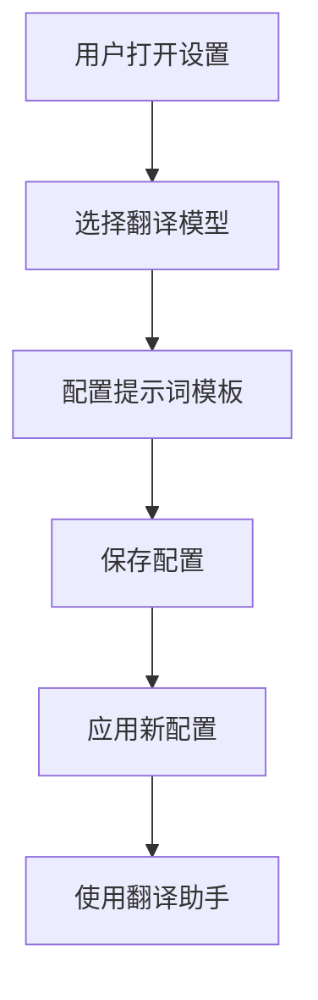
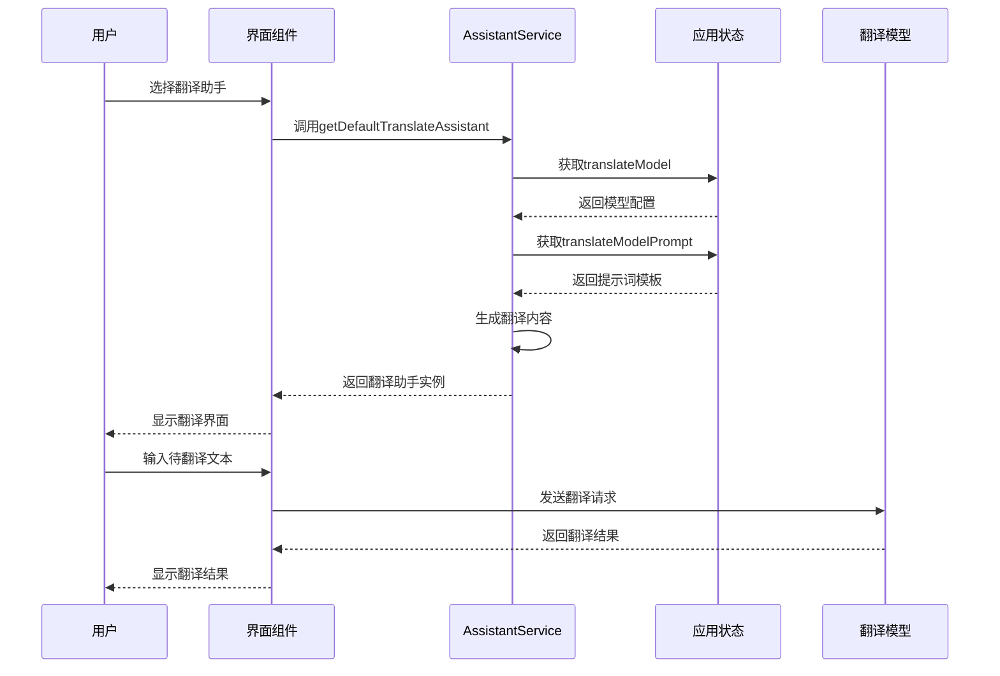

# 翻译预设助手

<cite>
**本文档引用的文件**   
- [assistantPresetGroupTranslations.ts](file://src/renderer/src/pages/store/assistants/presets/assistantPresetGroupTranslations.ts)
- [translate.ts](file://src/renderer/src/config/translate.ts)
- [AssistantService.ts](file://src/renderer/src/services/AssistantService.ts)
- [ModelSettings.tsx](file://src/renderer/src/pages/settings/ModelSettings/ModelSettings.tsx)
- [TranslatePromptSettings.tsx](file://src/renderer/src/pages/settings/TranslateSettingsPopup/TranslatePromptSettings.tsx)
- [prompts.ts](file://src/renderer/src/config/prompts.ts)
- [constant.ts](file://src/renderer/src/config/constant.ts)
</cite>

## 目录
1. [翻译预设助手概述](#翻译预设助手概述)
2. [数据模型与类型定义](#数据模型与类型定义)
3. [预设分组逻辑](#预设分组逻辑)
4. [默认模型与参数配置](#默认模型与参数配置)
5. [提示词模板机制](#提示词模板机制)
6. [用户界面管理](#用户界面管理)
7. [工作流程时序图](#工作流程时序图)
8. [开发者扩展指南](#开发者扩展指南)

## 翻译预设助手概述

Cherry Studio的翻译预设助手系统为用户提供了一套完整的翻译解决方案，通过预设配置和智能助手实现高效、准确的翻译功能。该系统基于预设分组机制，将翻译助手按功能和使用场景进行分类管理，使用户能够快速选择合适的翻译工具。

翻译预设助手不仅支持多种语言的互译，还允许用户通过界面创建、编辑和管理自定义翻译助手。系统通过继承和覆盖机制，确保用户可以在保留默认行为的基础上，根据个人需求进行个性化配置。这种灵活的设计既保证了系统的易用性，又提供了足够的扩展性。

**Section sources**
- [assistantPresetGroupTranslations.ts](file://src/renderer/src/pages/store/assistants/presets/assistantPresetGroupTranslations.ts)
- [translate.ts](file://src/renderer/src/config/translate.ts)

## 数据模型与类型定义

翻译预设助手系统的核心数据模型基于`TranslateAssistant`类型，该类型继承自基础的`Assistant`类型，并扩展了翻译专用的属性。`TranslateAssistant`类型定义了翻译助手特有的数据结构，包括目标语言、翻译内容和使用的模型等关键属性。

```typescript
export type TranslateAssistant = Assistant & {
  model: Model
  content: string
  targetLanguage: TranslateLanguage
}
```

系统通过`isTranslateAssistant`函数来验证一个助手实例是否为翻译助手，该函数检查实例是否包含必要的翻译相关属性。这种类型安全的设计确保了系统在处理翻译助手时的可靠性。

`TranslateLanguage`类型定义了支持的翻译语言，每个语言对象包含语言值、语言代码、标签和表情符号等属性。系统预定义了多种常用语言，如英语、简体中文、繁体中文、日语等，为用户提供开箱即用的翻译体验。

**Section sources**
- [index.ts](file://src/renderer/src/types/index.ts#L57-L65)
- [translate.ts](file://src/renderer/src/config/translate.ts#L4-L172)

## 预设分组逻辑

翻译预设助手的分组逻辑通过`assistantPresetGroupTranslations.ts`文件实现，该文件定义了预设助手的分类体系和多语言支持。系统将预设助手分为多个逻辑组，如"我的"、"职业"、"商业"、"工具"、"语言"等，每个组别都有明确的用途和定位。

分组系统采用多语言映射机制，支持包括希腊语、德语、英语、西班牙语、法语、简体中文、繁体中文、俄语、日语和葡萄牙语在内的多种语言。这种设计确保了预设助手在不同语言环境下的可读性和一致性。

```typescript
export const groupTranslations: GroupTranslations = {
  我的: {
    'el-GR': 'Τα δικά μου',
    'de-DE': 'Meine Agenten',
    'en-US': 'My Agents',
    // ... 其他语言映射
  },
  职业: {
    'el-GR': 'Επαγγελμα',
    'de-DE': 'Karriere',
    'en-US': 'Career',
    // ... 其他语言映射
  },
  // ... 其他分组
}
```

分组逻辑不仅用于界面显示，还作为预设助手的组织架构，帮助用户快速找到所需的翻译工具。系统通过`AssistantPresetGroupIcon`组件将分组名称与图标关联，提供直观的视觉反馈。

**Section sources**
- [assistantPresetGroupTranslations.ts](file://src/renderer/src/pages/store/assistants/presets/assistantPresetGroupTranslations.ts)
- [AssistantPresetGroupIcon.tsx](file://src/renderer/src/pages/store/assistants/presets/components/AssistantPresetGroupIcon.tsx)

## 默认模型与参数配置

翻译预设助手的默认模型和参数配置是系统正常运行的基础。系统通过`getDefaultTranslateAssistant`函数创建默认的翻译助手实例，该函数负责初始化翻译助手所需的所有配置。

默认翻译模型通过`getTranslateModel`函数从应用状态中获取，该函数从`llm.translateModel`状态中读取用户配置的翻译模型。如果未配置翻译模型，系统将抛出错误提示，确保用户意识到需要先配置模型。

```typescript
export function getDefaultTranslateAssistant(targetLanguage: TranslateLanguage, text: string): TranslateAssistant {
  const model = getTranslateModel()
  const assistant: Assistant = getDefaultAssistant()
  
  // ... 错误处理逻辑
  
  const settings = {
    temperature: 0.7
  }
  
  // ... 内容生成逻辑
}
```

温度参数（temperature）默认设置为0.7，这是一个平衡创造性和准确性的中间值。较高的温度值会增加输出的随机性，而较低的温度值会使输出更加确定和保守。0.7的默认值旨在提供既自然又准确的翻译结果。

系统还定义了其他默认常量，如`DEFAULT_TEMPERATURE`（默认温度1.0）、`DEFAULT_CONTEXTCOUNT`（默认上下文数量5）和`DEFAULT_MAX_TOKENS`（默认最大令牌数4096），这些常量为翻译助手提供了基础的行为准则。

**Section sources**
- [AssistantService.ts](file://src/renderer/src/services/AssistantService.ts#L57-L96)
- [constant.ts](file://src/renderer/src/config/constant.ts#L1-L44)

## 提示词模板机制

提示词模板机制是翻译预设助手的核心功能之一，它通过动态模板生成翻译指令，确保翻译结果符合预期。系统使用`translateModelPrompt`设置项存储默认的提示词模板，该模板包含`{{target_language}}`和`{{text}}`两个占位符，分别代表目标语言和待翻译文本。

```typescript
return store
  .getState()
  .settings.translateModelPrompt.replaceAll('{{target_language}}', targetLanguage.value)
  .replaceAll('{{text}}', text)
```

当使用QwenMT模型时，系统会直接传递原始文本，因为这些模型能够直接处理翻译任务。对于其他模型，系统会将提示词模板中的占位符替换为实际值，生成完整的翻译指令。

用户可以在设置界面中自定义提示词模板，通过`TranslatePromptSettings`组件修改`translateModelPrompt`的值。系统提供了重置功能，允许用户将模板恢复为默认值。这种灵活的配置机制使用户能够根据具体需求调整翻译行为，如改变翻译风格、添加特定指令等。

**Section sources**
- [AssistantService.ts](file://src/renderer/src/services/AssistantService.ts#L75-L85)
- [TranslatePromptSettings.tsx](file://src/renderer/src/pages/settings/TranslateSettingsPopup/TranslatePromptSettings.tsx)
- [prompts.ts](file://src/renderer/src/config/prompts.ts)

## 用户界面管理

用户界面管理是翻译预设助手系统的重要组成部分，它提供了创建、编辑和管理自定义翻译助手的完整功能。用户可以通过直观的界面操作，轻松配置翻译助手的各项参数。

在模型设置界面中，用户可以选择用于翻译的默认模型，并通过设置按钮访问更详细的翻译配置。系统提供了重置功能，允许用户将提示词模板恢复为默认状态，确保配置的可维护性。



用户创建的自定义翻译助手会继承默认行为，但可以覆盖特定参数。这种继承和覆盖机制确保了系统的一致性，同时提供了足够的灵活性。用户可以在不改变整体行为的前提下，针对特定场景优化翻译效果。

**Diagram sources**
- [ModelSettings.tsx](file://src/renderer/src/pages/settings/ModelSettings/ModelSettings.tsx#L117-L138)
- [TranslatePromptSettings.tsx](file://src/renderer/src/pages/settings/TranslateSettingsPopup/TranslatePromptSettings.tsx)

**Section sources**
- [ModelSettings.tsx](file://src/renderer/src/pages/settings/ModelSettings/ModelSettings.tsx)
- [TranslateSettingsPopup](file://src/renderer/src/pages/settings/TranslateSettingsPopup)

## 工作流程时序图

翻译预设助手的工作流程从用户选择助手开始，到翻译执行完成结束。整个流程涉及多个组件的协同工作，确保翻译任务的顺利执行。



该时序图展示了从助手选择到翻译执行的完整过程。当用户选择翻译助手时，界面组件调用`getDefaultTranslateAssistant`函数，该函数从应用状态中获取翻译模型和提示词模板，生成包含所有必要配置的翻译助手实例。随后，用户输入待翻译文本，界面组件将请求发送给翻译模型，最终将翻译结果返回给用户。

**Diagram sources**
- [AssistantService.ts](file://src/renderer/src/services/AssistantService.ts#L57-L96)
- [translate.ts](file://src/renderer/src/config/translate.ts)

## 开发者扩展指南

开发者可以通过多种方式扩展翻译预设助手的功能，包括集成新的翻译模型和自定义预设功能。系统提供了清晰的扩展接口，使开发者能够轻松地添加新功能。

要集成新的翻译模型，开发者需要在模型配置中添加新模型的支持，并确保`getTranslateModel`函数能够正确识别和返回该模型。对于特殊模型如QwenMT，需要在`isQwenMTModel`函数中添加相应的判断逻辑。

```typescript
// 示例：扩展新模型支持
export function isCustomTranslateModel(model: Model): boolean {
  return model.id.startsWith('custom-translate-')
}
```

要扩展预设功能，开发者可以修改`assistantPresetGroupTranslations.ts`文件，添加新的分组或修改现有分组的多语言映射。此外，还可以通过创建新的预设助手模板，为用户提供更多选择。

开发者还应该注意保持系统的类型安全，确保所有扩展都符合`TranslateAssistant`类型的定义。通过遵循这些指南，开发者可以为Cherry Studio的翻译预设助手系统贡献有价值的扩展功能。

**Section sources**
- [AssistantService.ts](file://src/renderer/src/services/AssistantService.ts)
- [assistantPresetGroupTranslations.ts](file://src/renderer/src/pages/store/assistants/presets/assistantPresetGroupTranslations.ts)
- [translate.ts](file://src/renderer/src/config/translate.ts)