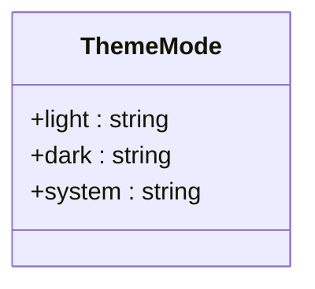
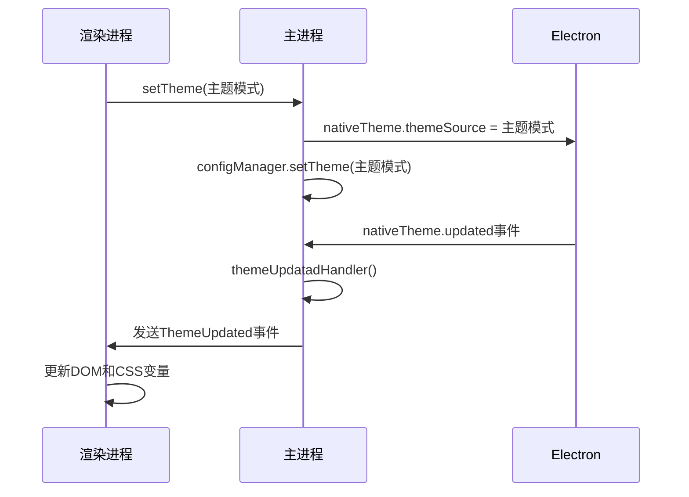
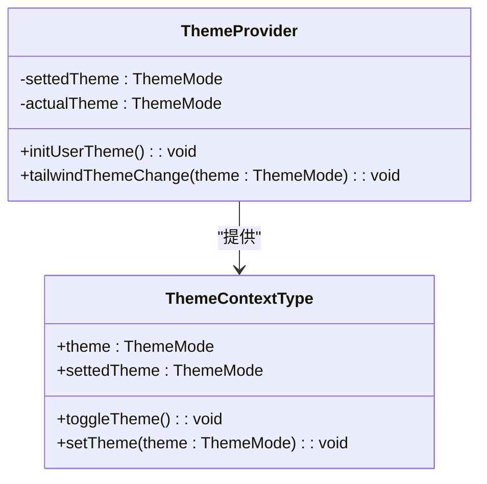
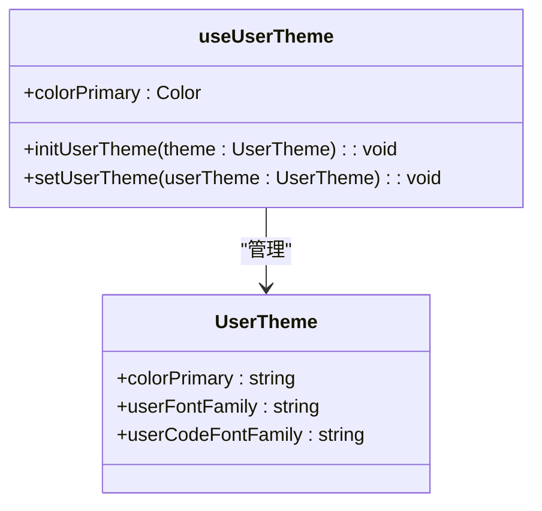
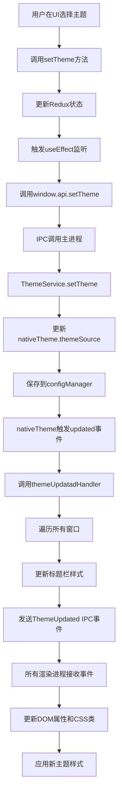
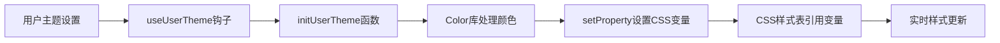
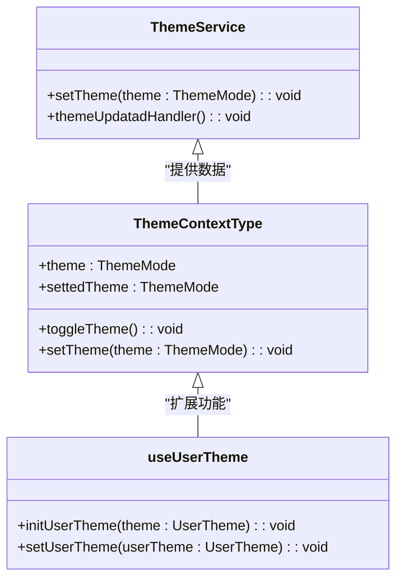

# 主题管理

<cite>
**本文档引用的文件**   
- [ThemeService.ts](file://src/main/services/ThemeService.ts)
- [ThemeProvider.tsx](file://src/renderer/src/context/ThemeProvider.tsx)
- [useUserTheme.ts](file://src/renderer/src/hooks/useUserTheme.ts)
- [settings.ts](file://src/renderer/src/store/settings.ts)
- [DisplaySettings.tsx](file://src/renderer/src/pages/settings/DisplaySettings/DisplaySettings.tsx)
- [types/index.ts](file://src/renderer/src/types/index.ts)
</cite>

## 目录
1. [简介](#简介)
2. [主题模式定义](#主题模式定义)
3. [主题服务实现](#主题服务实现)
4. [主题上下文提供者](#主题上下文提供者)
5. [用户主题自定义](#用户主题自定义)
6. [主题切换流程](#主题切换流程)
7. [CSS变量注入机制](#css变量注入机制)
8. [开发者API接口](#开发者api接口)
9. [最佳实践](#最佳实践)

## 简介

Cherry Studio的主题管理功能提供了一套完整的主题解决方案，支持亮色、暗色和跟随系统三种主题模式。系统通过Electron的nativeTheme模块实现与操作系统级主题的同步，确保应用外观与系统设置保持一致。主题管理功能分为三个主要部分：主题服务（ThemeService）负责处理主进程中的主题逻辑，主题上下文（ThemeProvider）为React应用提供主题状态管理，用户主题（UserTheme）则允许用户自定义主色调和字体等个性化设置。

整个主题系统采用现代化的架构设计，通过IPC（进程间通信）机制在主进程和渲染进程之间传递主题变更事件，确保所有窗口能够实时更新主题。系统使用CSS变量实现动态样式更新，避免了传统方案中需要重新加载样式表的性能开销。此外，主题管理还考虑了向后兼容性，能够处理旧版本的主题设置。

**Section sources**
- [ThemeService.ts](file://src/main/services/ThemeService.ts#L1-L48)
- [ThemeProvider.tsx](file://src/renderer/src/context/ThemeProvider.tsx#L1-L95)

## 主题模式定义

主题模式通过枚举类型ThemeMode定义，包含三种可选值：亮色（light）、暗色（dark）和跟随系统（system）。这三种模式覆盖了用户对应用主题的所有基本需求。当用户选择"跟随系统"模式时，应用会自动检测操作系统的当前主题设置，并相应地调整应用的外观。

**Diagram sources**
- [types/index.ts](file://src/renderer/src/types/index.ts#L438-L442)

主题模式的定义位于类型文件中，确保在整个应用中保持一致性。每种模式对应一个字符串值，这些值不仅用于内部逻辑判断，还作为CSS类名应用到DOM元素上，便于通过CSS进行样式控制。系统在启动时会从配置管理器中读取用户上次选择的主题模式，并根据该模式初始化应用的主题状态。

**Section sources**
- [types/index.ts](file://src/renderer/src/types/index.ts#L438-L442)
- [settings.ts](file://src/renderer/src/store/settings.ts#L60)

## 主题服务实现

主题服务（ThemeService）是主进程中负责管理主题的核心组件，它封装了与Electron nativeTheme模块的交互逻辑。服务在初始化时会从配置管理器读取用户保存的主题设置，并将其应用到nativeTheme的themeSource属性上。通过监听nativeTheme的'updated'事件，主题服务能够及时响应系统主题的变化。

**Diagram sources**
- [ThemeService.ts](file://src/main/services/ThemeService.ts#L8-L48)
- [ThemeProvider.tsx](file://src/renderer/src/context/ThemeProvider.tsx#L74-L77)

当系统主题发生变化时，themeUpdatadHandler方法会被调用，该方法会遍历所有打开的窗口，更新它们的标题栏覆盖样式，并通过IPC通道向所有渲染进程发送主题更新事件。这种设计确保了即使应用有多个窗口同时打开，所有窗口的主题也能保持同步。

**Section sources**
- [ThemeService.ts](file://src/main/services/ThemeService.ts#L8-L48)
- [WindowService.ts](file://src/main/services/WindowService.ts#L2-L3)

## 主题上下文提供者

主题上下文（ThemeProvider）是React应用中的核心组件，负责提供主题状态和操作方法。它使用React的Context API创建了一个主题上下文，使得应用中的任何组件都可以通过useTheme钩子访问主题状态。上下文包含了当前的实际主题、用户设置的主题、切换主题和设置主题的方法。

**Diagram sources**
- [ThemeProvider.tsx](file://src/renderer/src/context/ThemeProvider.tsx#L9-L21)

ThemeProvider组件在挂载时会执行一系列初始化操作，包括设置body元素的OS属性、主题模式属性和语言属性。它还负责监听来自主进程的主题更新事件，并相应地更新组件状态。通过useEffect钩子，组件确保在主题变化时能够正确更新DOM和CSS类名。

**Section sources**
- [ThemeProvider.tsx](file://src/renderer/src/context/ThemeProvider.tsx#L33-L95)
- [useSettings.ts](file://src/renderer/src/hooks/useSettings.ts#L74-L76)

## 用户主题自定义

用户主题（UserTheme）功能允许用户自定义应用的主色调和字体设置，提供个性化的用户体验。用户主题包含三个主要属性：主色调（colorPrimary）、常规字体（userFontFamily）和代码字体（userCodeFontFamily）。这些自定义设置通过CSS变量注入到应用中，实现了无需刷新页面的实时样式更新。

**Diagram sources**
- [useUserTheme.ts](file://src/renderer/src/hooks/useUserTheme.ts#L34-L38)
- [settings.ts](file://src/renderer/src/store/settings.ts#L34-L38)

当用户修改主题设置时，initUserTheme函数会被调用，该函数将用户选择的颜色值转换为多种透明度变体，并通过document.body.style.setProperty方法设置相应的CSS变量。这些CSS变量包括--color-primary（主色调）、--color-primary-soft（半透明主色调）和--color-primary-mute（低透明度主色调），为UI组件提供了丰富的色彩选择。

**Section sources**
- [useUserTheme.ts](file://src/renderer/src/hooks/useUserTheme.ts#L6-L35)
- [settings.ts](file://src/renderer/src/store/settings.ts#L247-L251)

## 主题切换流程

主题切换流程是一个跨进程的复杂操作，涉及用户界面、渲染进程和主进程之间的协同工作。当用户在设置界面选择新的主题模式时，触发一系列事件，最终实现所有窗口的主题更新。整个流程设计精巧，确保了用户体验的流畅性和数据的一致性。

**Diagram sources**
- [DisplaySettings.tsx](file://src/renderer/src/pages/settings/DisplaySettings/DisplaySettings.tsx#L206)
- [ThemeProvider.tsx](file://src/renderer/src/context/ThemeProvider.tsx#L85)
- [ThemeService.ts](file://src/main/services/ThemeService.ts#L37-L45)

流程从用户在显示设置界面选择新的主题模式开始，通过Segmented组件的onChange事件触发setTheme方法。该方法首先更新Redux store中的主题状态，然后通过useEffect监听器调用window.api.setTheme，通过IPC通道将主题变更通知发送到主进程。主进程的ThemeService接收到请求后，更新nativeTheme设置并保存到配置管理器。当系统主题发生变化时，会触发updated事件，进而调用themeUpdatadHandler方法，向所有渲染进程广播主题更新事件。

**Section sources**
- [DisplaySettings.tsx](file://src/renderer/src/pages/settings/DisplaySettings/DisplaySettings.tsx#L199-L360)
- [ThemeProvider.tsx](file://src/renderer/src/context/ThemeProvider.tsx#L84-L86)
- [ThemeService.ts](file://src/main/services/ThemeService.ts#L37-L45)

## CSS变量注入机制

CSS变量注入机制是实现动态主题切换的核心技术，它利用CSS自定义属性（CSS Variables）的特性，允许在运行时动态修改样式。与传统的CSS类切换方案相比，CSS变量方案具有更高的灵活性和性能优势，避免了频繁的DOM操作和样式表重新解析。

系统通过JavaScript的setProperty方法将主题相关的颜色值和字体设置注入到DOM的根元素或body元素上。这些CSS变量包括：

- `--color-primary`: 主色调，用于按钮、链接等主要UI元素
- `--color-primary-soft`: 半透明主色调，用于悬停效果和次要元素
- `--color-primary-mute`: 低透明度主色调，用于背景和分隔线
- `--user-font-family`: 用户自定义的常规字体
- `--user-code-font-family`: 用户自定义的代码字体

**Diagram sources**
- [useUserTheme.ts](file://src/renderer/src/hooks/useUserTheme.ts#L14-L21)

这种机制的优势在于，一旦CSS变量被设置，所有引用这些变量的CSS规则都会自动更新，无需重新加载样式表或重新渲染组件。此外，通过使用Color库处理颜色值，系统能够生成具有不同透明度的色彩变体，丰富了UI设计的可能性。

**Section sources**
- [useUserTheme.ts](file://src/renderer/src/hooks/useUserTheme.ts#L11-L22)
- [settings.ts](file://src/renderer/src/store/settings.ts#L248-L250)

## 开发者API接口

主题管理功能为开发者提供了清晰的API接口，便于在应用的其他部分集成主题功能。主要API包括主题服务接口、主题上下文接口和用户主题钩子，这些接口封装了底层实现细节，提供了简洁易用的编程接口。

### 主题服务API

主题服务（ThemeService）提供了以下主要方法：
- `setTheme(theme: ThemeMode)`: 设置应用主题模式
- `themeUpdatadHandler()`: 处理系统主题更新的内部方法

### 主题上下文API

通过useTheme钩子可以访问以下主题相关属性和方法：
- `theme`: 当前实际应用的主题模式
- `settedTheme`: 用户设置的主题模式
- `toggleTheme()`: 切换主题模式的循环方法
- `setTheme(theme: ThemeMode)`: 设置用户主题模式

### 用户主题API

useUserTheme钩子提供了以下方法：
- `initUserTheme(theme: UserTheme)`: 初始化用户主题设置
- `setUserTheme(userTheme: UserTheme)`: 设置并应用新的用户主题

**Diagram sources**
- [ThemeService.ts](file://src/main/services/ThemeService.ts#L37-L45)
- [ThemeProvider.tsx](file://src/renderer/src/context/ThemeProvider.tsx#L13-L14)
- [useUserTheme.ts](file://src/renderer/src/hooks/useUserTheme.ts#L29-L33)

**Section sources**
- [ThemeService.ts](file://src/main/services/ThemeService.ts#L37-L45)
- [ThemeProvider.tsx](file://src/renderer/src/context/ThemeProvider.tsx#L13-L14)
- [useUserTheme.ts](file://src/renderer/src/hooks/useUserTheme.ts#L29-L33)

## 最佳实践

在使用Cherry Studio的主题管理功能时，遵循以下最佳实践可以确保应用的稳定性和用户体验的一致性：

1. **始终通过API接口操作主题**：避免直接修改nativeTheme或CSS变量，应通过提供的API方法进行主题操作，确保状态管理的一致性。

2. **正确处理主题更新事件**：在自定义组件中，如果需要响应主题变化，应监听ThemeUpdated IPC事件或使用useTheme钩子，确保组件能够正确响应主题变更。

3. **合理使用CSS变量**：在自定义样式中，优先使用系统提供的CSS变量而非硬编码颜色值，这样可以确保自定义样式与主题设置保持一致。

4. **考虑向后兼容性**：在处理主题设置时，应考虑到旧版本的兼容性问题，如代码中所示的对旧版"auto"主题的处理。

5. **性能优化**：避免在主题切换时执行昂贵的DOM操作，利用CSS变量的特性实现高效的样式更新。

6. **错误处理**：在调用setTitleBarOverlay等可能失败的方法时，应适当地捕获和处理错误，避免影响应用的正常运行。

7. **状态同步**：确保Redux store、本地存储和UI状态之间的一致性，避免出现状态不一致的问题。

通过遵循这些最佳实践，开发者可以充分利用Cherry Studio的主题管理功能，为用户提供一致、流畅和个性化的用户体验。

**Section sources**
- [ThemeService.ts](file://src/main/services/ThemeService.ts#L27-L31)
- [ThemeProvider.tsx](file://src/renderer/src/context/ThemeProvider.tsx#L67-L69)
- [useUserTheme.ts](file://src/renderer/src/hooks/useUserTheme.ts#L14-L21)