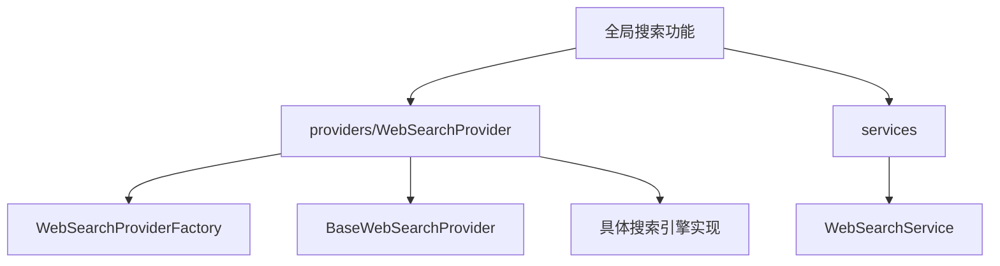
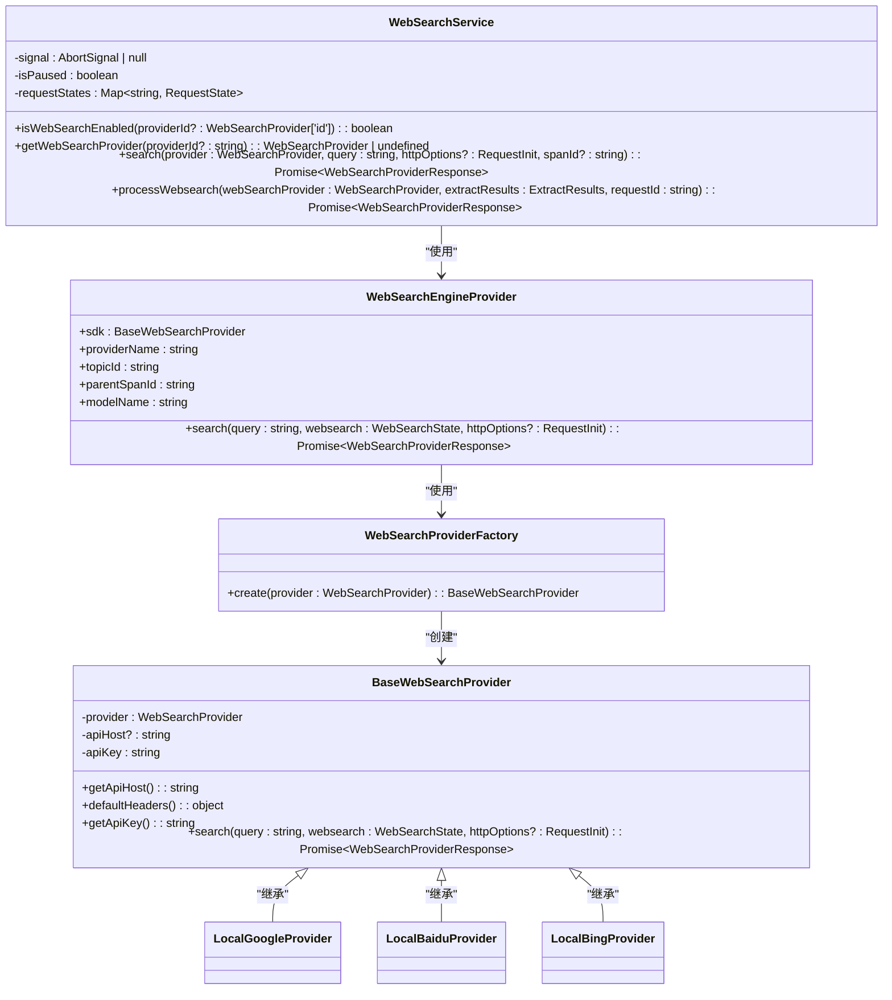
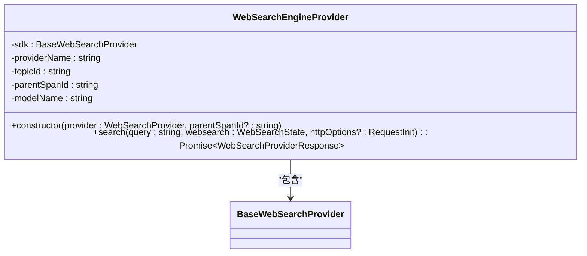
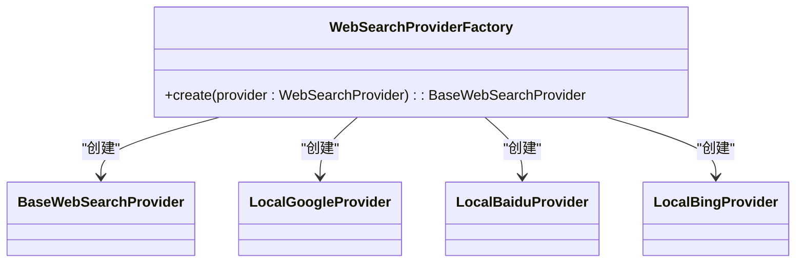
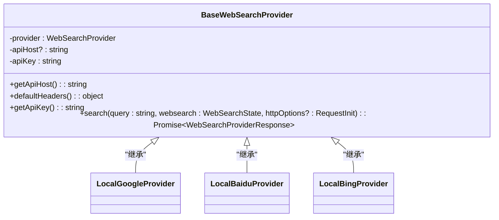
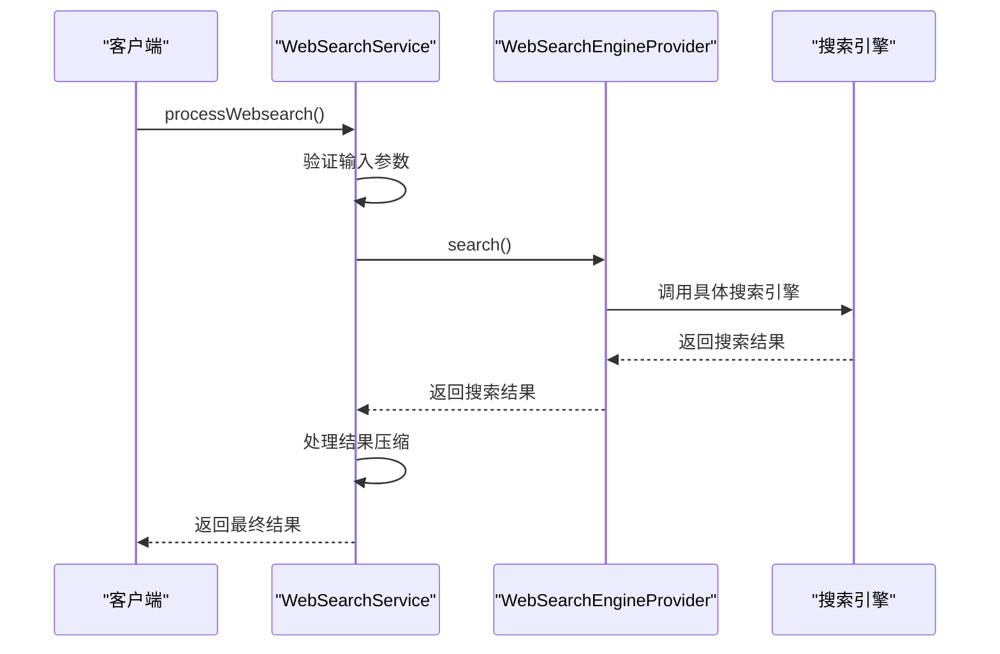
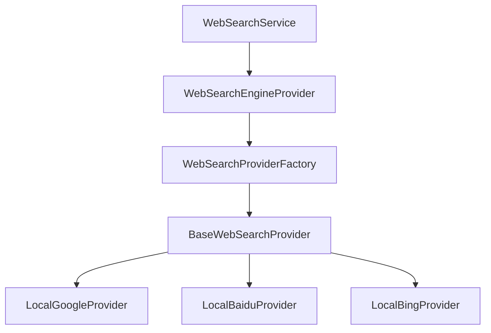

# 全局搜索

<cite>
**本文档引用的文件**
- [SearchService.ts](file://src/main/services/SearchService.ts)
- [WebSearchProviderFactory.ts](file://src/renderer/src/providers/WebSearchProvider/WebSearchProviderFactory.ts)
- [BaseWebSearchProvider.ts](file://src/renderer/src/providers/WebSearchProvider/BaseWebSearchProvider.ts)
- [WebSearchService.ts](file://src/renderer/src/services/WebSearchService.ts)
- [index.ts](file://src/renderer/src/providers/WebSearchProvider/index.ts)
</cite>

## 目录
1. [简介](#简介)
2. [项目结构](#项目结构)
3. [核心组件](#核心组件)
4. [架构概述](#架构概述)
5. [详细组件分析](#详细组件分析)
6. [依赖分析](#依赖分析)
7. [性能考虑](#性能考虑)
8. [故障排除指南](#故障排除指南)
9. [结论](#结论)

## 简介
本文档详细介绍了Cherry Studio的全局搜索功能，包括搜索服务的架构设计、核心组件和实现细节。文档涵盖了WebSearchEngineProvider作为核心调度器，以及基于工厂模式的WebSearchProviderFactory如何创建不同搜索引擎的实例。同时，文档还阐述了支持的搜索引擎类型、搜索请求的处理流程、结果过滤机制和性能优化策略。

## 项目结构
Cherry Studio的全局搜索功能主要分布在`src/renderer/src/providers/WebSearchProvider`和`src/renderer/src/services`目录下。这些目录包含了搜索服务的核心组件和实现。

**Diagram sources**
- [WebSearchProviderFactory.ts](file://src/renderer/src/providers/WebSearchProvider/WebSearchProviderFactory.ts)
- [BaseWebSearchProvider.ts](file://src/renderer/src/providers/WebSearchProvider/BaseWebSearchProvider.ts)
- [WebSearchService.ts](file://src/renderer/src/services/WebSearchService.ts)

**Section sources**
- [WebSearchProviderFactory.ts](file://src/renderer/src/providers/WebSearchProvider/WebSearchProviderFactory.ts)
- [BaseWebSearchProvider.ts](file://src/renderer/src/providers/WebSearchProvider/BaseWebSearchProvider.ts)
- [WebSearchService.ts](file://src/renderer/src/services/WebSearchService.ts)

## 核心组件
全局搜索功能的核心组件包括WebSearchEngineProvider、WebSearchProviderFactory、BaseWebSearchProvider和WebSearchService。这些组件共同协作，实现了灵活、可扩展的搜索功能。

**Section sources**
- [WebSearchEngineProvider.ts](file://src/renderer/src/providers/WebSearchProvider/index.ts)
- [WebSearchProviderFactory.ts](file://src/renderer/src/providers/WebSearchProvider/WebSearchProviderFactory.ts)
- [BaseWebSearchProvider.ts](file://src/renderer/src/providers/WebSearchProvider/BaseWebSearchProvider.ts)
- [WebSearchService.ts](file://src/renderer/src/services/WebSearchService.ts)

## 架构概述
Cherry Studio的全局搜索功能采用模块化设计，通过工厂模式和抽象基类实现搜索引擎的灵活扩展。核心组件之间的关系如下：

**Diagram sources**
- [WebSearchEngineProvider.ts](file://src/renderer/src/providers/WebSearchProvider/index.ts)
- [WebSearchProviderFactory.ts](file://src/renderer/src/providers/WebSearchProvider/WebSearchProviderFactory.ts)
- [BaseWebSearchProvider.ts](file://src/renderer/src/providers/WebSearchProvider/BaseWebSearchProvider.ts)
- [WebSearchService.ts](file://src/renderer/src/services/WebSearchService.ts)

## 详细组件分析
### WebSearchEngineProvider 分析
WebSearchEngineProvider是全局搜索功能的核心调度器，负责协调不同搜索引擎的调用。

#### 类图

**Diagram sources**
- [WebSearchEngineProvider.ts](file://src/renderer/src/providers/WebSearchProvider/index.ts)
- [BaseWebSearchProvider.ts](file://src/renderer/src/providers/WebSearchProvider/BaseWebSearchProvider.ts)

### WebSearchProviderFactory 分析
WebSearchProviderFactory采用工厂模式，根据配置创建不同搜索引擎的实例。

#### 类图

**Diagram sources**
- [WebSearchProviderFactory.ts](file://src/renderer/src/providers/WebSearchProvider/WebSearchProviderFactory.ts)
- [BaseWebSearchProvider.ts](file://src/renderer/src/providers/WebSearchProvider/BaseWebSearchProvider.ts)

### BaseWebSearchProvider 分析
BaseWebSearchProvider是所有搜索引擎的抽象基类，定义了通用的接口和方法。

#### 类图

**Diagram sources**
- [BaseWebSearchProvider.ts](file://src/renderer/src/providers/WebSearchProvider/BaseWebSearchProvider.ts)

### WebSearchService 分析
WebSearchService是全局搜索功能的主要服务类，负责处理搜索请求的完整流程。

#### 序列图

**Diagram sources**
- [WebSearchService.ts](file://src/renderer/src/services/WebSearchService.ts)
- [WebSearchEngineProvider.ts](file://src/renderer/src/providers/WebSearchProvider/index.ts)

**Section sources**
- [WebSearchService.ts](file://src/renderer/src/services/WebSearchService.ts)
- [WebSearchEngineProvider.ts](file://src/renderer/src/providers/WebSearchProvider/index.ts)

## 依赖分析
全局搜索功能的组件依赖关系如下：

**Diagram sources**
- [WebSearchService.ts](file://src/renderer/src/services/WebSearchService.ts)
- [WebSearchEngineProvider.ts](file://src/renderer/src/providers/WebSearchProvider/index.ts)
- [WebSearchProviderFactory.ts](file://src/renderer/src/providers/WebSearchProvider/WebSearchProviderFactory.ts)
- [BaseWebSearchProvider.ts](file://src/renderer/src/providers/WebSearchProvider/BaseWebSearchProvider.ts)

**Section sources**
- [WebSearchService.ts](file://src/renderer/src/services/WebSearchService.ts)
- [WebSearchEngineProvider.ts](file://src/renderer/src/providers/WebSearchProvider/index.ts)
- [WebSearchProviderFactory.ts](file://src/renderer/src/providers/WebSearchProvider/WebSearchProviderFactory.ts)
- [BaseWebSearchProvider.ts](file://src/renderer/src/providers/WebSearchProvider/BaseWebSearchProvider.ts)

## 性能考虑
全局搜索功能在设计时考虑了多种性能优化策略，包括结果压缩、并发搜索和资源管理。通过RAG和截断两种压缩方法，可以有效减少搜索结果的数据量，提高处理效率。

## 故障排除指南
如果全局搜索功能出现问题，可以检查以下方面：
1. 确认搜索引擎的API密钥和主机配置是否正确
2. 检查网络连接是否正常
3. 查看日志文件以获取详细的错误信息
4. 确认搜索请求的参数是否符合要求

**Section sources**
- [WebSearchService.ts](file://src/renderer/src/services/WebSearchService.ts)
- [WebSearchEngineProvider.ts](file://src/renderer/src/providers/WebSearchProvider/index.ts)

## 结论
Cherry Studio的全局搜索功能通过模块化设计和工厂模式，实现了灵活、可扩展的搜索能力。核心组件之间的清晰分工和协作，使得系统易于维护和扩展。通过合理的性能优化策略，确保了搜索功能的高效运行。