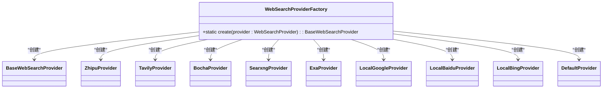
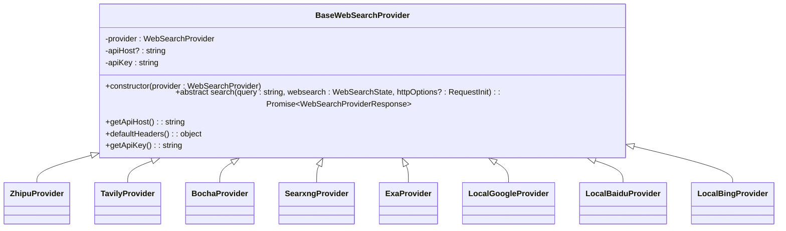
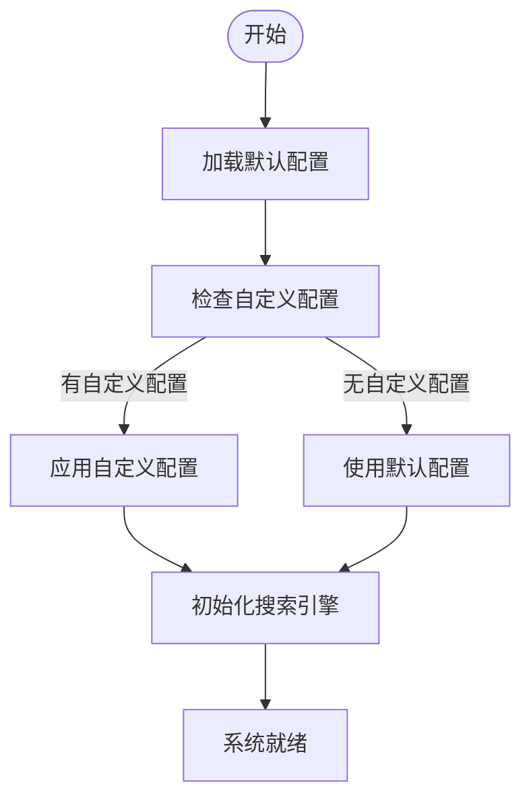
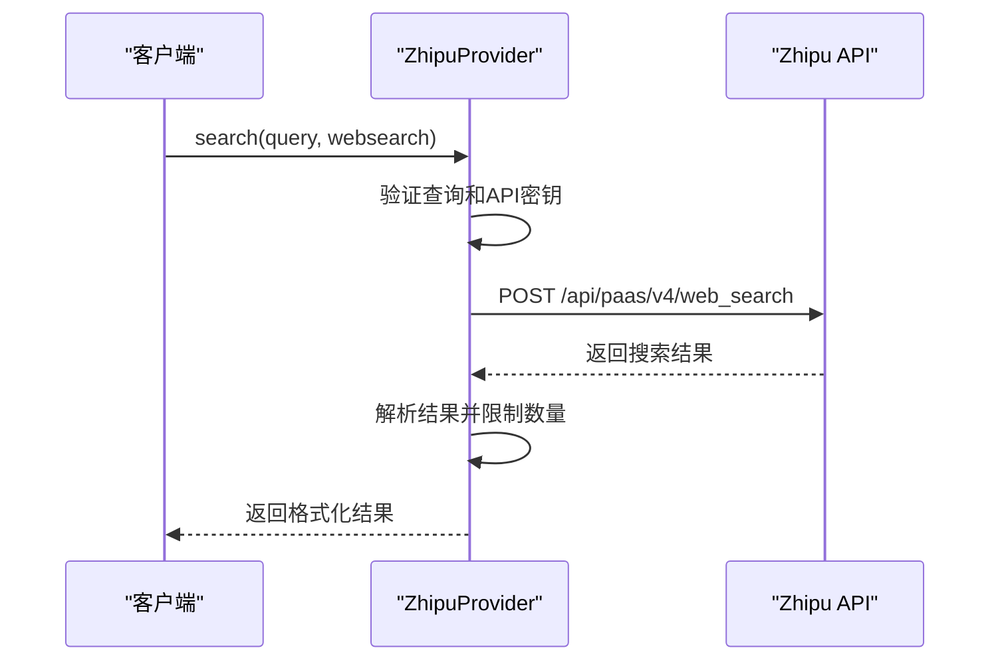
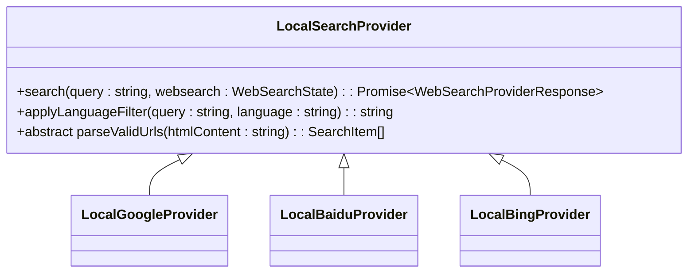
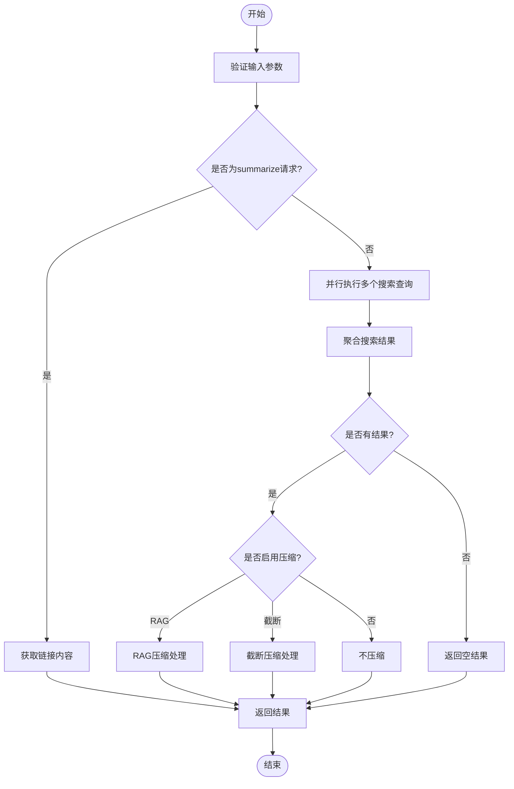

# 搜索引擎管理

<cite>
**本文档引用的文件**   
- [WebSearchProviderFactory.ts](file://src/renderer/src/providers/WebSearchProvider/WebSearchProviderFactory.ts)
- [BaseWebSearchProvider.ts](file://src/renderer/src/providers/WebSearchProvider/BaseWebSearchProvider.ts)
- [webSearchProviders.ts](file://src/renderer/src/config/webSearchProviders.ts)
- [WebSearchService.ts](file://src/renderer/src/services/WebSearchService.ts)
- [ZhipuProvider.ts](file://src/renderer/src/providers/WebSearchProvider/ZhipuProvider.ts)
- [TavilyProvider.ts](file://src/renderer/src/providers/WebSearchProvider/TavilyProvider.ts)
- [BochaProvider.ts](file://src/renderer/src/providers/WebSearchProvider/BochaProvider.ts)
- [SearxngProvider.ts](file://src/renderer/src/providers/WebSearchProvider/SearxngProvider.ts)
- [ExaProvider.ts](file://src/renderer/src/providers/WebSearchProvider/ExaProvider.ts)
- [LocalGoogleProvider.ts](file://src/renderer/src/providers/WebSearchProvider/LocalGoogleProvider.ts)
- [LocalBaiduProvider.ts](file://src/renderer/src/providers/WebSearchProvider/LocalBaiduProvider.ts)
- [LocalBingProvider.ts](file://src/renderer/src/providers/WebSearchProvider/LocalBingProvider.ts)
- [LocalSearchProvider.ts](file://src/renderer/src/providers/WebSearchProvider/LocalSearchProvider.ts)
- [websearch.ts](file://src/renderer/src/store/websearch.ts)
</cite>

## 目录
1. [引言](#引言)
2. [工厂模式实现](#工厂模式实现)
3. [抽象基类设计](#抽象基类设计)
4. [搜索引擎配置](#搜索引擎配置)
5. [具体搜索引擎实现](#具体搜索引擎实现)
6. [搜索引擎服务](#搜索引擎服务)
7. [扩展新搜索引擎](#扩展新搜索引擎)
8. [总结](#总结)

## 引言

Cherry Studio的搜索引擎管理系统采用工厂模式和抽象基类的设计模式，为用户提供灵活的网络搜索功能。系统支持多种搜索引擎，包括zhipu、tavily、bocha、searxng、exa以及本地Google、Baidu、Bing等。通过配置驱动的方式，用户可以轻松添加、修改和删除搜索引擎配置，满足不同场景下的搜索需求。

本系统的核心设计包括WebSearchProviderFactory工厂类，用于根据配置创建不同类型的搜索引擎实例；BaseWebSearchProvider抽象基类，定义了所有搜索引擎的公共接口和基础功能；以及详细的配置结构，用于管理各种搜索引擎的参数和设置。

**本节不分析具体源文件**

## 工厂模式实现

WebSearchProviderFactory类实现了工厂模式，根据提供的搜索引擎配置创建相应的搜索引擎实例。该工厂类通过switch语句根据provider.id来决定创建哪种类型的搜索引擎实例。



**Diagram sources**
- [WebSearchProviderFactory.ts](file://src/renderer/src/providers/WebSearchProvider/WebSearchProviderFactory.ts#L14-L37)

**Section sources**
- [WebSearchProviderFactory.ts](file://src/renderer/src/providers/WebSearchProvider/WebSearchProviderFactory.ts#L1-L38)

## 抽象基类设计

BaseWebSearchProvider是一个抽象基类，为所有具体的搜索引擎提供者定义了统一的接口和基础功能。该基类包含核心属性和方法，确保所有搜索引擎实现的一致性。

### 核心属性

- **provider**: WebSearchProvider类型，存储搜索引擎的配置信息
- **apiHost**: 字符串类型，可选，存储API主机地址
- **apiKey**: 字符串类型，存储API密钥

### 核心方法

- **search(query: string, websearch: WebSearchState, httpOptions?: RequestInit)**: 抽象方法，所有子类必须实现的具体搜索逻辑
- **getApiHost()**: 获取API主机地址
- **defaultHeaders()**: 返回默认的HTTP请求头
- **getApiKey()**: 获取API密钥，支持多密钥轮换机制



**Diagram sources**
- [BaseWebSearchProvider.ts](file://src/renderer/src/providers/WebSearchProvider/BaseWebSearchProvider.ts#L4-L55)

**Section sources**
- [BaseWebSearchProvider.ts](file://src/renderer/src/providers/WebSearchProvider/BaseWebSearchProvider.ts#L1-L55)

## 搜索引擎配置

webSearchProviders配置结构定义了系统中所有可用搜索引擎的配置信息，包括官方文档链接和API密钥获取链接。配置分为两个主要部分：WEB_SEARCH_PROVIDER_CONFIG和WEB_SEARCH_PROVIDERS。

### 配置结构

**WEB_SEARCH_PROVIDER_CONFIG**: 记录类型，存储每个搜索引擎的网站信息

```typescript
type WebSearchProviderConfig = {
  websites: {
    official: string
    apiKey?: string
  }
}
```

**WEB_SEARCH_PROVIDERS**: WebSearchProvider数组，定义了每个搜索引擎的具体配置

```typescript
export const WEB_SEARCH_PROVIDERS: WebSearchProvider[] = [
  {
    id: 'zhipu',
    name: 'Zhipu',
    apiHost: 'https://open.bigmodel.cn/api/paas/v4/web_search',
    apiKey: ''
  },
  {
    id: 'tavily',
    name: 'Tavily',
    apiHost: 'https://api.tavily.com',
    apiKey: ''
  },
  // ... 其他搜索引擎配置
]
```

### 配置管理

系统提供了完整的配置管理功能，包括：

- **添加搜索引擎**: 通过addWebSearchProvider action添加新的搜索引擎
- **修改搜索引擎**: 通过updateWebSearchProvider action更新现有搜索引擎的配置
- **删除搜索引擎**: 通过更新providers数组来移除搜索引擎



**Diagram sources**
- [webSearchProviders.ts](file://src/renderer/src/config/webSearchProviders.ts#L10-L105)

**Section sources**
- [webSearchProviders.ts](file://src/renderer/src/config/webSearchProviders.ts#L1-L105)

## 具体搜索引擎实现

### API搜索引擎实现

#### ZhipuProvider

ZhipuProvider实现了与智谱AI的Web搜索API的集成。该实现使用POST请求发送搜索查询，并解析返回的JSON数据。



**Diagram sources**
- [ZhipuProvider.ts](file://src/renderer/src/providers/WebSearchProvider/ZhipuProvider.ts#L35-L92)

#### TavilyProvider

TavilyProvider使用@agentic/tavily客户端库与Tavily搜索API进行交互，提供简洁的搜索接口。

**Section sources**
- [TavilyProvider.ts](file://src/renderer/src/providers/WebSearchProvider/TavilyProvider.ts#L1-L49)

#### BochaProvider

BochaProvider实现了与Bocha AI搜索API的集成，支持搜索结果摘要和新鲜度过滤。

**Section sources**
- [BochaProvider.ts](file://src/renderer/src/providers/WebSearchProvider/BochaProvider.ts#L1-L73)

#### SearxngProvider

SearxngProvider是一个功能丰富的搜索引擎实现，支持基本认证和引擎配置。该实现首先获取可用的搜索引擎列表，然后执行搜索并获取网页内容。

**Section sources**
- [SearxngProvider.ts](file://src/renderer/src/providers/WebSearchProvider/SearxngProvider.ts#L1-L143)

#### ExaProvider

ExaProvider使用@agentic/exa客户端库与Exa搜索API进行交互，提供高质量的搜索结果。

**Section sources**
- [ExaProvider.ts](file://src/renderer/src/providers/WebSearchProvider/ExaProvider.ts#L1-L53)

### 本地搜索引擎实现

#### LocalSearchProvider

LocalSearchProvider是本地搜索引擎的基类，定义了本地搜索的通用逻辑，包括URL解析和内容获取。



**Diagram sources**
- [LocalSearchProvider.ts](file://src/renderer/src/providers/WebSearchProvider/LocalSearchProvider.ts#L19-L103)

**Section sources**
- [LocalSearchProvider.ts](file://src/renderer/src/providers/WebSearchProvider/LocalSearchProvider.ts#L1-L103)

#### LocalGoogleProvider

LocalGoogleProvider实现了对Google搜索结果的HTML解析，提取搜索结果的标题和URL。

**Section sources**
- [LocalGoogleProvider.ts](file://src/renderer/src/providers/WebSearchProvider/LocalGoogleProvider.ts#L1-L34)

#### LocalBaiduProvider

LocalBaiduProvider实现了对百度搜索结果的HTML解析，提取搜索结果的标题和URL。

**Section sources**
- [LocalBaiduProvider.ts](file://src/renderer/src/providers/WebSearchProvider/LocalBaiduProvider.ts#L1-L34)

#### LocalBingProvider

LocalBingProvider实现了对必应搜索结果的HTML解析，并包含Bing重定向URL解码功能。

**Section sources**
- [LocalBingProvider.ts](file://src/renderer/src/providers/WebSearchProvider/LocalBingProvider.ts#L1-L64)

## 搜索引擎服务

WebSearchService类提供了搜索引擎的高级功能，包括搜索状态管理、结果压缩和错误处理。该服务是连接用户界面和底层搜索引擎的桥梁。

### 核心功能

- **搜索状态管理**: 跟踪每个搜索请求的状态，支持暂停和取消
- **结果压缩**: 支持RAG（检索增强生成）和截断两种压缩方法
- **多查询处理**: 支持并行执行多个搜索查询
- **错误处理**: 统一的错误处理机制，提供详细的错误信息

### 搜索流程



**Diagram sources**
- [WebSearchService.ts](file://src/renderer/src/services/WebSearchService.ts#L412-L566)

**Section sources**
- [WebSearchService.ts](file://src/renderer/src/services/WebSearchService.ts#L1-L569)

## 扩展新搜索引擎

### 继承BaseWebSearchProvider

要扩展新的搜索引擎类型，首先需要创建一个继承BaseWebSearchProvider的新类。以下是扩展新搜索引擎的基本步骤：

1. **创建新类**: 创建一个新的TypeScript文件，定义继承BaseWebSearchProvider的类
2. **实现search方法**: 实现具体的搜索逻辑
3. **添加构造函数**: 在构造函数中进行必要的初始化和验证

```typescript
import BaseWebSearchProvider from './BaseWebSearchProvider'

export default class NewSearchProvider extends BaseWebSearchProvider {
  constructor(provider: WebSearchProvider) {
    super(provider)
    // 验证必要的配置
    if (!this.apiKey) {
      throw new Error('API key is required for NewSearch provider')
    }
    if (!this.apiHost) {
      throw new Error('API host is required for NewSearch provider')
    }
  }

  public async search(query: string, websearch: WebSearchState): Promise<WebSearchProviderResponse> {
    // 实现具体的搜索逻辑
    try {
      if (!query.trim()) {
        throw new Error('Search query cannot be empty')
      }
      
      // 执行搜索请求
      const response = await fetch(`${this.apiHost}/search`, {
        method: 'POST',
        headers: {
          Authorization: `Bearer ${this.apiKey}`,
          'Content-Type': 'application/json',
          ...this.defaultHeaders()
        },
        body: JSON.stringify({ query })
      })
      
      if (!response.ok) {
        throw new Error(`Search failed: ${response.status} ${response.statusText}`)
      }
      
      const data = await response.json()
      
      return {
        query: query,
        results: data.results.slice(0, websearch.maxResults).map((result: any) => ({
          title: result.title || 'No title',
          content: result.content || '',
          url: result.url || ''
        }))
      }
    } catch (error) {
      throw new Error(`Search failed: ${error instanceof Error ? error.message : 'Unknown error'}`)
    }
  }
}
```

### 在工厂中注册新类型

在创建新的搜索引擎类后，需要在WebSearchProviderFactory中注册该类型：

1. **导入新类**: 在WebSearchProviderFactory.ts文件中导入新的搜索引擎类
2. **添加case分支**: 在create方法的switch语句中添加新的case分支

```typescript
import NewSearchProvider from './NewSearchProvider'

export default class WebSearchProviderFactory {
  static create(provider: WebSearchProvider): BaseWebSearchProvider {
    switch (provider.id) {
      case 'newsearch':
        return new NewSearchProvider(provider)
      // 其他case分支...
      default:
        return new DefaultProvider(provider)
    }
  }
}
```

### 更新配置

最后，需要在webSearchProviders.ts文件中添加新的搜索引擎配置：

```typescript
export const WEB_SEARCH_PROVIDERS: WebSearchProvider[] = [
  {
    id: 'newsearch',
    name: 'NewSearch',
    apiHost: 'https://api.newsearch.com',
    apiKey: ''
  },
  // 其他搜索引擎配置...
]
```

**Section sources**
- [BaseWebSearchProvider.ts](file://src/renderer/src/providers/WebSearchProvider/BaseWebSearchProvider.ts#L4-L55)
- [WebSearchProviderFactory.ts](file://src/renderer/src/providers/WebSearchProvider/WebSearchProviderFactory.ts#L14-L37)
- [webSearchProviders.ts](file://src/renderer/src/config/webSearchProviders.ts#L57-L105)

## 总结

Cherry Studio的搜索引擎管理系统通过工厂模式和抽象基类的设计，实现了灵活、可扩展的搜索功能。系统支持多种搜索引擎，包括API-based和本地搜索引擎，满足不同用户的需求。

核心设计特点包括：

1. **工厂模式**: WebSearchProviderFactory根据配置创建相应的搜索引擎实例，实现了对象创建的解耦
2. **抽象基类**: BaseWebSearchProvider定义了统一的接口和基础功能，确保所有搜索引擎实现的一致性
3. **配置驱动**: 通过webSearchProviders配置结构，用户可以轻松管理各种搜索引擎的参数和设置
4. **可扩展性**: 系统设计支持轻松添加新的搜索引擎类型，只需继承BaseWebSearchProvider并在工厂中注册即可

该系统为开发者提供了清晰的扩展指南，使得添加新的搜索引擎类型变得简单而直观。通过遵循继承BaseWebSearchProvider和在工厂中注册新类型的步骤，开发者可以快速集成新的搜索服务，丰富Cherry Studio的功能。

**本节不分析具体源文件**