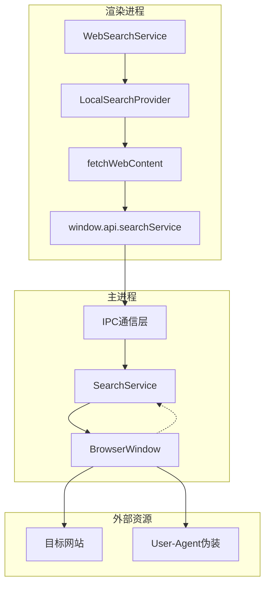
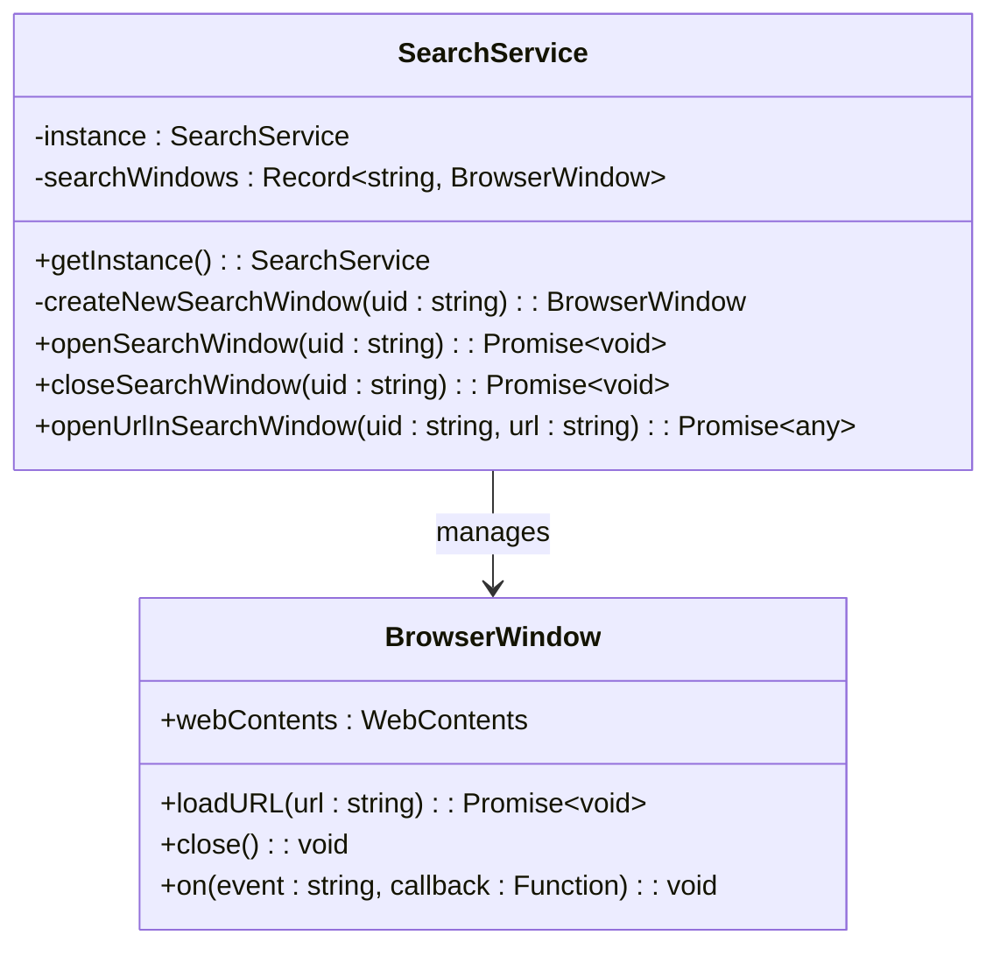
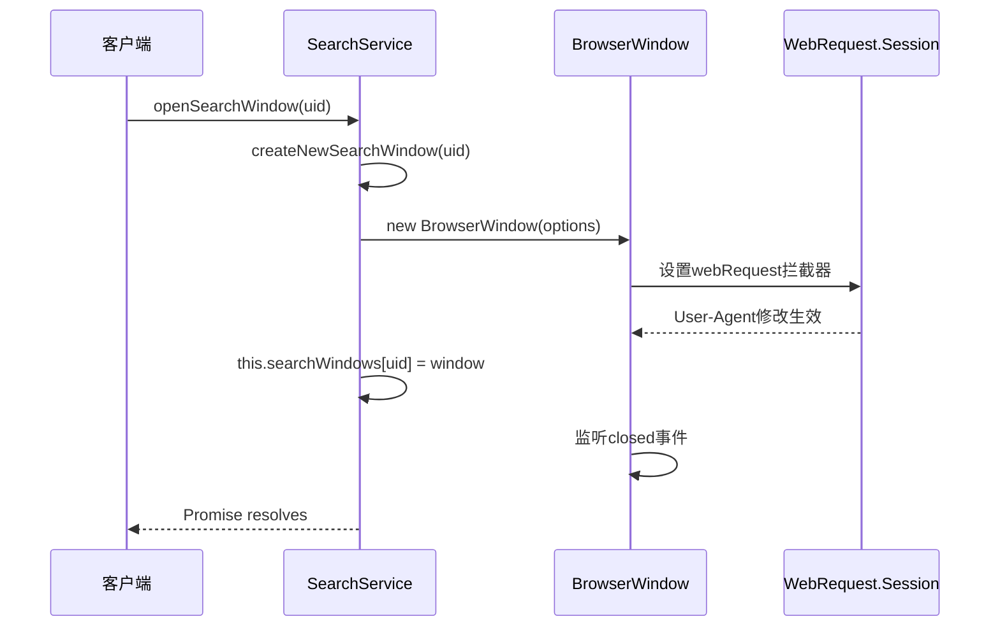
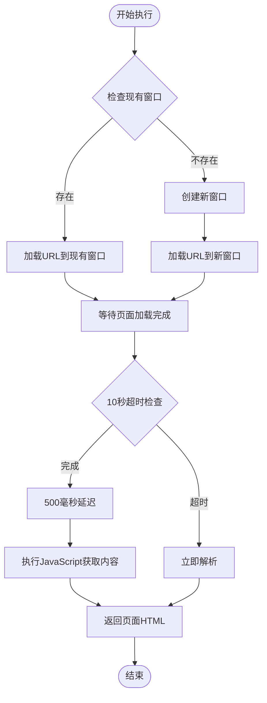
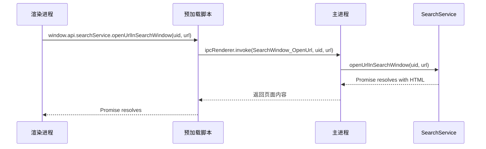
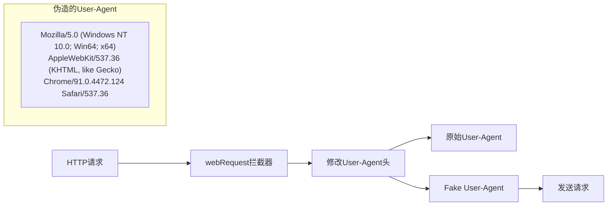
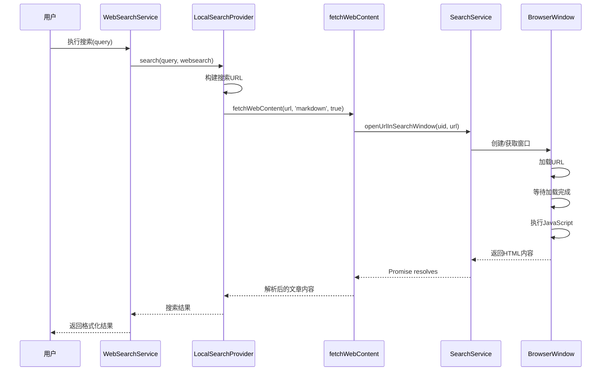
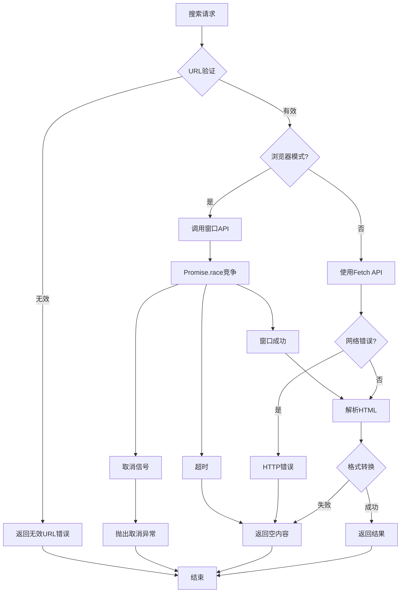

# 搜索执行流程

<cite>
**本文档中引用的文件**
- [SearchService.ts](file://src/main/services/SearchService.ts)
- [ipc.ts](file://src/main/ipc.ts)
- [index.ts](file://src/preload/index.ts)
- [IpcChannel.ts](file://packages/shared/IpcChannel.ts)
- [fetch.ts](file://src/renderer/src/utils/fetch.ts)
- [LocalSearchProvider.ts](file://src/renderer/src/providers/WebSearchProvider/LocalSearchProvider.ts)
- [WebSearchService.ts](file://src/renderer/src/services/WebSearchService.ts)
- [fetch.test.ts](file://src/renderer/src/utils/__tests__/fetch.test.ts)
</cite>

## 目录
1. [简介](#简介)
2. [系统架构概览](#系统架构概览)
3. [SearchService单例服务](#searchservice单例服务)
4. [搜索窗口管理机制](#搜索窗口管理机制)
5. [openUrlInSearchWindow方法详解](#openurlinsearchwindow方法详解)
6. [IPC通信机制](#ipc通信机制)
7. [User-Agent伪造策略](#user-agent伪造策略)
8. [搜索执行流程](#搜索执行流程)
9. [错误处理与超时机制](#错误处理与超时机制)
10. [常见问题与解决方案](#常见问题与解决方案)
11. [总结](#总结)

## 简介

Cherry Studio的搜索执行流程是一个基于Electron框架的复杂系统，通过SearchService单例服务管理独立的搜索窗口，利用浏览器引擎加载网页内容并提取信息。该系统采用主进程-渲染进程分离的架构，通过IPC通信机制实现高效的内容抓取和处理。

## 系统架构概览

**图表来源**
- [SearchService.ts](file://src/main/services/SearchService.ts#L7-L86)
- [WebSearchService.ts](file://src/renderer/src/services/WebSearchService.ts#L145-L427)
- [fetch.ts](file://src/renderer/src/utils/fetch.ts#L49-L149)

## SearchService单例服务

SearchService是整个搜索功能的核心单例服务，负责管理所有搜索窗口的生命周期和操作。

### 单例模式实现

**图表来源**
- [SearchService.ts](file://src/main/services/SearchService.ts#L7-L86)

### 核心特性

1. **单例保证**：通过静态方法确保全局只有一个SearchService实例
2. **窗口池管理**：维护一个搜索窗口的字典，支持按UID快速查找
3. **自动清理**：监听窗口关闭事件，自动清理内存中的引用

**章节来源**
- [SearchService.ts](file://src/main/services/SearchService.ts#L8-L15)

## 搜索窗口管理机制

### 窗口创建流程

**图表来源**
- [SearchService.ts](file://src/main/services/SearchService.ts#L21-L45)

### 窗口配置参数

SearchService创建的每个搜索窗口都经过精心配置：

| 参数 | 值 | 说明 |
|------|-----|------|
| width | 800 | 窗口宽度 |
| height | 600 | 窗口高度 |
| show | false | 后台显示，不显示在界面上 |
| nodeIntegration | true | 允许Node.js集成 |
| contextIsolation | false | 关闭上下文隔离以便JavaScript执行 |
| devTools | is.dev | 开发环境下启用开发者工具 |

**章节来源**
- [SearchService.ts](file://src/main/services/SearchService.ts#L22-L30)

## openUrlInSearchWindow方法详解

openUrlInSearchWindow是搜索功能的核心方法，负责加载指定URL并获取页面内容。

### 方法执行流程

**图表来源**
- [SearchService.ts](file://src/main/services/SearchService.ts#L59-L82)

### 关键技术细节

1. **10秒超时机制**：防止页面加载过久导致资源浪费
2. **500毫秒延迟**：确保JavaScript执行完成后再获取内容
3. **动态窗口管理**：根据需要创建或复用搜索窗口
4. **内容提取**：通过`document.documentElement.outerHTML`获取完整HTML

**章节来源**
- [SearchService.ts](file://src/main/services/SearchService.ts#L60-L82)

## IPC通信机制

### 通信通道定义

系统通过IpcChannel枚举定义了三个主要的搜索相关IPC通道：

| 通道名称 | 功能描述 | 参数 |
|----------|----------|------|
| SearchWindow_Open | 打开搜索窗口 | uid: string |
| SearchWindow_Close | 关闭搜索窗口 | uid: string |
| SearchWindow_OpenUrl | 在搜索窗口中打开URL | uid: string, url: string |

**章节来源**
- [IpcChannel.ts](file://packages/shared/IpcChannel.ts#L264-L268)

### 主进程处理逻辑

**图表来源**
- [ipc.ts](file://src/main/ipc.ts#L840-L849)
- [index.ts](file://src/preload/index.ts#L413-L417)

**章节来源**
- [ipc.ts](file://src/main/ipc.ts#L840-L849)

## User-Agent伪造策略

### 伪造策略实现

SearchService通过webRequest拦截器实现User-Agent伪造：

**图表来源**
- [SearchService.ts](file://src/main/services/SearchService.ts#L32-L39)

### 伪造效果

这种User-Agent伪造策略可以：
1. **绕过反爬虫检测**：模拟真实浏览器行为
2. **提高访问成功率**：减少被目标网站拒绝的风险
3. **保持一致性**：在整个会话期间保持相同的User-Agent

**章节来源**
- [SearchService.ts](file://src/main/services/SearchService.ts#L32-L39)

## 搜索执行流程

### 完整执行链路

**图表来源**
- [WebSearchService.ts](file://src/renderer/src/services/WebSearchService.ts#L145-L427)
- [LocalSearchProvider.ts](file://src/renderer/src/providers/WebSearchProvider/LocalSearchProvider.ts#L27-L68)
- [fetch.ts](file://src/renderer/src/utils/fetch.ts#L49-L149)

### 关键处理步骤

1. **URL构建**：根据搜索提供商的模板生成最终URL
2. **并发处理**：支持多个搜索结果的并发处理
3. **内容解析**：使用Readability库解析HTML为可读内容
4. **格式转换**：支持Markdown、HTML、纯文本等多种输出格式

**章节来源**
- [LocalSearchProvider.ts](file://src/renderer/src/providers/WebSearchProvider/LocalSearchProvider.ts#L42-L68)

## 错误处理与超时机制

### 多层次错误处理

**图表来源**
- [fetch.ts](file://src/renderer/src/utils/fetch.ts#L49-L149)
- [fetch.test.ts](file://src/renderer/src/utils/__tests__/fetch.test.ts#L84-L104)

### 超时与取消机制

1. **浏览器模式超时**：10秒页面加载超时
2. **HTTP请求超时**：30秒标准超时限制
3. **信号取消**：支持AbortController信号取消
4. **优雅降级**：失败时返回默认内容而非崩溃

**章节来源**
- [fetch.ts](file://src/renderer/src/utils/fetch.ts#L62-L73)
- [fetch.ts](file://src/renderer/src/utils/fetch.ts#L81-L83)

## 常见问题与解决方案

### 页面加载超时问题

**问题描述**：某些复杂页面加载时间超过10秒

**解决方案**：
1. **增加超时时间**：在SearchService中调整setTimeout值
2. **优化网络连接**：检查网络状况和代理设置
3. **简化页面**：对于特别复杂的页面，考虑使用更简单的解析方式

### User-Agent被识别问题

**问题描述**：目标网站识别出非真实浏览器

**解决方案**：
1. **定期更新User-Agent**：保持与主流浏览器版本同步
2. **添加随机性**：在User-Agent中加入随机元素
3. **多代理轮换**：使用不同IP地址进行访问

### 内存泄漏问题

**问题描述**：长时间运行后内存占用过高

**解决方案**：
1. **及时关闭窗口**：确保不再使用的窗口被正确关闭
2. **监控窗口数量**：限制同时存在的搜索窗口数量
3. **定期清理缓存**：清理不必要的临时文件和缓存数据

### 网页内容解析失败

**问题描述**：某些特殊格式的网页无法正确解析

**解决方案**：
1. **增强解析器**：改进Readability库的配置
2. **多解析策略**：尝试多种内容提取方法
3. **人工干预**：对于关键内容提供人工审核机制

**章节来源**
- [SearchService.ts](file://src/main/services/SearchService.ts#L71-L78)
- [fetch.ts](file://src/renderer/src/utils/fetch.ts#L119-L130)

## 总结

Cherry Studio的搜索执行流程展现了现代桌面应用中复杂内容抓取系统的最佳实践。通过SearchService单例服务的精心设计，结合Electron框架的强大能力，实现了高效、稳定的网页内容提取功能。

### 核心优势

1. **模块化设计**：清晰的职责分离和接口定义
2. **容错性强**：多层次的错误处理和超时机制
3. **性能优化**：并发处理和智能缓存策略
4. **安全可靠**：User-Agent伪造和合理的资源管理

### 技术亮点

- **单例模式**：确保服务的唯一性和稳定性
- **IPC通信**：主进程与渲染进程的安全交互
- **异步处理**：Promise和async/await的合理运用
- **资源管理**：自动化的窗口生命周期管理

这个搜索执行流程为开发者提供了完整的参考实现，展示了如何在Electron应用中构建高性能的内容抓取系统。