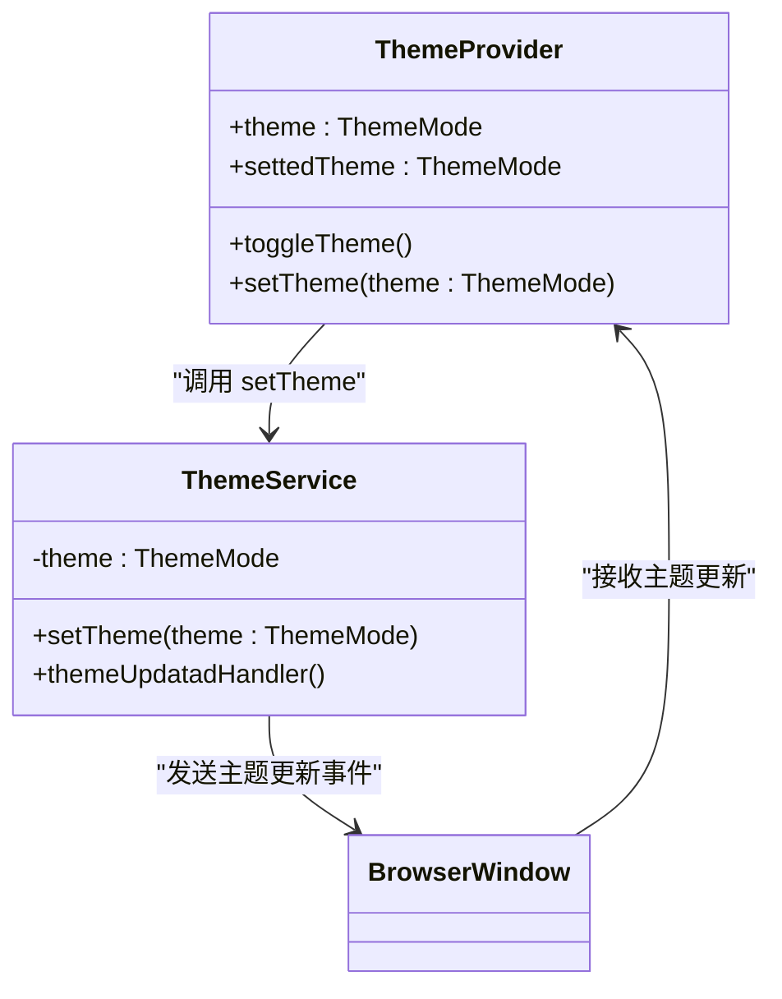
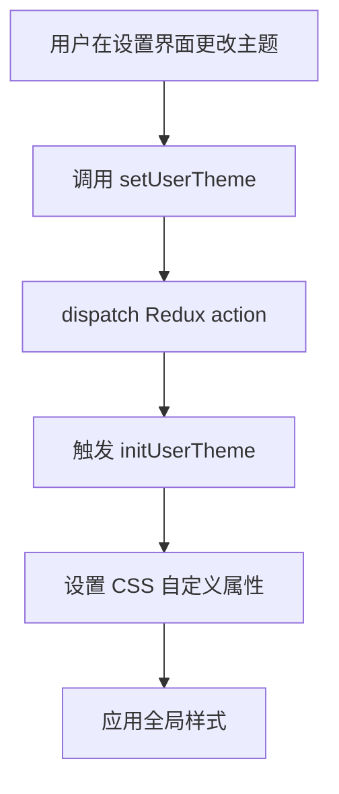
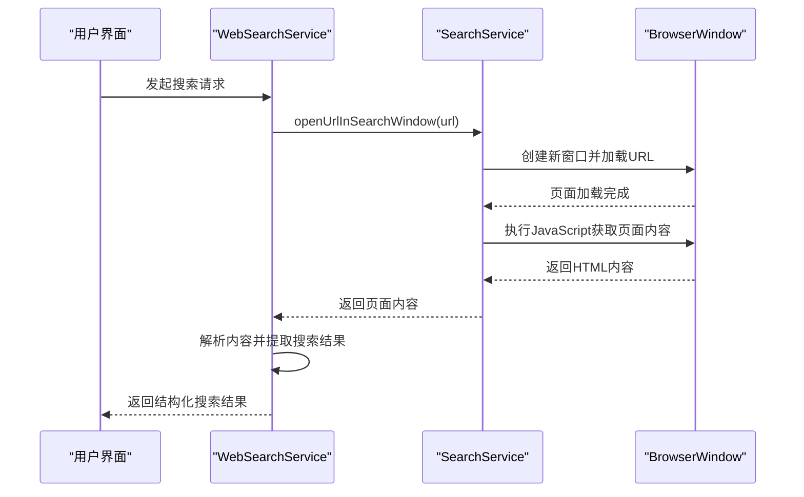
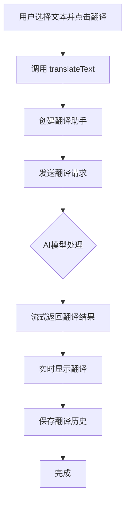
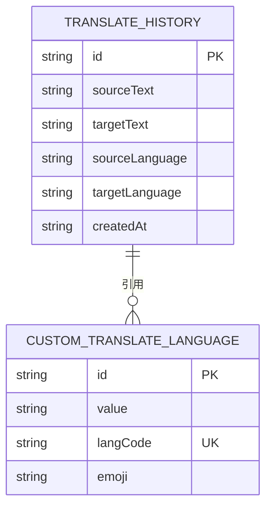
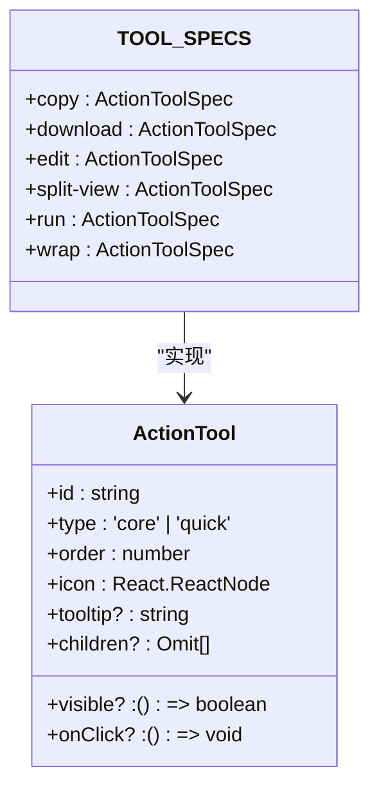
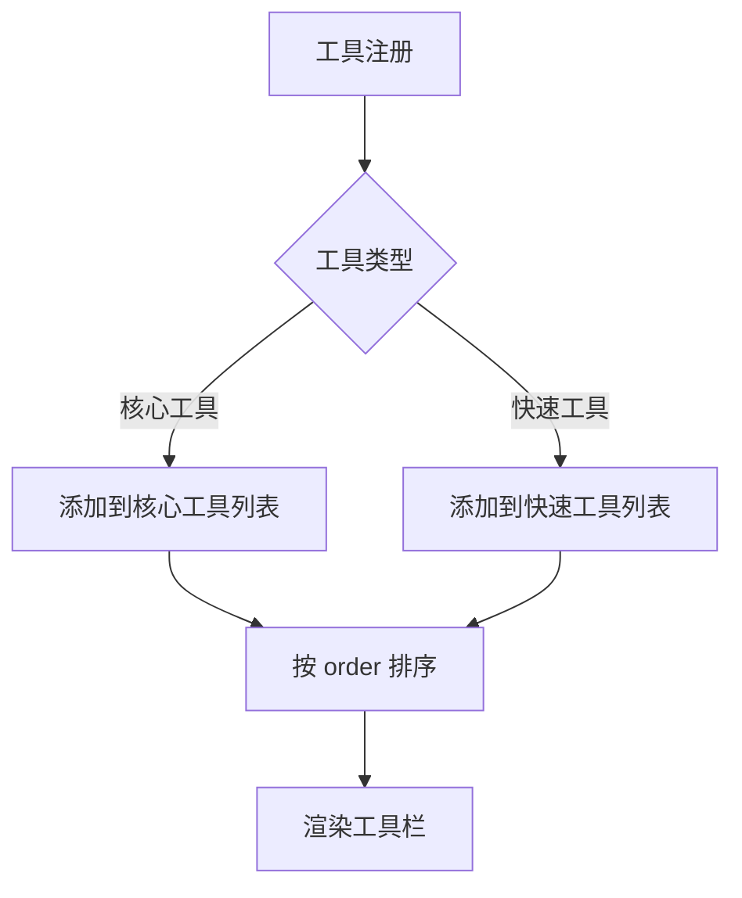
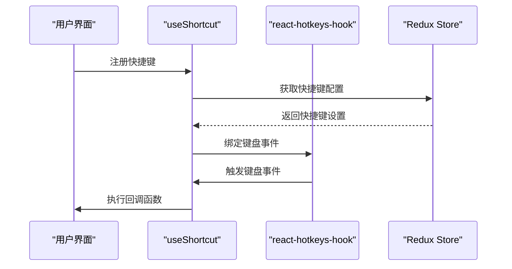
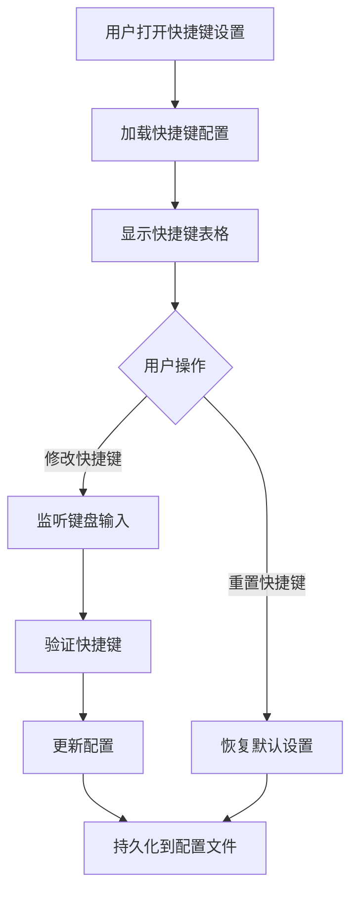

# 实用工具

<cite>
**本文档引用的文件**   
- [ThemeProvider.tsx](file://src/renderer/src/context/ThemeProvider.tsx)
- [useUserTheme.ts](file://src/renderer/src/hooks/useUserTheme.ts)
- [DisplaySettings.tsx](file://src/renderer/src/pages/settings/DisplaySettings/DisplaySettings.tsx)
- [CodeStyleProvider.tsx](file://src/renderer/src/context/CodeStyleProvider.tsx)
- [shiki.ts](file://src/renderer/src/utils/shiki.ts)
- [ThemeService.ts](file://src/main/services/ThemeService.ts)
- [SearchService.ts](file://src/main/services/SearchService.ts)
- [WebSearchService.ts](file://src/renderer/src/services/WebSearchService.ts)
- [LocalSearchProvider.ts](file://src/renderer/src/providers/WebSearchProvider/LocalSearchProvider.ts)
- [TranslateService.ts](file://src/renderer/src/services/TranslateService.ts)
- [AssistantService.ts](file://src/renderer/src/services/AssistantService.ts)
- [constants.ts](file://src/renderer/src/components/ActionTools/constants.ts)
- [types.ts](file://src/renderer/src/components/ActionTools/types.ts)
- [useShortcuts.ts](file://src/renderer/src/hooks/useShortcuts.ts)
- [ShortcutSettings.tsx](file://src/renderer/src/pages/settings/ShortcutSettings.tsx)
- [ShortcutService.ts](file://src/main/services/ShortcutService.ts)
- [ContentSearch.tsx](file://src/renderer/src/components/ContentSearch.tsx)
- [CollapsibleSearchBar.tsx](file://src/renderer/src/components/CollapsibleSearchBar.tsx)
- [WebviewSearch.tsx](file://src/renderer/src/pages/minapps/components/WebviewSearch.tsx)
- [copy.ts](file://src/renderer/src/utils/copy.ts)
- [useMessageOperations.ts](file://src/renderer/src/hooks/useMessageOperations.ts)
- [ExportService.ts](file://src/main/services/ExportService.ts)
- [export.ts](file://src/renderer/src/utils/export.ts)
- [IpcChannel.ts](file://packages/shared/IpcChannel.ts)
</cite>

## 目录
1. [简介](#简介)
2. [主题管理](#主题管理)
3. [全局搜索](#全局搜索)
4. [AI翻译功能](#ai翻译功能)
5. [操作工具栏](#操作工具栏)
6. [快捷键系统](#快捷键系统)
7. [实用工具使用技巧](#实用工具使用技巧)
8. [自定义扩展指南](#自定义扩展指南)
9. [结论](#结论)

## 简介

Cherry Studio提供了一套全面的实用工具功能，旨在提升用户的生产力和使用体验。这些工具涵盖了应用外观的个性化、内容的快速查找、多语言翻译以及高效的交互操作。本文档将详细介绍主题管理、全局搜索、AI翻译和操作工具栏等核心实用功能的实现机制和技术细节，为初学者提供使用技巧，为开发者提供自定义扩展的技术指导。

## 主题管理

Cherry Studio的主题管理功能允许用户自定义应用的外观，支持亮色、暗色和跟随系统三种主题模式，并提供自定义主题颜色和字体的功能。

### 主题模式实现

主题模式的实现分为前端和后端两个部分。在前端，`ThemeProvider.tsx`组件通过React Context提供主题状态和切换功能。它监听用户的设置，并通过`window.matchMedia('(prefers-color-scheme: dark)')`检测系统偏好，初始化实际主题。当用户切换主题时，会通过`window.api.setTheme`调用主进程服务。



**Diagram sources**
- [ThemeProvider.tsx](file://src/renderer/src/context/ThemeProvider.tsx)
- [ThemeService.ts](file://src/main/services/ThemeService.ts)

在后端，`ThemeService.ts`负责管理应用的主题状态。它使用Electron的`nativeTheme`模块来同步应用主题与系统主题，并通过`configManager`持久化用户的主题设置。当系统主题发生变化时，`nativeTheme.on('updated')`事件处理器会通知所有窗口更新其标题栏样式。

### 自定义主题

用户可以通过设置界面自定义主题颜色和字体。`useUserTheme.ts`钩子提供了`initUserTheme`函数，该函数将用户选择的颜色和字体设置为CSS自定义属性，从而实现全局样式覆盖。



**Diagram sources**
- [useUserTheme.ts](file://src/renderer/src/hooks/useUserTheme.ts)
- [DisplaySettings.tsx](file://src/renderer/src/pages/settings/DisplaySettings/DisplaySettings.tsx)

**Section sources**
- [ThemeProvider.tsx](file://src/renderer/src/context/ThemeProvider.tsx#L1-L95)
- [useUserTheme.ts](file://src/renderer/src/hooks/useUserTheme.ts#L1-L35)
- [ThemeService.ts](file://src/main/services/ThemeService.ts#L1-L48)

## 全局搜索

Cherry Studio的全局搜索功能支持在对话历史中快速查找内容，提供高效的搜索体验。

### 搜索服务架构

全局搜索功能由`SearchService`和`WebSearchService`两个核心服务组成。`SearchService`在主进程中运行，负责创建和管理独立的搜索窗口，这些窗口用于加载和解析网页内容。`WebSearchService`在渲染进程中运行，负责协调搜索请求和处理搜索结果。



**Diagram sources**
- [SearchService.ts](file://src/main/services/SearchService.ts)
- [WebSearchService.ts](file://src/renderer/src/services/WebSearchService.ts)
- [LocalSearchProvider.ts](file://src/renderer/src/providers/WebSearchProvider/LocalSearchProvider.ts)

### 搜索实现机制

搜索的实现分为几个关键步骤：
1. **创建搜索窗口**：`SearchService.createNewSearchWindow`创建一个隐藏的`BrowserWindow`实例，用于加载目标网页。
2. **加载网页**：`openUrlInSearchWindow`方法加载指定URL，并等待页面完全加载。
3. **提取内容**：使用`executeJavaScript`执行脚本，获取页面的完整HTML内容。
4. **解析结果**：`LocalSearchProvider`的子类（如`LocalGoogleProvider`）负责解析HTML内容，提取有效的搜索结果链接。
5. **获取详细内容**：并发地从每个结果链接获取详细内容，并转换为Markdown格式。

**Section sources**
- [SearchService.ts](file://src/main/services/SearchService.ts#L1-L85)
- [WebSearchService.ts](file://src/renderer/src/services/WebSearchService.ts#L95-L146)
- [LocalSearchProvider.ts](file://src/renderer/src/providers/WebSearchProvider/LocalSearchProvider.ts#L42-L102)

## AI翻译功能

Cherry Studio的AI翻译功能利用AI模型实现高质量的文本翻译，支持多种语言和自定义语言。

### 翻译工作流程

AI翻译功能的工作流程如下：
1. **初始化翻译助手**：`getDefaultTranslateAssistant`函数创建一个专门用于翻译的助手实例，配置适当的提示词和模型。
2. **调用翻译服务**：`translateText`函数调用`fetchChatCompletion`，将待翻译文本作为提示发送给AI模型。
3. **流式处理结果**：通过`onChunkReceived`回调函数实时接收和处理翻译结果，提供流畅的用户体验。
4. **保存历史记录**：翻译完成后，将原文和译文保存到`translate_history`数据库表中。



**Diagram sources**
- [TranslateService.ts](file://src/renderer/src/services/TranslateService.ts)
- [AssistantService.ts](file://src/renderer/src/services/AssistantService.ts)

### 翻译数据模型

翻译功能使用了专门的数据模型来管理翻译历史和自定义语言。`TranslateHistory`接口定义了翻译历史记录的结构，包括原文、译文、源语言和目标语言代码。`CustomTranslateLanguage`接口用于存储用户自定义的语言。



**Diagram sources**
- [TranslateService.ts](file://src/renderer/src/services/TranslateService.ts#L1-L245)

**Section sources**
- [TranslateService.ts](file://src/renderer/src/services/TranslateService.ts#L1-L245)
- [AssistantService.ts](file://src/renderer/src/services/AssistantService.ts#L44-L85)

## 操作工具栏

操作工具栏是Cherry Studio中用于快速执行常见操作的核心UI组件，支持核心工具和快速工具的分类管理。

### 工具架构设计

操作工具栏的架构设计基于`ActionTool`接口和`TOOL_SPECS`常量。`ActionTool`接口定义了工具的基本属性，包括ID、类型、显示顺序、图标、提示文本和点击事件。`TOOL_SPECS`常量定义了所有可用工具的规格。



**Diagram sources**
- [types.ts](file://src/renderer/src/components/ActionTools/types.ts)
- [constants.ts](file://src/renderer/src/components/ActionTools/constants.ts)

### 核心与快速工具

操作工具栏将工具分为两类：
- **核心工具**：包括复制、下载、编辑等基本操作，通常位于工具栏的显眼位置。
- **快速工具**：包括分屏、运行、换行等辅助操作，提供更高效的交互方式。

工具的显示顺序由`order`属性控制，数值越小越靠右显示。工具的可见性可以通过`visible`函数动态控制。



**Diagram sources**
- [constants.ts](file://src/renderer/src/components/ActionTools/constants.ts#L1-L76)
- [types.ts](file://src/renderer/src/components/ActionTools/types.ts#L1-L35)

**Section sources**
- [constants.ts](file://src/renderer/src/components/ActionTools/constants.ts#L1-L76)
- [types.ts](file://src/renderer/src/components/ActionTools/types.ts#L1-L35)

## 快捷键系统

Cherry Studio的快捷键系统允许用户通过键盘快捷方式快速执行各种操作，提高工作效率。

### 快捷键绑定

快捷键的绑定通过`useShortcut`钩子实现。该钩子使用`react-hotkeys-hook`库来监听键盘事件，并根据用户的设置动态启用或禁用快捷键。



**Diagram sources**
- [useShortcuts.ts](file://src/renderer/src/hooks/useShortcuts.ts)
- [ShortcutSettings.tsx](file://src/renderer/src/pages/settings/ShortcutSettings.tsx)

### 快捷键管理

用户可以在设置界面管理所有快捷键。`ShortcutSettings.tsx`组件显示一个表格，列出所有可用的快捷键及其当前绑定。用户可以点击快捷键输入框来重新绑定，或使用重置按钮恢复默认设置。



**Diagram sources**
- [ShortcutSettings.tsx](file://src/renderer/src/pages/settings/ShortcutSettings.tsx)
- [ShortcutService.ts](file://src/main/services/ShortcutService.ts)

**Section sources**
- [useShortcuts.ts](file://src/renderer/src/hooks/useShortcuts.ts#L1-L93)
- [ShortcutSettings.tsx](file://src/renderer/src/pages/settings/ShortcutSettings.tsx#L1-L452)
- [ShortcutService.ts](file://src/main/services/ShortcutService.ts#L158-L206)

## 实用工具使用技巧

### 主题管理技巧
- **暗色模式**：在夜间或低光环境下使用暗色模式可以减少眼睛疲劳。
- **自定义颜色**：选择与个人品牌或偏好相符的主题颜色，提升使用体验。
- **字体选择**：选择清晰易读的字体，特别是在长时间阅读时。

### 全局搜索技巧
- **精确搜索**：使用引号包围短语进行精确匹配搜索。
- **排除关键词**：使用减号排除不想要的结果，例如`搜索词 -排除词`。
- **语言过滤**：在搜索时指定语言，获取更相关的结果。

### AI翻译技巧
- **上下文翻译**：选择包含上下文的文本进行翻译，以获得更准确的结果。
- **自定义语言**：为不常见的语言或方言创建自定义翻译语言。
- **历史记录**：利用翻译历史记录快速查找之前的翻译结果。

### 操作工具栏技巧
- **快捷键**：熟练掌握核心工具的快捷键，提高操作效率。
- **工具组合**：结合使用多个工具，例如先复制再粘贴，或先下载再编辑。
- **自定义布局**：根据个人工作流程调整工具栏的布局和可见性。

## 自定义扩展指南

### 扩展操作工具栏
开发者可以通过修改`TOOL_SPECS`常量来添加新的操作工具。新工具需要定义ID、类型、顺序、图标和点击事件。

```typescript
// 示例：添加一个新的"分享"工具
TOOL_SPECS.share = {
  id: 'share',
  type: 'quick',
  order: 50,
  icon: <ShareIcon />,
  tooltip: '分享内容',
  onClick: () => {
    // 实现分享逻辑
  }
};
```

### 扩展快捷键系统
要添加新的快捷键，需要在`ShortcutService`中注册新的快捷键处理程序，并在Redux store中添加相应的配置。

```typescript
// 在主进程中注册快捷键
const handler = () => {
  // 执行快捷键操作
};
globalShortcut.register('CommandOrControl+Shift+S', handler);
```

### 扩展翻译功能
开发者可以通过实现新的`WebSearchProvider`子类来支持更多的翻译服务。新服务需要实现`parseValidUrls`方法来解析搜索结果。

```typescript
class CustomTranslateProvider extends LocalSearchProvider {
  protected parseValidUrls(htmlContent: string): SearchItem[] {
    // 实现自定义解析逻辑
    return results;
  }
}
```

## 结论

Cherry Studio的实用工具功能通过精心设计的架构和实现，为用户提供了强大的个性化和生产力工具。主题管理功能允许用户根据个人喜好定制应用外观，全局搜索功能提供了高效的内容查找能力，AI翻译功能利用先进的AI技术实现了高质量的多语言支持，而操作工具栏和快捷键系统则极大地提升了用户的交互效率。通过理解这些功能的实现细节，用户可以更好地利用这些工具，开发者也可以在此基础上进行自定义扩展，满足更复杂的需求。