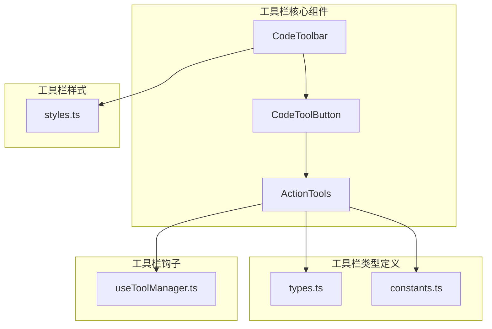
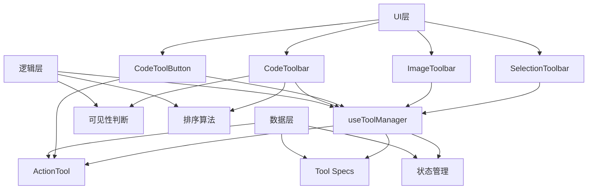
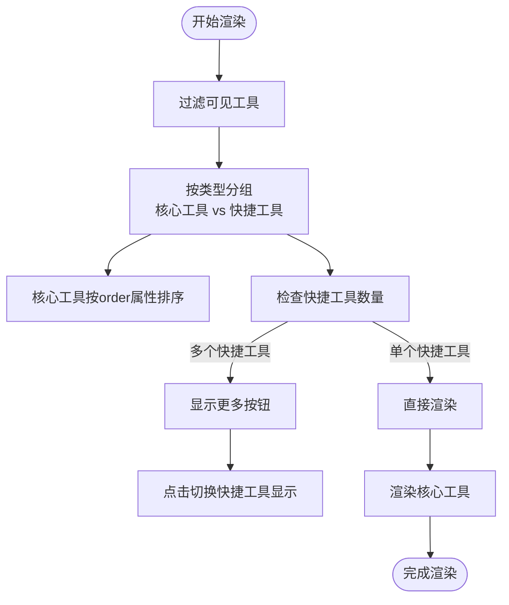
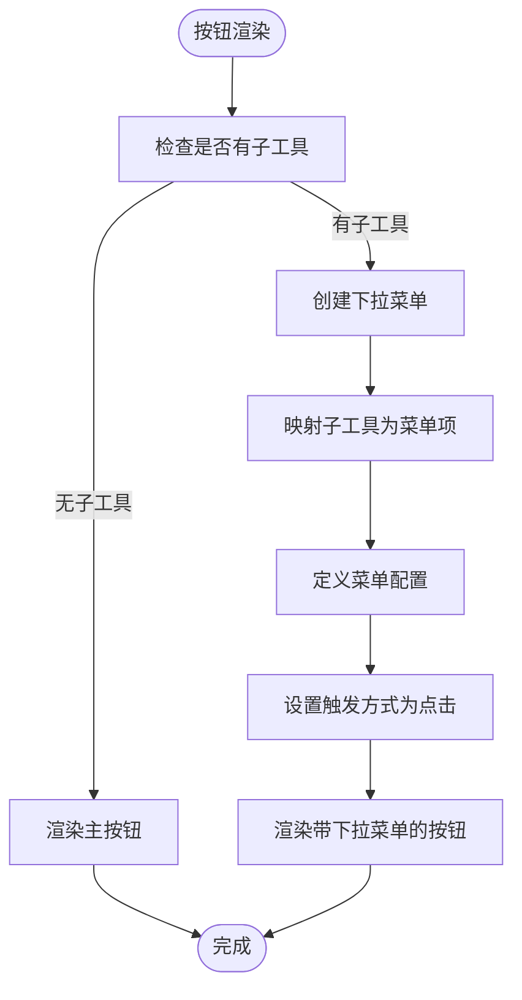
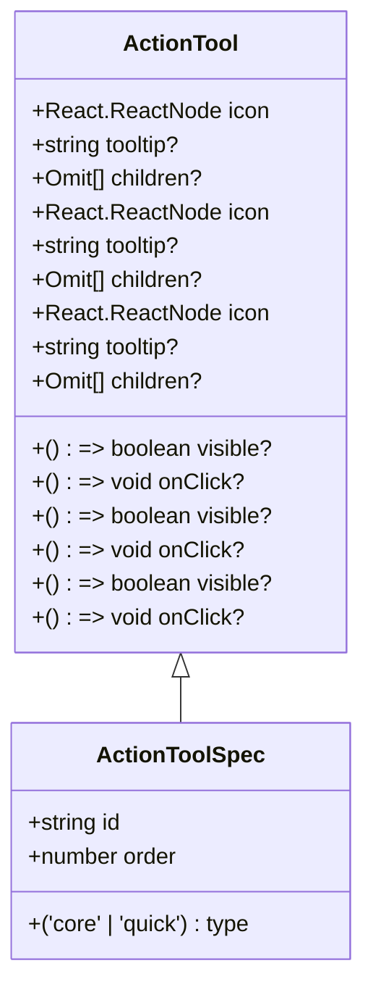
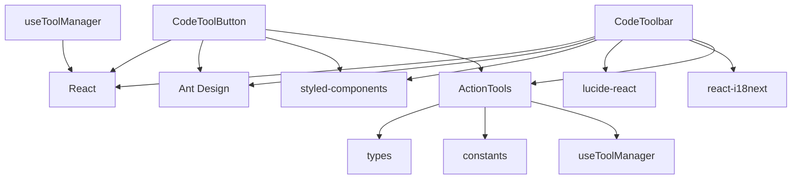

# 工具栏渲染机制

<cite>
**本文档引用的文件**  
- [toolbar.tsx](file://src/renderer/src/components/CodeToolbar/toolbar.tsx)
- [button.tsx](file://src/renderer/src/components/CodeToolbar/button.tsx)
- [styles.ts](file://src/renderer/src/components/CodeToolbar/styles.ts)
- [types.ts](file://src/renderer/src/components/ActionTools/types.ts)
- [constants.ts](file://src/renderer/src/components/ActionTools/constants.ts)
- [useToolManager.ts](file://src/renderer/src/components/ActionTools/hooks/useToolManager.ts)
- [ImageToolbar.tsx](file://src/renderer/src/components/Preview/ImageToolbar.tsx)
- [SelectionToolbar.tsx](file://src/renderer/src/windows/selection/toolbar/SelectionToolbar.tsx)
</cite>

## 目录
1. [简介](#简介)
2. [项目结构](#项目结构)
3. [核心组件](#核心组件)
4. [架构概述](#架构概述)
5. [详细组件分析](#详细组件分析)
6. [依赖分析](#依赖分析)
7. [性能考虑](#性能考虑)
8. [故障排除指南](#故障排除指南)
9. [结论](#结论)

## 简介
本文档详细说明了Cherry Studio中操作工具栏的渲染机制。文档涵盖了工具栏的UI渲染流程，包括工具按钮的排序算法、可见性判断逻辑和启用状态控制。同时解释了下拉菜单工具的嵌套渲染实现，描述了工具按钮的视觉样式、交互反馈和无障碍访问支持，并提供了工具栏在不同上下文中的渲染差异示例。

## 项目结构
工具栏相关组件主要分布在`src/renderer/src/components/`目录下，特别是`CodeToolbar`和`ActionTools`两个核心模块。这些组件采用React函数式组件和Hooks模式构建，通过TypeScript定义了严格的类型系统。

**图源**  
- [toolbar.tsx](file://src/renderer/src/components/CodeToolbar/toolbar.tsx)
- [button.tsx](file://src/renderer/src/components/CodeToolbar/button.tsx)
- [types.ts](file://src/renderer/src/components/ActionTools/types.ts)
- [constants.ts](file://src/renderer/src/components/ActionTools/constants.ts)
- [styles.ts](file://src/renderer/src/components/CodeToolbar/styles.ts)
- [useToolManager.ts](file://src/renderer/src/components/ActionTools/hooks/useToolManager.ts)

**节源**  
- [toolbar.tsx](file://src/renderer/src/components/CodeToolbar/toolbar.tsx)
- [button.tsx](file://src/renderer/src/components/CodeToolbar/button.tsx)

## 核心组件
工具栏系统由多个核心组件构成，包括`CodeToolbar`、`CodeToolButton`和`ActionTools`。这些组件通过React的函数式编程模式和Hooks机制协同工作，实现了灵活的工具栏渲染功能。

**节源**  
- [toolbar.tsx](file://src/renderer/src/components/CodeToolbar/toolbar.tsx)
- [button.tsx](file://src/renderer/src/components/CodeToolbar/button.tsx)
- [types.ts](file://src/renderer/src/components/ActionTools/types.ts)

## 架构概述
工具栏渲染系统采用分层架构设计，分为UI层、逻辑层和数据层。UI层负责工具栏的视觉呈现，逻辑层处理工具的排序、可见性和交互逻辑，数据层管理工具的元数据和状态。

**图源**  
- [toolbar.tsx](file://src/renderer/src/components/CodeToolbar/toolbar.tsx)
- [button.tsx](file://src/renderer/src/components/CodeToolbar/button.tsx)
- [useToolManager.ts](file://src/renderer/src/components/ActionTools/hooks/useToolManager.ts)
- [types.ts](file://src/renderer/src/components/ActionTools/types.ts)
- [constants.ts](file://src/renderer/src/components/ActionTools/constants.ts)

## 详细组件分析

### CodeToolbar 分析
`CodeToolbar`组件是代码块工具栏的主要实现，负责管理工具的分组、排序和可见性。

#### 工具分组与排序

**图源**  
- [toolbar.tsx](file://src/renderer/src/components/CodeToolbar/toolbar.tsx#L16-L53)

**节源**  
- [toolbar.tsx](file://src/renderer/src/components/CodeToolbar/toolbar.tsx#L1-L74)

### CodeToolButton 分析
`CodeToolButton`组件是工具栏按钮的基础单元，负责处理单个工具的渲染和交互。

#### 下拉菜单嵌套渲染

**图源**  
- [button.tsx](file://src/renderer/src/components/CodeToolbar/button.tsx#L21-L35)

**节源**  
- [button.tsx](file://src/renderer/src/components/CodeToolbar/button.tsx#L1-L42)

### 工具栏类型与接口分析
工具栏系统通过TypeScript接口定义了严格的类型系统，确保了组件间的类型安全。

**图源**  
- [types.ts](file://src/renderer/src/components/ActionTools/types.ts#L4-L27)

**节源**  
- [types.ts](file://src/renderer/src/components/ActionTools/types.ts#L1-L35)

## 依赖分析
工具栏系统依赖于多个外部库和内部模块，形成了复杂的依赖关系网络。

**图源**  
- [toolbar.tsx](file://src/renderer/src/components/CodeToolbar/toolbar.tsx)
- [button.tsx](file://src/renderer/src/components/CodeToolbar/button.tsx)
- [useToolManager.ts](file://src/renderer/src/components/ActionTools/hooks/useToolManager.ts)
- [types.ts](file://src/renderer/src/components/ActionTools/types.ts)
- [constants.ts](file://src/renderer/src/components/ActionTools/constants.ts)

**节源**  
- [toolbar.tsx](file://src/renderer/src/components/CodeToolbar/toolbar.tsx)
- [button.tsx](file://src/renderer/src/components/CodeToolbar/button.tsx)
- [useToolManager.ts](file://src/renderer/src/components/ActionTools/hooks/useToolManager.ts)

## 性能考虑
工具栏渲染系统在性能方面进行了多项优化，包括使用`useMemo`和`useCallback`进行记忆化，以及使用`memo`进行组件记忆化，避免不必要的重新渲染。

**节源**  
- [toolbar.tsx](file://src/renderer/src/components/CodeToolbar/toolbar.tsx#L24-L30)
- [button.tsx](file://src/renderer/src/components/CodeToolbar/button.tsx#L12-L19)

## 故障排除指南
当工具栏渲染出现问题时，可以检查以下几个常见问题：

1. **工具不显示**：检查`visible`函数的返回值是否正确
2. **排序错误**：确认`order`属性值是否符合预期
3. **下拉菜单不工作**：检查`children`属性是否正确配置
4. **样式问题**：验证CSS变量是否正确设置

**节源**  
- [toolbar.tsx](file://src/renderer/src/components/CodeToolbar/toolbar.tsx#L17-L18)
- [button.tsx](file://src/renderer/src/components/CodeToolbar/button.tsx#L21-L35)

## 结论
Cherry Studio的工具栏渲染机制采用现代化的React函数式组件和Hooks模式，通过清晰的分层架构和类型系统，实现了灵活、可扩展的工具栏功能。系统支持工具的动态排序、条件显示和嵌套菜单，为用户提供了一致且直观的交互体验。