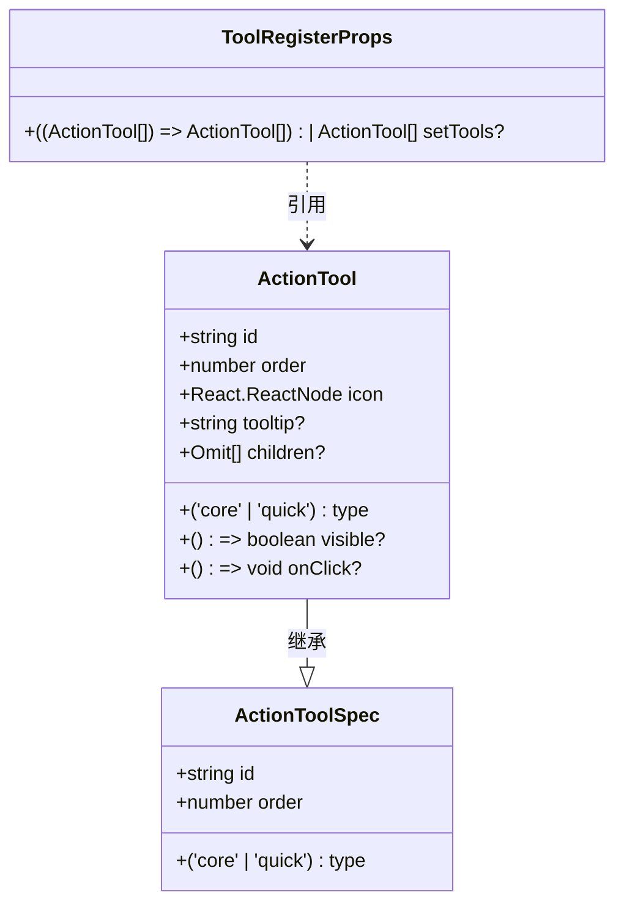
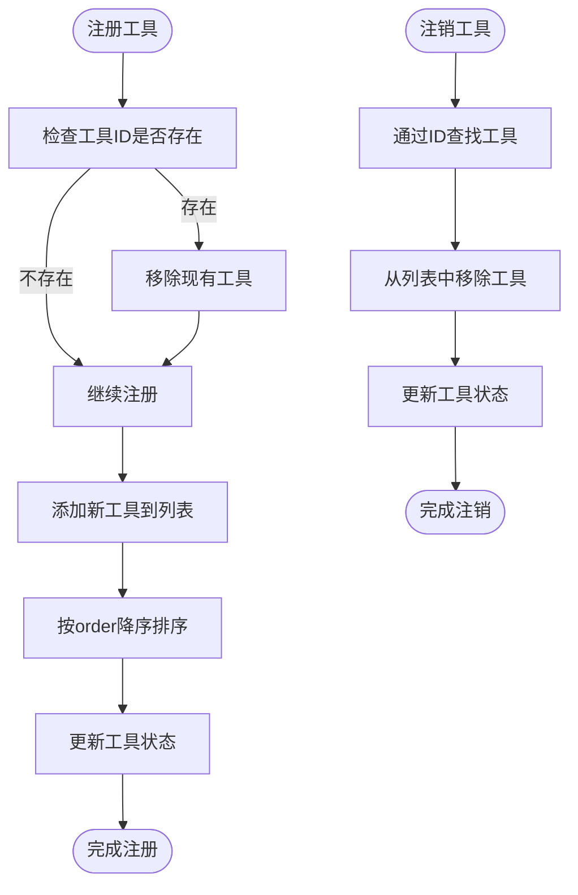
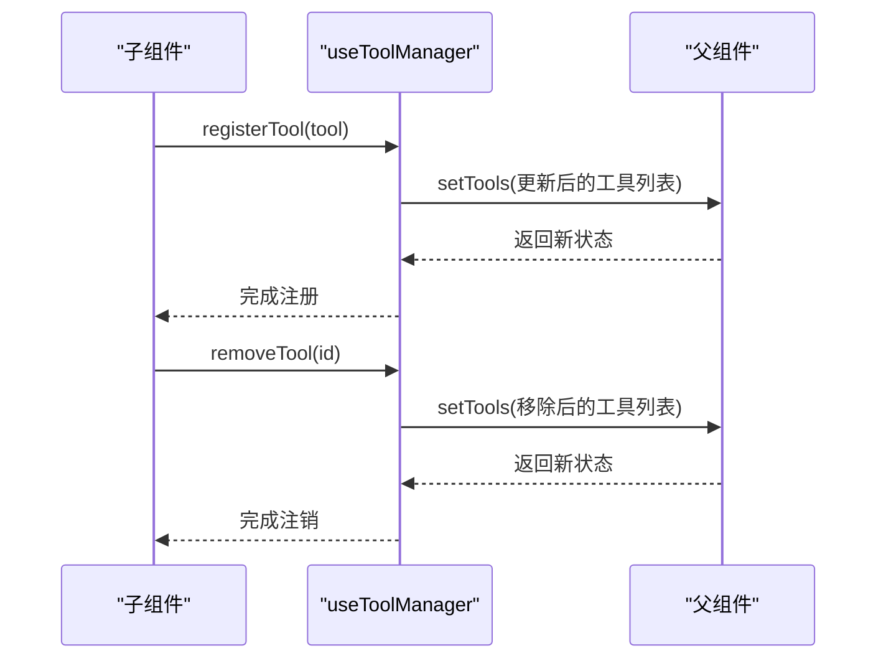
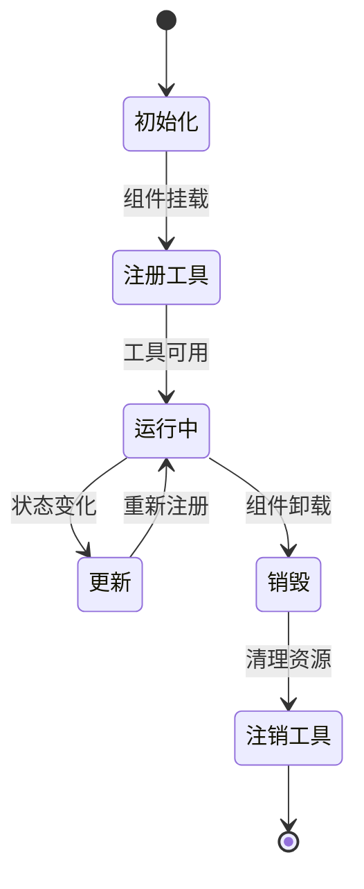
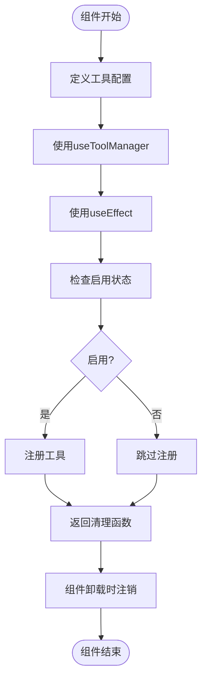
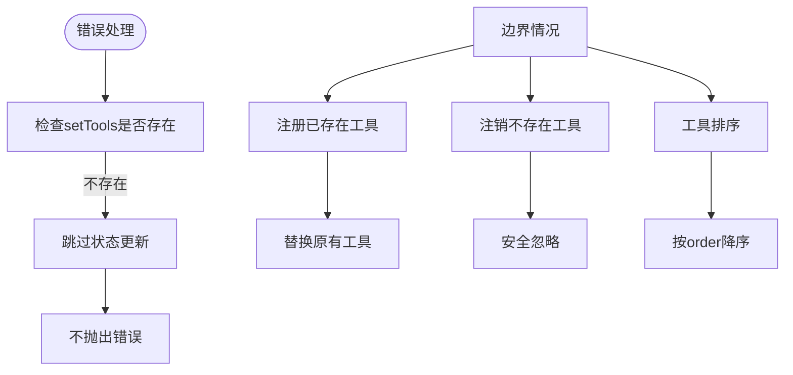

# 工具注册与管理

<cite>
**本文档引用的文件**  
- [useToolManager.ts](file://src/renderer/src/components/ActionTools/hooks/useToolManager.ts)
- [types.ts](file://src/renderer/src/components/ActionTools/types.ts)
- [constants.ts](file://src/renderer/src/components/ActionTools/constants.ts)
- [useWrapTool.tsx](file://src/renderer/src/components/CodeToolbar/hooks/useWrapTool.tsx)
- [useRunTool.tsx](file://src/renderer/src/components/CodeToolbar/hooks/useRunTool.tsx)
- [useToolManager.test.ts](file://src/renderer/src/components/ActionTools/__tests__/useToolManager.test.ts)
</cite>

## 目录
1. [简介](#简介)
2. [核心组件](#核心组件)
3. [工具注册表与状态管理](#工具注册表与状态管理)
4. [注册与注销机制](#注册与注销机制)
5. [工具状态同步](#工具状态同步)
6. [工具生命周期管理](#工具生命周期管理)
7. [自定义工具注册示例](#自定义工具注册示例)
8. [错误处理与边界情况](#错误处理与边界情况)

## 简介
本文档详细解析了操作工具栏的注册与管理机制，重点分析了`useToolManager`自定义Hook的实现原理。该机制为应用程序提供了动态注册、更新和注销操作工具的能力，确保了工具栏的灵活性和可扩展性。

## 核心组件

`useToolManager`是工具注册与管理的核心Hook，它提供了注册和注销工具的接口。该Hook通过`setTools`状态更新函数来管理工具列表，实现了工具的动态添加和移除。

**组件来源**
- [useToolManager.ts](file://src/renderer/src/components/ActionTools/hooks/useToolManager.ts#L1-L26)

## 工具注册表与状态管理

工具注册表通过React的状态管理机制实现，使用`ActionTool`接口定义工具的结构。每个工具包含ID、类型、顺序、图标、提示文本、显示条件和点击事件等属性。

**图示来源**
- [types.ts](file://src/renderer/src/components/ActionTools/types.ts#L1-L34)

## 注册与注销机制

### registerTool方法
`registerTool`方法用于注册新工具或更新现有工具。当注册同ID的工具时，会替换原有工具。工具注册后会根据`order`属性进行降序排序，确保高优先级的工具显示在前面。

### unregisterTool方法
`unregisterTool`方法通过工具ID从工具列表中移除指定工具，保持工具列表的整洁。

**图示来源**
- [useToolManager.ts](file://src/renderer/src/components/ActionTools/hooks/useToolManager.ts#L7-L23)

**组件来源**
- [useToolManager.ts](file://src/renderer/src/components/ActionTools/hooks/useToolManager.ts#L5-L26)

## 工具状态同步

工具状态通过父组件的`setTools`函数实现同步。子组件通过`useToolManager`Hook获取注册和注销工具的能力，当工具状态发生变化时，会触发父组件的状态更新，从而实现组件间的工具状态同步。

**图示来源**
- [useToolManager.ts](file://src/renderer/src/components/ActionTools/hooks/useToolManager.ts#L5-L26)
- [useWrapTool.tsx](file://src/renderer/src/components/CodeToolbar/hooks/useWrapTool.tsx#L15-L36)

## 工具生命周期管理

工具的生命周期包括初始化、更新和销毁三个阶段。通过`useEffect` Hook管理工具的生命周期，在组件挂载时注册工具，在组件卸载时自动注销工具。

**组件来源**
- [useWrapTool.tsx](file://src/renderer/src/components/CodeToolbar/hooks/useWrapTool.tsx#L15-L36)
- [useRunTool.tsx](file://src/renderer/src/components/CodeToolbar/hooks/useRunTool.tsx#L15-L31)

## 自定义工具注册示例

以下是在组件中注册自定义工具的完整示例：

**组件来源**
- [useWrapTool.tsx](file://src/renderer/src/components/CodeToolbar/hooks/useWrapTool.tsx#L15-L36)
- [useRunTool.tsx](file://src/renderer/src/components/CodeToolbar/hooks/useRunTool.tsx#L15-L31)

## 错误处理与边界情况

### 错误处理
- 当`setTools`未提供时，`registerTool`和`removeTool`方法会安全地跳过状态更新，避免抛出错误。
- 工具ID的唯一性确保了工具的正确替换和移除。

### 边界情况
- 注册已存在的工具：同ID的工具会被新工具替换。
- 注销不存在的工具：操作被安全忽略，不影响其他工具。
- 工具排序：按`order`属性降序排列，确保正确的显示顺序。

**组件来源**
- [useToolManager.test.ts](file://src/renderer/src/components/ActionTools/__tests__/useToolManager.test.ts#L102-L110)
- [useToolManager.test.ts](file://src/renderer/src/components/ActionTools/__tests__/useToolManager.test.ts#L169-L178)