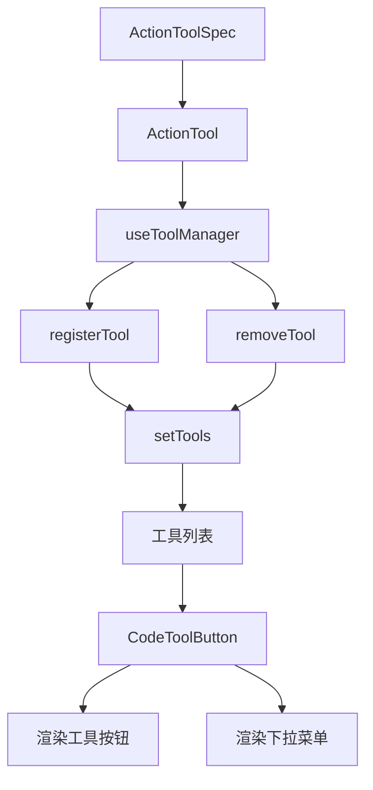
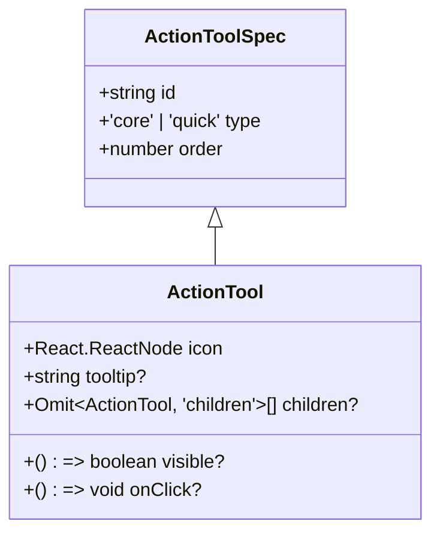
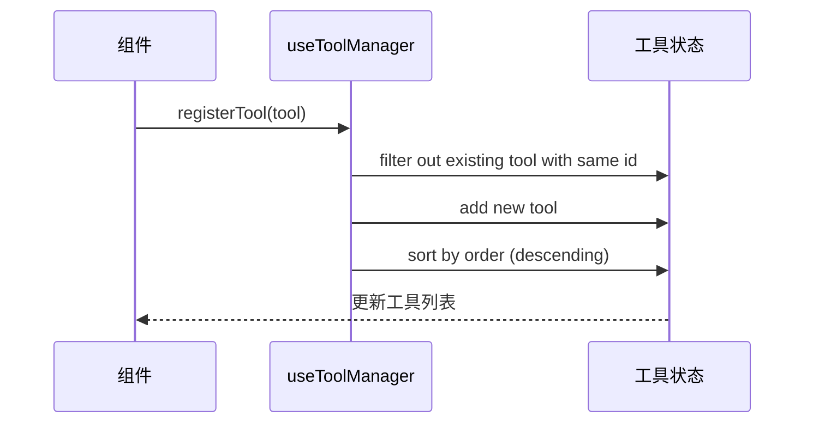
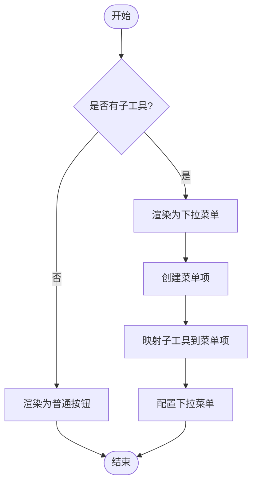
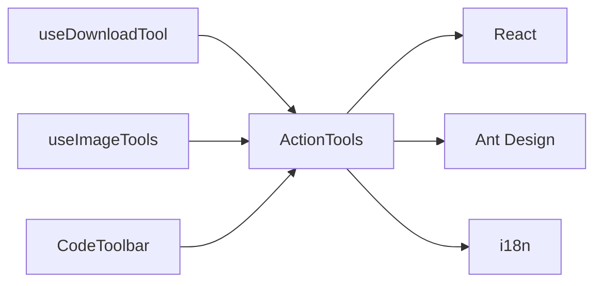

# 操作工具栏

<cite>
**本文档引用的文件**  
- [types.ts](file://src/renderer/src/components/ActionTools/types.ts)
- [constants.ts](file://src/renderer/src/components/ActionTools/constants.ts)
- [useToolManager.ts](file://src/renderer/src/components/ActionTools/hooks/useToolManager.ts)
- [button.tsx](file://src/renderer/src/components/CodeToolbar/button.tsx)
- [useDownloadTool.test.tsx](file://src/renderer/src/components/CodeToolbar/__tests__/useDownloadTool.test.tsx)
- [useImageTools.tsx](file://src/renderer/src/components/ActionTools/hooks/useImageTools.tsx)
</cite>

## 目录
1. [简介](#简介)
2. [核心组件](#核心组件)
3. [架构概述](#架构概述)
4. [详细组件分析](#详细组件分析)
5. [依赖分析](#依赖分析)
6. [性能考虑](#性能考虑)
7. [故障排除指南](#故障排除指南)
8. [结论](#结论)

## 简介
本文档详细阐述了Cherry Studio中操作工具栏（ActionTools）的功能实现。该功能允许用户通过可扩展的工具系统与界面元素进行交互，支持核心工具和快速工具的分类管理。文档将深入分析工具规格（ActionToolSpec）和工具定义（ActionTool）的接口设计，工具注册机制，工具栏的渲染逻辑，以及开发者如何通过useToolManager钩子注册自定义工具。

## 核心组件
操作工具栏的核心组件包括ActionTool接口定义、工具规格（ActionToolSpec）、工具管理器（useToolManager）以及工具按钮的渲染逻辑。这些组件共同构成了一个灵活且可扩展的工具系统，支持工具的动态注册、排序和条件显示。

**本节来源**
- [types.ts](file://src/renderer/src/components/ActionTools/types.ts#L1-L34)
- [constants.ts](file://src/renderer/src/components/ActionTools/constants.ts#L1-L76)
- [useToolManager.ts](file://src/renderer/src/components/ActionTools/hooks/useToolManager.ts#L1-L26)

## 架构概述
操作工具栏的架构基于React组件和自定义Hook的组合。核心是ActionTool接口，它定义了工具的所有属性，包括ID、类型、顺序、图标、提示文本、可见性条件、点击事件和子工具。工具管理器useToolManager负责注册和管理工具列表，而工具按钮组件则负责渲染单个工具或带有下拉菜单的工具组。

**图表来源**
- [types.ts](file://src/renderer/src/components/ActionTools/types.ts#L1-L34)
- [useToolManager.ts](file://src/renderer/src/components/ActionTools/hooks/useToolManager.ts#L1-L26)
- [button.tsx](file://src/renderer/src/components/CodeToolbar/button.tsx#L1-L41)

## 详细组件分析

### ActionTool 接口分析
ActionTool接口是操作工具栏的核心数据结构，它扩展了ActionToolSpec并添加了具体的UI和行为属性。

**图表来源**
- [types.ts](file://src/renderer/src/components/ActionTools/types.ts#L4-L27)

### 工具管理器分析
useToolManager Hook提供了注册和移除工具的功能。它通过setTools函数更新工具列表，并在注册时自动按order属性降序排序。

**图表来源**
- [useToolManager.ts](file://src/renderer/src/components/ActionTools/hooks/useToolManager.ts#L5-L25)

### 工具按钮渲染分析
CodeToolButton组件根据工具是否有子工具来决定渲染为普通按钮还是下拉菜单。

**图表来源**
- [button.tsx](file://src/renderer/src/components/CodeToolbar/button.tsx#L1-L41)

## 依赖分析
操作工具栏功能依赖于多个核心模块，包括React状态管理、Ant Design的Tooltip和Dropdown组件，以及i18n国际化支持。工具管理器依赖于父组件提供的setTools函数来更新状态，而具体的工具实现（如下载工具）则依赖于工具管理器来注册自身。

**图表来源**
- [button.tsx](file://src/renderer/src/components/CodeToolbar/button.tsx#L1-L41)
- [useDownloadTool.test.tsx](file://src/renderer/src/components/CodeToolbar/__tests__/useDownloadTool.test.tsx#L1-L348)
- [useImageTools.tsx](file://src/renderer/src/components/ActionTools/hooks/useImageTools.tsx#L1-L294)

## 性能考虑
操作工具栏的设计考虑了性能优化。工具列表在每次注册时都会重新排序，但由于工具数量通常较少，排序开销可以忽略不计。使用React的useCallback和useMemo Hook可以避免不必要的重新渲染。此外，工具的可见性函数（visible）只在需要时执行，减少了不必要的计算。

## 故障排除指南
当操作工具栏功能出现问题时，可以按照以下步骤进行排查：
1. 检查工具是否正确注册到useToolManager
2. 验证工具的order属性是否正确设置
3. 确认工具的visible函数返回正确的布尔值
4. 检查onClick事件处理器是否正确绑定
5. 确保父组件提供了有效的setTools函数

**本节来源**
- [useToolManager.test.ts](file://src/renderer/src/components/ActionTools/__tests__/useToolManager.test.ts#L1-L216)
- [useDownloadTool.test.tsx](file://src/renderer/src/components/CodeToolbar/__tests__/useDownloadTool.test.tsx#L1-L348)

## 结论
Cherry Studio的操作工具栏功能通过清晰的接口设计和灵活的注册机制，为开发者提供了一个强大的工具扩展系统。通过理解ActionTool接口、useToolManager Hook和工具渲染逻辑，开发者可以轻松地创建和集成自定义工具，从而增强应用程序的功能和用户体验。