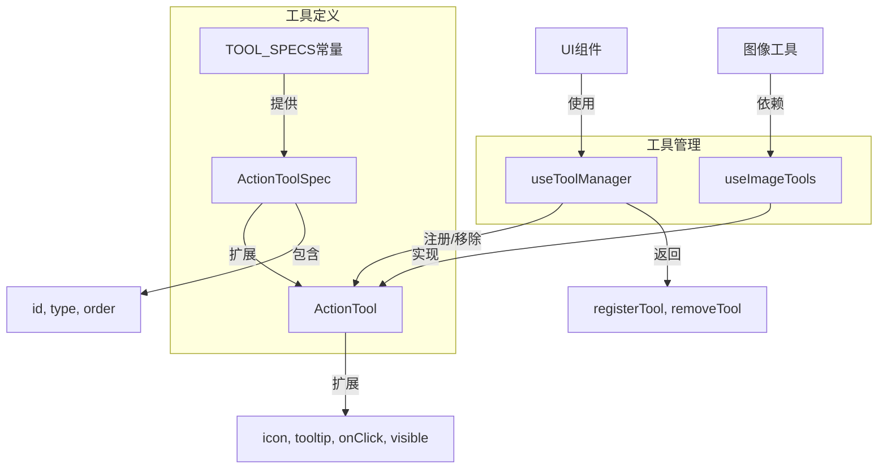
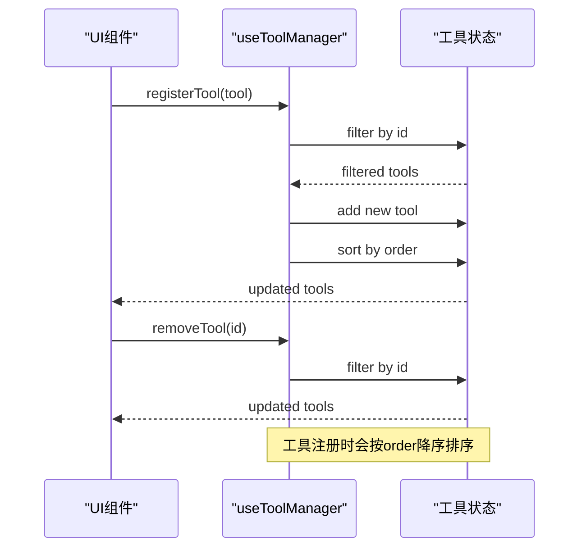
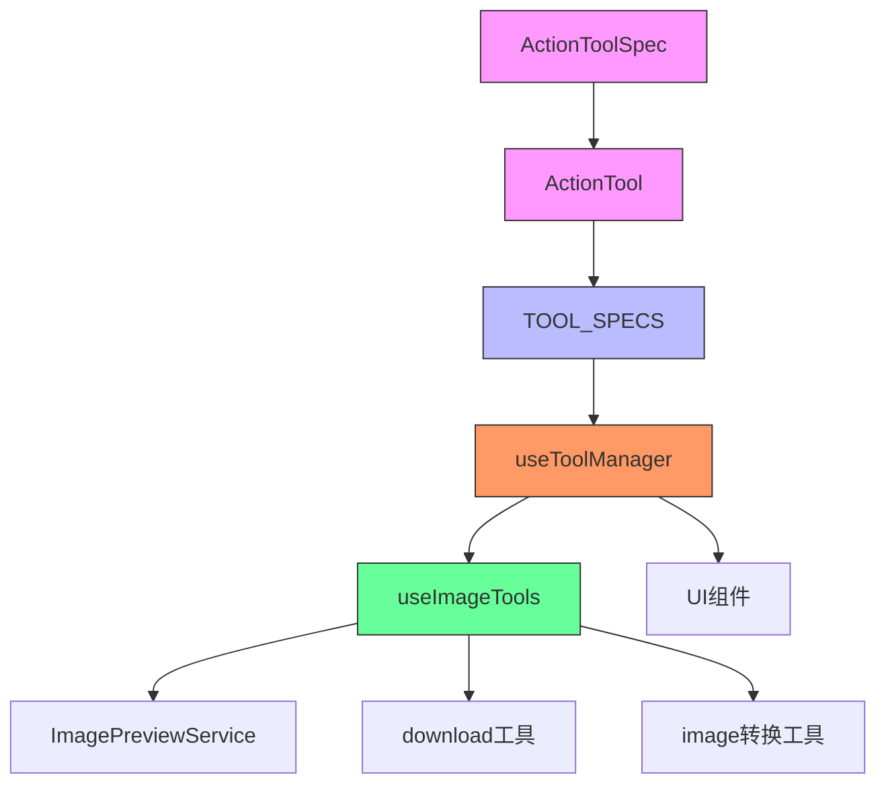

# 操作工具栏架构设计

<cite>
**本文档引用的文件**   
- [types.ts](file://src/renderer/src/components/ActionTools/types.ts)
- [constants.ts](file://src/renderer/src/components/ActionTools/constants.ts)
- [useToolManager.ts](file://src/renderer/src/components/ActionTools/hooks/useToolManager.ts)
- [useImageTools.tsx](file://src/renderer/src/components/ActionTools/hooks/useImageTools.tsx)
</cite>

## 目录
1. [简介](#简介)
2. [核心组件](#核心组件)
3. [架构概述](#架构概述)
4. [详细组件分析](#详细组件分析)
5. [依赖分析](#依赖分析)
6. [性能考虑](#性能考虑)
7. [故障排除指南](#故障排除指南)
8. [结论](#结论)

## 简介
本文档详细阐述了操作工具栏的架构设计，重点分析了ActionToolSpec和ActionTool接口的设计原理。文档解释了工具规格（spec）与工具实例（tool）的分离设计模式，描述了核心字段如id、type、icon、label等的用途。同时，文档说明了TOOL_SPECS常量中定义的工具分类体系，包括核心工具和快速工具的区别，并阐述了工具元数据设计如何支持国际化、快捷键绑定和动态配置。

## 核心组件
操作工具栏系统由几个核心组件构成：ActionToolSpec接口定义了工具的基本信息，ActionTool接口扩展了规格定义，增加了运行时属性，TOOL_SPECS常量定义了所有可用工具的规格，useToolManager钩子提供了工具注册和管理功能，useImageTools钩子为图像操作提供了具体功能实现。

**核心组件**
- [types.ts](file://src/renderer/src/components/ActionTools/types.ts#L4-L34)
- [constants.ts](file://src/renderer/src/components/ActionTools/constants.ts#L3-L76)
- [useToolManager.ts](file://src/renderer/src/components/ActionTools/hooks/useToolManager.ts#L5-L26)

## 架构概述
操作工具栏采用规格-实例分离的设计模式，将工具的静态元数据与动态运行时属性分开管理。这种设计模式提高了系统的可维护性和类型安全性，同时支持灵活的工具注册和动态配置。



**图表来源**
- [types.ts](file://src/renderer/src/components/ActionTools/types.ts#L4-L34)
- [constants.ts](file://src/renderer/src/components/ActionTools/constants.ts#L3-L76)
- [useToolManager.ts](file://src/renderer/src/components/ActionTools/hooks/useToolManager.ts#L5-L26)

## 详细组件分析

### ActionToolSpec与ActionTool接口分析
操作工具栏的核心是ActionToolSpec和ActionTool接口的设计，采用了规格-实例分离的模式。ActionToolSpec定义了工具的静态元数据，而ActionTool在此基础上扩展了运行时所需的动态属性。

```mermaid
classDiagram
class ActionToolSpec {
+string id
+'core' | 'quick' type
+number order
}
class ActionTool {
+React.ReactNode icon
+string tooltip?
+() => boolean visible?
+() => void onClick?
+Omit<ActionTool, 'children'>[] children?
}
ActionToolSpec <|-- ActionTool : "extends"
note right of ActionToolSpec
工具规格接口，定义工具的
基本元数据，用于静态配置
end note
note right of ActionTool
工具实例接口，扩展了规格接口，
增加了运行时所需的UI和行为属性
end note
```

**图表来源**
- [types.ts](file://src/renderer/src/components/ActionTools/types.ts#L4-L34)

**核心组件**
- [types.ts](file://src/renderer/src/components/ActionTools/types.ts#L4-L34)

#### 核心字段用途说明
操作工具栏中的核心字段具有明确的用途和设计目的：

- **id**: 工具的唯一标识符，用于工具的注册、查找和去重
- **type**: 工具类型，分为'core'(核心工具)和'quick'(快速工具)两种，用于分类管理
- **order**: 显示顺序，数值越小越靠右显示，控制工具在工具栏中的位置
- **icon**: 按钮图标，使用React.ReactNode类型，支持JSX元素作为图标
- **tooltip**: 提示文本，鼠标悬停时显示的工具说明
- **visible**: 显示条件函数，返回布尔值决定工具是否可见
- **onClick**: 点击动作函数，定义工具被点击时的执行逻辑
- **children**: 子工具数组，用于构建下拉菜单等复合工具

这些字段的设计确保了工具系统的灵活性和可扩展性，同时通过TypeScript的类型系统保证了类型安全。

### TOOL_SPECS常量分析
TOOL_SPECS常量定义了系统中所有可用工具的规格，采用Record<string, ActionToolSpec>类型，以工具ID为键，工具规格为值的映射结构。

```mermaid
erDiagram
TOOL_SPECS {
string id PK
string type
number order
}
TOOL_SPECS ||--o{ CORE_TOOLS : "core"
TOOL_SPECS ||--o{ QUICK_TOOLS : "quick"
class CORE_TOOLS {
copy
download
edit
view-source
save
expand
}
class QUICK_TOOLS {
split-view
run
wrap
copy-image
download-svg
download-png
zoom-in
zoom-out
}
```

**图表来源**
- [constants.ts](file://src/renderer/src/components/ActionTools/constants.ts#L3-L76)

**核心组件**
- [constants.ts](file://src/renderer/src/components/ActionTools/constants.ts#L3-L76)

#### 工具分类体系
操作工具栏的工具被分为两种主要类型：

1. **核心工具**(type: 'core')
   - 主要功能工具，如复制、下载、编辑等
   - 在工具栏中具有较高的优先级
   - 通常与内容操作直接相关

2. **快速工具**(type: 'quick')
   - 辅助性或快捷操作工具，如分屏、运行、换行等
   - 提供快速访问的便捷功能
   - 通常与视图或显示控制相关

这种分类体系有助于组织工具的逻辑结构，便于管理和扩展。通过type字段的枚举类型定义，系统确保了类型安全，防止了无效的工具类型值。

### 工具管理机制分析
useToolManager钩子提供了工具注册和管理的核心功能，实现了工具的动态注册、更新和移除。



**图表来源**
- [useToolManager.ts](file://src/renderer/src/components/ActionTools/hooks/useToolManager.ts#L5-L26)

**核心组件**
- [useToolManager.ts](file://src/renderer/src/components/ActionTools/hooks/useToolManager.ts#L5-L26)

#### 工具元数据设计
工具元数据的设计支持了国际化、快捷键绑定和动态配置等高级功能：

- **国际化支持**: tooltip字段使用字符串，可与i18n系统集成，从语言包中获取翻译文本
- **动态配置**: visible函数允许根据应用状态动态决定工具的可见性
- **事件绑定**: onClick函数提供了灵活的事件处理机制
- **类型安全**: 通过TypeScript接口定义，确保了所有工具属性的类型一致性
- **扩展性**: children字段支持嵌套工具结构，可构建复杂的下拉菜单

这种设计使得工具系统既灵活又安全，能够适应不同的使用场景和需求。

## 依赖分析
操作工具栏系统与其他组件存在明确的依赖关系，形成了清晰的架构层次。



**图表来源**
- [types.ts](file://src/renderer/src/components/ActionTools/types.ts#L4-L34)
- [constants.ts](file://src/renderer/src/components/ActionTools/constants.ts#L3-L76)
- [useToolManager.ts](file://src/renderer/src/components/ActionTools/hooks/useToolManager.ts#L5-L26)
- [useImageTools.tsx](file://src/renderer/src/components/ActionTools/hooks/useImageTools.tsx#L1-L294)

**核心组件**
- [types.ts](file://src/renderer/src/components/ActionTools/types.ts#L4-L34)
- [constants.ts](file://src/renderer/src/components/ActionTools/constants.ts#L3-L76)
- [useToolManager.ts](file://src/renderer/src/components/ActionTools/hooks/useToolManager.ts#L5-L26)
- [useImageTools.tsx](file://src/renderer/src/components/ActionTools/hooks/useImageTools.tsx#L1-L294)

## 性能考虑
操作工具栏的设计考虑了性能因素，特别是在工具注册和渲染方面：

- **工具注册**: 使用setTools回调函数进行状态更新，避免了不必要的重新渲染
- **排序优化**: 在registerTool时进行一次排序，而不是在渲染时排序
- **记忆化**: 使用useCallback确保registerTool和removeTool函数的引用稳定性
- **过滤效率**: 使用Array.filter进行工具去重，时间复杂度为O(n)

这些设计决策确保了工具栏在动态更新时的性能表现。

## 故障排除指南
在使用操作工具栏系统时可能遇到的常见问题及解决方案：

**工具不显示**
- 检查visible函数的返回值
- 确认工具的order值是否正确
- 验证工具是否已正确注册

**工具点击无效**
- 检查onClick函数是否正确定义
- 确认事件处理函数没有抛出异常
- 验证工具是否被正确渲染

**工具顺序错误**
- 检查order值的设置，数值越小越靠右
- 确认工具注册时是否正确排序

**类型错误**
- 验证工具对象是否符合ActionTool接口定义
- 检查必填字段是否都已提供
- 确认type字段的值是否为'core'或'quick'

**核心组件**
- [types.ts](file://src/renderer/src/components/ActionTools/types.ts#L4-L34)
- [useToolManager.ts](file://src/renderer/src/components/ActionTools/hooks/useToolManager.ts#L5-L26)

## 结论
操作工具栏的架构设计采用了规格-实例分离的模式，通过ActionToolSpec和ActionTool接口的分层设计，实现了工具定义的灵活性和类型安全性。TOOL_SPECS常量提供了工具的集中化管理，useToolManager钩子实现了工具的动态注册和管理。整个系统设计考虑了可维护性、扩展性和性能，支持国际化、动态配置等高级功能，为应用程序提供了强大而灵活的工具栏解决方案。