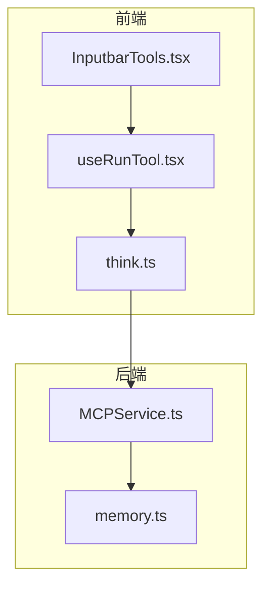
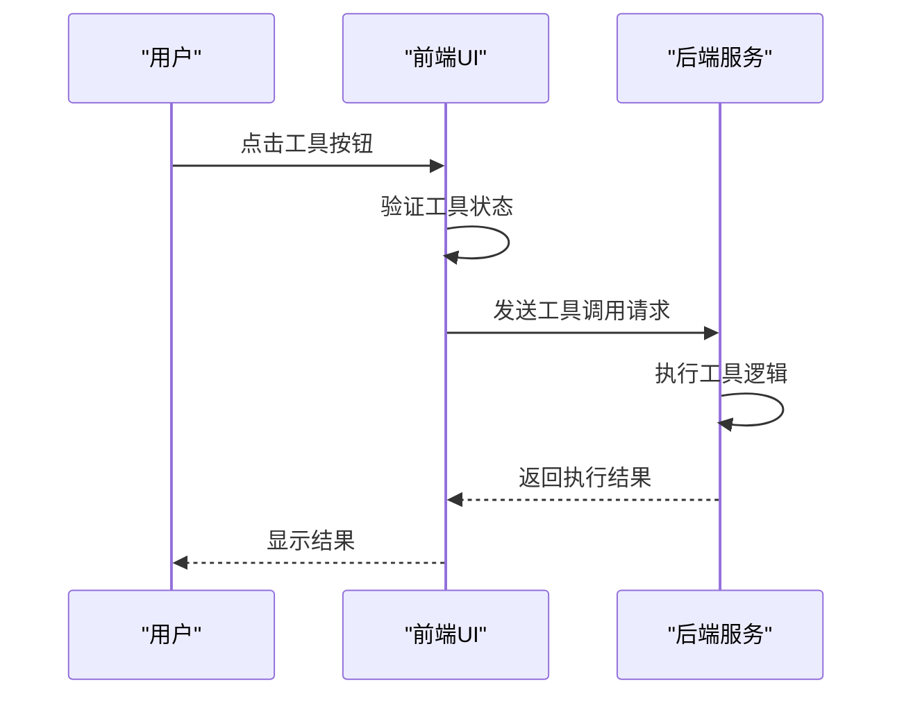
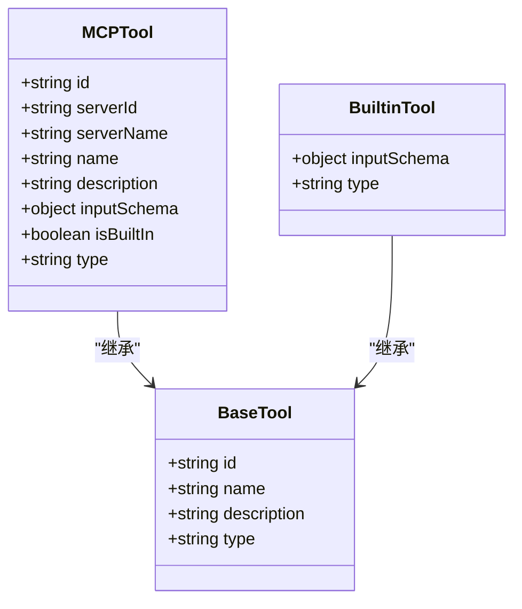
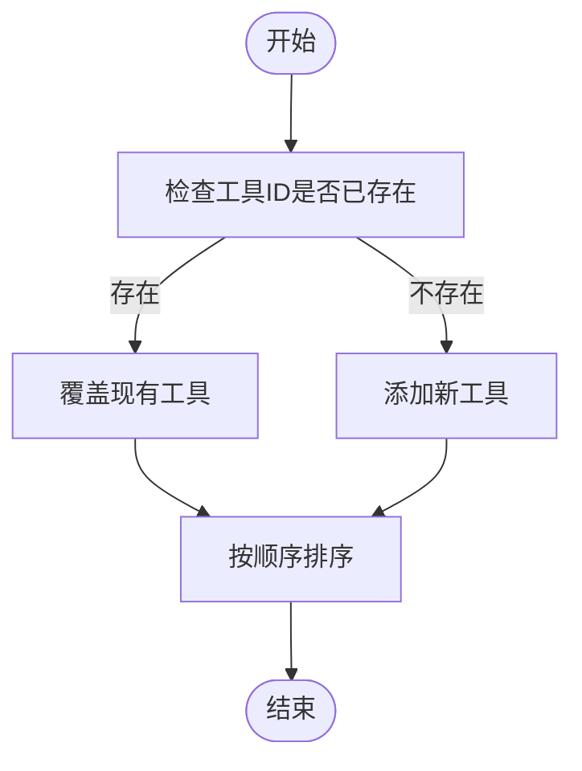
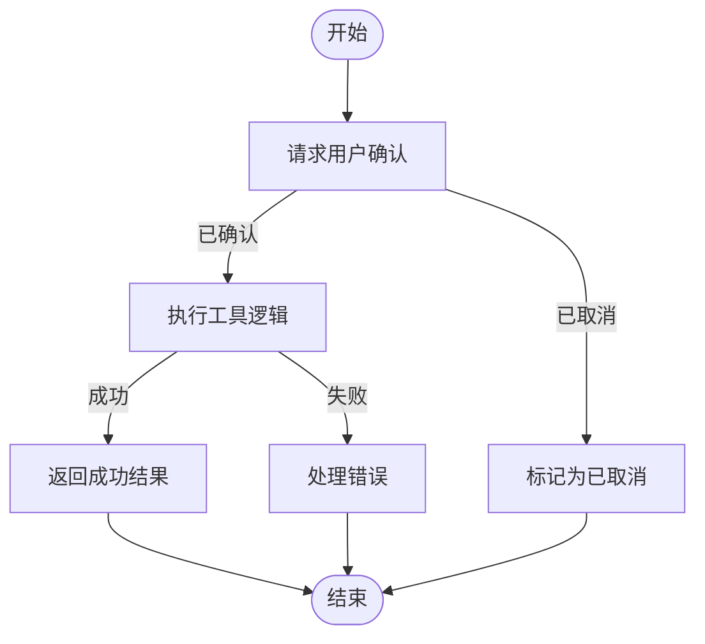
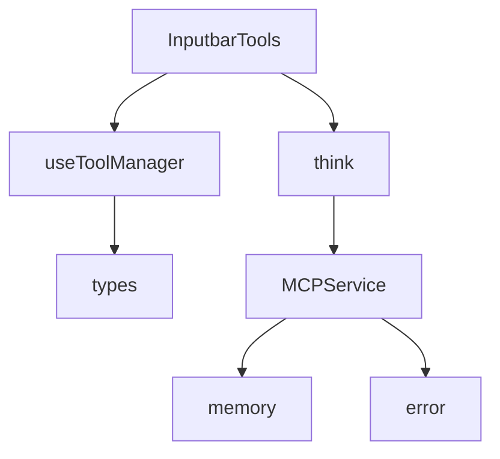

# 自定义工具开发指南

<cite>
**本文档引用的文件**
- [types.ts](file://src/renderer/src/types/tool.ts)
- [think.ts](file://src/renderer/src/tools/think.ts)
- [InputbarTools.tsx](file://src/renderer/src/pages/home/Inputbar/InputbarTools.tsx)
- [useRunTool.tsx](file://src/renderer/src/components/CodeToolbar/hooks/useRunTool.tsx)
- [McpToolChunkMiddleware.ts](file://src/renderer/src/aiCore/legacy/middleware/core/McpToolChunkMiddleware.ts)
- [MCPService.ts](file://src/main/services/MCPService.ts)
- [memory.ts](file://src/main/mcpServers/memory.ts)
- [useToolManager.ts](file://src/renderer/src/components/ActionTools/hooks/useToolManager.ts)
- [error.ts](file://src/renderer/src/utils/error.ts)
</cite>

## 目录
1. [简介](#简介)
2. [项目结构](#项目结构)
3. [核心组件](#核心组件)
4. [架构概述](#架构概述)
5. [详细组件分析](#详细组件分析)
6. [依赖分析](#依赖分析)
7. [性能考虑](#性能考虑)
8. [故障排除指南](#故障排除指南)
9. [结论](#结论)

## 简介
本文档旨在为开发者提供创建自定义操作工具的完整指南。通过分析代码库中的工具系统，我们将详细介绍从定义工具规格、实现执行逻辑、注册到系统以及处理用户交互的完整流程。文档还将说明如何利用context参数访问应用状态，正确处理异步操作和错误情况，并展示创建带有下拉菜单的复合工具的高级用法。最后，我们将列出常见的开发陷阱和最佳实践。

## 项目结构
本项目采用模块化架构，将工具相关的代码分布在多个目录中。核心工具定义位于`src/renderer/src/tools/`目录，而工具的注册和管理逻辑分布在UI组件中。工具执行的后端服务位于`src/main/services/`和`src/main/mcpServers/`目录。

**图表来源**
- [InputbarTools.tsx](file://src/renderer/src/pages/home/Inputbar/InputbarTools.tsx)
- [useRunTool.tsx](file://src/renderer/src/components/CodeToolbar/hooks/useRunTool.tsx)
- [think.ts](file://src/renderer/src/tools/think.ts)
- [MCPService.ts](file://src/main/services/MCPService.ts)
- [memory.ts](file://src/main/mcpServers/memory.ts)

**章节来源**
- [InputbarTools.tsx](file://src/renderer/src/pages/home/Inputbar/InputbarTools.tsx)
- [useRunTool.tsx](file://src/renderer/src/components/CodeToolbar/hooks/useRunTool.tsx)

## 核心组件
自定义工具系统的核心组件包括工具定义、工具注册器、工具执行器和错误处理机制。工具定义描述了工具的元数据和行为，工具注册器负责将工具注入UI，工具执行器处理工具的调用逻辑，而错误处理机制确保系统的稳定性。

**章节来源**
- [types.ts](file://src/renderer/src/types/tool.ts)
- [think.ts](file://src/renderer/src/tools/think.ts)

## 架构概述
工具系统的架构分为前端和后端两个主要部分。前端负责工具的UI展示和用户交互，后端负责工具的实际执行。当用户触发一个工具时，前端会通过MCP协议与后端通信，后端执行相应的操作并返回结果。

**图表来源**
- [useRunTool.tsx](file://src/renderer/src/components/CodeToolbar/hooks/useRunTool.tsx)
- [MCPService.ts](file://src/main/services/MCPService.ts)

## 详细组件分析

### 工具定义分析
工具定义是创建自定义工具的第一步。每个工具都需要一个唯一的ID、名称、描述和输入模式。内置工具还需要指定执行逻辑。

**图表来源**
- [types.ts](file://src/renderer/src/types/tool.ts)
- [think.ts](file://src/renderer/src/tools/think.ts)

### 工具注册分析
工具注册器负责将定义好的工具注入到UI系统中。它提供了注册和移除工具的API，并确保工具按正确的顺序显示。

**图表来源**
- [useToolManager.ts](file://src/renderer/src/components/ActionTools/hooks/useToolManager.ts)

### 工具执行分析
工具执行流程涉及多个步骤，包括用户确认、实际执行和结果处理。系统会先请求用户确认，然后执行工具逻辑，最后处理返回结果。

**图表来源**
- [McpToolChunkMiddleware.ts](file://src/renderer/src/aiCore/legacy/middleware/core/McpToolChunkMiddleware.ts)
- [MCPService.ts](file://src/main/services/MCPService.ts)

## 依赖分析
工具系统依赖于多个核心模块，包括状态管理、UI组件和后端服务。这些模块通过清晰的接口进行通信，确保系统的可维护性和可扩展性。

**图表来源**
- [InputbarTools.tsx](file://src/renderer/src/pages/home/Inputbar/InputbarTools.tsx)
- [useToolManager.ts](file://src/renderer/src/components/ActionTools/hooks/useToolManager.ts)
- [types.ts](file://src/renderer/src/types/tool.ts)
- [think.ts](file://src/renderer/src/tools/think.ts)
- [MCPService.ts](file://src/main/services/MCPService.ts)
- [memory.ts](file://src/main/mcpServers/memory.ts)
- [error.ts](file://src/renderer/src/utils/error.ts)

**章节来源**
- [InputbarTools.tsx](file://src/renderer/src/pages/home/Inputbar/InputbarTools.tsx)
- [useToolManager.ts](file://src/renderer/src/components/ActionTools/hooks/useToolManager.ts)
- [types.ts](file://src/renderer/src/types/tool.ts)
- [think.ts](file://src/renderer/src/tools/think.ts)
- [MCPService.ts](file://src/main/services/MCPService.ts)
- [memory.ts](file://src/main/mcpServers/memory.ts)
- [error.ts](file://src/renderer/src/utils/error.ts)

## 性能考虑
在开发自定义工具时，需要考虑性能优化、内存泄漏防范和类型安全保证。避免在工具执行中进行阻塞操作，合理管理异步任务，并确保类型定义的准确性。

## 故障排除指南
当工具出现问题时，首先检查工具定义是否正确，然后验证注册流程是否成功，最后确认执行逻辑是否有错误。使用日志记录可以帮助快速定位问题。

**章节来源**
- [error.ts](file://src/renderer/src/utils/error.ts)
- [MCPService.ts](file://src/main/services/MCPService.ts)

## 结论
通过本文档，开发者可以全面了解如何创建和管理自定义操作工具。从工具定义到执行，每个环节都有详细的说明和最佳实践建议。遵循这些指南，可以确保工具的稳定性和用户体验。