# 文档处理

<cite>
**本文档引用的文件**  
- [BasePreprocessProvider.ts](file://src/main/knowledge/preprocess/BasePreprocessProvider.ts)
- [MistralPreprocessProvider.ts](file://src/main/knowledge/preprocess/MistralPreprocessProvider.ts)
- [Doc2xPreprocessProvider.ts](file://src/main/knowledge/preprocess/Doc2xPreprocessProvider.ts)
- [PreprocessingService.ts](file://src/main/knowledge/preprocess/PreprocessingService.ts)
- [PreprocessProvider.ts](file://src/main/knowledge/preprocess/PreprocessProvider.ts)
- [DefaultPreprocessProvider.ts](file://src/main/knowledge/preprocess/DefaultPreprocessProvider.ts)
- [index.ts](file://src/main/knowledge/embedjs/loader/index.ts)
- [epubLoader.ts](file://src/main/knowledge/embedjs/loader/epubLoader.ts)
- [odLoader.ts](file://src/main/knowledge/embedjs/loader/odLoader.ts)
- [VoyageEmbeddings.ts](file://src/main/knowledge/embedjs/embeddings/VoyageEmbeddings.ts)
- [Reranker.ts](file://src/main/knowledge/reranker/Reranker.ts)
- [BaseReranker.ts](file://src/main/knowledge/reranker/BaseReranker.ts)
- [BailianStrategy.ts](file://src/main/knowledge/reranker/strategies/BailianStrategy.ts)
- [JinaStrategy.ts](file://src/main/knowledge/reranker/strategies/JinaStrategy.ts)
- [TeiStrategy.ts](file://src/main/knowledge/reranker/strategies/TeiStrategy.ts)
</cite>

## 目录
1. [简介](#简介)
2. [文档处理架构概览](#文档处理架构概览)
3. [预处理服务](#预处理服务)
4. [文档加载器系统](#文档加载器系统)
5. [嵌入式服务](#嵌入式服务)
6. [重排序策略](#重排序策略)
7. [核心实现细节](#核心实现细节)
8. [使用指南](#使用指南)
9. [高级开发建议](#高级开发建议)

## 简介

Cherry Studio的文档处理功能是一个完整的文档智能处理系统，旨在将各种格式的文档转换为可被AI模型理解和处理的向量表示。该系统支持多种文档格式的上传和处理，包括PDF、EPUB、OD文档等，并通过预处理、加载、嵌入和重排序等步骤，将原始文档内容转化为结构化的知识。

文档处理流程从用户上传文件开始，系统首先根据文件类型和配置选择合适的预处理提供商进行内容提取和格式转换。对于扫描的PDF文档，系统会使用OCR技术将其转换为可编辑的文本格式。处理后的文档内容会被文档加载器系统读取和解析，然后通过嵌入式服务转换为向量表示，存储在知识库中。当用户进行知识检索时，系统会使用重排序策略对搜索结果进行重新排序，以提高检索的准确性和相关性。

本文档将详细介绍Cherry Studio文档处理功能的各个组成部分，包括预处理服务架构、文档加载器系统、嵌入式服务和重排序策略，为开发者和用户提供全面的技术参考和使用指南。

## 文档处理架构概览

Cherry Studio的文档处理系统采用模块化架构设计，由多个相互协作的组件构成。系统的核心架构包括预处理服务、文档加载器、嵌入式服务和重排序服务四个主要部分，它们共同完成从原始文档到结构化知识的转换过程。

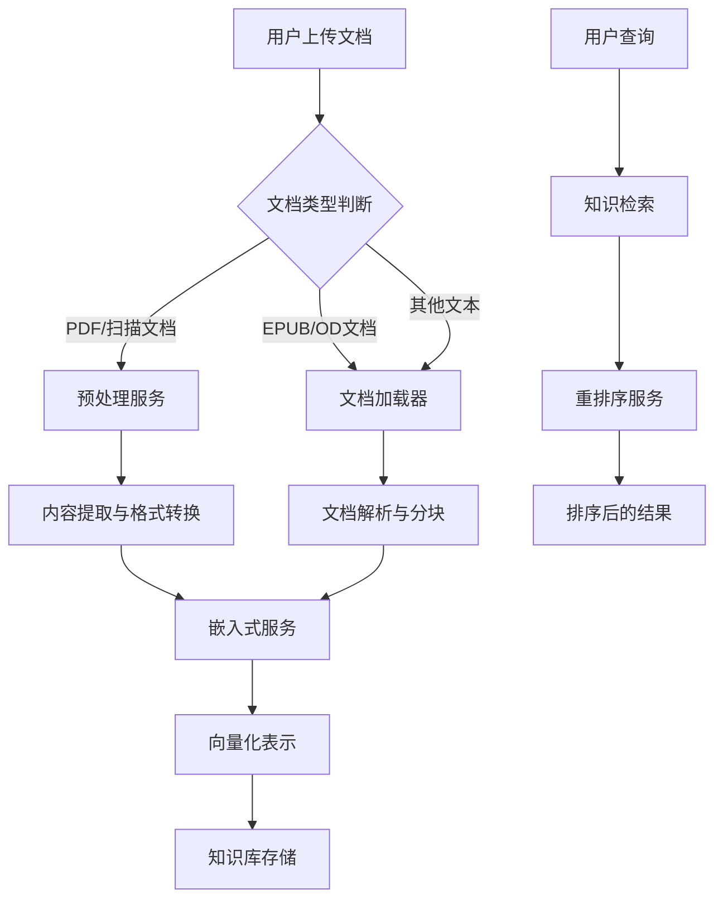

**架构来源**  
- [BasePreprocessProvider.ts](file://src/main/knowledge/preprocess/BasePreprocessProvider.ts)
- [index.ts](file://src/main/knowledge/embedjs/loader/index.ts)
- [VoyageEmbeddings.ts](file://src/main/knowledge/embedjs/embeddings/VoyageEmbeddings.ts)
- [Reranker.ts](file://src/main/knowledge/reranker/Reranker.ts)

## 预处理服务

### BasePreprocessProvider抽象类

`BasePreprocessProvider`是所有预处理提供商的基类，定义了预处理服务的核心接口和通用功能。该抽象类提供了文件预处理的基本框架，包括目录管理、进度通知、缓存检查等通用功能，确保所有具体实现遵循统一的接口规范。

```mermaid
classDiagram
class BasePreprocessProvider {
+provider : PreprocessProvider
+userId? : string
+storageDir : string
+constructor(provider : PreprocessProvider, userId? : string)
+abstract parseFile(sourceId : string, file : FileMetadata) : Promise<{ processedFile : FileMetadata; quota? : number }>
+abstract checkQuota() : Promise<number>
+checkIfAlreadyProcessed(file : FileMetadata) : Promise<FileMetadata | null>
+delay(ms : number) : Promise<void>
+readPdf(buffer : Buffer) : Promise<{ numPages : number }>
+sendPreprocessProgress(sourceId : string, progress : number) : Promise<void>
+moveToAttachmentsDir(fileId : string, filePaths : string[]) : string[]
}
BasePreprocessProvider <|-- MistralPreprocessProvider
BasePreprocessProvider <|-- Doc2xPreprocessProvider
BasePreprocessProvider <|-- DefaultPreprocessProvider
```

**类图来源**  
- [BasePreprocessProvider.ts](file://src/main/knowledge/preprocess/BasePreprocessProvider.ts#L12-L134)

**预处理服务来源**  
- [BasePreprocessProvider.ts](file://src/main/knowledge/preprocess/BasePreprocessProvider.ts#L1-L134)

### 具体预处理提供商实现

#### MistralPreprocessProvider

`MistralPreprocessProvider`是基于Mistral AI服务的预处理实现，主要用于处理扫描的PDF文档和图像文件。该提供商利用Mistral的OCR技术将图像中的文本内容提取出来，并转换为Markdown格式的文档。

处理流程包括：
1. 文件预上传到Mistral服务
2. 调用OCR API处理文档
3. 将结果转换为Markdown格式
4. 保存处理后的文件并返回元数据

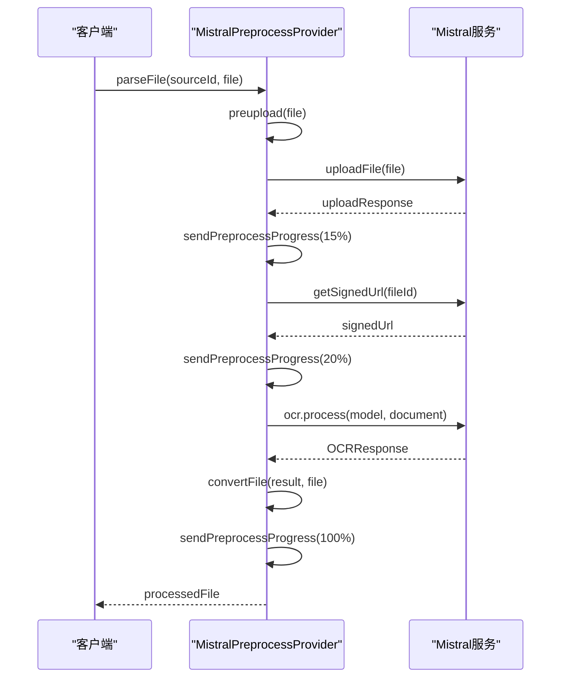

**序列图来源**  
- [MistralPreprocessProvider.ts](file://src/main/knowledge/preprocess/MistralPreprocessProvider.ts#L21-L193)

#### Doc2xPreprocessProvider

`Doc2xPreprocessProvider`是基于Doc2x服务的预处理实现，专门用于将PDF文档转换为Markdown格式。该提供商通过与Doc2x API的交互，实现高质量的PDF到Markdown转换。

处理流程包括：
1. 预上传获取上传URL
2. 验证文件大小和页数限制
3. 上传文件到指定URL
4. 等待处理完成并获取状态
5. 导出处理后的文件
6. 下载并解压结果

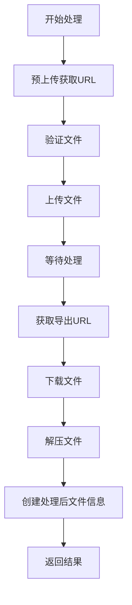

**流程图来源**  
- [Doc2xPreprocessProvider.ts](file://src/main/knowledge/preprocess/Doc2xPreprocessProvider.ts#L35-L375)

#### DefaultPreprocessProvider

`DefaultPreprocessProvider`是默认的预处理提供商，当没有配置特定预处理服务时使用。该提供商目前未实现具体功能，主要用于占位和扩展。

**预处理提供商来源**  
- [MistralPreprocessProvider.ts](file://src/main/knowledge/preprocess/MistralPreprocessProvider.ts#L21-L193)
- [Doc2xPreprocessProvider.ts](file://src/main/knowledge/preprocess/Doc2xPreprocessProvider.ts#L35-L375)
- [DefaultPreprocessProvider.ts](file://src/main/knowledge/preprocess/DefaultPreprocessProvider.ts#L5-L17)

### 预处理服务工厂

`PreprocessProviderFactory`负责根据配置创建相应的预处理提供商实例。该工厂模式实现了预处理服务的解耦，使得系统可以灵活地扩展新的预处理提供商而无需修改核心代码。

```mermaid
classDiagram
class PreprocessProviderFactory {
+static create(provider : PreprocessProvider, userId? : string) : BasePreprocessProvider
}
class PreprocessProvider {
-sdk : BasePreprocessProvider
+constructor(provider : Provider, userId? : string)
+parseFile(sourceId : string, file : FileMetadata) : Promise<{ processedFile : FileMetadata; quota? : number }>
+checkQuota() : Promise<number>
+checkIfAlreadyProcessed(file : FileMetadata) : Promise<FileMetadata | null>
}
class PreprocessingService {
+preprocessFile(file : FileMetadata, base : KnowledgeBaseParams, item : KnowledgeItem, userId : string) : Promise<FileMetadata>
+checkQuota(base : KnowledgeBaseParams, userId : string) : Promise<number>
}
PreprocessProviderFactory --> BasePreprocessProvider : "创建"
PreprocessProvider --> BasePreprocessProvider : "委托"
PreprocessingService --> PreprocessProvider : "使用"
```

**工厂类来源**  
- [PreprocessProvider.ts](file://src/main/knowledge/preprocess/PreprocessProvider.ts#L6-L31)
- [PreprocessingService.ts](file://src/main/knowledge/preprocess/PreprocessingService.ts#L8-L64)

## 文档加载器系统

### 支持的文档格式

Cherry Studio的文档加载器系统支持多种文档格式的加载和解析，包括：

- **通用格式**：PDF、CSV、DOC、DOCX、PPTX、XLSX、MD
- **开放文档格式**：ODT、ODS、ODP
- **电子书格式**：EPUB
- **笔记格式**：DraftsExport
- **网页格式**：HTML、HTM
- **数据格式**：JSON
- **纯文本格式**：TXT及其他文本文件

### 文档加载器架构

文档加载器系统采用策略模式设计，根据文件扩展名选择合适的加载器进行处理。系统通过`FILE_LOADER_MAP`映射表将文件扩展名与对应的加载器类型关联起来。

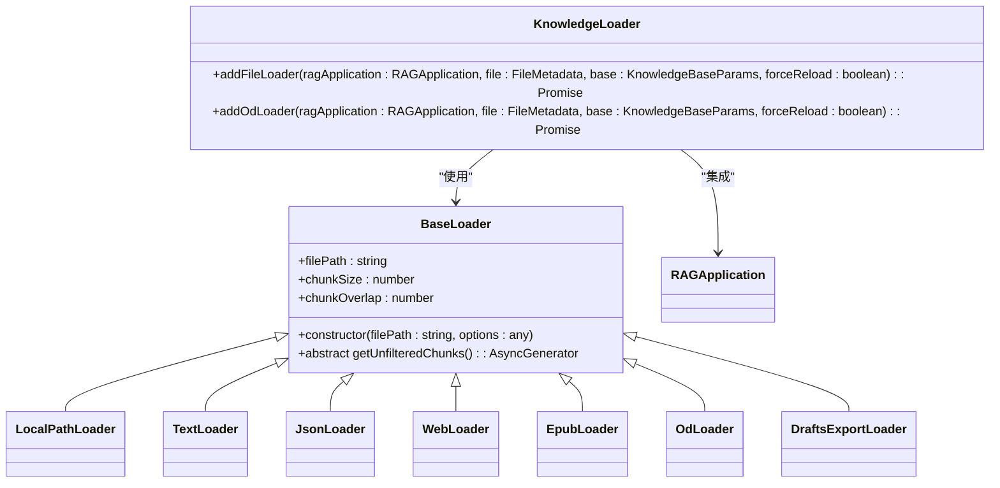

**加载器架构来源**  
- [index.ts](file://src/main/knowledge/embedjs/loader/index.ts#L1-L167)
- [epubLoader.ts](file://src/main/knowledge/embedjs/loader/epubLoader.ts#L60-L251)
- [odLoader.ts](file://src/main/knowledge/embedjs/loader/odLoader.ts#L18-L76)

### 具体加载器实现

#### EpubLoader

`EpubLoader`用于加载和解析EPUB格式的电子书文件。该加载器使用`epub`库解析EPUB文件，提取文本内容和元数据，并将内容分割成适当大小的块。

处理流程：
1. 检查文件是否存在
2. 初始化EPUB解析器
3. 提取元数据和章节信息
4. 遍历所有章节并提取文本
5. 清理HTML标签
6. 分割文本块

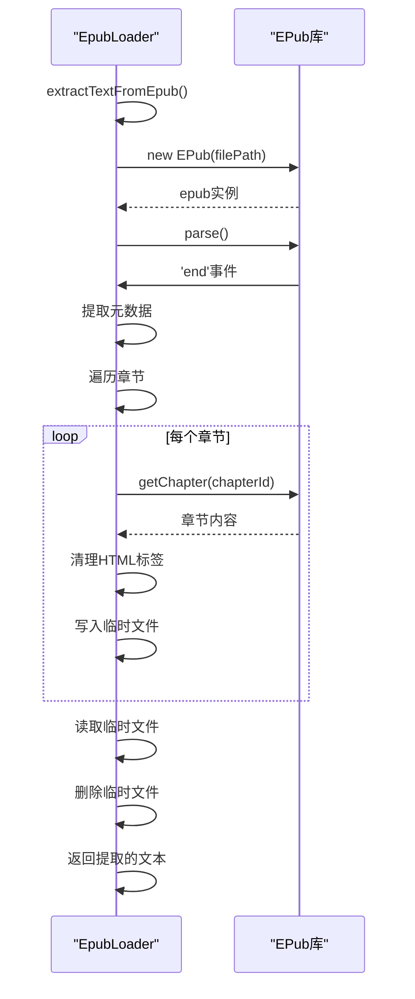

**EPUB加载器来源**  
- [epubLoader.ts](file://src/main/knowledge/embedjs/loader/epubLoader.ts#L60-L251)

#### OdLoader

`OdLoader`用于加载和解析开放文档格式（ODT、ODS、ODP）文件。该加载器使用`officeparser`库解析OD文档，提取纯文本内容。

处理流程：
1. 配置解析选项
2. 调用`parseOfficeAsync`解析文件
3. 分割文本块
4. 添加元数据

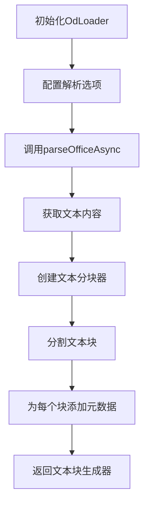

**OD加载器来源**  
- [odLoader.ts](file://src/main/knowledge/embedjs/loader/odLoader.ts#L18-L76)

#### 其他加载器

- **LocalPathLoader**：用于加载本地路径的通用文档格式
- **TextLoader**：用于加载纯文本文件
- **JsonLoader**：用于加载JSON格式文件
- **WebLoader**：用于加载HTML内容
- **DraftsExportLoader**：用于加载笔记导出文件

**文档加载器来源**  
- [index.ts](file://src/main/knowledge/embedjs/loader/index.ts#L1-L167)

## 嵌入式服务

### 嵌入式服务架构

嵌入式服务负责将文档内容转换为向量表示，这是知识检索的基础。Cherry Studio的嵌入式服务基于`@cherrystudio/embedjs-interfaces`接口设计，支持多种嵌入模型。

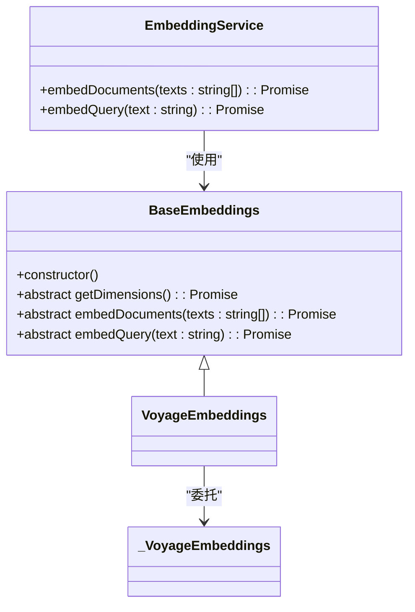

**嵌入式服务架构来源**  
- [VoyageEmbeddings.ts](file://src/main/knowledge/embedjs/embeddings/VoyageEmbeddings.ts#L7-L36)

### VoyageEmbeddings实现

`VoyageEmbeddings`是基于Voyage AI的嵌入实现，将文档内容转换为高维向量表示。该实现封装了`@langchain/community/embeddings/voyage`库，提供了统一的嵌入接口。

主要特性：
- 支持设置嵌入维度
- 自动处理模型配置
- 错误处理和重试机制
- 支持文档和查询的嵌入

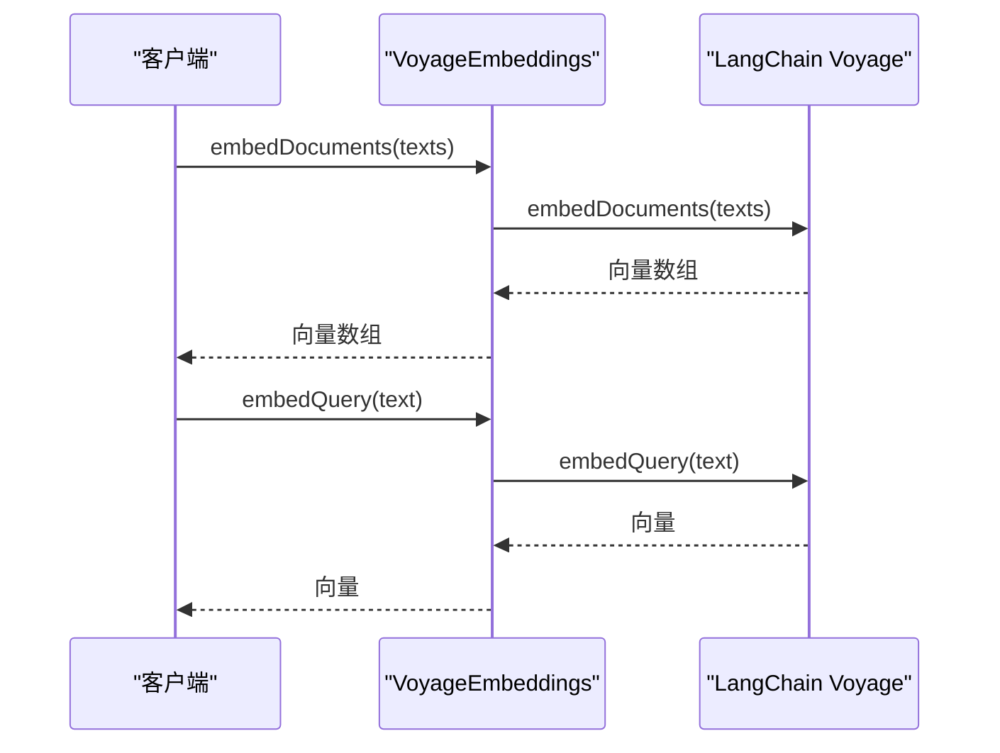

**VoyageEmbeddings来源**  
- [VoyageEmbeddings.ts](file://src/main/knowledge/embedjs/embeddings/VoyageEmbeddings.ts#L7-L36)

## 重排序策略

### 重排序服务架构

重排序服务用于对知识检索结果进行重新排序，提高检索的相关性和准确性。系统采用策略模式设计，支持多种重排序算法。

```mermaid
classDiagram
class BaseReranker {
+base : KnowledgeBaseParams
+strategy : RerankStrategy
+constructor(base : KnowledgeBaseParams)
+abstract rerank(query : string, searchResults : KnowledgeSearchResult[]) : Promise<KnowledgeSearchResult[]>
+getRerankUrl() : string
+getRerankRequestBody(query : string, searchResults : KnowledgeSearchResult[]) : any
+extractRerankResult(data : any) : KnowledgeSearchResult[]
+getRerankResult(searchResults : KnowledgeSearchResult[], rerankResults : Array<{ index : number; relevance_score : number }>) : KnowledgeSearchResult[]
}
class Reranker {
-sdk : GeneralReranker
+constructor(base : KnowledgeBaseParams)
+rerank(query : string, searchResults : KnowledgeSearchResult[]) : Promise<KnowledgeSearchResult[]>
}
BaseReranker <|-- GeneralReranker
Reranker --> GeneralReranker : "使用"
```

**重排序架构来源**  
- [BaseReranker.ts](file://src/main/knowledge/reranker/BaseReranker.ts#L7-L89)
- [Reranker.ts](file://src/main/knowledge/reranker/Reranker.ts#L5-L14)

### 具体重排序策略

#### BailianStrategy

`BailianStrategy`是基于阿里云百炼服务的重排序策略，使用阿里云的文本重排序API对搜索结果进行重新排序。

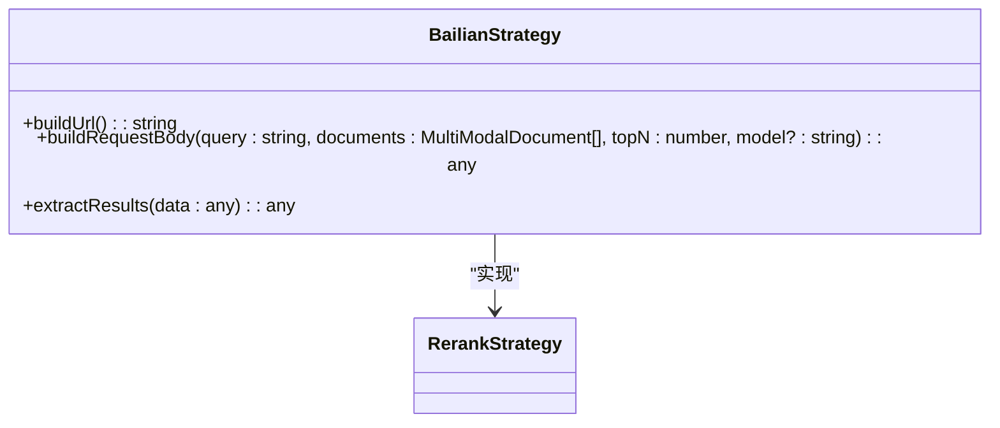

**百炼策略来源**  
- [BailianStrategy.ts](file://src/main/knowledge/reranker/strategies/BailianStrategy.ts#L2-L19)

#### JinaStrategy

`JinaStrategy`是基于Jina AI的重排序策略，支持多种Jina重排序模型。

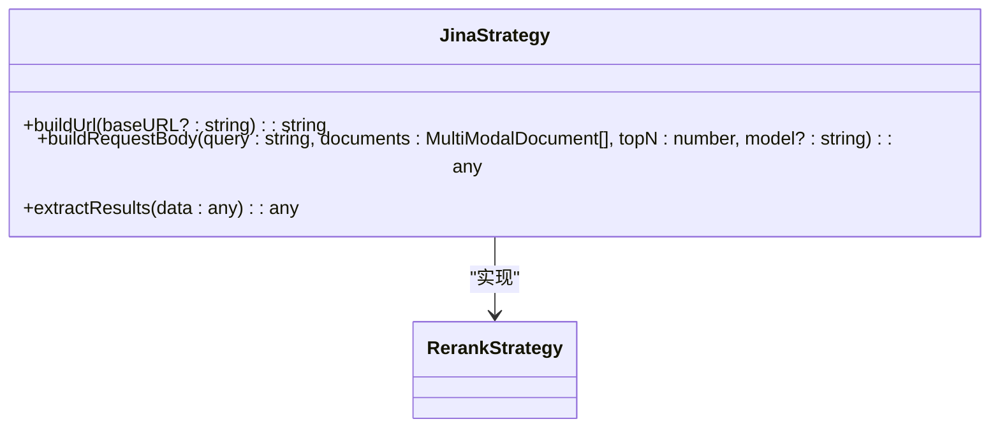

**Jina策略来源**  
- [JinaStrategy.ts](file://src/main/knowledge/reranker/strategies/JinaStrategy.ts#L2-L34)

#### TeiStrategy

`TeiStrategy`是基于Text Embeddings Inference (TEI) 服务的重排序策略，适用于本地部署的重排序服务。

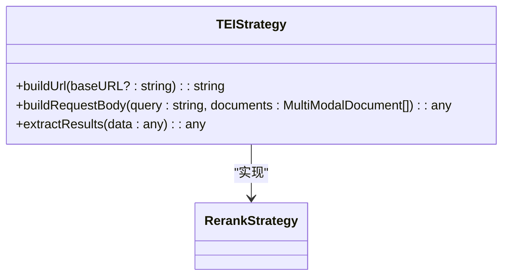

**TEI策略来源**  
- [TeiStrategy.ts](file://src/main/knowledge/reranker/strategies/TeiStrategy.ts#L2-L27)

## 核心实现细节

### 预处理配额检查

预处理服务支持配额检查功能，确保用户在使用预处理服务时不会超出限制。`checkQuota`方法用于检查当前用户的预处理配额。

```mermaid
flowchart TD
A[调用checkQuota] --> B{是否有预处理提供商}
B --> |是| C[创建PreprocessProvider实例]
C --> D[调用provider.checkQuota()]
D --> E[返回配额信息]
B --> |否| F[抛出异常]
```

**配额检查来源**  
- [PreprocessingService.ts](file://src/main/knowledge/preprocess/PreprocessingService.ts#L49-L60)

### 缓存机制

系统实现了智能缓存机制，避免重复处理相同的文件。`checkIfAlreadyProcessed`方法用于检查文件是否已经被预处理过。

处理逻辑：
1. 检查`Data/Files/{file.id}`目录是否存在
2. 如果存在且为目录，说明文件已被处理
3. 查找目录中的处理结果文件（.md或.txt）
4. 返回处理后的文件信息

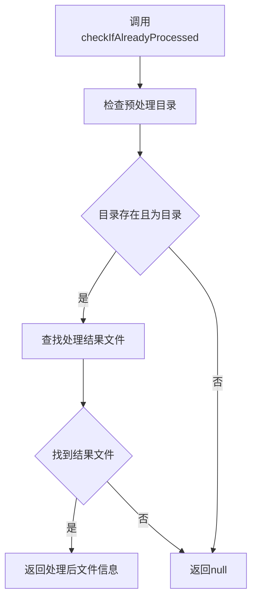

**缓存机制来源**  
- [BasePreprocessProvider.ts](file://src/main/knowledge/preprocess/BasePreprocessProvider.ts#L46-L83)

### 进度通知

预处理服务支持进度通知功能，实时向UI层发送处理进度。`sendPreprocessProgress`方法用于发送进度更新。

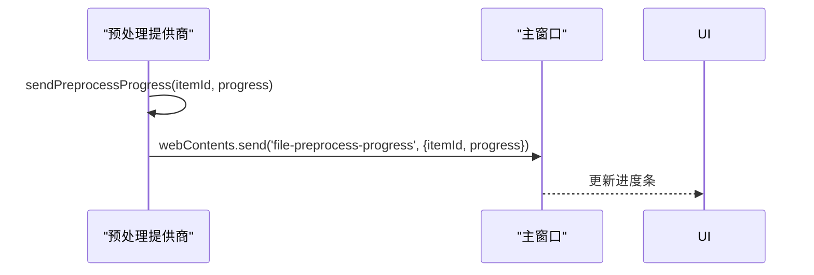

**进度通知来源**  
- [BasePreprocessProvider.ts](file://src/main/knowledge/preprocess/BasePreprocessProvider.ts#L100-L106)
- [PreprocessingService.ts](file://src/main/knowledge/preprocess/PreprocessingService.ts#L34-L38)

### parseFile方法实现流程

`parseFile`是预处理服务的核心方法，负责处理单个文件的预处理流程。不同提供商的实现略有差异，但基本流程相似。

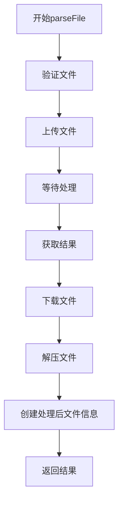

**parseFile流程来源**  
- [Doc2xPreprocessProvider.ts](file://src/main/knowledge/preprocess/Doc2xPreprocessProvider.ts#L61-L90)
- [MistralPreprocessProvider.ts](file://src/main/knowledge/preprocess/MistralPreprocessProvider.ts#L77-L97)

## 使用指南

### 文档上传和处理流程

对于初学者，文档上传和处理的基本流程如下：

1. **上传文档**：通过UI界面上传需要处理的文档
2. **选择预处理服务**：在知识库设置中选择合适的预处理服务
3. **等待处理完成**：系统会自动处理文档并显示进度
4. **使用知识**：处理完成后，文档内容可用于知识检索

### 配置预处理服务

在知识库设置中，可以配置预处理服务的提供商、API密钥和模型等参数。系统会根据配置自动选择相应的预处理提供商。

## 高级开发建议

### 自定义预处理提供商

开发者可以创建自定义的预处理提供商，只需继承`BasePreprocessProvider`抽象类并实现`parseFile`和`checkQuota`方法。

```typescript
import BasePreprocessProvider from './BasePreprocessProvider'

export default class CustomPreprocessProvider extends BasePreprocessProvider {
  constructor(provider) {
    super(provider)
  }
  
  async parseFile(sourceId: string, file: FileMetadata) {
    // 实现自定义预处理逻辑
  }
  
  async checkQuota(): Promise<number> {
    // 实现配额检查逻辑
  }
}
```

### 技术优化建议

1. **性能优化**：对于大文件处理，考虑使用流式处理而非一次性加载到内存
2. **错误处理**：实现完善的错误处理和重试机制
3. **缓存策略**：优化缓存机制，减少重复处理
4. **进度反馈**：提供更细粒度的进度反馈，提升用户体验
5. **资源管理**：合理管理临时文件和内存使用