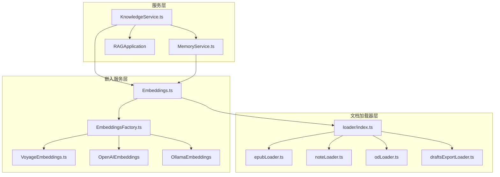
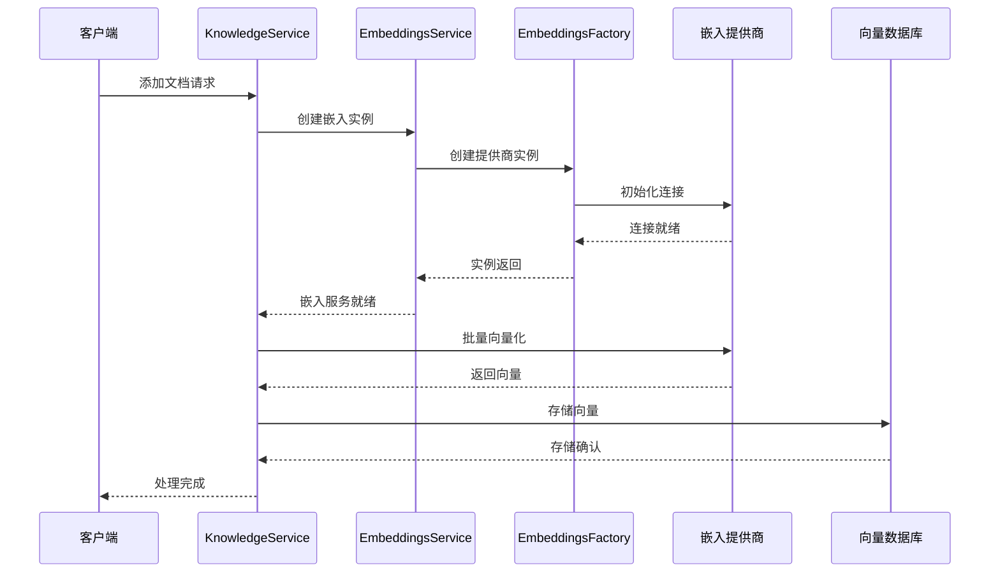
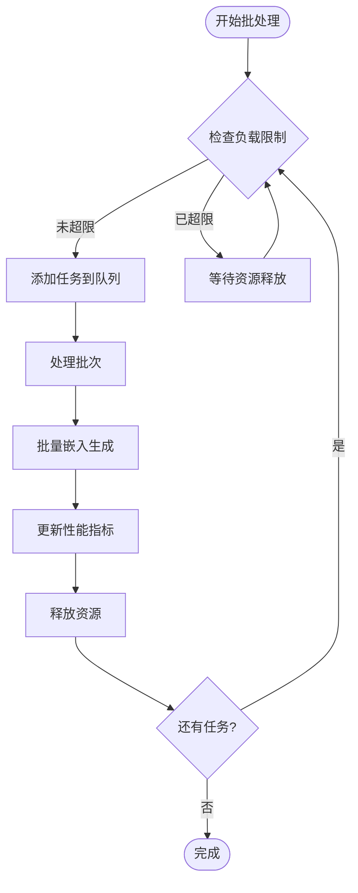
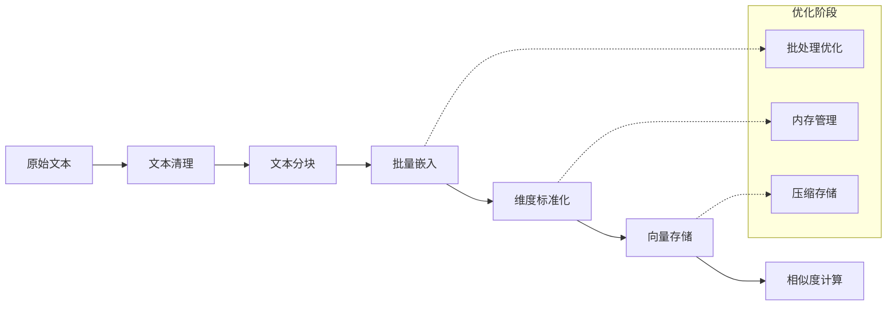
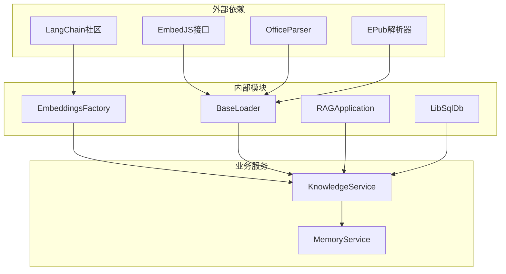

# 文档嵌入功能

<cite>
**本文档引用的文件**
- [Embeddings.ts](file://src/main/knowledge/embedjs/embeddings/Embeddings.ts)
- [EmbeddingsFactory.ts](file://src/main/knowledge/embedjs/embeddings/EmbeddingsFactory.ts)
- [VoyageEmbeddings.ts](file://src/main/knowledge/embedjs/embeddings/VoyageEmbeddings.ts)
- [KnowledgeService.ts](file://src/main/services/KnowledgeService.ts)
- [MemoryService.ts](file://src/main/services/memory/MemoryService.ts)
- [index.ts](file://src/main/knowledge/embedjs/loader/index.ts)
- [epubLoader.ts](file://src/main/knowledge/embedjs/loader/epubLoader.ts)
- [noteLoader.ts](file://src/main/knowledge/embedjs/loader/noteLoader.ts)
- [odLoader.ts](file://src/main/knowledge/embedjs/loader/odLoader.ts)
- [draftsExportLoader.ts](file://src/main/knowledge/embedjs/loader/draftsExportLoader.ts)
- [embedings.ts](file://src/renderer/src/config/embedings.ts)
</cite>

## 目录
1. [简介](#简介)
2. [项目结构](#项目结构)
3. [核心组件](#核心组件)
4. [架构概览](#架构概览)
5. [详细组件分析](#详细组件分析)
6. [依赖关系分析](#依赖关系分析)
7. [性能考虑](#性能考虑)
8. [故障排除指南](#故障排除指南)
9. [结论](#结论)

## 简介

Cherry Studio的文档嵌入功能是一个强大的知识管理系统，它通过将文档转换为高维向量表示来实现智能检索和语义搜索。该系统采用RAG（检索增强生成）架构，支持多种文档格式的加载、处理和向量化，为用户提供高效的文档管理和知识检索体验。

核心功能包括：
- 多格式文档加载器系统（EPUB、笔记、OD文档等）
- 可配置的嵌入服务提供商（VoyageAI、OpenAI、Ollama等）
- 批处理机制和错误处理策略
- 向量数据库集成和相似度搜索
- 文本分块和预处理管道

## 项目结构

文档嵌入功能的核心文件组织如下：

**图表来源**
- [Embeddings.ts](file://src/main/knowledge/embedjs/embeddings/Embeddings.ts#L1-L33)
- [EmbeddingsFactory.ts](file://src/main/knowledge/embedjs/embeddings/EmbeddingsFactory.ts#L1-L50)
- [index.ts](file://src/main/knowledge/embedjs/loader/index.ts#L1-L167)

## 核心组件

### Embeddings抽象类

Embeddings类是整个嵌入系统的核心抽象层，提供了统一的接口来访问不同的嵌入服务提供商。

**主要特性：**
- 统一的初始化接口
- 文档向量化方法
- 查询向量化方法
- 性能追踪支持

**关键方法：**
- `init()` - 初始化嵌入服务
- `getDimensions()` - 获取向量维度
- `embedDocuments(texts)` - 批量文档向量化
- `embedQuery(text)` - 单个查询向量化

**章节来源**
- [Embeddings.ts](file://src/main/knowledge/embedjs/embeddings/Embeddings.ts#L7-L33)

### EmbeddingsFactory工厂类

EmbeddingsFactory负责根据配置动态创建合适的嵌入服务实例，支持多种提供商的无缝切换。

**支持的提供商：**
- **VoyageAI** - 专业级语义理解模型
- **OpenAI** - 广泛使用的嵌入模型
- **Ollama** - 本地化部署选项

**配置参数：**
- `embedApiClient` - API客户端配置
- `dimensions` - 输出向量维度
- `batchSize` - 批处理大小

**章节来源**
- [EmbeddingsFactory.ts](file://src/main/knowledge/embedjs/embeddings/EmbeddingsFactory.ts#L9-L50)

### VoyageEmbeddings具体实现

VoyageEmbeddings是针对VoyageAI API的专门实现，支持可配置的输出维度和高级错误处理。

**技术特点：**
- 支持多种Voyage模型（voyage-3、voyage-code-2等）
- 可配置的输出维度
- 批处理优化（默认8个文档/批次）
- 强大的错误恢复机制

**章节来源**
- [VoyageEmbeddings.ts](file://src/main/knowledge/embedjs/embeddings/VoyageEmbeddings.ts#L7-L35)

## 架构概览

文档嵌入系统采用分层架构设计，确保了良好的可扩展性和维护性：

**图表来源**
- [KnowledgeService.ts](file://src/main/services/KnowledgeService.ts#L237-L271)
- [MemoryService.ts](file://src/main/services/memory/MemoryService.ts#L712-L739)

## 详细组件分析

### 文档加载器系统

文档加载器系统支持多种文档格式的智能处理，每种格式都有专门的加载器进行优化处理。

#### EPUB加载器

EPUB加载器专门处理电子书格式，提供完整的元数据提取和文本清理功能。

**核心功能：**
- 自动元数据提取（标题、作者、语言等）
- 章节级别的文本分割
- 智能文本清理和格式化
- 可配置的分块策略

**章节来源**
- [epubLoader.ts](file://src/main/knowledge/embedjs/loader/epubLoader.ts#L60-L250)

#### 笔记加载器

笔记加载器专为各种笔记应用格式设计，支持富文本和纯文本笔记的统一处理。

**处理特性：**
- 支持HTML和纯文本格式
- 自动编码检测
- 可配置的分块大小
- 源URL跟踪

**章节来源**
- [noteLoader.ts](file://src/main/knowledge/embedjs/loader/noteLoader.ts#L6-L44)

#### OD文档加载器

OD加载器支持OpenDocument格式的各种变体，包括文本、表格和演示文稿。

**支持格式：**
- `.odt` - 文本文档
- `.ods` - 电子表格
- `.odp` - 演示文稿

**章节来源**
- [odLoader.ts](file://src/main/knowledge/embedjs/loader/odLoader.ts#L18-L75)

### 批处理机制

系统实现了智能的批处理机制来优化嵌入生成性能：

**图表来源**
- [KnowledgeService.ts](file://src/main/services/KnowledgeService.ts#L551-L596)

### 错误处理和性能优化

系统实现了多层次的错误处理和性能优化策略：

#### 错误处理策略

1. **连接错误处理** - 自动重试机制
2. **速率限制处理** - 智能退避算法
3. **数据验证** - 输入数据完整性检查
4. **降级策略** - 备用提供商自动切换

#### 性能优化技术

1. **并发控制** - 最大30个并发任务
2. **内存管理** - 动态资源分配
3. **缓存机制** - 嵌入结果缓存
4. **压缩存储** - 向量数据压缩

**章节来源**
- [KnowledgeService.ts](file://src/main/services/KnowledgeService.ts#L318-L343)

### 向量生成和存储

向量生成过程包括多个阶段的优化处理：

**图表来源**
- [MemoryService.ts](file://src/main/services/memory/MemoryService.ts#L695-L707)

## 依赖关系分析

系统的依赖关系展现了清晰的分层架构：

**图表来源**
- [EmbeddingsFactory.ts](file://src/main/knowledge/embedjs/embeddings/EmbeddingsFactory.ts#L1-L8)
- [index.ts](file://src/main/knowledge/embedjs/loader/index.ts#L1-L13)

**章节来源**
- [KnowledgeService.ts](file://src/main/services/KnowledgeService.ts#L16-L40)

## 性能考虑

### 内存管理

系统实现了智能的内存管理策略：
- 最大80MB工作负载限制
- 最多30个并发处理项
- 自动垃圾回收触发
- 内存使用监控

### 网络优化

1. **连接池管理** - 复用HTTP连接
2. **请求合并** - 减少网络往返
3. **超时控制** - 防止长时间阻塞
4. **重试机制** - 智能指数退避

### 数据库优化

- 向量数据压缩存储
- 索引优化策略
- 批量插入操作
- 连接池管理

## 故障排除指南

### 常见问题及解决方案

#### 嵌入服务连接失败

**症状**：无法初始化嵌入服务
**原因**：API密钥无效或网络连接问题
**解决**：检查配置和网络连接

#### 文档加载失败

**症状**：特定格式文档无法处理
**原因**：格式不支持或文件损坏
**解决**：检查文件格式和完整性

#### 性能问题

**症状**：处理速度慢或内存占用高
**解决**：调整批处理大小和并发数

**章节来源**
- [KnowledgeService.ts](file://src/main/services/KnowledgeService.ts#L325-L342)

### 调试工具

系统提供了丰富的调试功能：
- 详细的日志记录
- 性能指标监控
- 错误堆栈跟踪
- 实时状态报告

## 结论

Cherry Studio的文档嵌入功能提供了一个完整、高效的知识管理系统解决方案。通过模块化的架构设计、强大的多格式支持和智能的性能优化，该系统能够满足从个人用户到企业级应用的各种需求。

**主要优势：**
- **灵活性**：支持多种嵌入提供商和文档格式
- **可扩展性**：模块化设计便于功能扩展
- **性能**：智能批处理和优化策略
- **可靠性**：完善的错误处理和监控机制

**未来发展方向：**
- 更多文档格式支持
- 自适应批处理优化
- 分布式处理能力
- 更智能的预处理管道

该系统为现代知识管理应用提供了坚实的技术基础，是构建智能文档处理解决方案的理想选择。