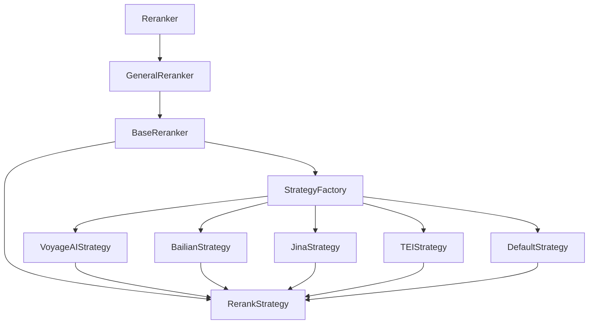
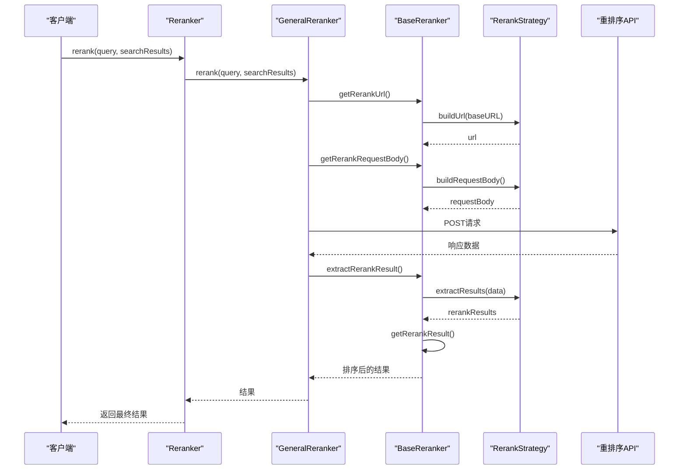
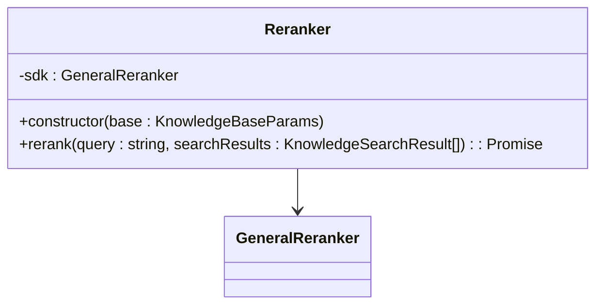
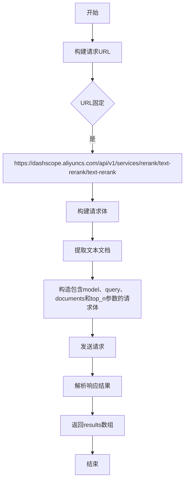
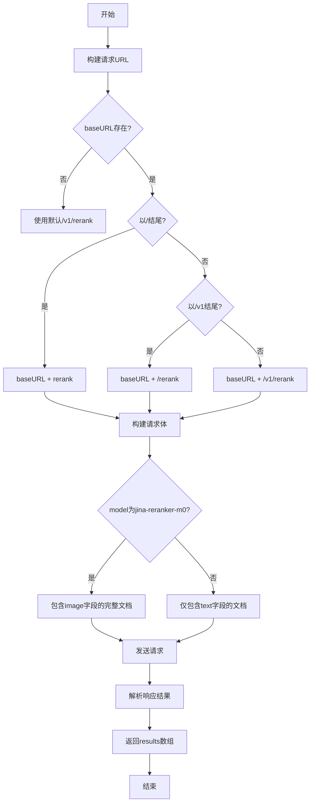
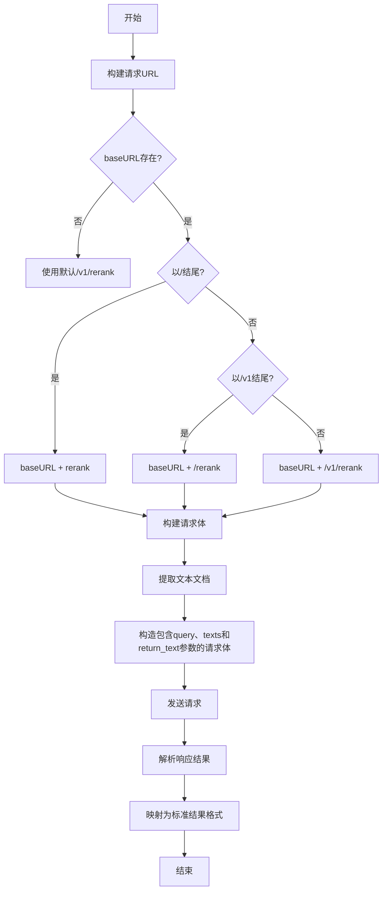
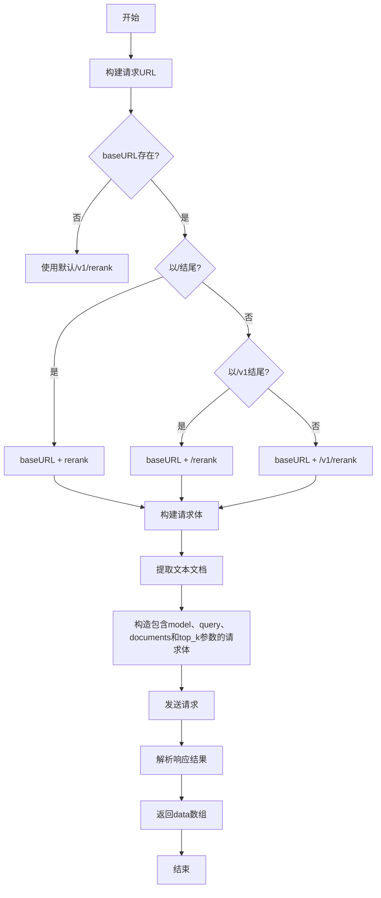
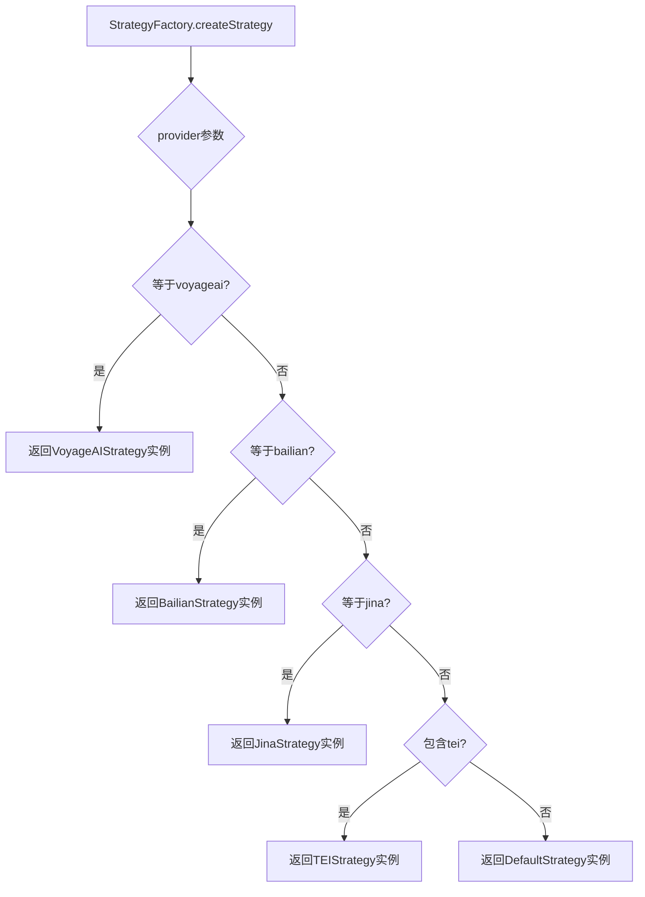
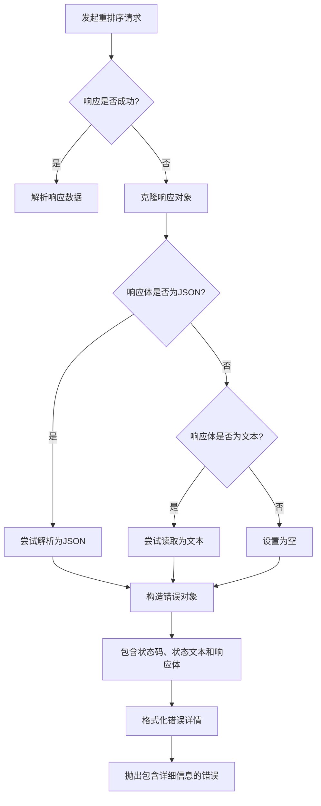

# 文档重排序

<cite>
**本文档中引用的文件**  
- [BaseReranker.ts](file://src/main/knowledge/reranker/BaseReranker.ts)
- [GeneralReranker.ts](file://src/main/knowledge/reranker/GeneralReranker.ts)
- [Reranker.ts](file://src/main/knowledge/reranker/Reranker.ts)
- [StrategyFactory.ts](file://src/main/knowledge/reranker/strategies/StrategyFactory.ts)
- [BailianStrategy.ts](file://src/main/knowledge/reranker/strategies/BailianStrategy.ts)
- [JinaStrategy.ts](file://src/main/knowledge/reranker/strategies/JinaStrategy.ts)
- [TeiStrategy.ts](file://src/main/knowledge/reranker/strategies/TeiStrategy.ts)
- [VoyageStrategy.ts](file://src/main/knowledge/reranker/strategies/VoyageStrategy.ts)
- [DefaultStrategy.ts](file://src/main/knowledge/reranker/strategies/DefaultStrategy.ts)
- [RerankStrategy.ts](file://src/main/knowledge/reranker/strategies/RerankStrategy.ts)
- [types.ts](file://src/main/knowledge/reranker/strategies/types.ts)
</cite>

## 目录
1. [简介](#简介)
2. [核心组件](#核心组件)
3. [架构概述](#架构概述)
4. [详细组件分析](#详细组件分析)
5. [重排序策略实现](#重排序策略实现)
6. [策略工厂机制](#策略工厂机制)
7. [性能优化与错误处理](#性能优化与错误处理)
8. [使用指南](#使用指南)
9. [自定义开发指导](#自定义开发指导)
10. [结论](#结论)

## 简介
文档重排序功能是Cherry Studio知识检索系统中的关键组件，用于对初步搜索结果进行相关性重排序，以提高检索结果的质量和准确性。该功能通过集成多种先进的重排序模型，实现了灵活、可扩展的重排序体系，支持多种第三方重排序服务提供商。

## 核心组件

文档重排序系统由多个核心组件构成，包括抽象基类、具体实现类、策略接口和工厂模式等。这些组件共同协作，实现了灵活的重排序功能。

**核心组件**
- `BaseReranker`: 重排序器的抽象基类，定义了通用的重排序流程和模板方法
- `GeneralReranker`: 基于Electron网络模块的具体重排序实现
- `Reranker`: 对外暴露的重排序器接口类
- `RerankStrategy`: 重排序策略接口，定义了不同提供商的实现规范
- `StrategyFactory`: 策略工厂类，负责根据配置创建相应的重排序策略实例

**Section sources**
- [BaseReranker.ts](file://src/main/knowledge/reranker/BaseReranker.ts#L7-L89)
- [GeneralReranker.ts](file://src/main/knowledge/reranker/GeneralReranker.ts#L14-L65)
- [Reranker.ts](file://src/main/knowledge/reranker/Reranker.ts#L5-L14)
- [RerankStrategy.ts](file://src/main/knowledge/reranker/strategies/RerankStrategy.ts#L5-L9)

## 架构概述

文档重排序系统的架构采用分层设计和策略模式，实现了高内聚、低耦合的设计原则。系统通过抽象基类定义通用流程，通过策略接口支持多种重排序服务，通过工厂模式实现运行时的策略选择。



**Diagram sources**
- [Reranker.ts](file://src/main/knowledge/reranker/Reranker.ts#L5-L14)
- [GeneralReranker.ts](file://src/main/knowledge/reranker/GeneralReranker.ts#L14-L65)
- [BaseReranker.ts](file://src/main/knowledge/reranker/BaseReranker.ts#L7-L89)
- [StrategyFactory.ts](file://src/main/knowledge/reranker/strategies/StrategyFactory.ts#L9-L26)

## 详细组件分析

### BaseReranker抽象类分析

`BaseReranker`是文档重排序系统的抽象基类，采用模板方法设计模式，定义了重排序的核心流程和通用逻辑。该类通过依赖注入的方式接收知识库参数，并利用策略工厂创建相应的重排序策略实例。

```mermaid
classDiagram
class BaseReranker {
-base : KnowledgeBaseParams
-strategy : RerankStrategy
+constructor(base : KnowledgeBaseParams)
+abstract rerank(query : string, searchResults : KnowledgeSearchResult[]) : Promise<KnowledgeSearchResult[]>
+getRerankUrl() : string
+getRerankRequestBody(query : string, searchResults : KnowledgeSearchResult[]) : any
+getRerankResult(searchResults : KnowledgeSearchResult[], rerankResults : Array<{index : number, relevance_score : number}>) : KnowledgeSearchResult[]
+defaultHeaders() : object
+formatErrorMessage(url : string, error : any, requestBody : any) : string
}
BaseReranker <|-- GeneralReranker
```

**Diagram sources**
- [BaseReranker.ts](file://src/main/knowledge/reranker/BaseReranker.ts#L7-L89)

**Section sources**
- [BaseReranker.ts](file://src/main/knowledge/reranker/BaseReranker.ts#L7-L89)

### GeneralReranker实现类分析

`GeneralReranker`是`BaseReranker`的具体实现类，负责执行实际的HTTP请求操作。该类使用Electron的网络模块发送重排序请求，并处理响应结果和错误情况。



**Diagram sources**
- [GeneralReranker.ts](file://src/main/knowledge/reranker/GeneralReranker.ts#L14-L65)
- [BaseReranker.ts](file://src/main/knowledge/reranker/BaseReranker.ts#L19-L27)

**Section sources**
- [GeneralReranker.ts](file://src/main/knowledge/reranker/GeneralReranker.ts#L14-L65)

### Reranker接口类分析

`Reranker`类是对外暴露的重排序器接口，作为系统的门面模式实现，简化了客户端的使用复杂度。该类封装了`GeneralReranker`的实例化过程，提供了简洁的API接口。



**Diagram sources**
- [Reranker.ts](file://src/main/knowledge/reranker/Reranker.ts#L5-L14)

**Section sources**
- [Reranker.ts](file://src/main/knowledge/reranker/Reranker.ts#L5-L14)

## 重排序策略实现

### 重排序策略接口

所有重排序策略都实现了`RerankStrategy`接口，该接口定义了三个核心方法：`buildUrl`、`buildRequestBody`和`extractResults`，确保了不同提供商的实现具有统一的调用方式。

```mermaid
classDiagram
class RerankStrategy {
<<interface>>
+buildUrl(baseURL? : string) : string
+buildRequestBody(query : string, documents : MultiModalDocument[], topN : number, model? : string) : any
+extractResults(data : any) : Array<{index : number, relevance_score : number}>
}
class MultiModalDocument {
+text? : string
+image? : string
}
RerankStrategy <|-- VoyageAIStrategy
RerankStrategy <|-- BailianStrategy
RerankStrategy <|-- JinaStrategy
RerankStrategy <|-- TEIStrategy
RerankStrategy <|-- DefaultStrategy
```

**Diagram sources**
- [RerankStrategy.ts](file://src/main/knowledge/reranker/strategies/RerankStrategy.ts#L5-L9)
- [BailianStrategy.ts](file://src/main/knowledge/reranker/strategies/BailianStrategy.ts#L2-L19)
- [JinaStrategy.ts](file://src/main/knowledge/reranker/strategies/JinaStrategy.ts#L2-L34)

### BailianStrategy实现

`BailianStrategy`是针对阿里云百炼平台的重排序策略实现，具有固定的API端点和特定的请求体结构。



**Diagram sources**
- [BailianStrategy.ts](file://src/main/knowledge/reranker/strategies/BailianStrategy.ts#L2-L19)

**Section sources**
- [BailianStrategy.ts](file://src/main/knowledge/reranker/strategies/BailianStrategy.ts#L2-L19)

### JinaStrategy实现

`JinaStrategy`是针对Jina AI平台的重排序策略实现，支持自定义基础URL，并根据模型类型调整请求体结构。



**Diagram sources**
- [JinaStrategy.ts](file://src/main/knowledge/reranker/strategies/JinaStrategy.ts#L2-L34)

**Section sources**
- [JinaStrategy.ts](file://src/main/knowledge/reranker/strategies/JinaStrategy.ts#L2-L34)

### TeiStrategy实现

`TEIStrategy`是针对Text Embeddings Inference (TEI) 服务的重排序策略实现，专为本地或自托管的重排序服务设计。



**Diagram sources**
- [TeiStrategy.ts](file://src/main/knowledge/reranker/strategies/TeiStrategy.ts#L2-L27)

**Section sources**
- [TeiStrategy.ts](file://src/main/knowledge/reranker/strategies/TeiStrategy.ts#L2-L27)

### VoyageStrategy实现

`VoyageAIStrategy`是针对Voyage AI平台的重排序策略实现，具有与其他策略相似的URL构建逻辑，但在请求参数命名上有所区别。



**Diagram sources**
- [VoyageStrategy.ts](file://src/main/knowledge/reranker/strategies/VoyageStrategy.ts#L2-L25)

**Section sources**
- [VoyageStrategy.ts](file://src/main/knowledge/reranker/strategies/VoyageStrategy.ts#L2-L25)

### DefaultStrategy实现

`DefaultStrategy`是默认的重排序策略实现，用于处理未知或未指定的重排序提供商，提供了基本的重排序功能。


**Diagram sources**
- [DefaultStrategy.ts](file://src/main/knowledge/reranker/strategies/DefaultStrategy.ts#L2-L26)

**Section sources**
- [DefaultStrategy.ts](file://src/main/knowledge/reranker/strategies/DefaultStrategy.ts#L2-L26)

## 策略工厂机制

策略工厂模式是文档重排序系统的核心设计之一，通过`StrategyFactory`类实现了重排序策略的动态创建和管理。



**Diagram sources**
- [StrategyFactory.ts](file://src/main/knowledge/reranker/strategies/StrategyFactory.ts#L9-L26)
- [types.ts](file://src/main/knowledge/reranker/strategies/types.ts#L3-L8)

**Section sources**
- [StrategyFactory.ts](file://src/main/knowledge/reranker/strategies/StrategyFactory.ts#L9-L26)

## 性能优化与错误处理

### 性能优化机制

文档重排序系统在设计时考虑了多种性能优化策略：

1. **请求体优化**: 只提取必要的文本内容，避免传输冗余数据
2. **URL构建优化**: 智能处理基础URL，确保正确的API端点
3. **内存优化**: 使用流式处理和及时释放引用，减少内存占用

### 错误处理机制

系统实现了完善的错误处理机制，确保在API调用失败时能够提供详细的错误信息：



**Section sources**
- [GeneralReranker.ts](file://src/main/knowledge/reranker/GeneralReranker.ts#L18-L65)
- [BaseReranker.ts](file://src/main/knowledge/reranker/BaseReranker.ts#L77-L87)

## 使用指南

### 基本使用方法

对于初学者，文档重排序功能的使用非常简单：

1. 创建`KnowledgeBaseParams`对象，包含重排序API客户端配置
2. 实例化`Reranker`类
3. 调用`rerank`方法进行重排序

```typescript
const reranker = new Reranker({
  rerankApiClient: {
    provider: 'voyageai',
    apiKey: 'your-api-key',
    model: 'voyage-2',
    baseURL: 'https://api.voyageai.com'
  },
  documentCount: 10
});

const results = await reranker.rerank('查询文本', searchResults);
```

### 配置选项

重排序功能支持多种配置选项：

- `provider`: 指定重排序服务提供商
- `apiKey`: API认证密钥
- `model`: 指定使用的模型
- `baseURL`: 自定义API基础URL
- `documentCount`: 返回的文档数量

## 自定义开发指导

### 实现新的重排序策略

要实现新的重排序策略，需要遵循以下步骤：

1. 创建新的策略类，实现`RerankStrategy`接口
2. 实现`buildUrl`方法，定义API端点
3. 实现`buildRequestBody`方法，构造请求体
4. 实现`extractResults`方法，解析响应结果
5. 在`StrategyFactory`中添加新的策略分支

### 技术优化建议

1. **缓存机制**: 对频繁查询的结果进行缓存
2. **批量处理**: 支持批量重排序请求
3. **超时控制**: 设置合理的请求超时时间
4. **重试机制**: 实现指数退避重试策略
5. **监控指标**: 添加性能监控和日志记录

## 结论

Cherry Studio的文档重排序功能通过精心设计的架构和灵活的策略模式，实现了高效、可扩展的重排序能力。系统采用分层设计，将通用逻辑与具体实现分离，通过工厂模式支持多种重排序服务提供商。该设计不仅提高了代码的可维护性，还为未来的功能扩展提供了良好的基础。对于开发者而言，系统提供了清晰的接口和扩展点，使得集成新的重排序服务变得简单高效。