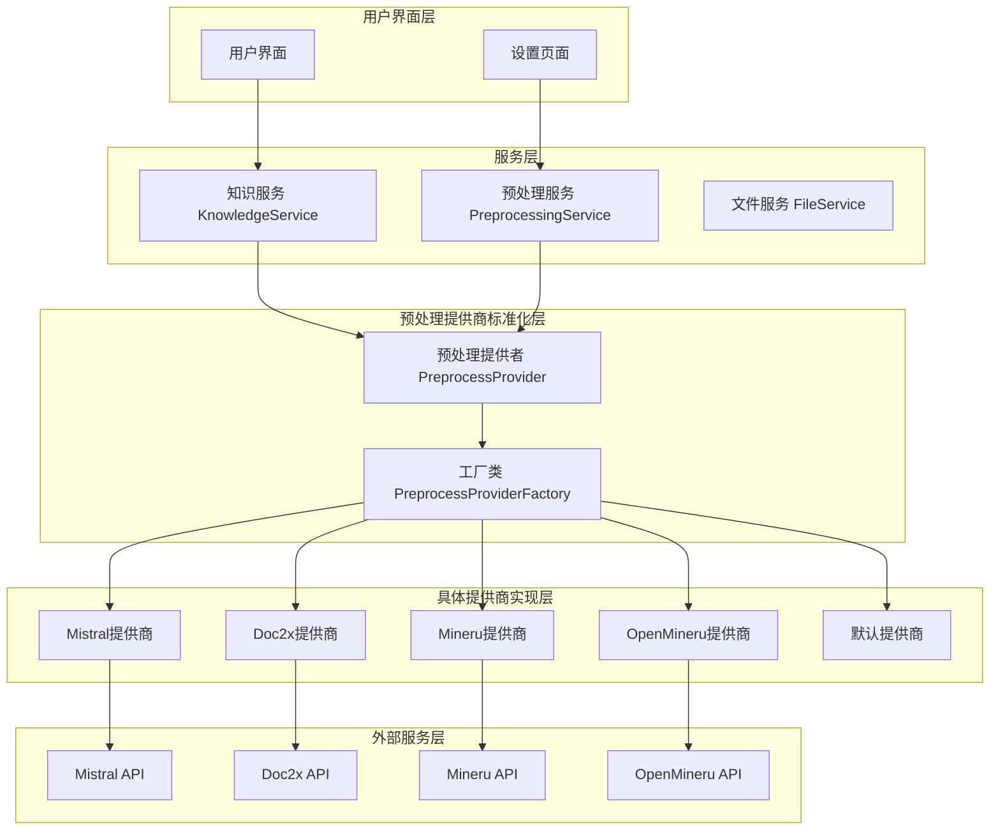
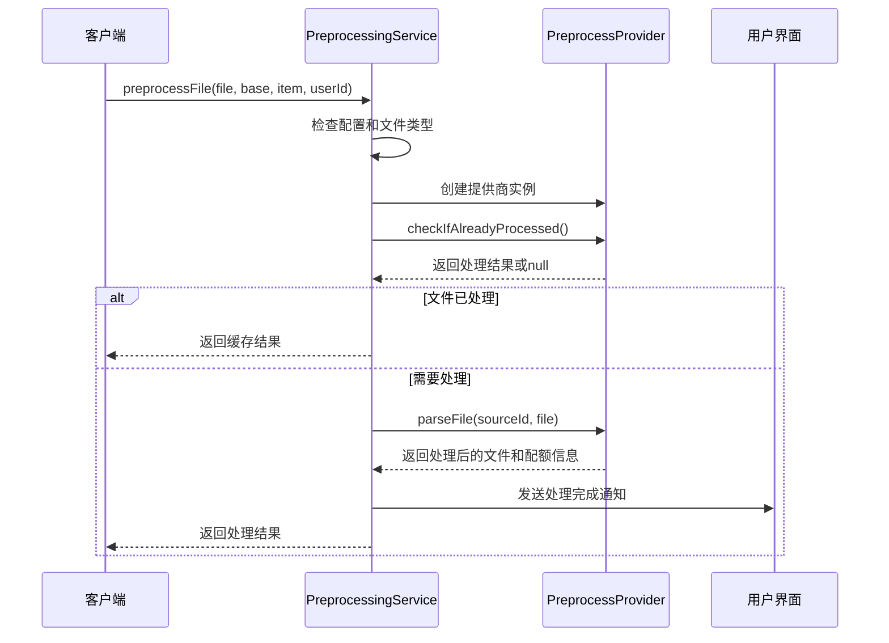
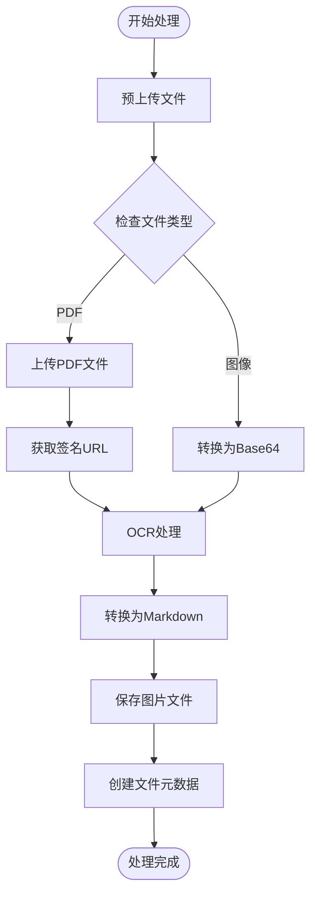
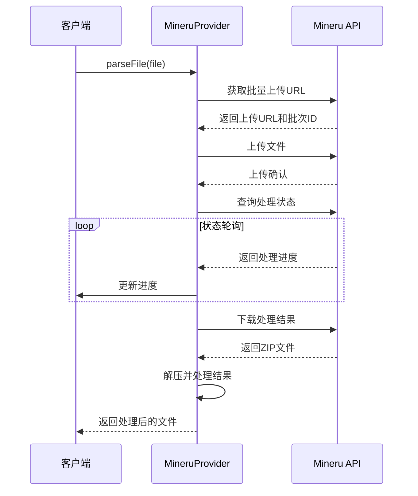
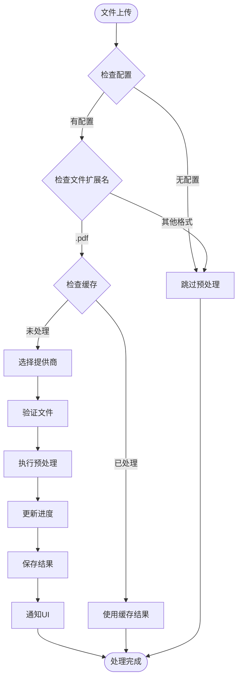
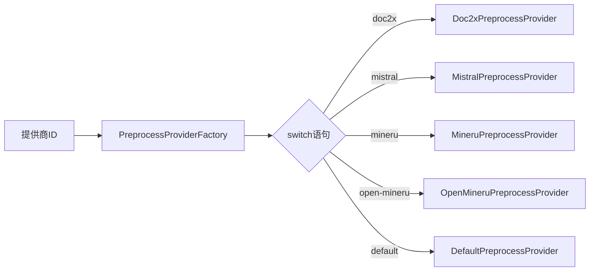
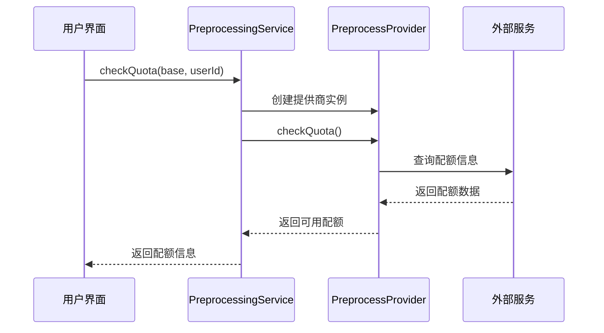
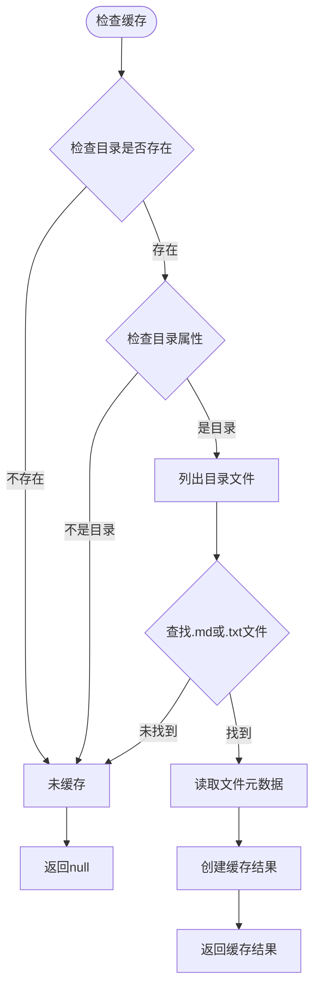
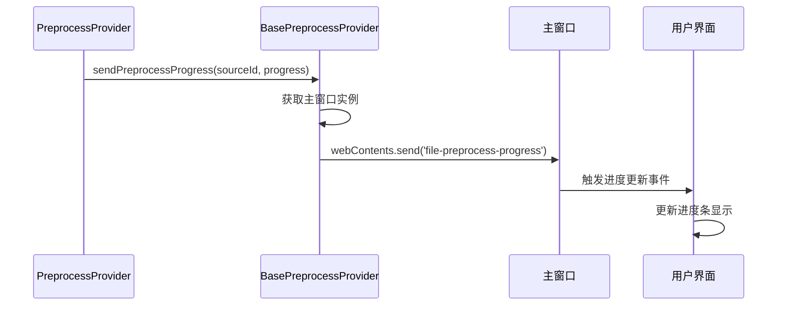
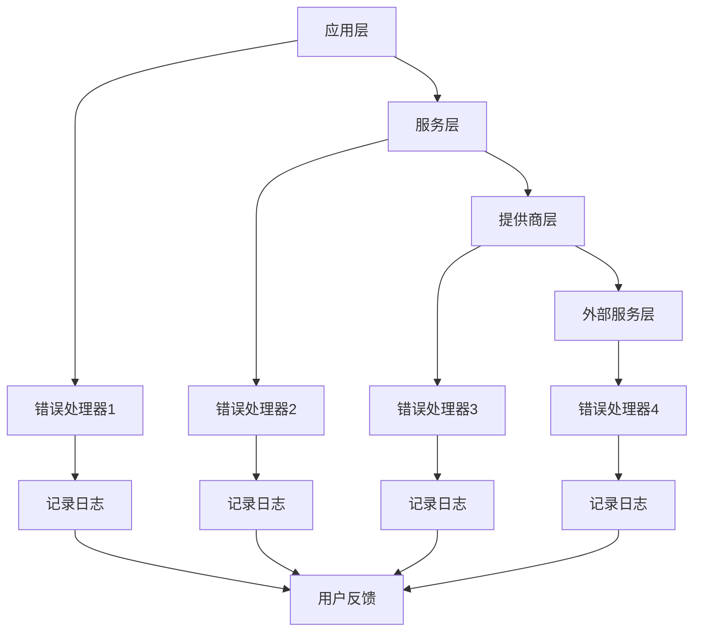

# 文档预处理功能文档

<cite>
**本文档中引用的文件**
- [PreprocessingService.ts](file://src/main/knowledge/preprocess/PreprocessingService.ts)
- [BasePreprocessProvider.ts](file://src/main/knowledge/preprocess/BasePreprocessProvider.ts)
- [MistralPreprocessProvider.ts](file://src/main/knowledge/preprocess/MistralPreprocessProvider.ts)
- [Doc2xPreprocessProvider.ts](file://src/main/knowledge/preprocess/Doc2xPreprocessProvider.ts)
- [OpenMineruPreprocessProvider.ts](file://src/main/knowledge/preprocess/OpenMineruPreprocessProvider.ts)
- [MineruPreprocessProvider.ts](file://src/main/knowledge/preprocess/MineruPreprocessProvider.ts)
- [PreprocessProvider.ts](file://src/main/knowledge/preprocess/PreprocessProvider.ts)
- [PreprocessProviderFactory.ts](file://src/main/knowledge/preprocess/PreprocessProviderFactory.ts)
- [DefaultPreprocessProvider.ts](file://src/main/knowledge/preprocess/DefaultPreprocessProvider.ts)
- [KnowledgeService.ts](file://src/main/services/KnowledgeService.ts)
- [preprocessProviders.ts](file://src/renderer/src/config/preprocessProviders.ts)
</cite>

## 目录
1. [简介](#简介)
2. [系统架构](#系统架构)
3. [核心组件分析](#核心组件分析)
4. [预处理提供商详解](#预处理提供商详解)
5. [工作流程](#工作流程)
6. [配额检查机制](#配额检查机制)
7. [缓存策略](#缓存策略)
8. [进度通知功能](#进度通知功能)
9. [错误处理机制](#错误处理机制)
10. [使用指南](#使用指南)
11. [开发指导](#开发指导)
12. [性能优化建议](#性能优化建议)

## 简介

Cherry Studio的文档预处理功能是一个强大的文档解析和格式转换系统，专门用于处理扫描版PDF文档和其他格式的文件。该系统通过多种预处理提供商（PreprocessProvider）支持不同的文档处理服务，包括OCR识别、格式转换和内容提取等功能。

预处理功能的核心目标是将复杂的扫描版PDF文档转换为结构化的文本格式，便于后续的知识库构建和智能检索。系统采用模块化设计，支持多种第三方服务提供商，同时具备完善的缓存机制和进度通知功能。

## 系统架构

### 整体架构图



**图表来源**
- [PreprocessingService.ts](file://src/main/knowledge/preprocess/PreprocessingService.ts#L1-L64)
- [PreprocessProvider.ts](file://src/main/knowledge/preprocess/PreprocessProvider.ts#L1-L31)
- [PreprocessProviderFactory.ts](file://src/main/knowledge/preprocess/PreprocessProviderFactory.ts#L1-L25)

### 核心设计模式

系统采用了以下设计模式：

1. **工厂模式（Factory Pattern）**：通过`PreprocessProviderFactory`根据提供商ID创建相应的具体提供商实例
2. **抽象工厂模式**：`BasePreprocessProvider`作为抽象基类，定义了所有提供商的通用接口
3. **策略模式（Strategy Pattern）**：不同提供商实现不同的文档处理策略
4. **观察者模式**：通过事件通知机制实现进度更新和状态同步

## 核心组件分析

### PreprocessingService - 预处理服务

`PreprocessingService`是整个预处理系统的核心协调器，负责管理预处理流程的完整生命周期。

#### 主要职责

- **文件预处理协调**：根据配置决定是否对特定文件执行预处理
- **缓存检查**：检查文件是否已经预处理过，避免重复处理
- **提供商调用**：动态选择合适的预处理提供商并调用其处理方法
- **进度通知**：向UI层发送处理进度和完成状态通知
- **错误处理**：捕获和处理预处理过程中的异常

#### 关键方法



**图表来源**
- [PreprocessingService.ts](file://src/main/knowledge/preprocess/PreprocessingService.ts#L9-L63)

**章节来源**
- [PreprocessingService.ts](file://src/main/knowledge/preprocess/PreprocessingService.ts#L1-L64)

### BasePreprocessProvider - 抽象基类

`BasePreprocessProvider`是所有具体预处理提供商的抽象基类，定义了预处理功能的标准接口和通用行为。

#### 设计理念

1. **标准化接口**：强制所有子类实现`parseFile`和`checkQuota`方法
2. **通用功能**：提供文件缓存检查、进度通知、文件移动等通用功能
3. **错误处理**：统一的错误处理和日志记录机制
4. **资源管理**：自动管理临时文件和目录

#### 核心功能

- **缓存检查机制**：通过文件ID检查目录是否存在来判断是否已处理
- **进度通知**：通过IPC通信向主进程发送处理进度
- **文件操作**：提供文件移动和附件管理功能
- **PDF验证**：内置PDF文件的基本验证功能

**章节来源**
- [BasePreprocessProvider.ts](file://src/main/knowledge/preprocess/BasePreprocessProvider.ts#L1-L134)

## 预处理提供商详解

### MistralPreprocessProvider - Mistral提供商

Mistral提供商基于Mistral AI的OCR服务，专门处理图像格式的文档识别。

#### 支持的文档格式
- PDF文件（自动转换为图像URL）
- 图像文件（PNG、JPG等）

#### 处理特点
- **云端OCR处理**：利用Mistral AI的强大OCR能力
- **多格式支持**：支持多种图像格式的识别
- **高质量输出**：生成结构化的Markdown格式
- **实时进度反馈**：提供详细的处理进度信息

#### 实现流程



**图表来源**
- [MistralPreprocessProvider.ts](file://src/main/knowledge/preprocess/MistralPreprocessProvider.ts#L77-L193)

**章节来源**
- [MistralPreprocessProvider.ts](file://src/main/knowledge/preprocess/MistralPreprocessProvider.ts#L1-L193)

### Doc2xPreprocessProvider - Doc2x提供商

Doc2x提供商基于Doc2x服务，提供专业的文档格式转换功能。

#### 支持的文档格式
- PDF文件（主要支持格式）
- 限制：最大300MB，最多1000页

#### 处理特点
- **流式上传**：支持大文件的分块上传
- **异步处理**：支持长时间运行的文档处理任务
- **进度监控**：实时监控处理进度
- **批量处理**：支持批量文档处理

#### 技术实现

系统实现了完整的RESTful API交互流程：

1. **预上传阶段**：获取上传URL和唯一标识符
2. **文件上传**：使用PUT请求进行流式上传
3. **状态轮询**：定期检查处理状态
4. **结果下载**：下载处理完成的压缩包
5. **文件解压**：解压并提取处理结果

**章节来源**
- [Doc2xPreprocessProvider.ts](file://src/main/knowledge/preprocess/Doc2xPreprocessProvider.ts#L1-L375)

### OpenMineruPreprocessProvider - 开源Mineru提供商

开源Mineru提供商基于MinerU项目的开源版本，提供本地部署的文档处理能力。

#### 支持的文档格式
- PDF文件（主要支持格式）
- 限制：最大200MB，最多600页

#### 处理特点
- **本地处理**：完全在本地服务器上运行
- **无限配额**：自托管版本无配额限制
- **高精度识别**：支持公式和表格识别
- **批量处理**：支持批量文档处理

#### 错误处理策略

系统实现了多层次的错误处理：

1. **文件大小验证**：在读取文件前检查大小限制
2. **PDF结构验证**：尝试解析PDF结构，失败时记录警告而非中断
3. **重试机制**：网络请求失败时自动重试
4. **降级处理**：部分功能失败时继续处理其他内容

**章节来源**
- [OpenMineruPreprocessProvider.ts](file://src/main/knowledge/preprocess/OpenMineruPreprocessProvider.ts#L1-L225)

### MineruPreprocessProvider - 商业Mineru提供商

商业Mineru提供商基于MinerU的付费服务，提供企业级的文档处理解决方案。

#### 支持的文档格式
- PDF文件（主要支持格式）
- 限制：最大200MB，最多600页

#### 处理特点
- **企业级服务**：提供稳定可靠的商业服务
- **配额管理**：支持详细的配额查询和管理
- **高级功能**：支持公式识别、表格识别等高级功能
- **批量处理**：支持大规模批量处理

#### API交互流程



**图表来源**
- [MineruPreprocessProvider.ts](file://src/main/knowledge/preprocess/MineruPreprocessProvider.ts#L63-L435)

**章节来源**
- [MineruPreprocessProvider.ts](file://src/main/knowledge/preprocess/MineruPreprocessProvider.ts#L1-L435)

### DefaultPreprocessProvider - 默认提供商

默认提供商作为兜底方案，当没有合适的提供商可用时使用。

#### 功能特点
- **空实现**：所有方法都抛出未实现异常
- **扩展点**：为未来添加新的提供商提供接口
- **错误提示**：明确指示功能尚未实现

**章节来源**
- [DefaultPreprocessProvider.ts](file://src/main/knowledge/preprocess/DefaultPreprocessProvider.ts#L1-L17)

## 工作流程

### 预处理触发条件

预处理功能只在以下条件下触发：
1. 知识库配置了预处理提供商
2. 文件扩展名为`.pdf`
3. 文件尚未被预处理过

### 完整处理流程



**图表来源**
- [PreprocessingService.ts](file://src/main/knowledge/preprocess/PreprocessingService.ts#L9-L63)
- [KnowledgeService.ts](file://src/main/services/KnowledgeService.ts#L689-L725)

### 具体提供商选择逻辑

系统通过`PreprocessProviderFactory`根据提供商ID选择合适的具体实现：



**图表来源**
- [PreprocessProviderFactory.ts](file://src/main/knowledge/preprocess/PreprocessProviderFactory.ts#L10-L23)

**章节来源**
- [PreprocessProviderFactory.ts](file://src/main/knowledge/preprocess/PreprocessProviderFactory.ts#L1-L25)

## 配额检查机制

### 配额检查架构

每个提供商都有自己的配额检查机制，系统通过统一的接口进行管理。

#### 配额检查流程



**图表来源**
- [PreprocessingService.ts](file://src/main/knowledge/preprocess/PreprocessingService.ts#L49-L60)

### 各提供商的配额策略

| 提供商 | 配额类型 | 检查方式 | 特点 |
|--------|----------|----------|------|
| Mistral | 无限制 | 不适用 | 基于API调用次数 |
| Doc2x | 无限制 | 不适用 | 基于API调用次数 |
| Mineru | 有限制 | API查询 | 支持用户配额管理 |
| OpenMineru | 无限 | 固定返回 | 自托管版本无限制 |

**章节来源**
- [PreprocessingService.ts](file://src/main/knowledge/preprocess/PreprocessingService.ts#L49-L60)

## 缓存策略

### 缓存机制设计

系统实现了基于文件ID的智能缓存机制，避免重复处理相同的文件。

#### 缓存检查算法



**图表来源**
- [BasePreprocessProvider.ts](file://src/main/knowledge/preprocess/BasePreprocessProvider.ts#L46-L83)

#### 缓存存储结构

系统使用统一的存储路径：`Data/Files/{file.id}/`，其中：
- `{file.id}`是文件的唯一标识符
- 目录中包含处理后的文档文件
- 可能包含相关的图片资源文件

**章节来源**
- [BasePreprocessProvider.ts](file://src/main/knowledge/preprocess/BasePreprocessProvider.ts#L46-L83)

## 进度通知功能

### 进度通知机制

系统提供了完整的进度通知机制，确保用户能够实时了解处理状态。

#### 通知流程



**图表来源**
- [BasePreprocessProvider.ts](file://src/main/knowledge/preprocess/BasePreprocessProvider.ts#L100-L106)

### 进度更新时机

不同提供商在不同阶段发送进度通知：

1. **Mistral提供商**：上传阶段（15%-20%），处理阶段（100%）
2. **Doc2x提供商**：状态轮询期间（0%-100%）
3. **Mineru提供商**：处理过程中（基于页面进度）
4. **OpenMineru提供商**：关键节点（50%）

**章节来源**
- [BasePreprocessProvider.ts](file://src/main/knowledge/preprocess/BasePreprocessProvider.ts#L100-L106)

## 错误处理机制

### 分层错误处理

系统实现了多层次的错误处理机制，确保系统的稳定性和用户体验。

#### 错误处理层次



### 具体错误处理策略

#### 文件验证错误

各提供商都实现了严格的文件验证：

- **大小限制**：防止处理超大文件导致内存溢出
- **页数限制**：避免处理过于复杂的文档
- **格式验证**：确保文件格式符合要求

#### 网络请求错误

对于依赖外部服务的提供商：

- **重试机制**：网络不稳定时自动重试
- **超时处理**：设置合理的超时时间
- **降级策略**：部分功能失败时继续处理其他内容

#### 异常恢复

系统在遇到错误时会：
1. 记录详细的错误日志
2. 清理临时文件和资源
3. 向用户报告错误信息
4. 在可能的情况下提供降级处理

**章节来源**
- [OpenMineruPreprocessProvider.ts](file://src/main/knowledge/preprocess/OpenMineruPreprocessProvider.ts#L55-L93)
- [Doc2xPreprocessProvider.ts](file://src/main/knowledge/preprocess/Doc2xPreprocessProvider.ts#L40-L59)

## 使用指南

### 初学者使用指南

#### 1. 配置预处理提供商

首先需要在设置中配置合适的预处理提供商：

1. 打开设置页面
2. 选择"知识库"选项卡
3. 配置预处理提供商（Doc2x、Mistral、Mineru等）
4. 输入必要的API密钥和配置信息

#### 2. 上传文档

1. 创建新的知识库
2. 添加PDF文档
3. 系统会自动触发预处理流程
4. 在进度条中查看处理状态

#### 3. 查看处理结果

1. 预处理完成后，文档会自动转换为Markdown格式
2. 在知识库中可以查看处理后的文本内容
3. 支持搜索和检索功能

### 高级用户配置

#### 自定义提供商配置

```typescript
// 示例：配置Doc2x提供商
const doc2xProvider = {
  id: 'doc2x',
  name: 'Doc2x',
  apiKey: 'your-api-key',
  apiHost: 'https://api.doc2x.com',
  model: 'standard'
};
```

#### 性能优化配置

- **并发处理**：控制同时处理的文件数量
- **缓存策略**：调整缓存清理频率
- **超时设置**：根据网络状况调整超时时间

## 开发指导

### 自定义预处理提供商开发

#### 1. 继承BasePreprocessProvider

```typescript
import BasePreprocessProvider from './BasePreprocessProvider';

export default class CustomPreprocessProvider extends BasePreprocessProvider {
  constructor(provider: PreprocessProvider) {
    super(provider);
    // 初始化自定义配置
  }
  
  public async parseFile(sourceId: string, file: FileMetadata): Promise<{ processedFile: FileMetadata; quota?: number }> {
    // 实现具体的处理逻辑
  }
  
  public async checkQuota(): Promise<number> {
    // 实现配额检查逻辑
  }
}
```

#### 2. 注册提供商

在`PreprocessProviderFactory`中添加新的提供商：

```typescript
case 'custom':
  return new CustomPreprocessProvider(provider);
```

#### 3. 实现接口规范

必须实现以下方法：

- `parseFile(sourceId: string, file: FileMetadata)`：处理文件的主要方法
- `checkQuota()`：检查可用配额的方法

### 最佳实践

#### 错误处理最佳实践

1. **详细的错误日志**：记录完整的错误上下文
2. **用户友好的错误消息**：避免技术术语，提供解决建议
3. **优雅的降级处理**：在部分功能失败时继续提供基本服务

#### 性能优化最佳实践

1. **异步处理**：使用异步操作避免阻塞主线程
2. **资源管理**：及时释放临时文件和网络连接
3. **缓存策略**：合理使用缓存减少重复处理

#### 测试最佳实践

1. **单元测试**：测试每个方法的功能正确性
2. **集成测试**：测试与外部服务的交互
3. **错误场景测试**：模拟各种错误情况

## 性能优化建议

### 系统级优化

#### 并发控制

- **文件处理队列**：实现优先级队列控制处理顺序
- **资源限制**：设置最大并发数防止资源耗尽
- **负载均衡**：在多个提供商间分配处理任务

#### 内存管理

- **流式处理**：对大文件使用流式处理避免内存溢出
- **及时清理**：处理完成后立即删除临时文件
- **缓存策略**：合理设置缓存大小和过期时间

### 网络优化

#### 请求优化

- **连接池**：复用HTTP连接减少建立连接的开销
- **压缩传输**：启用gzip压缩减少传输数据量
- **断点续传**：支持大文件的断点续传功能

#### 超时配置

```typescript
// 推荐的超时配置
const TIMEOUT_CONFIG = {
  connect: 5000,    // 连接超时
  request: 30000,   // 请求超时
  response: 60000   // 响应超时
};
```

### 存储优化

#### 文件组织

- **分层存储**：按日期或项目分类存储文件
- **压缩存储**：对历史数据进行压缩存储
- **定期清理**：自动清理过期的临时文件

#### 缓存策略

- **智能缓存**：根据使用频率决定缓存策略
- **预加载**：预测用户需求提前处理常用文件
- **分布式缓存**：在多节点环境中共享缓存

### 监控和诊断

#### 性能指标

- **处理速度**：平均处理时间和峰值处理能力
- **错误率**：各类错误的发生频率
- **资源使用**：CPU、内存、磁盘和网络使用情况

#### 日志分析

- **结构化日志**：使用JSON格式记录详细日志
- **链路追踪**：跟踪请求在整个系统中的流转
- **性能分析**：分析慢查询和性能瓶颈

通过以上优化措施，可以显著提升预处理系统的性能和稳定性，为用户提供更好的使用体验。