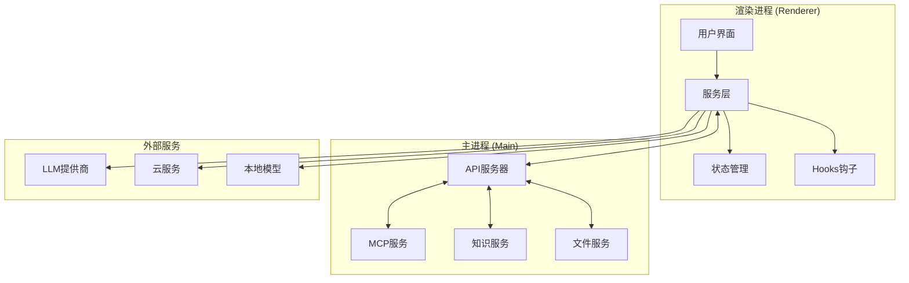
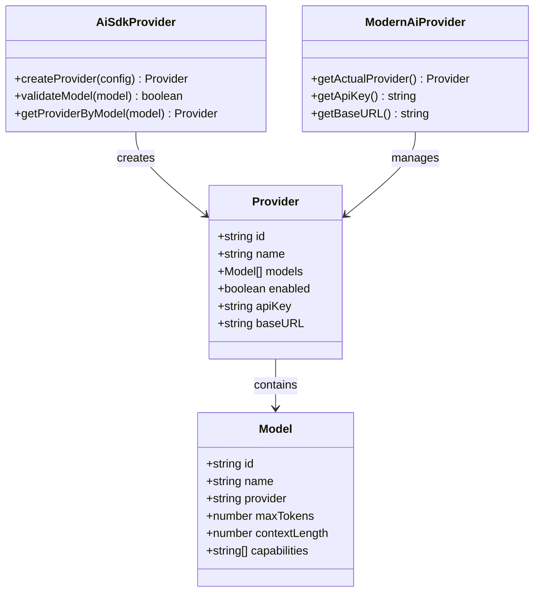
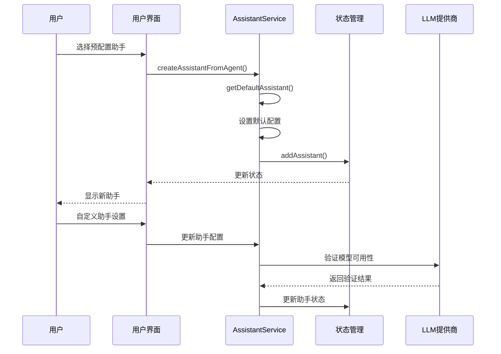
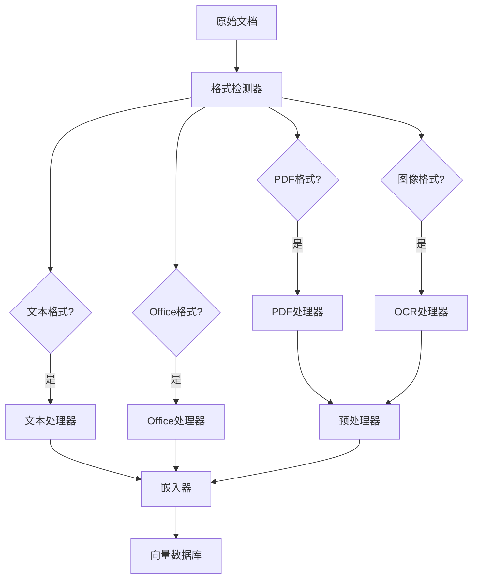
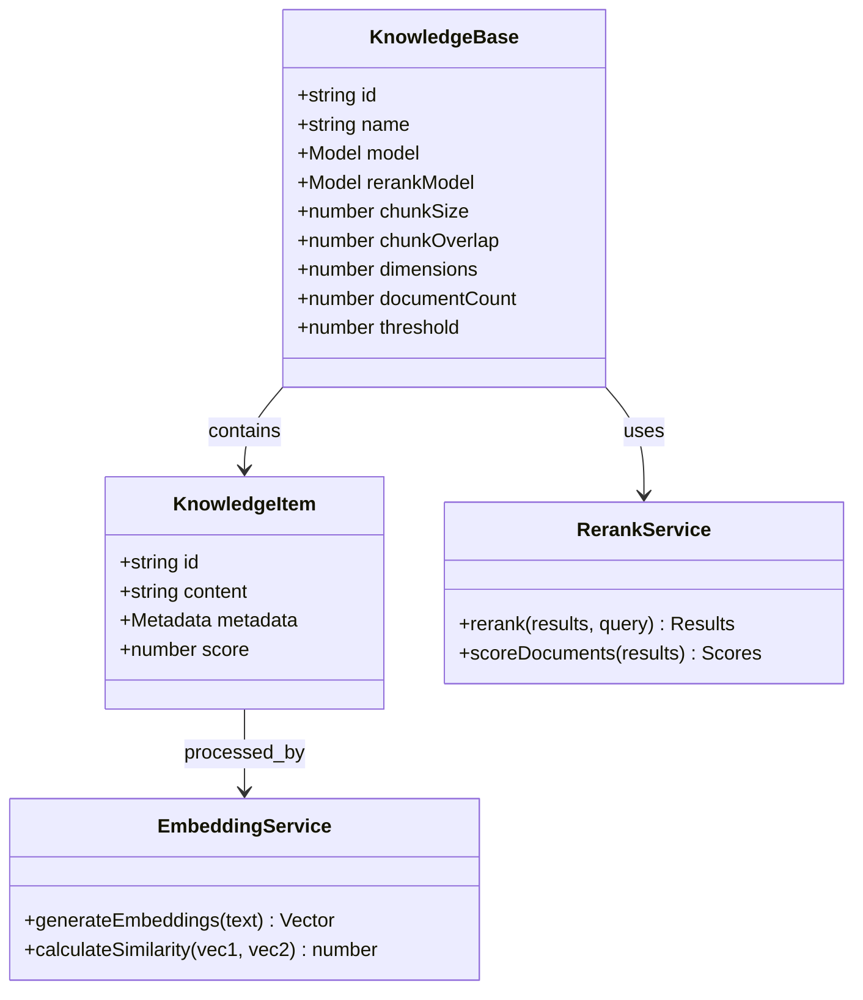
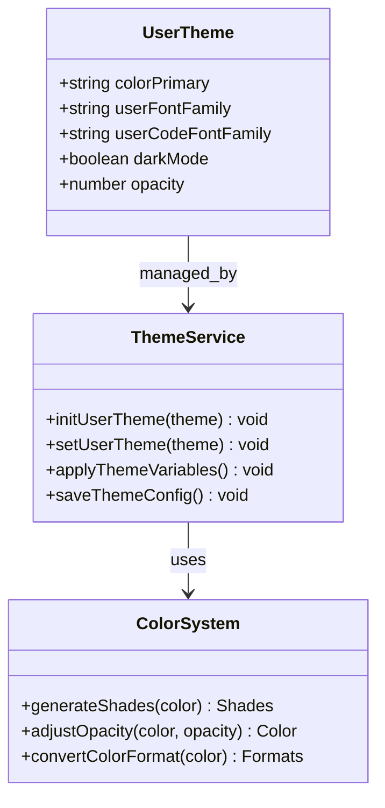
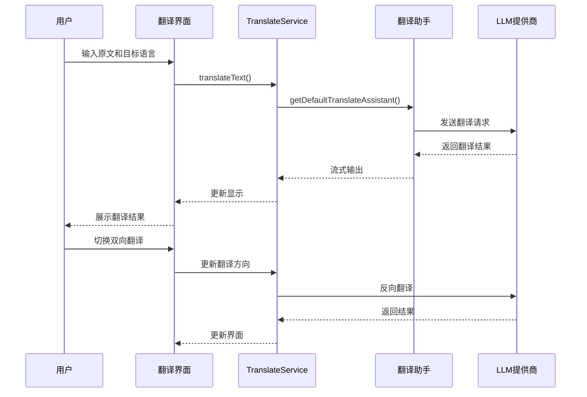
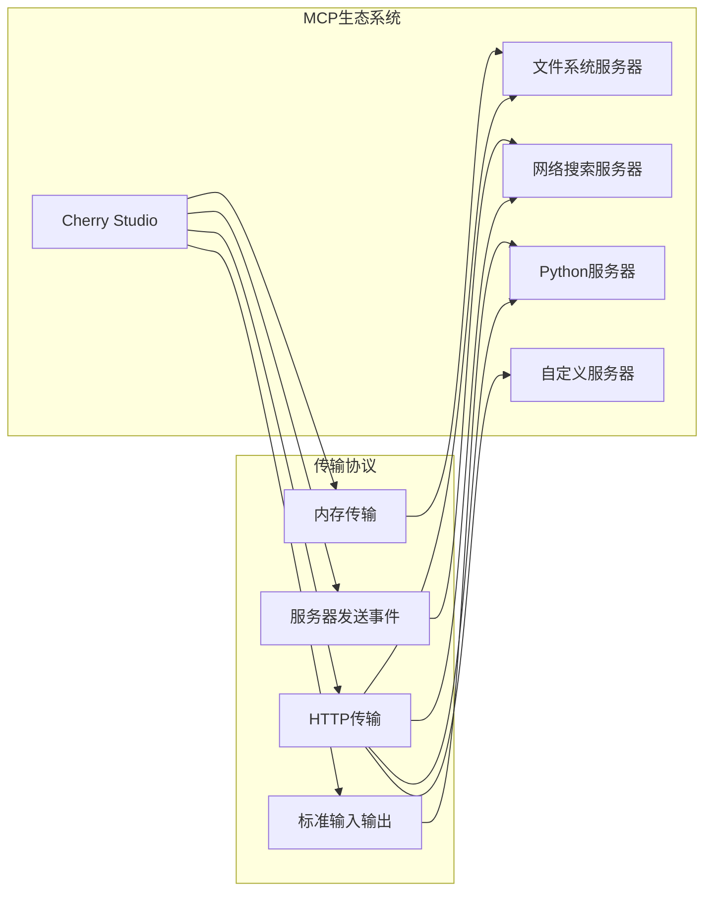
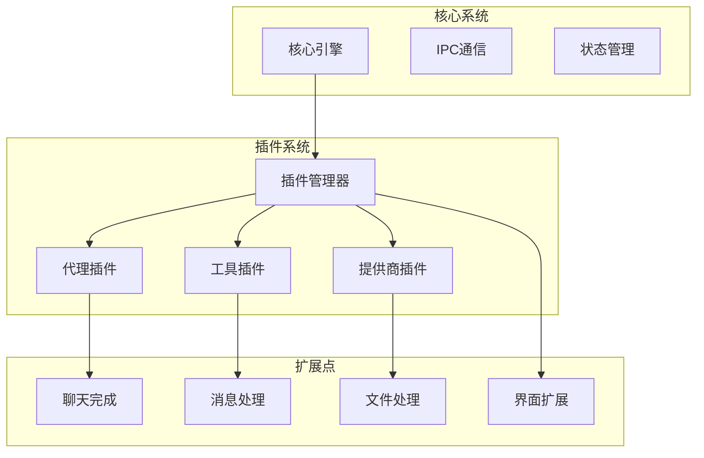

# Cherry Studio 核心功能文档

<cite>
**本文档引用的文件**
- [README.md](file://README.md)
- [package.json](file://package.json)
- [AssistantService.ts](file://src/renderer/src/services/AssistantService.ts)
- [KnowledgeService.ts](file://src/renderer/src/services/KnowledgeService.ts)
- [TranslateService.ts](file://src/renderer/src/services/TranslateService.ts)
- [MCPService.ts](file://src/main/services/MCPService.ts)
- [constant.ts](file://src/renderer/src/config/constant.ts)
- [useUserTheme.ts](file://src/renderer/src/hooks/useUserTheme.ts)
- [BasePreprocessProvider.ts](file://src/main/knowledge/preprocess/BasePreprocessProvider.ts)
- [MistralPreprocessProvider.ts](file://src/main/knowledge/preprocess/MistralPreprocessProvider.ts)
- [Doc2xPreprocessProvider.ts](file://src/main/knowledge/preprocess/Doc2xPreprocessProvider.ts)
- [MineruPreprocessProvider.ts](file://src/main/knowledge/preprocess/MineruPreprocessProvider.ts)
- [PreprocessingService.ts](file://src/main/knowledge/preprocess/PreprocessingService.ts)
- [OvOcrService.ts](file://src/main/services/ocr/builtin/OvOcrService.ts)
- [FileStorage.ts](file://src/main/services/FileStorage.ts)
</cite>

## 目录
1. [简介](#简介)
2. [项目架构概览](#项目架构概览)
3. [多LLM支持功能](#多llm支持功能)
4. [AI助手管理功能](#ai助手管理功能)
5. [文档处理功能](#文档处理功能)
6. [实用工具功能](#实用工具功能)
7. [系统集成与扩展](#系统集成与扩展)
8. [性能优化与最佳实践](#性能优化与最佳实践)
9. [故障排除指南](#故障排除指南)
10. [总结](#总结)

## 简介

Cherry Studio 是一个功能强大的桌面AI助手客户端，支持多种LLM提供商，可在Windows、Mac和Linux平台上运行。该应用提供了全面的AI功能集成，包括多模型支持、智能助手管理、文档处理、实用工具等功能模块。

### 核心特性概览

- **多LLM提供商支持**：集成OpenAI、Gemini、Anthropic等主流云服务和本地模型
- **AI助手管理**：300+预配置AI助手，支持自定义创建和对话管理
- **文档处理能力**：支持文本、图片、Office、PDF等多种格式的文档处理
- **实用工具集成**：全局搜索、主题管理、AI翻译、MCP服务器等
- **跨平台体验**：原生桌面应用，无需环境配置

## 项目架构概览

Cherry Studio采用现代化的Electron架构，分为主进程（Main Process）和渲染进程（Renderer Process），通过IPC通信实现功能协调。

**图表来源**
- [AssistantService.ts](file://src/renderer/src/services/AssistantService.ts#L1-L50)
- [MCPService.ts](file://src/main/services/MCPService.ts#L1-L100)

## 多LLM支持功能

### 架构设计

Cherry Studio实现了灵活的LLM提供商抽象层，支持云端服务和本地模型的统一管理。

**图表来源**
- [AssistantService.ts](file://src/renderer/src/services/AssistantService.ts#L130-L180)
- [MCPService.ts](file://src/main/services/MCPService.ts#L170-L250)

### 云端服务支持

支持的主要云端LLM提供商包括：

| 提供商 | 支持模型 | 特性 |
|--------|----------|------|
| OpenAI | GPT-4, GPT-3.5, GPT-4o | 流式响应、函数调用、视觉理解 |
| Google Gemini | Gemini Pro, Gemini Flash | 多模态输入、上下文管理 |
| Anthropic | Claude-3, Claude-2 | 长上下文、安全优先 |
| Azure OpenAI | 定制化部署 | 企业级安全、合规性 |
| Amazon Bedrock | 多模型支持 | AWS生态集成 |

### 本地模型支持

通过多种方式支持本地模型部署：

- **Ollama集成**：自动下载和管理本地模型
- **LM Studio支持**：本地推理引擎
- **自定义API**：兼容OpenAI格式的本地服务

**章节来源**
- [AssistantService.ts](file://src/renderer/src/services/AssistantService.ts#L130-L180)
- [MCPService.ts](file://src/main/services/MCPService.ts#L220-L350)

## AI助手管理功能

### 助手创建与配置

Cherry Studio提供了完整的AI助手生命周期管理功能，从预配置助手到自定义助手的创建和管理。

**图表来源**
- [AssistantService.ts](file://src/renderer/src/services/AssistantService.ts#L192-L214)

### 对话管理系统

每个助手都支持独立的对话管理，包括：

- **话题管理**：自动创建和组织对话话题
- **上下文控制**：可配置的历史消息数量
- **温度调节**：动态调整模型的创造性输出
- **工具使用**：支持函数调用和插件扩展

### 预配置AI助手

系统内置了300多个预配置AI助手，涵盖以下类别：

| 类别 | 示例助手 | 主要用途 |
|------|----------|----------|
| 开发辅助 | 编程助手、代码审查 | 程序员日常开发需求 |
| 写作创作 | 文章写作、创意文案 | 内容创作者需求 |
| 学习教育 | 学习辅导、语言学习 | 教育场景应用 |
| 生活助手 | 日常规划、健康咨询 | 个人生活管理 |

**章节来源**
- [AssistantService.ts](file://src/renderer/src/services/AssistantService.ts#L44-L120)

## 文档处理功能

### 支持的文档格式

Cherry Studio支持广泛的文档格式处理，通过多层预处理机制确保高质量的内容提取。

**图表来源**
- [BasePreprocessProvider.ts](file://src/main/knowledge/preprocess/BasePreprocessProvider.ts#L1-L38)
- [MistralPreprocessProvider.ts](file://src/main/knowledge/preprocess/MistralPreprocessProvider.ts#L77-L112)

### 内容提取方法

#### 文本文件处理
- **编码检测**：自动识别UTF-8、GBK等编码格式
- **格式标准化**：清理空白字符和特殊格式
- **分块处理**：基于语义的文本分割算法

#### Office文档处理
支持的格式包括：
- **Word (.doc, .docx)**：完整格式保留和内容提取
- **Excel (.xls, .xlsx)**：表格数据和公式解析
- **PowerPoint (.ppt, .pptx)**：幻灯片内容提取
- **OpenDocument (.odt, .ods, .odp)**：开源格式支持

#### PDF文档处理
- **扫描版PDF**：OCR文字识别和版面分析
- **纯文本PDF**：直接内容提取
- **加密PDF**：密码保护处理
- **批量处理**：支持大文件和多文件处理

#### 图像文件处理
- **光学字符识别**：支持多语言文字识别
- **版面分析**：智能布局识别
- **质量增强**：图像预处理提升识别准确率

### 知识库构建

文档处理完成后，系统会自动构建知识库：

**图表来源**
- [KnowledgeService.ts](file://src/renderer/src/services/KnowledgeService.ts#L28-L89)

**章节来源**
- [BasePreprocessProvider.ts](file://src/main/knowledge/preprocess/BasePreprocessProvider.ts#L1-L38)
- [MistralPreprocessProvider.ts](file://src/main/knowledge/preprocess/MistralPreprocessProvider.ts#L77-L112)
- [PreprocessingService.ts](file://src/main/knowledge/preprocess/PreprocessingService.ts#L1-L31)

## 实用工具功能

### 主题管理系统

Cherry Studio提供了丰富的主题定制功能，支持深度个性化设置。

**图表来源**
- [useUserTheme.ts](file://src/renderer/src/hooks/useUserTheme.ts#L1-L35)

#### 主题特性
- **颜色系统**：支持11种预设主色调
- **字体定制**：独立的正文和代码字体设置
- **透明度控制**：窗口透明度和背景模糊
- **暗色模式**：智能日夜模式切换

### 全局搜索功能

集成了强大的全文搜索能力，支持多种搜索模式：

| 搜索类型 | 功能特点 | 应用场景 |
|----------|----------|----------|
| 文本搜索 | 关键词匹配、模糊查询 | 快速定位内容 |
| 正则表达式 | 复杂模式匹配 | 高级查找需求 |
| 文件搜索 | 文件名和内容双重搜索 | 文件管理 |
| 知识库搜索 | 向量相似度检索 | 智能问答 |

### AI翻译功能

提供高质量的AI驱动翻译服务：

**图表来源**
- [TranslateService.ts](file://src/renderer/src/services/TranslateService.ts#L32-L88)

#### 翻译特性
- **多语言支持**：覆盖主要世界语言
- **自定义语言**：支持添加特殊语言对
- **历史记录**：自动保存翻译历史
- **同步滚动**：源文和译文同步滚动

### MCP服务器集成

Model Context Protocol (MCP) 服务器提供了强大的扩展能力：

**图表来源**
- [MCPService.ts](file://src/main/services/MCPService.ts#L220-L350)

#### MCP服务器类型
- **内置服务器**：文件系统、网络搜索、Python脚本
- **远程服务器**：HTTP API连接
- **本地服务器**：进程间通信
- **流式HTTP**：WebSocket连接

**章节来源**
- [useUserTheme.ts](file://src/renderer/src/hooks/useUserTheme.ts#L1-L35)
- [TranslateService.ts](file://src/renderer/src/services/TranslateService.ts#L32-L88)
- [MCPService.ts](file://src/main/services/MCPService.ts#L220-L350)

## 系统集成与扩展

### 插件架构

Cherry Studio采用模块化的插件架构，支持功能扩展：

### 数据持久化

采用多层数据存储策略：

- **本地数据库**：SQLite用于结构化数据
- **文件存储**：文档和媒体文件管理
- **缓存系统**：Redis用于高性能缓存
- **备份机制**：自动备份和恢复功能

### 网络安全

实施多层次的安全防护：

- **API密钥管理**：安全存储和轮换
- **HTTPS强制**：所有网络通信加密
- **CORS策略**：严格的跨域访问控制
- **输入验证**：防止注入攻击

## 性能优化与最佳实践

### 内存管理

- **懒加载**：按需加载组件和资源
- **对象池**：复用频繁创建的对象
- **垃圾回收**：主动触发垃圾回收
- **内存监控**：实时监控内存使用情况

### 网络优化

- **连接池**：复用HTTP连接
- **请求合并**：批量处理API请求
- **超时控制**：合理的超时设置
- **重试机制**：智能失败重试

### 用户体验优化

- **渐进式加载**：重要内容优先加载
- **离线支持**：有限的离线功能
- **响应式设计**：适配不同屏幕尺寸
- **无障碍支持**：键盘导航和屏幕阅读器

## 故障排除指南

### 常见问题及解决方案

#### LLM连接问题
1. **检查API密钥**：确认密钥格式正确且未过期
2. **网络连接**：验证网络连接和防火墙设置
3. **速率限制**：检查是否超出API调用限制
4. **模型可用性**：确认目标模型在提供商处可用

#### 文档处理失败
1. **文件格式**：确认文件格式受支持
2. **文件大小**：检查文件大小是否超过限制
3. **编码问题**：尝试不同的字符编码
4. **权限设置**：验证文件读写权限

#### 性能问题
1. **内存不足**：关闭不必要的标签页
2. **CPU占用**：降低并发请求数量
3. **磁盘空间**：清理临时文件和缓存
4. **网络延迟**：更换更稳定的网络连接

### 调试工具

- **开发者工具**：内置调试面板
- **日志系统**：分级日志记录
- **性能分析**：实时性能监控
- **错误报告**：自动错误收集

## 总结

Cherry Studio作为一个功能完整的AI桌面助手，展现了现代软件开发的最佳实践。其核心优势包括：

### 技术创新
- **模块化架构**：清晰的职责分离和扩展性
- **异步处理**：充分利用现代JavaScript的异步特性
- **类型安全**：完整的TypeScript类型定义
- **测试覆盖**：全面的单元测试和集成测试

### 用户体验
- **开箱即用**：无需复杂配置即可使用
- **跨平台支持**：统一的用户体验
- **个性化定制**：丰富的主题和设置选项
- **智能交互**：自然的语言理解和响应

### 生态系统
- **开放架构**：支持第三方扩展
- **标准化协议**：MCP协议集成
- **社区支持**：活跃的开发者社区
- **持续更新**：定期的功能迭代和优化

Cherry Studio不仅是一个优秀的AI工具，更是现代桌面应用开发的典范，为开发者提供了宝贵的参考价值。无论是初学者还是有经验的开发者，都能从中获得启发和帮助。