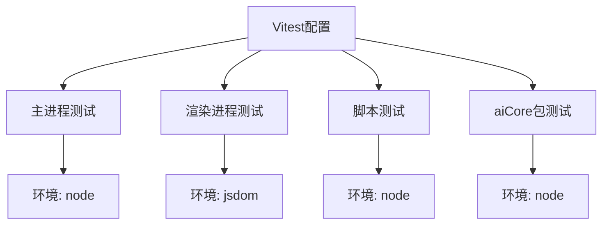
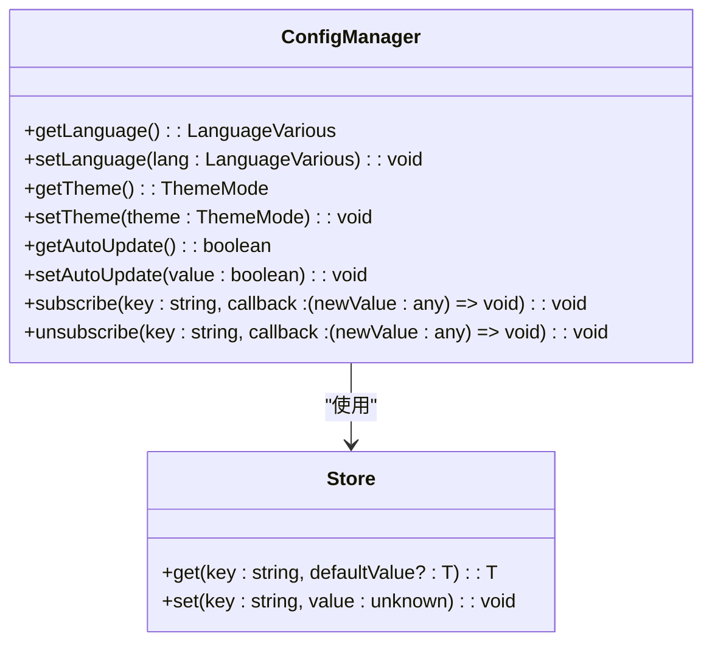
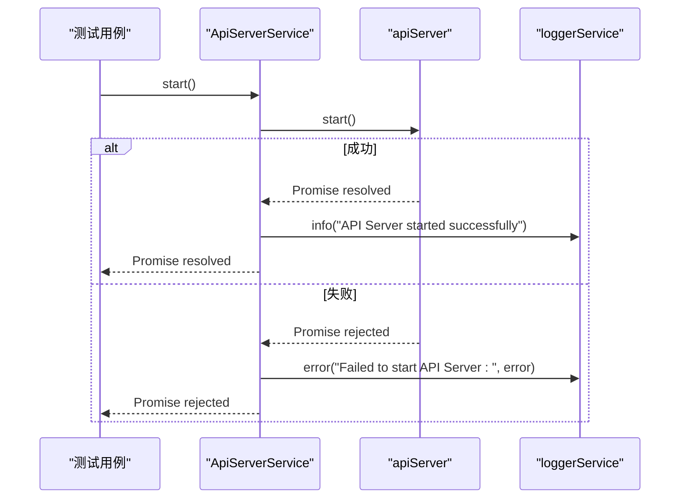
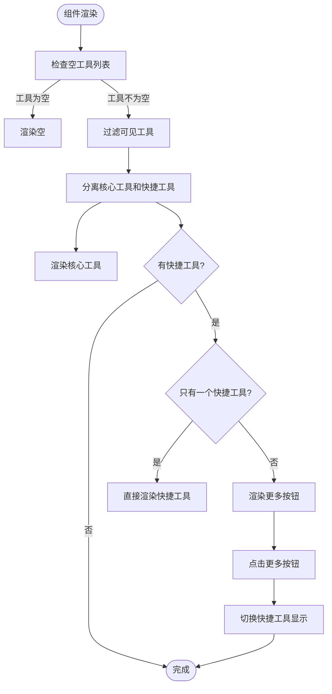
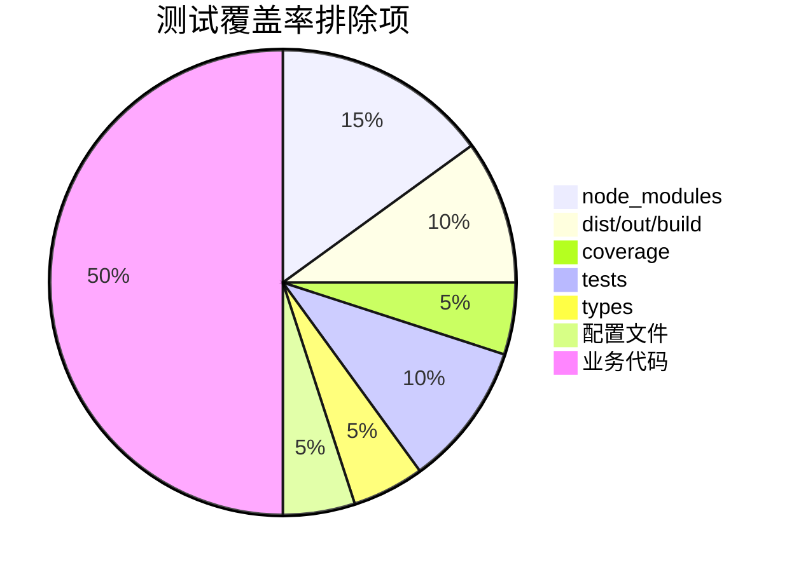

# 单元测试

<cite>
**本文档中引用的文件**  
- [vitest.config.ts](file://vitest.config.ts)
- [packages/aiCore/vitest.config.ts](file://packages/aiCore/vitest.config.ts)
- [scripts/__tests__/sort.test.ts](file://scripts/__tests__/sort.test.ts)
- [src/main/services/__tests__/AppUpdater.test.ts](file://src/main/services/__tests__/AppUpdater.test.ts)
- [src/main/services/__tests__/ProxyManager.test.ts](file://src/main/services/__tests__/ProxyManager.test.ts)
- [src/main/apiServer/middleware/__tests__/auth.test.ts](file://src/main/apiServer/middleware/__tests__/auth.test.ts)
- [src/main/services/ConfigManager.ts](file://src/main/services/ConfigManager.ts)
- [src/main/services/ApiServerService.ts](file://src/main/services/ApiServerService.ts)
- [tests/main.setup.ts](file://tests/main.setup.ts)
- [tests/renderer.setup.ts](file://tests/renderer.setup.ts)
- [packages/aiCore/src/__tests__/setup.ts](file://packages/aiCore/src/__tests__/setup.ts)
- [src/renderer/src/components/CodeToolbar/__tests__/CodeToolbar.test.tsx](file://src/renderer/src/components/CodeToolbar/__tests__/CodeToolbar.test.tsx)
</cite>

## 目录
1. [简介](#简介)
2. [测试环境配置](#测试环境配置)
3. [测试文件组织结构](#测试文件组织结构)
4. [主进程服务单元测试](#主进程服务单元测试)
5. [渲染进程组件单元测试](#渲染进程组件单元测试)
6. [AI Core包单元测试](#ai-core包单元测试)
7. [测试最佳实践](#测试最佳实践)
8. [测试覆盖率](#测试覆盖率)
9. [运行和调试测试](#运行和调试测试)

## 简介
Cherry Studio项目采用Vitest框架进行单元测试，支持主进程、渲染进程和独立包的全面测试。项目配置了多项目测试环境，能够分别针对Electron主进程、渲染进程、脚本工具和aiCore包进行独立测试。测试策略包括对核心服务如ConfigManager、ApiServerService的功能验证，以及对渲染进程组件的交互测试。通过mock机制隔离外部依赖，确保测试的可靠性和可重复性。

## 测试环境配置

Cherry Studio的测试环境通过`vitest.config.ts`文件进行配置，采用多项目（projects）模式支持不同运行环境的测试。主进程测试使用`node`环境，渲染进程测试使用`jsdom`环境，确保测试环境与实际运行环境一致。



**Diagram sources**
- [vitest.config.ts](file://vitest.config.ts#L10-L60)

**Section sources**
- [vitest.config.ts](file://vitest.config.ts#L1-L96)

## 测试文件组织结构

测试文件遵循约定优于配置的原则，通常放置在源文件目录下的`__tests__`文件夹中，或与源文件同目录下以`.test.ts`或`.spec.ts`为后缀。这种组织方式便于查找和维护测试代码。

```
src/
├── main/
│   ├── services/
│   │   ├── __tests__/
│   │   │   ├── AppUpdater.test.ts
│   │   │   └── ProxyManager.test.ts
│   │   └── AppUpdater.ts
├── renderer/
│   ├── src/
│   │   ├── components/
│   │   │   ├── CodeToolbar/
│   │   │   │   ├── __tests__/
│   │   │   │   │   └── CodeToolbar.test.tsx
│   │   │   │   └── toolbar.tsx
```

全局测试设置文件位于项目根目录的`tests/`文件夹中，包括`main.setup.ts`和`renderer.setup.ts`，分别为主进程和渲染进程测试提供全局mock和配置。

**Section sources**
- [vitest.config.ts](file://vitest.config.ts#L22-L37)
- [tests/main.setup.ts](file://tests/main.setup.ts)
- [tests/renderer.setup.ts](file://tests/renderer.setup.ts)

## 主进程服务单元测试

主进程服务的单元测试主要针对`src/main/services/`目录下的核心服务类，如`ConfigManager`、`ApiServerService`等。测试通过mock机制隔离Electron API、文件系统等外部依赖，专注于验证业务逻辑的正确性。

### ConfigManager测试

`ConfigManager`服务使用`electron-store`进行配置持久化，其测试通过mock `electron-store`的`get`和`set`方法来验证配置读写功能。测试用例覆盖了各种配置项的获取和设置，以及订阅通知机制。



**Diagram sources**
- [src/main/services/ConfigManager.ts](file://src/main/services/ConfigManager.ts#L37-L270)

**Section sources**
- [src/main/services/ConfigManager.ts](file://src/main/services/ConfigManager.ts#L1-L270)

### ApiServerService测试

`ApiServerService`服务负责管理API服务器的生命周期，其测试重点验证`start`、`stop`、`restart`等方法的正确性。测试通过mock `apiServer`对象和`loggerService`来验证服务调用和日志记录。



**Diagram sources**
- [src/main/services/ApiServerService.ts](file://src/main/services/ApiServerService.ts#L16-L115)

**Section sources**
- [src/main/services/ApiServerService.ts](file://src/main/services/ApiServerService.ts#L1-L115)

## 渲染进程组件单元测试

渲染进程组件的单元测试使用`@testing-library/react`进行，重点关注组件的渲染、交互和状态管理。测试通过mock组件依赖和使用测试工具来验证用户界面行为。

### CodeToolbar组件测试

`CodeToolbar`组件测试验证了工具按钮的渲染、可见性控制和交互行为。测试用例覆盖了不同工具类型（核心工具和快捷工具）的显示逻辑，以及"更多"按钮的展开/收起功能。



**Diagram sources**
- [src/renderer/src/components/CodeToolbar/__tests__/CodeToolbar.test.tsx](file://src/renderer/src/components/CodeToolbar/__tests__/CodeToolbar.test.tsx#L1-L263)

**Section sources**
- [src/renderer/src/components/CodeToolbar/__tests__/CodeToolbar.test.tsx](file://src/renderer/src/components/CodeToolbar/__tests__/CodeToolbar.test.tsx#L1-L263)

## AI Core包单元测试

`aiCore`包作为独立的npm包，拥有自己的`vitest.config.ts`配置文件。其测试环境通过别名机制mock了外部依赖`@cherrystudio/ai-sdk-provider`，确保测试的独立性。

```mermaid
graph TD
A[aiCore包测试] --> B[使用独立vitest配置]
B --> C[设置@别名为src目录]
B --> D[mock ai-sdk-provider]
B --> E[使用setup.ts进行全局设置]
C --> F[简化模块导入]
D --> G[隔离外部依赖]
E --> H[避免Node环境错误]
```

**Diagram sources**
- [packages/aiCore/vitest.config.ts](file://packages/aiCore/vitest.config.ts#L1-L24)
- [packages/aiCore/src/__tests__/setup.ts](file://packages/aiCore/src/__tests__/setup.ts#L1-L10)

**Section sources**
- [packages/aiCore/vitest.config.ts](file://packages/aiCore/vitest.config.ts#L1-L24)
- [packages/aiCore/src/__tests__/setup.ts](file://packages/aiCore/src/__tests__/setup.ts#L1-L10)

## 测试最佳实践

### Mock使用规范

Cherry Studio的测试广泛使用Vitest的mock功能来隔离外部依赖。主进程测试mock了`electron`、`winston`、`node:fs`等模块，渲染进程测试mock了`uuid`、`axios`和`electron`的`ipcRenderer`。

```typescript
// 主进程测试中的mock示例
vi.mock('electron', () => ({
  app: {
    getPath: vi.fn((key: string) => `/mock/${key}`),
    getVersion: vi.fn(() => '1.0.0')
  },
  ipcMain: {
    handle: vi.fn(),
    on: vi.fn()
  }
}))
```

### 异步函数测试

异步函数的测试使用`async/await`语法，确保测试用例等待异步操作完成。对于可能失败的异步操作，使用`try/catch`或`.catch()`来验证错误处理逻辑。

```typescript
it('should handle config.get() rejection', async () => {
  mockConfig.get.mockRejectedValue(new Error('Config error'))
  
  await expect(authMiddleware(req as Request, res as Response, next))
    .rejects.toThrow('Config error')
})
```

### 函数调用验证

使用Vitest的`vi.fn()`创建的mock函数可以验证函数是否被调用、调用次数和调用参数。这对于验证事件处理、回调函数和副作用非常有用。

```typescript
it('should authenticate successfully with valid API key', async () => {
  await authMiddleware(req as Request, res as Response, next)
  
  expect(next).toHaveBeenCalled()
  expect(statusMock).not.toHaveBeenCalled()
})
```

**Section sources**
- [tests/main.setup.ts](file://tests/main.setup.ts#L13-L65)
- [tests/renderer.setup.ts](file://tests/renderer/setup.ts#L9-L15)
- [src/main/services/__tests__/AppUpdater.test.ts](file://src/main/services/__tests__/AppUpdater.test.ts#L2-L800)

## 测试覆盖率

Cherry Studio的Vitest配置中启用了覆盖率报告，使用`v8`提供程序生成多种格式的报告（text、json、html、lcov、text-summary）。覆盖率配置排除了测试文件、配置文件和类型定义文件，专注于业务代码的覆盖。



**Diagram sources**
- [vitest.config.ts](file://vitest.config.ts#L65-L85)

**Section sources**
- [vitest.config.ts](file://vitest.config.ts#L65-L85)

## 运行和调试测试

### 运行测试

通过npm脚本运行测试：

```bash
# 运行所有测试
npm run test

# 运行特定项目测试
npm run test:main      # 主进程测试
npm run test:renderer  # 渲染进程测试
npm run test:scripts   # 脚本测试
npm run test:aiCore    # aiCore包测试
```

### 调试测试

使用`--inspect`标志启动调试模式：

```bash
npm run test:debug
```

然后在浏览器开发者工具或IDE中连接调试器。对于特定测试文件，可以使用`--testNamePattern`或`--include`参数过滤测试。

**Section sources**
- [package.json](file://package.json)
- [vitest.config.ts](file://vitest.config.ts)