# Cherry Studio 测试策略文档

<cite>
**本文档引用的文件**
- [package.json](file://package.json)
- [vitest.config.ts](file://vitest.config.ts)
- [playwright.config.ts](file://playwright.config.ts)
- [tests/main.setup.ts](file://tests/main.setup.ts)
- [tests/renderer.setup.ts](file://tests/renderer.setup.ts)
- [packages/aiCore/setupVitest.ts](file://packages/aiCore/setupVitest.ts)
- [tests/e2e/specs/app-launch.spec.ts](file://tests/e2e/specs/app-launch.spec.ts)
- [tests/e2e/pages/chat.page.ts](file://tests/e2e/pages/chat.page.ts)
- [tests/e2e/fixtures/electron.fixture.ts](file://tests/e2e/fixtures/electron.fixture.ts)
- [tests/e2e/utils/wait-helpers.ts](file://tests/e2e/utils/wait-helpers.ts)
- [src/main/services/__tests__/AppUpdater.test.ts](file://src/main/services/__tests__/AppUpdater.test.ts)
- [src/main/utils/__tests__/aes.test.ts](file://src/main/utils/__tests__/aes.test.ts)
- [src/renderer/src/aiCore/prepareParams/__tests__/message-converter.test.ts](file://src/renderer/src/aiCore/prepareParams/__tests__/message-converter.test.ts)
- [tests/e2e/specs/navigation.spec.ts](file://tests/e2e/specs/navigation.spec.ts)
</cite>

## 目录
1. [概述](#概述)
2. [测试框架架构](#测试框架架构)
3. [测试环境配置](#测试环境配置)
4. [测试类型与组织结构](#测试类型与组织结构)
5. [单元测试策略](#单元测试策略)
6. [端到端测试策略](#端到端测试策略)
7. [测试最佳实践](#测试最佳实践)
8. [测试覆盖率与质量保证](#测试覆盖率与质量保证)
9. [调试与故障排除](#调试与故障排除)
10. [持续集成与部署](#持续集成与部署)

## 概述

Cherry Studio采用现代化的测试策略，结合了单元测试、集成测试和端到端测试，确保应用程序的质量和稳定性。项目使用Vitest作为主要的单元测试框架，Playwright进行端到端测试，支持多进程测试分离（主进程和渲染进程）以及专门的AI核心包测试。

### 核心测试特性

- **多进程测试分离**：主进程测试和渲染进程测试独立运行
- **模块化测试配置**：每个包都有独立的测试配置
- **全面的测试覆盖**：从单元测试到端到端测试的完整测试金字塔
- **自动化测试执行**：支持CI/CD集成和自动化测试流程

## 测试框架架构

### 整体架构图

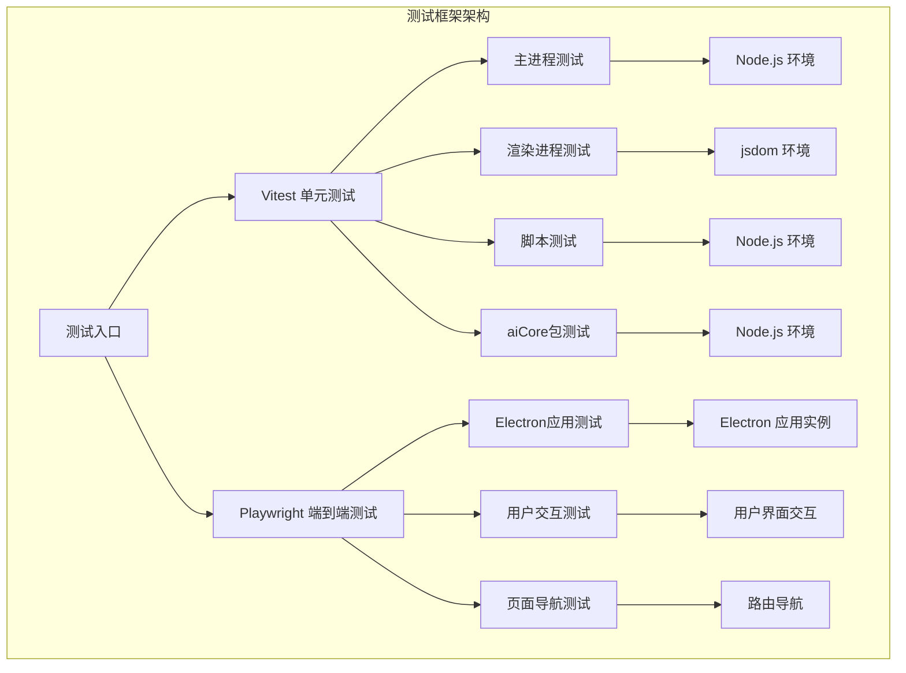

**图表来源**
- [vitest.config.ts](file://vitest.config.ts#L8-L96)
- [playwright.config.ts](file://playwright.config.ts#L1-L65)

### 测试框架组件

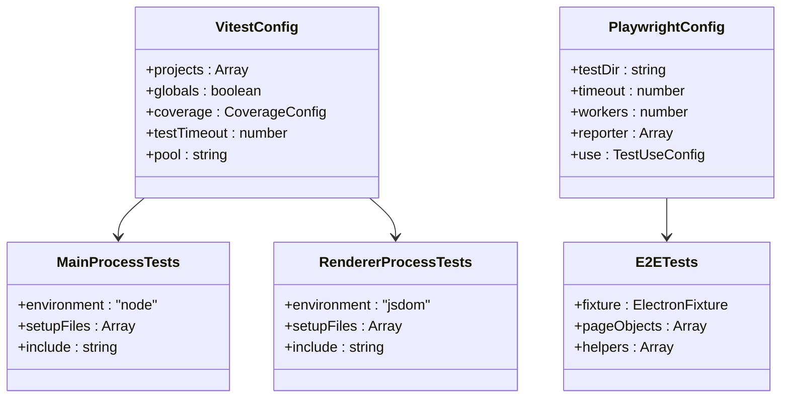

**图表来源**
- [vitest.config.ts](file://vitest.config.ts#L8-L96)
- [playwright.config.ts](file://playwright.config.ts#L7-L65)

**章节来源**
- [vitest.config.ts](file://vitest.config.ts#L1-L96)
- [playwright.config.ts](file://playwright.config.ts#L1-L65)

## 测试环境配置

### Vitest配置详解

Cherry Studio的Vitest配置支持多项目并行测试，每个项目针对不同的测试场景进行了优化：

#### 主进程测试配置

主进程测试在Node.js环境中运行，模拟Electron主进程的各种依赖和服务：

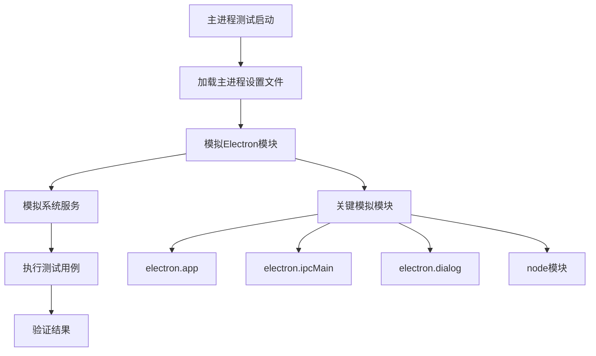

**图表来源**
- [tests/main.setup.ts](file://tests/main.setup.ts#L1-L140)

#### 渲染进程测试配置

渲染进程测试在jsdom环境中运行，模拟浏览器环境和React组件：

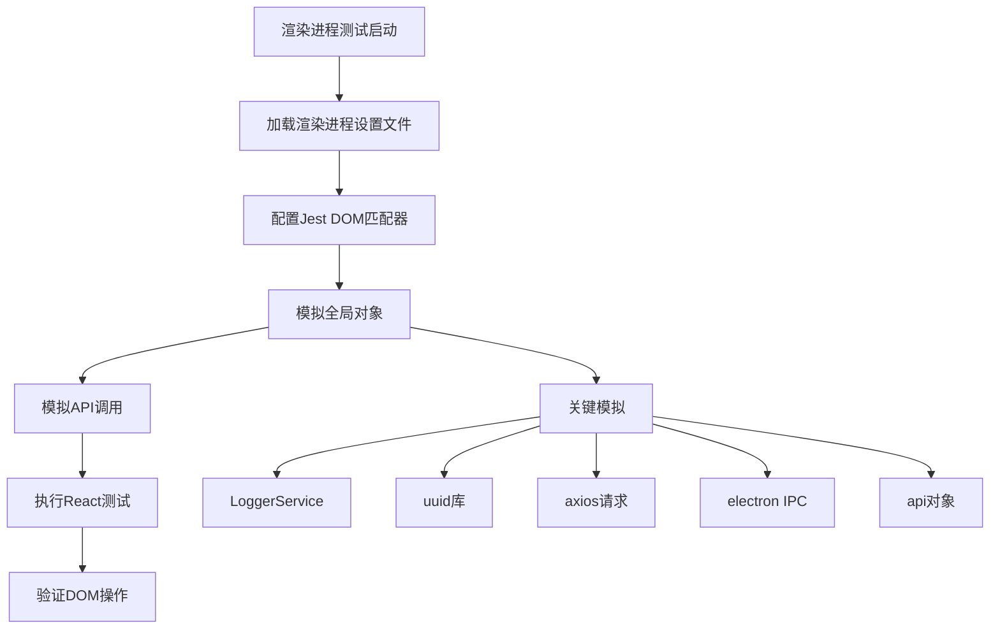

**图表来源**
- [tests/renderer.setup.ts](file://tests/renderer/setup.ts#L1-L51)

### Playwright配置详解

端到端测试配置针对Electron应用进行了专门优化：

| 配置项 | 值 | 说明 |
|--------|-----|------|
| testDir | ./tests/e2e/specs | 测试文件目录 |
| timeout | 60000ms | 单个测试超时时间 |
| workers | 1 | 串行执行以避免冲突 |
| expect.timeout | 10000ms | 断言超时时间 |
| actionTimeout | 15000ms | 用户操作超时 |
| navigationTimeout | 30000ms | 页面导航超时 |

**章节来源**
- [vitest.config.ts](file://vitest.config.ts#L8-L96)
- [playwright.config.ts](file://playwright.config.ts#L7-L65)
- [tests/main.setup.ts](file://tests/main/setup.ts#L1-L140)
- [tests/renderer.setup.ts](file://tests/renderer/setup.ts#L1-L51)

## 测试类型与组织结构

### 测试项目分类

Cherry Studio的测试按以下项目进行组织：

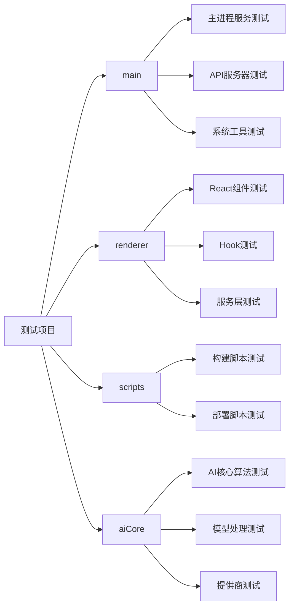

**图表来源**
- [vitest.config.ts](file://vitest.config.ts#L10-L60)

### 测试文件命名规范

| 测试类型 | 文件命名模式 | 示例 |
|----------|-------------|------|
| 单元测试 | `*.test.ts` 或 `*.spec.ts` | `AppUpdater.test.ts` |
| 组件测试 | `*.test.tsx` 或 `*.spec.tsx` | `ChatPage.test.tsx` |
| 集成测试 | `*.integration.test.ts` | `api.integration.test.ts` |
| 端到端测试 | `*.spec.ts` | `app-launch.spec.ts` |

### 测试目录结构

```
tests/
├── main.setup.ts          # 主进程测试设置
├── renderer.setup.ts      # 渲染进程测试设置
├── __mocks__/             # 全局模拟文件
│   ├── MainLoggerService.ts
│   └── RendererLoggerService.ts
├── e2e/                   # 端到端测试
│   ├── fixtures/          # 测试夹具
│   │   └── electron.fixture.ts
│   ├── pages/             # 页面对象
│   │   ├── base.page.ts
│   │   ├── chat.page.ts
│   │   ├── home.page.ts
│   │   └── settings.page.ts
│   ├── specs/             # 测试规范
│   │   ├── app-launch.spec.ts
│   │   ├── navigation.spec.ts
│   │   └── conversation/
│   ├── utils/             # 辅助工具
│   │   ├── index.ts
│   │   └── wait-helpers.ts
│   ├── global-setup.ts    # 全局设置
│   └── global-teardown.ts # 全局清理
```

**章节来源**
- [vitest.config.ts](file://vitest.config.ts#L10-L60)
- [tests/e2e/fixtures/electron.fixture.ts](file://tests/e2e/fixtures/electron.fixture.ts#L1-L54)

## 单元测试策略

### 主进程单元测试

主进程测试专注于后端服务、API路由和系统工具的功能验证：

#### 关键测试模式

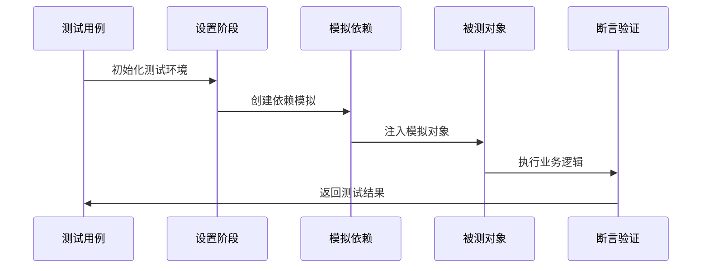

**图表来源**
- [src/main/services/__tests__/AppUpdater.test.ts](file://src/main/services/__tests__/AppUpdater.test.ts#L1-L800)

#### 测试用例示例分析

以AppUpdater服务的多语言发布说明解析为例：

| 测试场景 | 输入数据 | 预期输出 | 验证点 |
|----------|----------|----------|--------|
| 中文用户 | 多语言标记内容 | 中文版本说明 | 语言选择正确 |
| 英文用户 | 多语言标记内容 | 英文版本说明 | 默认语言处理 |
| 错误处理 | 异常输入 | 原始内容返回 | 异常恢复机制 |
| 性能测试 | 大量文本 | 正确加密解密 | 加密算法效率 |

### 渲染进程单元测试

渲染进程测试关注前端组件、Hook和用户界面交互：

#### React组件测试模式

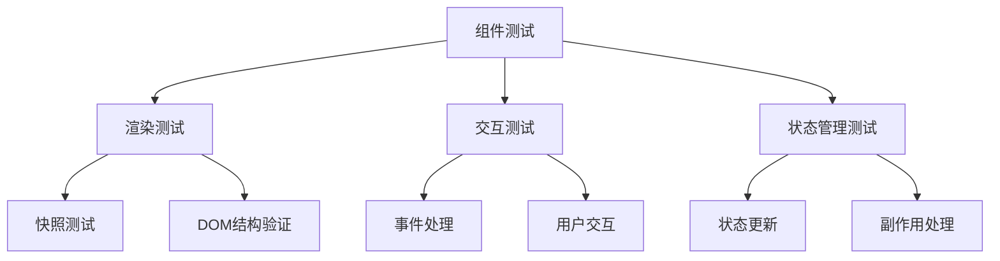

**图表来源**
- [src/renderer/src/aiCore/prepareParams/__tests__/message-converter.test.ts](file://src/renderer/src/aiCore/prepareParams/__tests__/message-converter.test.ts#L1-L240)

### aiCore包测试

aiCore包有独立的测试配置，专注于AI相关算法和模型处理：

#### 测试配置特点

- 使用特殊的Vite SSR模拟
- 针对AI算法和模型处理进行测试
- 支持并发测试执行

**章节来源**
- [src/main/services/__tests__/AppUpdater.test.ts](file://src/main/services/__tests__/AppUpdater.test.ts#L1-L800)
- [src/main/utils/__tests__/aes.test.ts](file://src/main/utils/__tests__/aes.test.ts#L1-L72)
- [src/renderer/src/aiCore/prepareParams/__tests__/message-converter.test.ts](file://src/renderer/src/aiCore/prepareParams/__tests__/message-converter.test.ts#L1-L240)
- [packages/aiCore/setupVitest.ts](file://packages/aiCore/setupVitest.ts#L1-L3)

## 端到端测试策略

### Playwright测试架构

端到端测试使用Playwright进行Electron应用的完整用户流程测试：

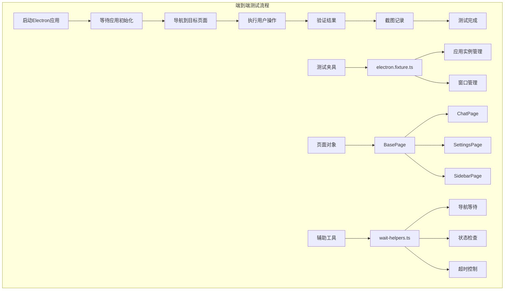

**图表来源**
- [tests/e2e/fixtures/electron.fixture.ts](file://tests/e2e/fixtures/electron.fixture.ts#L1-L54)
- [tests/e2e/pages/chat.page.ts](file://tests/e2e/pages/chat.page.ts#L1-L141)
- [tests/e2e/utils/wait-helpers.ts](file://tests/e2e/utils/wait-helpers.ts#L1-L104)

### 关键测试页面对象

#### ChatPage页面对象

ChatPage提供了完整的聊天界面交互方法：

| 方法名 | 功能描述 | 使用场景 |
|--------|----------|----------|
| goto() | 导航到聊天页面 | 页面初始化测试 |
| sendMessage() | 发送消息 | 对话流程测试 |
| typeMessage() | 输入消息文本 | 用户输入测试 |
| clickSend() | 点击发送按钮 | 按钮交互测试 |
| isGenerating() | 检查生成状态 | 实时反馈测试 |
| stopGeneration() | 停止生成 | 中断操作测试 |

#### 应用启动测试

应用启动测试验证Electron应用的基本启动和初始化过程：

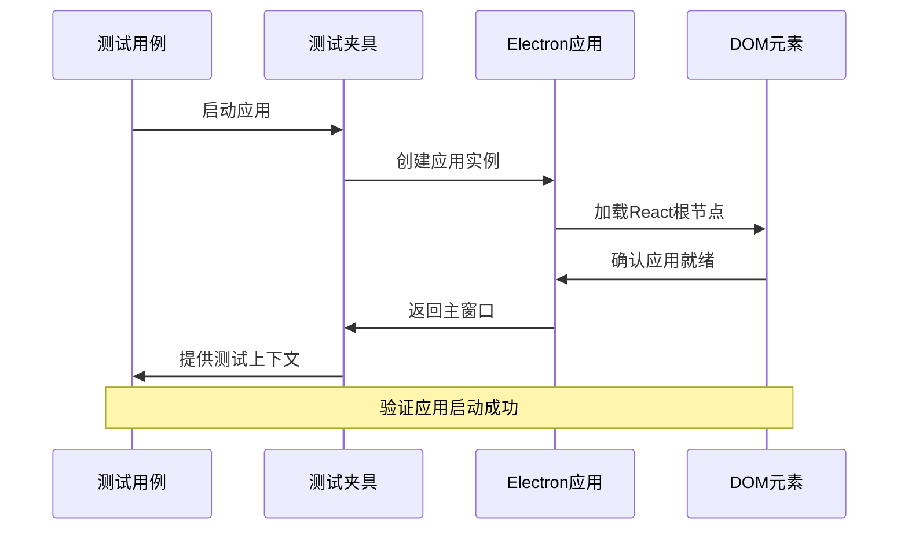

**图表来源**
- [tests/e2e/specs/app-launch.spec.ts](file://tests/e2e/specs/app-launch.spec.ts#L1-L50)

### 测试辅助工具

#### 等待助手函数

等待助手提供了各种等待条件的封装：

| 函数名 | 功能 | 超时时间 | 适用场景 |
|--------|------|----------|----------|
| waitForAppReady() | 等待应用完全加载 | 60秒 | 应用启动测试 |
| waitForNavigation() | 等待页面导航 | 15秒 | 路由切换测试 |
| waitForChatReady() | 等待聊天界面就绪 | 30秒 | 聊天功能测试 |
| waitForLoadingComplete() | 等待加载完成 | 30秒 | 数据加载测试 |
| waitForModal() | 等待模态框出现 | 10秒 | 对话框测试 |

**章节来源**
- [tests/e2e/specs/app-launch.spec.ts](file://tests/e2e/specs/app-launch.spec.ts#L1-L50)
- [tests/e2e/pages/chat.page.ts](file://tests/e2e/pages/chat.page.ts#L1-L141)
- [tests/e2e/utils/wait-helpers.ts](file://tests/e2e/utils/wait-helpers.ts#L1-L104)

## 测试最佳实践

### 测试设计原则

#### 1. AAA模式（Arrange-Act-Assert）

每个测试都遵循"准备-执行-断言"的结构：

```typescript
// 测试模板示例
describe('功能模块', () => {
  beforeEach(() => {
    // Arrange: 准备测试数据和环境
    vi.clearAllMocks();
    // 设置模拟对象
  });
  
  it('应该正确执行功能', async () => {
    // Act: 执行被测试的操作
    const result = await subjectUnderTest();
    
    // Assert: 验证结果
    expect(result).toBe(expectedValue);
  });
});
```

#### 2. 测试隔离性

- 每个测试独立运行，不依赖其他测试的状态
- 使用`beforeEach`清理测试环境
- 避免全局状态污染

#### 3. 模拟策略

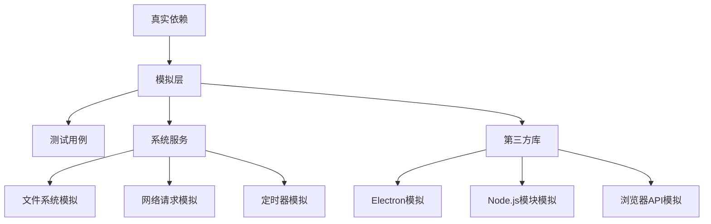

### 测试代码质量标准

#### 1. 测试命名规范

- 使用描述性的测试名称
- 明确表达测试意图
- 遵循"应该"语句格式

#### 2. 测试覆盖率要求

| 测试类型 | 最低覆盖率 | 目标覆盖率 |
|----------|------------|------------|
| 核心业务逻辑 | 80% | 90% |
| 工具函数 | 90% | 95% |
| 用户界面 | 70% | 80% |
| 错误处理 | 95% | 95% |

#### 3. 测试维护策略

- 定期重构测试代码
- 移除过时的测试
- 更新测试以反映需求变更

**章节来源**
- [src/main/services/__tests__/AppUpdater.test.ts](file://src/main/services/__tests__/AppUpdater.test.ts#L94-L194)
- [src/main/utils/__tests__/aes.test.ts](file://src/main/utils/__tests__/aes.test.ts#L1-L72)

## 测试覆盖率与质量保证

### 覆盖率报告配置

Vitest配置了多种覆盖率报告格式：

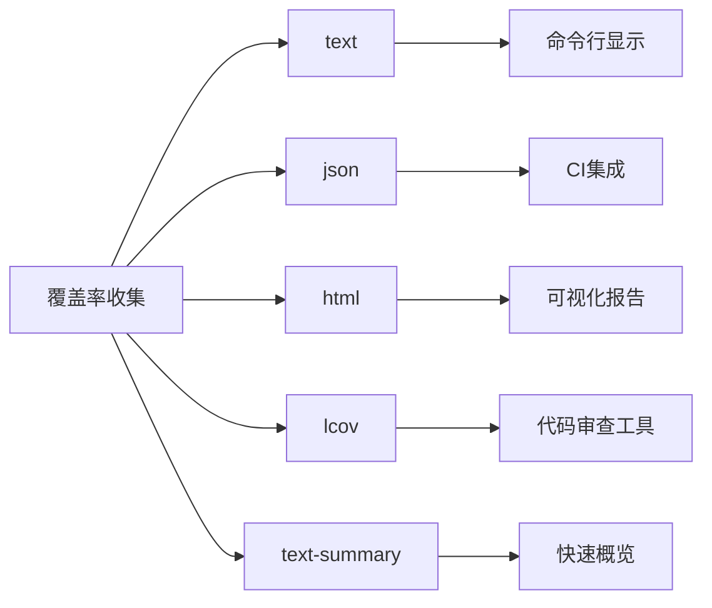

**图表来源**
- [vitest.config.ts](file://vitest.config.ts#L65-L85)

### 质量指标监控

#### 关键质量指标

| 指标类型 | 监控内容 | 目标值 | 警告阈值 |
|----------|----------|--------|----------|
| 测试覆盖率 | 代码覆盖率 | >85% | >75% |
| 测试通过率 | 测试执行成功率 | 100% | >95% |
| 测试执行时间 | 平均测试耗时 | <30秒 | <60秒 |
| 冒烟测试通过率 | 关键路径测试 | 100% | >98% |

#### 覆盖率排除规则

为了提高覆盖率报告的准确性，排除了以下类型的文件：

- 第三方库和依赖
- 类型定义文件
- 构建配置文件
- 测试辅助文件
- 生产无关的代码

### 持续质量改进

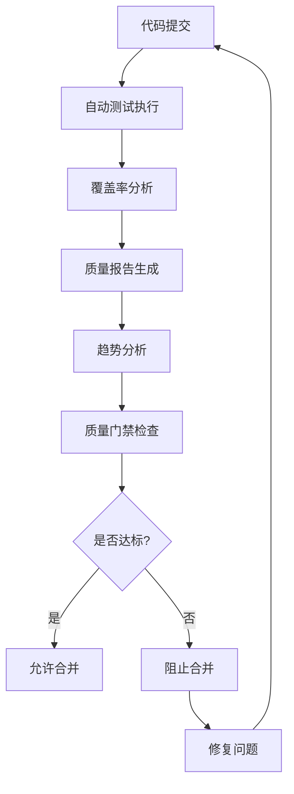

**章节来源**
- [vitest.config.ts](file://vitest.config.ts#L65-L85)

## 调试与故障排除

### 常见测试问题及解决方案

#### 1. 测试超时问题

**问题症状**：测试执行时间过长或无限等待

**解决方案**：
- 检查异步操作的超时设置
- 验证网络请求是否正常响应
- 确认数据库连接状态
- 使用适当的等待条件而非固定延时

#### 2. 模拟对象配置错误

**问题症状**：测试中的模拟行为不符合预期

**解决方案**：
- 验证模拟对象的导入顺序
- 检查模拟函数的调用次数和参数
- 确认模拟对象的作用域
- 使用`vi.mock`的正确语法

#### 3. 端到端测试不稳定

**问题症状**：Playwright测试结果不一致

**解决方案**：
- 增加适当的等待时间
- 使用更稳定的定位器
- 检查Electron应用的初始化状态
- 验证页面元素的可见性

### 调试工具和技术

#### 1. Vitest调试

```bash
# 运行单个测试文件
yarn test:main --file AppUpdater.test.ts

# 启用测试UI
yarn test:ui

# 生成覆盖率报告
yarn test:coverage

# 监视模式运行测试
yarn test:watch
```

#### 2. Playwright调试

```bash
# 启用调试模式
DEBUG=pw:api yarn test:e2e

# 在浏览器中运行测试
yarn playwright test --debug

# 截取失败时的屏幕截图
yarn playwright test --screenshot=only-on-failure
```

#### 3. 日志和追踪

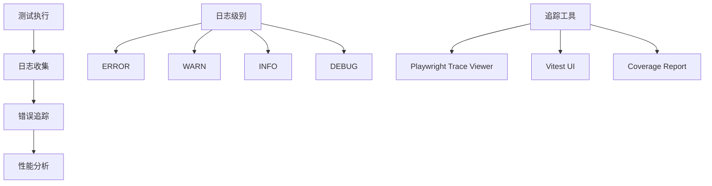

### 性能优化建议

#### 1. 测试执行优化

- 使用并行测试执行
- 合理设置测试超时时间
- 优化模拟对象的创建
- 减少不必要的等待时间

#### 2. 内存管理

- 及时清理测试资源
- 避免内存泄漏
- 合理使用测试缓存
- 监控测试过程中的内存使用

**章节来源**
- [tests/e2e/utils/wait-helpers.ts](file://tests/e2e/utils/wait-helpers.ts#L1-L104)
- [vitest.config.ts](file://vitest.config.ts#L87-L96)

## 持续集成与部署

### CI/CD集成策略

Cherry Studio的测试策略与CI/CD流程深度集成：

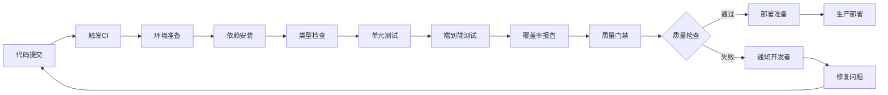

### 测试脚本配置

项目提供了丰富的测试脚本：

| 脚本命令 | 功能描述 | 使用场景 |
|----------|----------|----------|
| `yarn test` | 运行所有测试 | 开发阶段 |
| `yarn test:main` | 仅运行主进程测试 | 快速验证 |
| `yarn test:renderer` | 仅运行渲染进程测试 | 前端开发 |
| `yarn test:e2e` | 运行端到端测试 | 集成测试 |
| `yarn test:coverage` | 生成覆盖率报告 | 质量评估 |
| `yarn test:watch` | 监视模式运行 | 开发调试 |

### 自动化测试流程

#### 1. 开发阶段

- 本地开发时运行监视模式测试
- 保持高覆盖率和快速反馈
- 使用测试UI进行交互式调试

#### 2. 集成阶段

- CI系统自动执行完整测试套件
- 生成详细的测试报告
- 集成覆盖率检查

#### 3. 部署阶段

- 执行冒烟测试确保基本功能
- 运行关键路径的端到端测试
- 验证部署后的功能完整性

### 测试环境管理

#### 1. 环境隔离

- 开发环境：使用本地模拟
- 测试环境：使用隔离的测试数据
- 生产环境：使用真实数据（仅限部分测试）

#### 2. 数据管理

- 使用测试专用数据库
- 实现测试数据的自动清理
- 确保测试数据的一致性

**章节来源**
- [package.json](file://package.json#L62-L76)
- [vitest.config.ts](file://vitest.config.ts#L87-L96)
- [playwright.config.ts](file://playwright.config.ts#L23-L28)

## 结论

Cherry Studio的测试策略体现了现代软件开发的最佳实践，通过多层次的测试架构确保了应用程序的质量和可靠性。该策略的优势包括：

### 核心优势

1. **全面的测试覆盖**：从单元测试到端到端测试的完整测试金字塔
2. **高效的测试执行**：多进程并行测试和智能的测试隔离
3. **优秀的开发体验**：直观的测试工具和丰富的调试功能
4. **高质量的保证**：严格的覆盖率要求和持续的质量监控

### 发展方向

随着项目的不断发展，测试策略将继续演进：

- 增强AI相关功能的测试覆盖
- 优化测试执行性能
- 扩展跨平台测试能力
- 集成更多的自动化测试工具

通过持续改进测试策略，Cherry Studio能够为用户提供稳定、可靠的AI助手体验，同时为开发团队提供高效的质量保障体系。