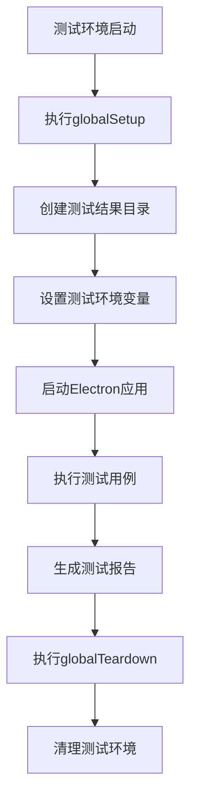
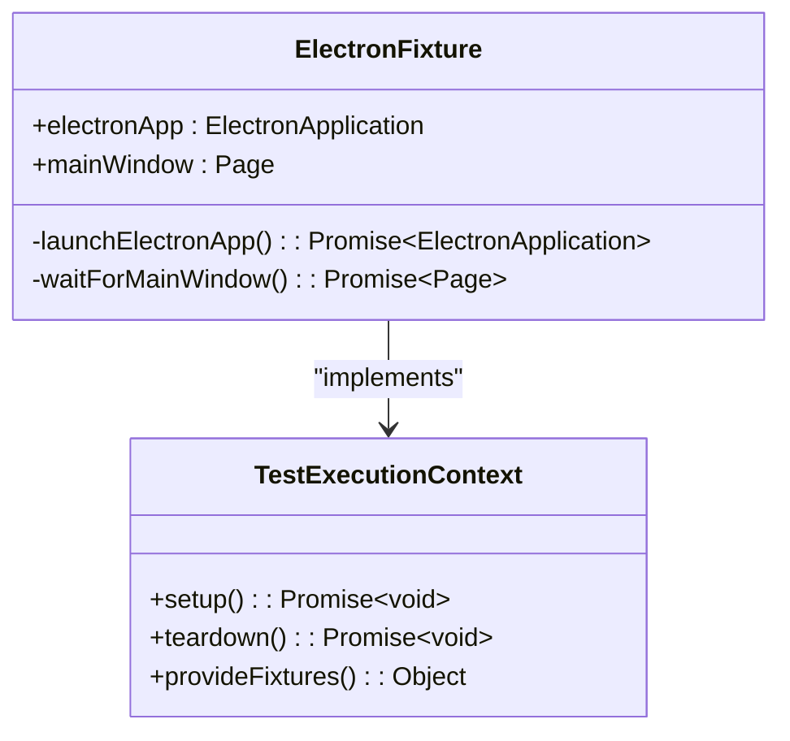
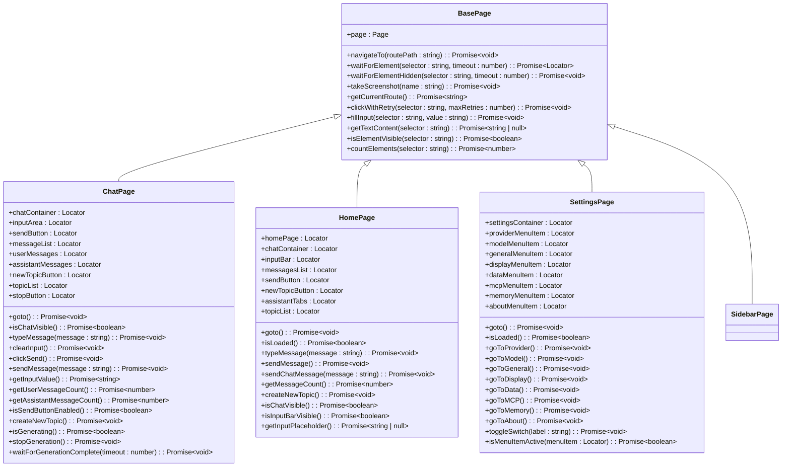
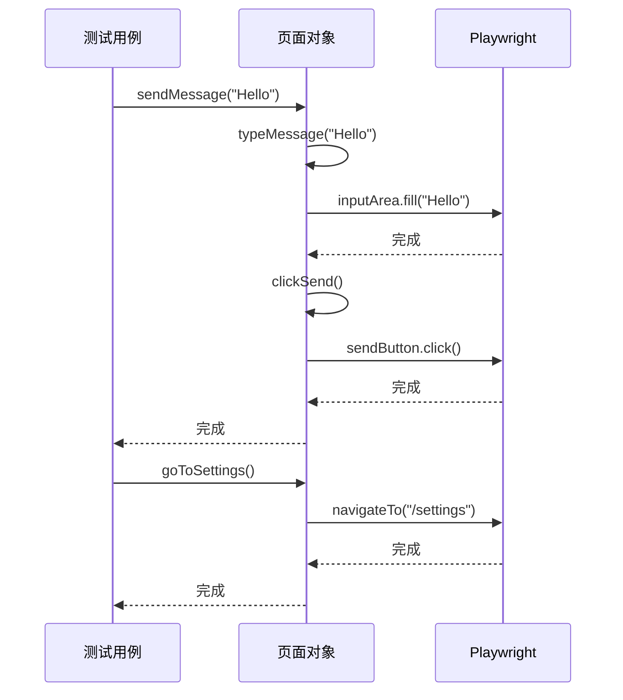
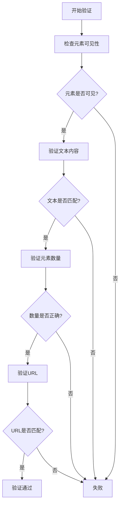
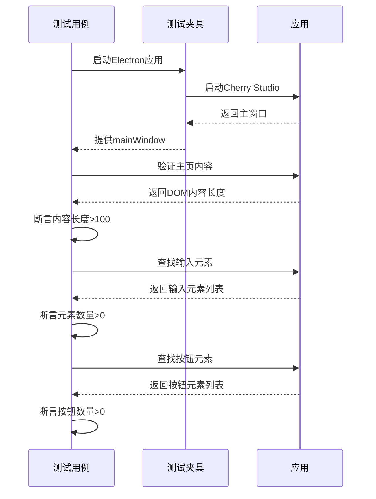
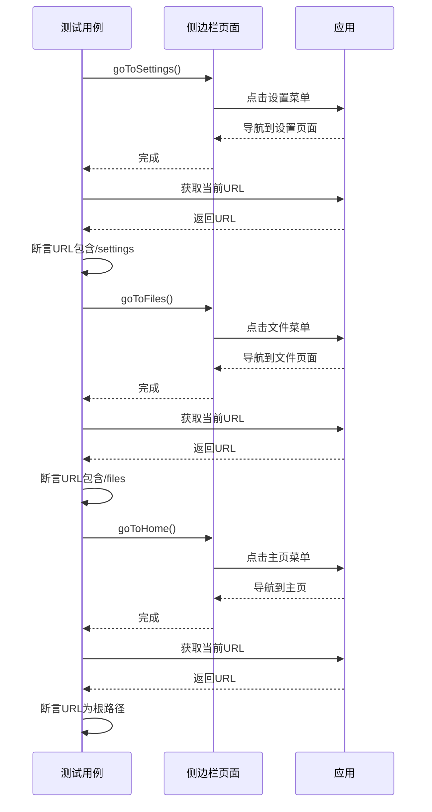
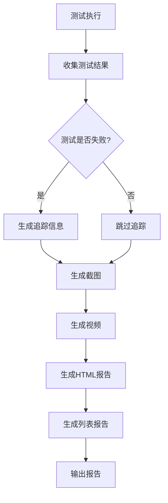

# 端到端测试

<cite>
**本文档中引用的文件**   
- [playwright.config.ts](file://playwright.config.ts)
- [global-setup.ts](file://tests/e2e/global-setup.ts)
- [global-teardown.ts](file://tests/e2e/global-teardown.ts)
- [base.page.ts](file://tests/e2e/pages/base.page.ts)
- [chat.page.ts](file://tests/e2e/pages/chat.page.ts)
- [home.page.ts](file://tests/e2e/pages/home.page.ts)
- [settings.page.ts](file://tests/e2e/pages/settings.page.ts)
- [sidebar.page.ts](file://tests/e2e/pages/sidebar.page.ts)
- [electron.fixture.ts](file://tests/e2e/fixtures/electron.fixture.ts)
- [wait-helpers.ts](file://tests/e2e/utils/wait-helpers.ts)
- [app-launch.spec.ts](file://tests/e2e/specs/app-launch.spec.ts)
- [navigation.spec.ts](file://tests/e2e/specs/navigation.spec.ts)
- [basic-chat.spec.ts](file://tests/e2e/specs/conversation/basic-chat.spec.ts)
- [general.spec.ts](file://tests/e2e/specs/settings/general.spec.ts)
</cite>

## 目录
1. [简介](#简介)
2. [测试环境搭建](#测试环境搭建)
3. [浏览器上下文管理](#浏览器上下文管理)
4. [页面对象模型实现](#页面对象模型实现)
5. [用户操作模拟](#用户操作模拟)
6. [页面状态验证](#页面状态验证)
7. [测试示例](#测试示例)
8. [测试最佳实践](#测试最佳实践)
9. [调试与问题解决](#调试与问题解决)
10. [结论](#结论)

## 简介
Cherry Studio是一款基于Electron的AI集成开发环境，为确保应用的稳定性和可靠性，项目采用了Playwright框架进行端到端测试。本文档详细介绍了Cherry Studio的端到端测试架构，包括测试环境配置、页面对象模型设计、用户交互模拟和测试验证方法。文档还提供了具体的测试示例和最佳实践，帮助开发人员编写可维护和可靠的测试用例。

**Section sources**
- [playwright.config.ts](file://playwright.config.ts#L1-L65)
- [app-launch.spec.ts](file://tests/e2e/specs/app-launch.spec.ts#L1-L50)

## 测试环境搭建
Cherry Studio的端到端测试环境基于Playwright框架构建，专门针对Electron应用进行了配置。测试环境的搭建包括Playwright配置文件、全局设置和拆卸脚本，以及自定义的测试夹具。

Playwright配置文件`playwright.config.ts`定义了测试的基本参数，包括测试目录、超时设置、报告器配置和项目设置。测试目录被设置为`./tests/e2e/specs`，所有测试用例都存放在此目录下。由于Electron应用的特性，测试被配置为顺序执行（`fullyParallel: false`）并使用单个工作进程（`workers: 1`），以避免多个Electron实例之间的冲突。

**Diagram sources**
- [playwright.config.ts](file://playwright.config.ts#L1-L65)
- [global-setup.ts](file://tests/e2e/global-setup.ts#L1-L26)
- [global-teardown.ts](file://tests/e2e/global-teardown.ts#L1-L17)

**Section sources**
- [playwright.config.ts](file://playwright.config.ts#L1-L65)
- [global-setup.ts](file://tests/e2e/global-setup.ts#L1-L26)
- [global-teardown.ts](file://tests/e2e/global-teardown.ts#L1-L17)

## 浏览器上下文管理
在Cherry Studio的端到端测试中，浏览器上下文管理通过自定义的Electron测试夹具实现。`electron.fixture.ts`文件定义了`electronApp`和`mainWindow`两个核心测试夹具，为所有测试用例提供一致的测试环境。

`electronApp`夹具负责启动Electron应用实例，通过`_electron.launch()`方法启动应用，并传递当前目录作为参数。夹具还设置了开发环境变量`NODE_ENV: 'development'`，确保应用在测试环境中以正确的模式运行。

`mainWindow`夹具则负责获取主窗口实例。由于Cherry Studio可能创建多个窗口（如主窗口和快速助手窗口），该夹具使用窗口标题作为识别条件，等待标题为"Cherry Studio"的窗口出现。获取窗口实例后，夹具会等待React应用的根元素`#root`被挂载，并等待DOM内容加载完成，确保测试开始时应用已处于可交互状态。

**Diagram sources**
- [electron.fixture.ts](file://tests/e2e/fixtures/electron.fixture.ts#L1-L54)

**Section sources**
- [electron.fixture.ts](file://tests/e2e/fixtures/electron.fixture.ts#L1-L54)

## 页面对象模型实现
Cherry Studio的端到端测试采用了页面对象模型（Page Object Model）设计模式，将页面元素和操作封装在独立的类中，提高测试代码的可维护性和可重用性。项目中的页面对象模型以`BasePage`类为基础，其他页面类继承该基类并扩展特定功能。

`BasePage`类定义了所有页面共用的基础方法，包括页面导航、元素等待、截图和用户交互操作。由于Cherry Studio使用HashRouter进行路由管理，`navigateTo`方法通过直接修改`window.location.hash`来实现页面跳转，而不是使用Playwright的`page.goto()`方法。

**Diagram sources**
- [base.page.ts](file://tests/e2e/pages/base.page.ts#L1-L111)
- [chat.page.ts](file://tests/e2e/pages/chat.page.ts#L1-L141)
- [home.page.ts](file://tests/e2e/pages/home.page.ts#L1-L111)
- [settings.page.ts](file://tests/e2e/pages/settings.page.ts#L1-L160)
- [sidebar.page.ts](file://tests/e2e/pages/sidebar.page.ts#L1-L100)

**Section sources**
- [base.page.ts](file://tests/e2e/pages/base.page.ts#L1-L111)
- [chat.page.ts](file://tests/e2e/pages/chat.page.ts#L1-L141)
- [home.page.ts](file://tests/e2e/pages/home.page.ts#L1-L111)
- [settings.page.ts](file://tests/e2e/pages/settings.page.ts#L1-L160)
- [sidebar.page.ts](file://tests/e2e/pages/sidebar.page.ts#L1-L100)

## 用户操作模拟
Cherry Studio的端到端测试通过页面对象模型封装了各种用户操作，包括点击、输入文本和导航等。这些操作被抽象为页面类的方法，使测试用例更加简洁和可读。

在`ChatPage`类中，`typeMessage`方法用于在聊天输入区域输入文本，`clickSend`方法用于点击发送按钮，`sendMessage`方法则组合了输入和发送两个操作。为了处理可能的元素未就绪情况，`clickWithRetry`方法实现了带重试机制的点击操作，最多重试3次，每次间隔500毫秒。

导航操作通过`navigateTo`方法实现，该方法直接修改`window.location.hash`来改变应用路由。对于特定页面的导航，如设置页面的各个子页面，`SettingsPage`类提供了`goToProvider`、`goToModel`等专用方法，这些方法首先尝试点击导航菜单项，如果失败则直接通过`navigateTo`方法跳转。

**Diagram sources**
- [chat.page.ts](file://tests/e2e/pages/chat.page.ts#L1-L141)
- [base.page.ts](file://tests/e2e/pages/base.page.ts#L1-L111)
- [settings.page.ts](file://tests/e2e/pages/settings.page.ts#L1-L160)

**Section sources**
- [chat.page.ts](file://tests/e2e/pages/chat.page.ts#L1-L141)
- [base.page.ts](file://tests/e2e/pages/base.page.ts#L1-L111)
- [settings.page.ts](file://tests/e2e/pages/settings.page.ts#L1-L160)

## 页面状态验证
Cherry Studio的端到端测试通过多种方式验证页面状态和元素，确保应用按预期工作。验证方法包括元素可见性检查、文本内容验证、URL断言和计数验证等。

`waitForElement`和`waitForElementHidden`方法用于等待元素出现或消失，这是验证异步操作完成的重要手段。例如，在发送消息后，可以等待加载指示器消失来确认请求已完成。`isElementVisible`方法则用于检查元素当前是否可见，常用于验证UI状态。

对于聊天功能，`ChatPage`类提供了`getUserMessageCount`和`getAssistantMessageCount`方法，用于验证消息数量。`getTextContent`方法可用于验证消息内容是否正确。在导航测试中，通过比较`page.url()`与预期URL来验证导航是否成功。

**Diagram sources**
- [base.page.ts](file://tests/e2e/pages/base.page.ts#L1-L111)
- [chat.page.ts](file://tests/e2e/pages/chat.page.ts#L1-L141)
- [home.page.ts](file://tests/e2e/pages/home.page.ts#L1-L111)

**Section sources**
- [base.page.ts](file://tests/e2e/pages/base.page.ts#L1-L111)
- [chat.page.ts](file://tests/e2e/pages/chat.page.ts#L1-L141)
- [home.page.ts](file://tests/e2e/pages/home.page.ts#L1-L111)

## 测试示例
### 基本聊天功能测试
基本聊天功能测试验证了Cherry Studio的核心功能——用户与AI助手的交互。测试用例位于`tests/e2e/specs/conversation/basic-chat.spec.ts`，使用`electron.fixture`提供的测试夹具。

测试首先验证主页是否正确加载，检查根元素是否存在且包含足够内容。然后验证聊天输入区域是否存在，通过定位`textarea`、`[contenteditable="true"]`或`input[type="text"]`元素来确认。最后验证交互元素（如按钮）是否存在，确保用户可以与应用交互。

**Diagram sources**
- [basic-chat.spec.ts](file://tests/e2e/specs/conversation/basic-chat.spec.ts#L1-L36)
- [electron.fixture.ts](file://tests/e2e/fixtures/electron.fixture.ts#L1-L54)

**Section sources**
- [basic-chat.spec.ts](file://tests/e2e/specs/conversation/basic-chat.spec.ts#L1-L36)

### 通用设置测试
通用设置测试验证了应用的导航功能和设置页面的可访问性。测试用例位于`tests/e2e/specs/navigation.spec.ts`，使用`SidebarPage`对象进行导航操作。

测试用例首先通过`goToSettings`方法导航到设置页面，然后验证URL是否包含`/settings`。接着测试导航到文件页面，验证URL是否包含`/files`。最后测试返回主页功能，验证URL是否为根路径。

**Diagram sources**
- [navigation.spec.ts](file://tests/e2e/specs/navigation.spec.ts#L1-L47)
- [sidebar.page.ts](file://tests/e2e/pages/sidebar.page.ts#L1-L100)

**Section sources**
- [navigation.spec.ts](file://tests/e2e/specs/navigation.spec.ts#L1-L47)

## 测试最佳实践
### 测试数据管理
Cherry Studio的端到端测试通过环境变量和测试夹具管理测试数据。`global-setup.ts`中设置了`NODE_ENV: 'test'`，确保应用在测试模式下运行。测试数据通常直接在测试用例中定义，避免依赖外部数据源，提高测试的可靠性和可重复性。

### 测试并行执行
由于Electron应用的特性，Cherry Studio的端到端测试被配置为顺序执行。`playwright.config.ts`中`fullyParallel: false`和`workers: 1`的设置确保了测试用例不会同时启动多个Electron实例，避免了资源冲突和不可预测的行为。

### 测试报告生成
测试报告配置在`playwright.config.ts`的reporter选项中，使用HTML报告和列表报告两种格式。HTML报告提供详细的测试结果、截图和追踪信息，便于调试失败的测试用例。列表报告则在控制台输出简洁的测试结果。

**Diagram sources**
- [playwright.config.ts](file://playwright.config.ts#L1-L65)
- [global-setup.ts](file://tests/e2e/global-setup.ts#L1-L26)

**Section sources**
- [playwright.config.ts](file://playwright.config.ts#L1-L65)
- [global-setup.ts](file://tests/e2e/global-setup.ts#L1-L26)

## 调试与问题解决
### 调试失败的测试
当测试失败时，Cherry Studio的测试框架会自动收集诊断信息。根据`playwright.config.ts`的配置，失败的测试会保留追踪信息（`trace: 'retain-on-failure'`）、生成截图（`screenshot: 'only-on-failure'`）和视频（`video: 'retain-on-failure'`）。这些信息保存在`test-results`目录中，可用于分析失败原因。

`BasePage`类中的`takeScreenshot`方法也可在测试代码中手动调用，用于在关键步骤生成截图，帮助定位问题。

### 常见问题及解决方案
1. **元素未找到错误**：由于应用使用React和动态渲染，元素可能在测试执行时尚未渲染。解决方案是使用`waitForElement`方法等待元素出现，或增加超时时间。

2. **导航失败**：Cherry Studio使用HashRouter，标准的`page.goto()`方法可能不适用。应使用`navigateTo`方法直接修改`window.location.hash`。

3. **Electron启动失败**：确保开发环境正确配置，Node.js版本兼容，并且没有其他Electron实例占用端口。

4. **异步操作超时**：增加`timeout`配置值，或使用`waitForLoadingComplete`等专用等待方法确保异步操作完成。

**Section sources**
- [playwright.config.ts](file://playwright.config.ts#L1-L65)
- [base.page.ts](file://tests/e2e/pages/base.page.ts#L1-L111)
- [wait-helpers.ts](file://tests/e2e/utils/wait-helpers.ts#L1-L104)

## 结论
Cherry Studio的端到端测试框架基于Playwright构建，采用页面对象模型设计模式，提供了稳定可靠的测试解决方案。通过合理的测试环境配置、清晰的页面对象分层和全面的验证方法，该框架能够有效保障应用质量。遵循文档中介绍的最佳实践，开发人员可以编写出可维护、可读性强的测试用例，为Cherry Studio的持续发展提供有力支持。