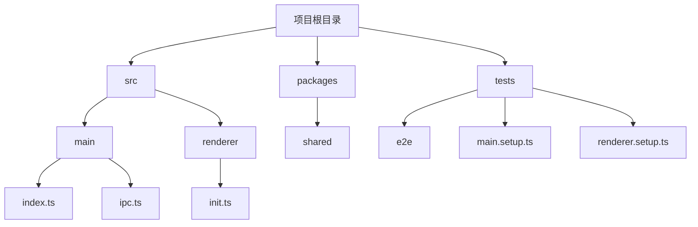
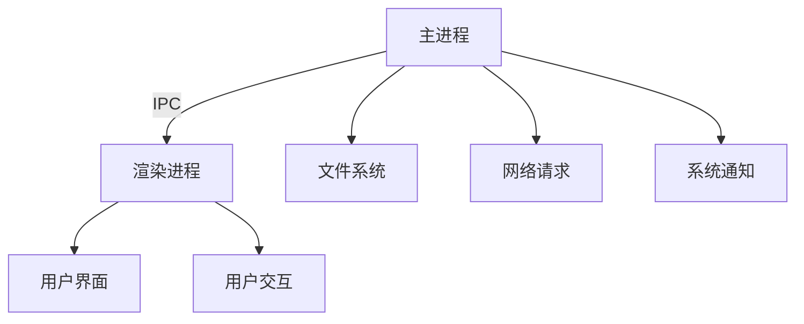
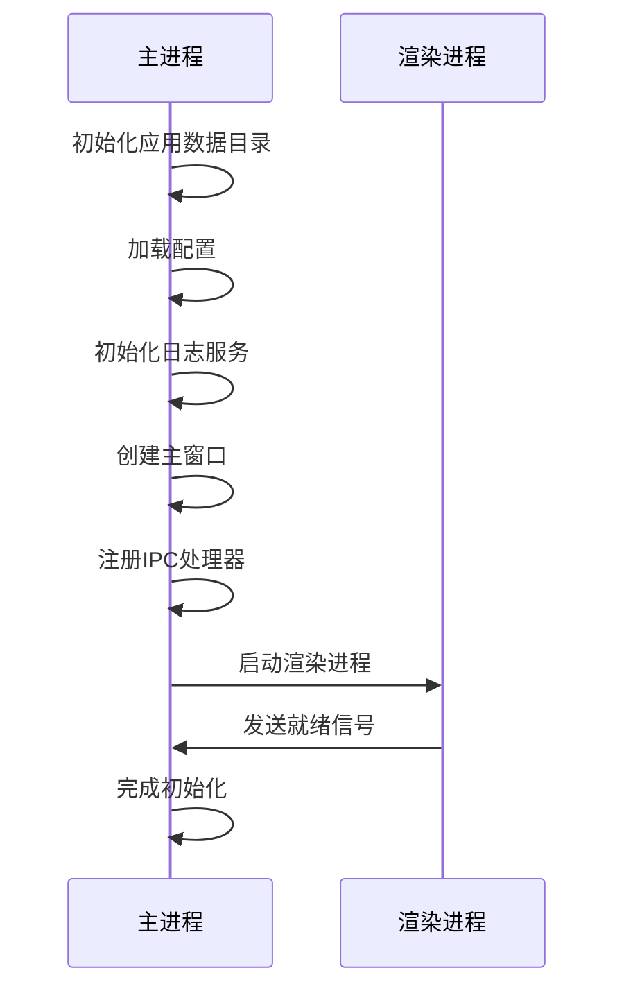
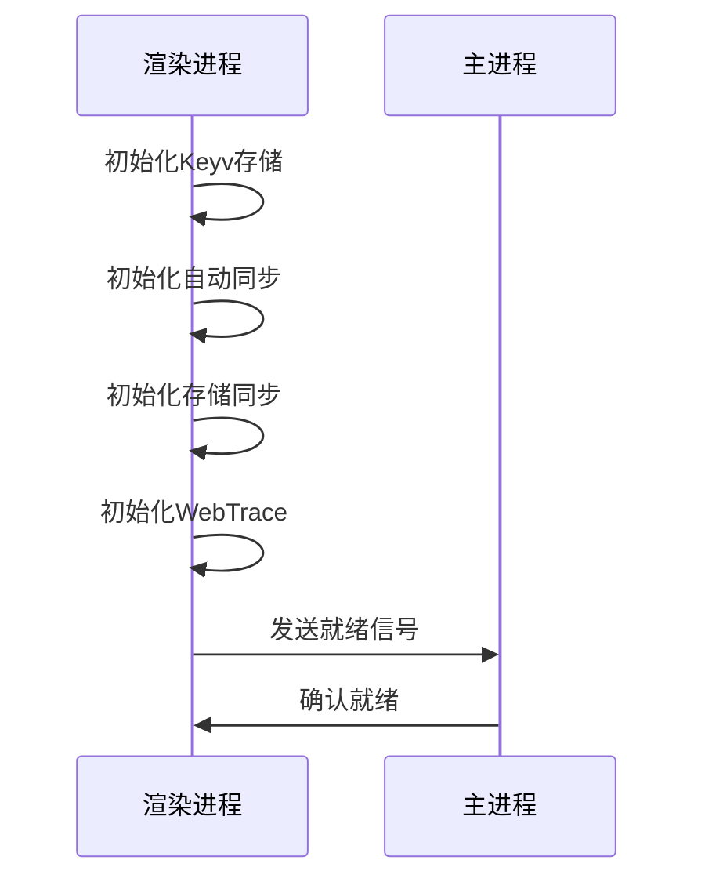
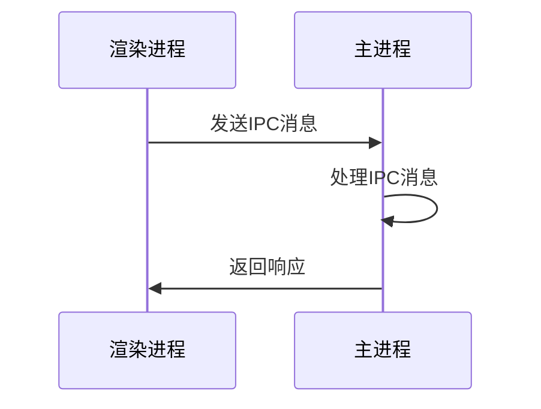
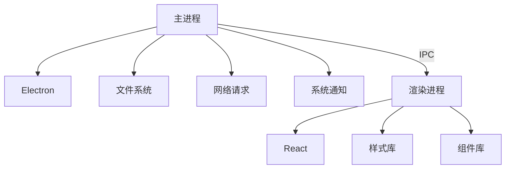

# 集成测试

<cite>
**本文档引用的文件**   
- [index.ts](file://src/main/index.ts)
- [ipc.ts](file://src/main/ipc.ts)
- [IpcChannel.ts](file://packages/shared/IpcChannel.ts)
- [index.ts](file://src/preload/index.ts)
- [init.ts](file://src/renderer/src/init.ts)
- [ApiServerService.ts](file://src/main/services/ApiServerService.ts)
- [main.setup.ts](file://tests/main.setup.ts)
- [renderer.setup.ts](file://tests/renderer.setup.ts)
- [electron.fixture.ts](file://tests/e2e/fixtures/electron.fixture.ts)
- [app-launch.spec.ts](file://tests/e2e/specs/app-launch.spec.ts)
</cite>

## 目录
1. [简介](#简介)
2. [项目结构](#项目结构)
3. [核心组件](#核心组件)
4. [架构概述](#架构概述)
5. [详细组件分析](#详细组件分析)
6. [依赖分析](#依赖分析)
7. [性能考虑](#性能考虑)
8. [故障排除指南](#故障排除指南)
9. [结论](#结论)

## 简介
本文档详细说明了如何对Cherry Studio进行集成测试，重点是主进程和渲染进程之间的集成，特别是通过IPC（进程间通信）机制的交互。文档涵盖了如何设置集成测试环境，包括如何启动主进程和渲染进程，以及如何建立IPC连接。提供了具体的测试示例，展示如何测试跨进程的函数调用、事件监听和数据传递。讨论了测试最佳实践，如测试异步通信、处理错误情况和验证数据完整性。还包括如何使用mock对象模拟外部依赖，以及如何确保集成测试的稳定性和可靠性。

## 项目结构
Cherry Studio项目采用典型的Electron应用结构，分为主进程和渲染进程。主进程负责管理应用程序的生命周期和系统级别的操作，而渲染进程负责用户界面的展示和交互。项目结构清晰，主要目录包括`src/main`（主进程代码）、`src/renderer`（渲染进程代码）、`packages`（共享包）和`tests`（测试代码）。

**Diagram sources**
- [index.ts](file://src/main/index.ts)
- [ipc.ts](file://src/main/ipc.ts)
- [init.ts](file://src/renderer/src/init.ts)

**Section sources**
- [index.ts](file://src/main/index.ts)
- [ipc.ts](file://src/main/ipc.ts)
- [init.ts](file://src/renderer/src/init.ts)

## 核心组件
Cherry Studio的核心组件包括主进程、渲染进程和IPC通信机制。主进程通过`src/main/index.ts`文件启动，负责初始化应用程序和创建主窗口。渲染进程通过`src/renderer/src/init.ts`文件初始化，负责加载用户界面和处理用户交互。IPC通信机制通过`src/main/ipc.ts`文件实现，负责主进程和渲染进程之间的消息传递。

**Section sources**
- [index.ts](file://src/main/index.ts)
- [init.ts](file://src/renderer/src/init.ts)
- [ipc.ts](file://src/main/ipc.ts)

## 架构概述
Cherry Studio的架构基于Electron框架，采用主进程和渲染进程分离的设计。主进程负责管理应用程序的生命周期和系统级别的操作，如文件系统访问、网络请求和系统通知。渲染进程负责用户界面的展示和交互，通过IPC与主进程通信。IPC通信机制通过`IpcChannel`枚举定义了各种通信通道，确保主进程和渲染进程之间的安全和高效通信。

**Diagram sources**
- [IpcChannel.ts](file://packages/shared/IpcChannel.ts)
- [ipc.ts](file://src/main/ipc.ts)

## 详细组件分析

### 主进程分析
主进程是Cherry Studio的核心，负责管理应用程序的生命周期和系统级别的操作。`src/main/index.ts`文件是主进程的入口点，负责初始化应用程序和创建主窗口。`src/main/ipc.ts`文件实现了IPC通信机制，负责主进程和渲染进程之间的消息传递。

#### 主进程启动流程

**Diagram sources**
- [index.ts](file://src/main/index.ts)
- [ipc.ts](file://src/main/ipc.ts)

**Section sources**
- [index.ts](file://src/main/index.ts)
- [ipc.ts](file://src/main/ipc.ts)

### 渲染进程分析
渲染进程负责用户界面的展示和交互，通过IPC与主进程通信。`src/renderer/src/init.ts`文件是渲染进程的入口点，负责初始化用户界面和注册事件处理器。

#### 渲染进程初始化流程

**Diagram sources**
- [init.ts](file://src/renderer/src/init.ts)

**Section sources**
- [init.ts](file://src/renderer/src/init.ts)

### IPC通信机制分析
IPC通信机制是Cherry Studio的核心，负责主进程和渲染进程之间的消息传递。`src/main/ipc.ts`文件实现了IPC通信机制，通过`IpcChannel`枚举定义了各种通信通道。

#### IPC通信流程

**Diagram sources**
- [ipc.ts](file://src/main/ipc.ts)
- [IpcChannel.ts](file://packages/shared/IpcChannel.ts)

**Section sources**
- [ipc.ts](file://src/main/ipc.ts)
- [IpcChannel.ts](file://packages/shared/IpcChannel.ts)

## 依赖分析
Cherry Studio的依赖关系清晰，主进程和渲染进程通过IPC通信机制进行交互。主进程依赖于Electron框架和各种系统级别的库，如文件系统访问和网络请求。渲染进程依赖于React框架和各种前端库，如样式和组件库。

**Diagram sources**
- [package.json](file://package.json)

**Section sources**
- [package.json](file://package.json)

## 性能考虑
在进行集成测试时，性能是一个重要的考虑因素。Cherry Studio通过优化IPC通信机制和减少不必要的消息传递来提高性能。此外，通过使用异步通信和批量处理消息来减少主进程和渲染进程之间的延迟。

## 故障排除指南
在进行集成测试时，可能会遇到各种问题。以下是一些常见的故障排除步骤：

1. **检查IPC通道**：确保IPC通道定义正确，且主进程和渲染进程之间的消息传递正常。
2. **检查依赖关系**：确保所有依赖关系都已正确安装，且版本兼容。
3. **检查日志**：查看日志文件，查找错误信息和警告。
4. **使用调试工具**：使用Electron的调试工具，如DevTools，来调试主进程和渲染进程。

**Section sources**
- [main.setup.ts](file://tests/main.setup.ts)
- [renderer.setup.ts](file://tests/renderer.setup.ts)

## 结论
Cherry Studio的集成测试文档详细说明了如何测试主进程和渲染进程之间的集成，特别是通过IPC机制的交互。通过遵循本文档中的指导，可以确保Cherry Studio的稳定性和可靠性。集成测试不仅有助于发现和修复问题，还可以提高开发效率和代码质量。