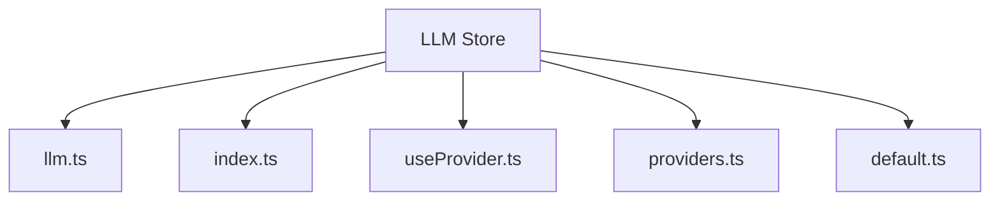
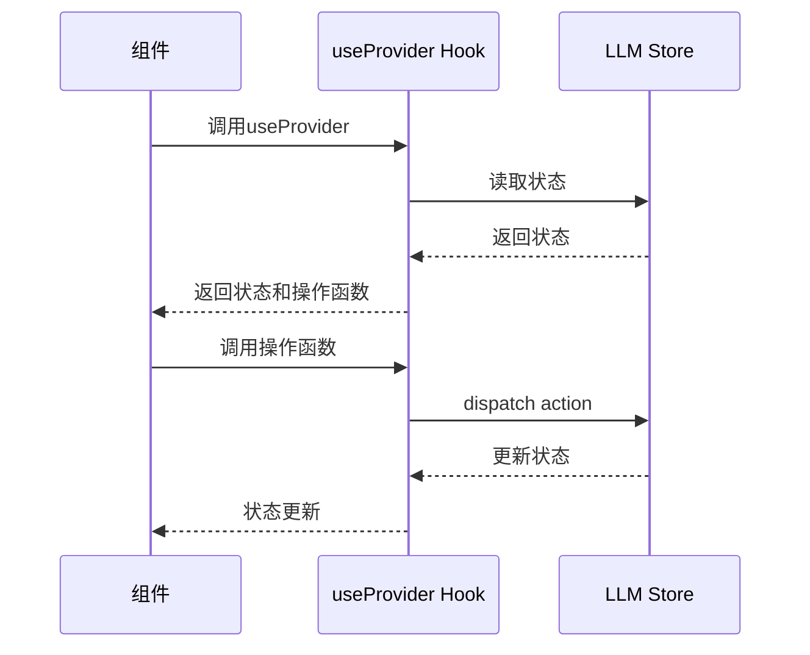
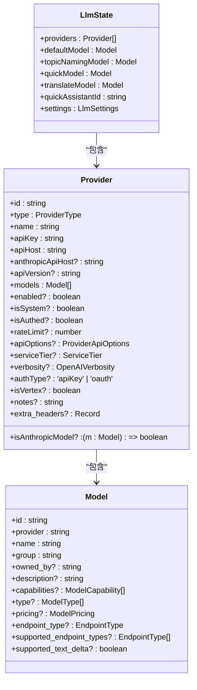
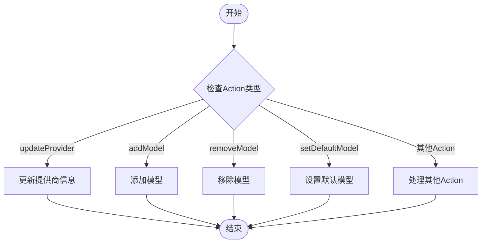
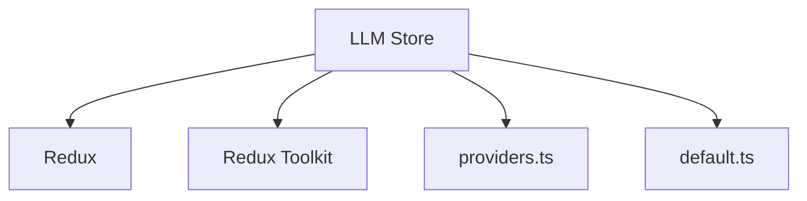

# LLM Store

<cite>
**本文档引用的文件**   
- [llm.ts](file://src/renderer/src/store/llm.ts)
- [index.ts](file://src/renderer/src/store/index.ts)
- [useProvider.ts](file://src/renderer/src/hooks/useProvider.ts)
- [providers.ts](file://src/renderer/src/config/providers.ts)
- [default.ts](file://src/renderer/src/config/models/default.ts)
- [types.ts](file://src/renderer/src/types/index.ts)
</cite>

## 目录
1. [简介](#简介)
2. [项目结构](#项目结构)
3. [核心组件](#核心组件)
4. [架构概述](#架构概述)
5. [详细组件分析](#详细组件分析)
6. [依赖分析](#依赖分析)
7. [性能考虑](#性能考虑)
8. [故障排除指南](#故障排除指南)
9. [结论](#结论)

## 简介
LLM Store模块是Cherry Studio中用于管理大语言模型状态的核心组件。该模块基于Redux实现，负责维护模型列表、活动模型、提供商配置等状态信息，并提供相应的action creators来更新这些状态。LLM Store的设计旨在支持多模型场景下的状态管理，确保模型状态的一致性和可预测性。

## 项目结构
LLM Store模块主要由以下几个文件组成：
- `llm.ts`：定义了LLM状态的reducer和action creators
- `index.ts`：将LLM reducer集成到全局store中
- `useProvider.ts`：提供了与LLM Store交互的hook函数
- `providers.ts`：定义了系统内置的模型提供商
- `default.ts`：定义了默认的模型配置

**Diagram sources**
- [llm.ts](file://src/renderer/src/store/llm.ts)
- [index.ts](file://src/renderer/src/store/index.ts)
- [useProvider.ts](file://src/renderer/src/hooks/useProvider.ts)
- [providers.ts](file://src/renderer/src/config/providers.ts)
- [default.ts](file://src/renderer/src/config/models/default.ts)

**Section sources**
- [llm.ts](file://src/renderer/src/store/llm.ts)
- [index.ts](file://src/renderer/src/store/index.ts)

## 核心组件
LLM Store的核心是`llmSlice`，它定义了LLM状态的初始状态和reducer函数。状态结构包括`providers`、`defaultModel`、`quickModel`、`translateModel`等字段，用于管理模型提供商、默认模型、快速模型和翻译模型。

**Section sources**
- [llm.ts](file://src/renderer/src/store/llm.ts#L36-L80)

## 架构概述
LLM Store采用Redux架构模式，通过定义reducer函数来管理状态的更新。状态更新通过dispatch action来触发，确保状态变化的可预测性和可追踪性。LLM Store与其他组件通过hook函数进行交互，如`useProvider` hook提供了访问和更新LLM状态的便捷方式。

**Diagram sources**
- [llm.ts](file://src/renderer/src/store/llm.ts)
- [useProvider.ts](file://src/renderer/src/hooks/useProvider.ts)

## 详细组件分析

### LLM状态结构分析
LLM Store的状态结构设计合理，包含了管理大语言模型所需的各种信息。`LlmState`接口定义了状态的类型，包括`providers`、`defaultModel`、`quickModel`、`translateModel`等字段。

**Diagram sources**
- [llm.ts](file://src/renderer/src/store/llm.ts#L36-L45)
- [types.ts](file://src/renderer/src/types/index.ts#L260-L306)
- [types.ts](file://src/renderer/src/types/index.ts#L239-L243)

### Reducer函数分析
LLM Store的reducer函数定义在`llmSlice`中，通过`createSlice`函数创建。reducer函数处理各种action，更新状态。例如，`updateProvider` action用于更新提供商信息，`addModel` action用于添加模型。

**Diagram sources**
- [llm.ts](file://src/renderer/src/store/llm.ts#L127-L234)

### Action Creators分析
LLM Store通过`createSlice`函数自动生成action creators。这些action creators提供了更新状态的接口，如`updateProvider`、`addModel`、`removeModel`等。这些函数被导出，供其他组件使用。

**Section sources**
- [llm.ts](file://src/renderer/src/store/llm.ts#L237-L261)

### 与模型服务组件的交互
LLM Store通过hook函数与模型服务组件进行交互。`useProvider` hook提供了访问和更新LLM状态的便捷方式，使得组件可以轻松地读取模型状态和触发状态更新。

**Diagram sources**
- [useProvider.ts](file://src/renderer/src/hooks/useProvider.ts)
- [llm.ts](file://src/renderer/src/store/llm.ts)

## 依赖分析
LLM Store依赖于Redux和Redux Toolkit来管理状态。它还依赖于`@renderer/config/providers`和`@renderer/config/models`来获取系统内置的提供商和模型配置。

**Diagram sources**
- [llm.ts](file://src/renderer/src/store/llm.ts)
- [providers.ts](file://src/renderer/src/config/providers.ts)
- [default.ts](file://src/renderer/src/config/models/default.ts)

**Section sources**
- [llm.ts](file://src/renderer/src/store/llm.ts)
- [providers.ts](file://src/renderer/src/config/providers.ts)
- [default.ts](file://src/renderer/src/config/models/default.ts)

## 性能考虑
LLM Store的设计考虑了性能因素。通过使用Redux Toolkit的`createSlice`函数，减少了样板代码，提高了开发效率。状态更新通过immutable方式实现，确保了状态的一致性和可预测性。

## 故障排除指南
在使用LLM Store时，可能会遇到一些常见问题，如状态更新不及时、模型信息不正确等。这些问题通常可以通过检查action的dispatch和reducer的逻辑来解决。

**Section sources**
- [llm.ts](file://src/renderer/src/store/llm.ts)

## 结论
LLM Store模块是Cherry Studio中管理大语言模型状态的核心组件。它通过Redux架构模式实现了状态的可预测性和可追踪性，提供了丰富的API来管理模型状态。LLM Store的设计合理，性能良好，为Cherry Studio的多模型支持提供了坚实的基础。