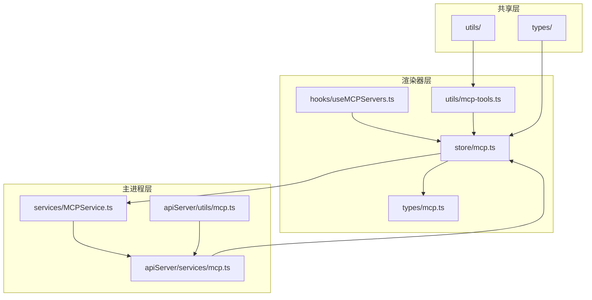
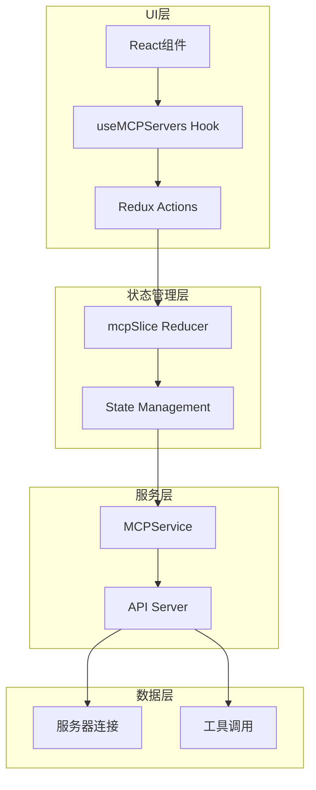
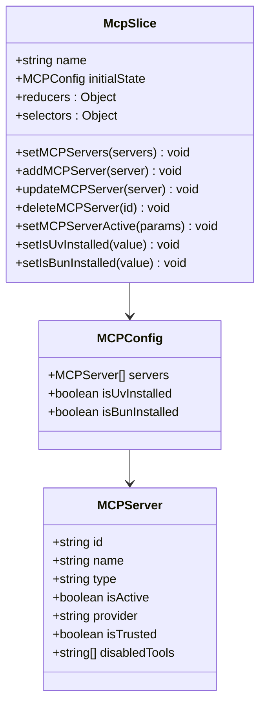
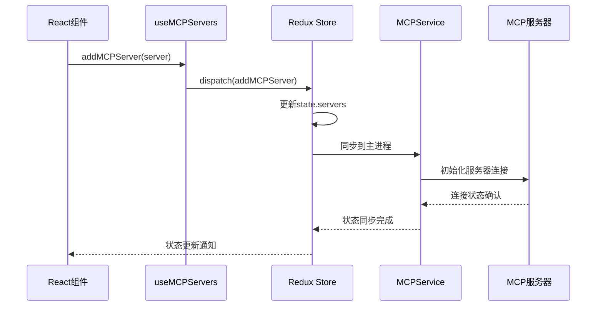
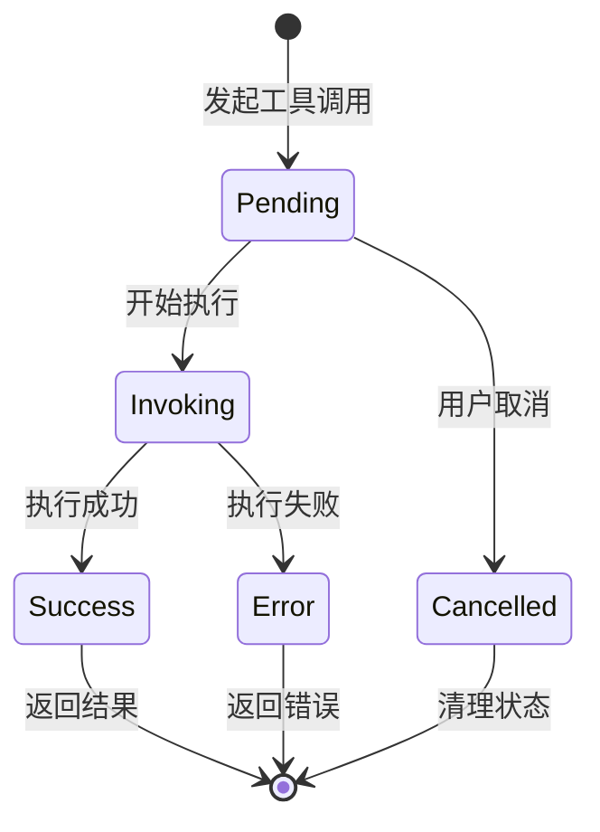
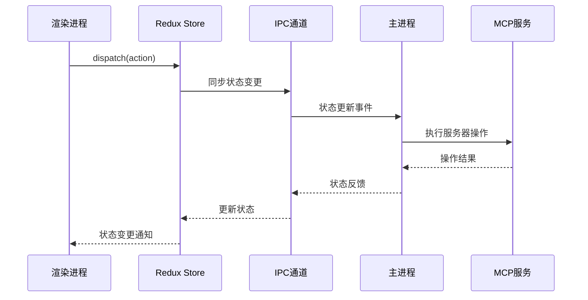
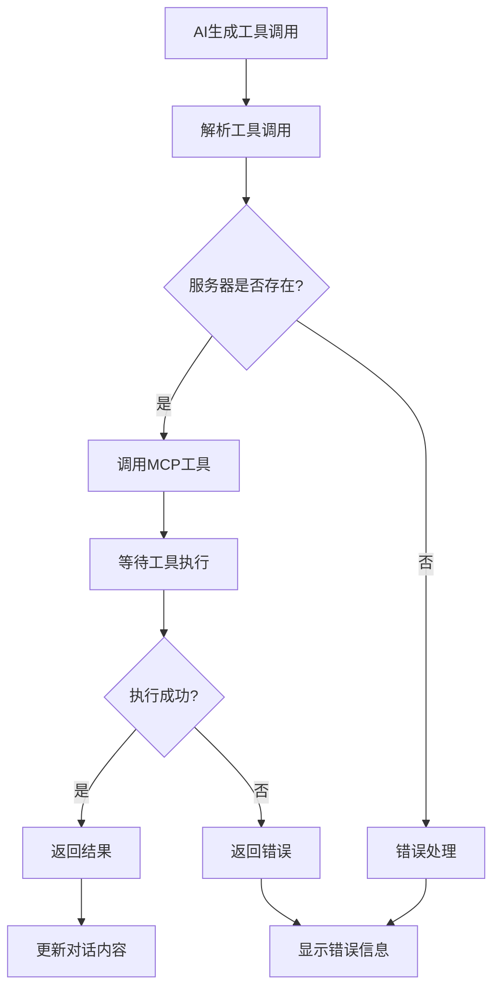
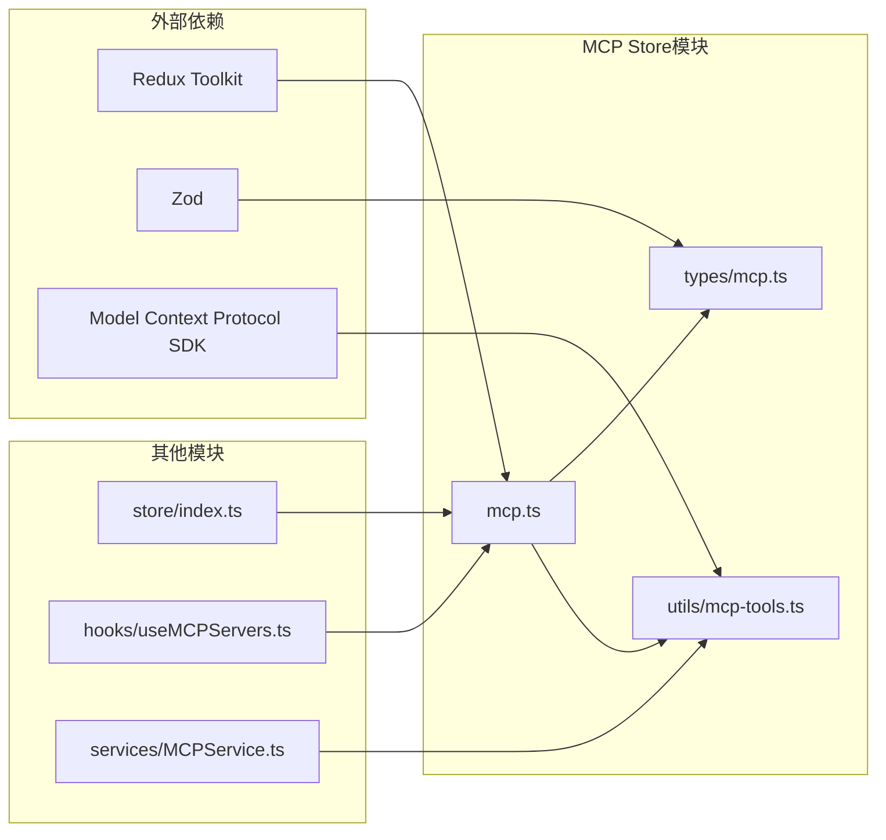

# Cherry Studio MCP Store模块文档

<cite>
**本文档中引用的文件**
- [mcp.ts](file://src/renderer/src/store/mcp.ts)
- [mcp.ts](file://src/renderer/src/types/mcp.ts)
- [MCPService.ts](file://src/main/services/MCPService.ts)
- [mcp.ts](file://src/main/apiServer/services/mcp.ts)
- [mcp.ts](file://src/main/apiServer/utils/mcp.ts)
- [useMCPServers.ts](file://src/renderer/src/hooks/useMCPServers.ts)
- [index.ts](file://src/renderer/src/store/index.ts)
- [mcp-tools.ts](file://src/renderer/src/utils/mcp-tools.ts)
- [ApiService.ts](file://src/renderer/src/services/ApiService.ts)
</cite>

## 目录
1. [简介](#简介)
2. [项目结构](#项目结构)
3. [核心组件](#核心组件)
4. [架构概览](#架构概览)
5. [详细组件分析](#详细组件分析)
6. [依赖关系分析](#依赖关系分析)
7. [性能考虑](#性能考虑)
8. [故障排除指南](#故障排除指南)
9. [结论](#结论)

## 简介

Cherry Studio的MCP Store模块是一个基于Redux Toolkit构建的状态管理系统，专门用于管理模型上下文协议（Model Context Protocol, MCP）服务的状态。该模块负责维护MCP服务器配置、工具调用状态以及与AI对话中的工具交互管理。

MCP Store模块的核心功能包括：
- 管理MCP服务器的生命周期（启动、停止、配置）
- 维护服务器状态和工具可用性
- 处理工具调用请求和响应
- 提供类型安全的状态访问接口
- 支持内置和外部MCP服务器的统一管理

## 项目结构

MCP Store模块在Cherry Studio项目中的组织结构如下：

**图表来源**
- [mcp.ts](file://src/renderer/src/store/mcp.ts#L1-L198)
- [MCPService.ts](file://src/main/services/MCPService.ts#L1-L200)

**章节来源**
- [mcp.ts](file://src/renderer/src/store/mcp.ts#L1-L198)
- [index.ts](file://src/renderer/src/store/index.ts#L1-L137)

## 核心组件

### State数据结构

MCP Store的state包含以下核心字段：

| 字段名 | 类型 | 描述 | 默认值 |
|--------|------|------|--------|
| `servers` | `MCPServer[]` | 所有MCP服务器的配置列表 | `[]` |
| `isUvInstalled` | `boolean` | UV包管理器安装状态 | `true` |
| `isBunInstalled` | `boolean` | Bun包管理器安装状态 | `true` |

### 内置MCP服务器

系统预配置了多个内置MCP服务器，每个服务器都有特定的功能：

| 服务器名称 | 功能描述 | 类型 | 默认状态 |
|------------|----------|------|----------|
| `mcpAutoInstall` | 自动安装MCP服务器 | `inMemory` | `false` |
| `memory` | 内存存储服务器 | `inMemory` | `true` |
| `sequentialThinking` | 顺序思考服务器 | `inMemory` | `true` |
| `braveSearch` | Brave搜索引擎 | `inMemory` | `false` |
| `fetch` | HTTP请求服务器 | `inMemory` | `true` |
| `filesystem` | 文件系统访问 | `inMemory` | `false` |
| `difyKnowledge` | 知识库服务器 | `inMemory` | `false` |
| `python` | Python执行服务器 | `inMemory` | `false` |
| `@cherry/didi-mcp` | 滴滴MCP服务器 | `inMemory` | `false` |

**章节来源**
- [mcp.ts](file://src/renderer/src/store/mcp.ts#L7-L11)
- [mcp.ts](file://src/renderer/src/store/mcp.ts#L73-L178)

## 架构概览

MCP Store采用分层架构设计，确保状态管理的清晰性和可维护性：

**图表来源**
- [mcp.ts](file://src/renderer/src/store/mcp.ts#L13-L61)
- [useMCPServers.ts](file://src/renderer/src/hooks/useMCPServers.ts#L25-L39)

## 详细组件分析

### Reducer架构设计

MCP Store使用Redux Toolkit的createSlice创建，提供了类型安全的状态管理和操作：

**图表来源**
- [mcp.ts](file://src/renderer/src/store/mcp.ts#L13-L61)
- [mcp.ts](file://src/renderer/src/types/mcp.ts#L38-L178)

### Action定义和处理流程

MCP Store定义了以下核心actions：

#### 服务器管理Actions

**图表来源**
- [mcp.ts](file://src/renderer/src/store/mcp.ts#L17-L30)
- [useMCPServers.ts](file://src/renderer/src/hooks/useMCPServers.ts#L30-L35)

#### 工具调用状态管理

工具调用过程涉及多个状态转换：

**图表来源**
- [mcp-tools.ts](file://src/renderer/src/utils/mcp-tools.ts#L134-L187)
- [MCPService.ts](file://src/main/services/MCPService.ts#L660-L690)

**章节来源**
- [mcp.ts](file://src/renderer/src/store/mcp.ts#L17-L61)
- [mcp-tools.ts](file://src/renderer/src/utils/mcp-tools.ts#L134-L187)

### 与MCP服务组件的集成

MCP Store与MCP服务组件通过以下方式集成：

#### 主进程通信

**图表来源**
- [useMCPServers.ts](file://src/renderer/src/hooks/useMCPServers.ts#L10-L18)
- [mcp.ts](file://src/main/apiServer/services/mcp.ts#L40-L49)

#### AI对话中的工具调用

在AI对话中，MCP工具调用遵循以下流程：

**图表来源**
- [mcp-tools.ts](file://src/renderer/src/utils/mcp-tools.ts#L74-L108)
- [ApiService.ts](file://src/renderer/src/services/ApiService.ts#L48-L55)

**章节来源**
- [useMCPServers.ts](file://src/renderer/src/hooks/useMCPServers.ts#L10-L18)
- [mcp-tools.ts](file://src/renderer/src/utils/mcp-tools.ts#L134-L187)

## 依赖关系分析

MCP Store模块与其他模块的依赖关系如下：

**图表来源**
- [index.ts](file://src/renderer/src/store/index.ts#L15)
- [mcp.ts](file://src/renderer/src/store/mcp.ts#L1-L3)

**章节来源**
- [index.ts](file://src/renderer/src/store/index.ts#L1-L137)
- [mcp.ts](file://src/renderer/src/store/mcp.ts#L1-L198)

## 性能考虑

MCP Store模块在设计时考虑了以下性能优化策略：

### 缓存机制
- 使用Redux Persist进行状态持久化
- 实现工具列表缓存（5分钟TTL）
- 服务器连接复用机制

### 异步处理
- 工具调用采用异步模式
- 支持取消操作
- 流式响应处理

### 内存管理
- 及时清理过期的服务器连接
- 限制状态树深度
- 避免不必要的状态更新

## 故障排除指南

### 常见问题及解决方案

#### 服务器连接失败
**症状**: MCP服务器无法启动或连接超时
**解决方案**: 
1. 检查服务器配置是否正确
2. 验证网络连接状态
3. 查看日志获取详细错误信息

#### 工具调用超时
**症状**: 工具执行时间过长或无响应
**解决方案**:
1. 检查工具配置参数
2. 增加超时时间设置
3. 验证服务器资源可用性

#### 状态不同步
**症状**: UI显示状态与实际状态不一致
**解决方案**:
1. 检查IPC通信状态
2. 重启应用重置状态
3. 清除Redux Persist缓存

**章节来源**
- [MCPService.ts](file://src/main/services/MCPService.ts#L438-L474)
- [mcp.ts](file://src/main/apiServer/utils/mcp.ts#L30-L65)

## 结论

Cherry Studio的MCP Store模块提供了一个完整、类型安全且高性能的状态管理解决方案。通过合理的架构设计和完善的错误处理机制，该模块能够有效地管理复杂的MCP服务器生态系统，并为AI对话中的工具调用提供可靠的支持。

主要优势包括：
- **类型安全**: 完整的TypeScript类型定义
- **性能优化**: 多层缓存和异步处理
- **可扩展性**: 模块化设计支持新功能添加
- **可靠性**: 完善的错误处理和恢复机制

该模块为Cherry Studio的AI功能提供了坚实的基础，支持用户在对话中无缝使用各种MCP工具和服务。