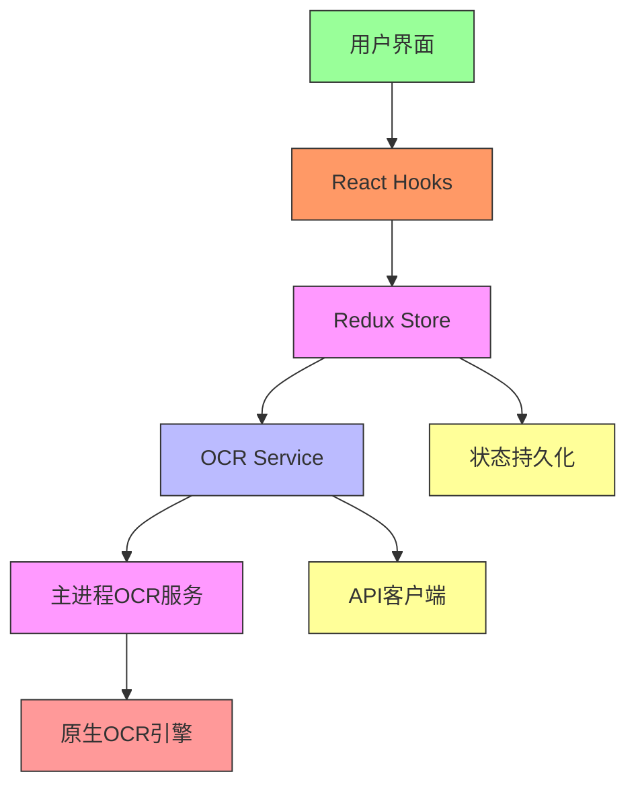
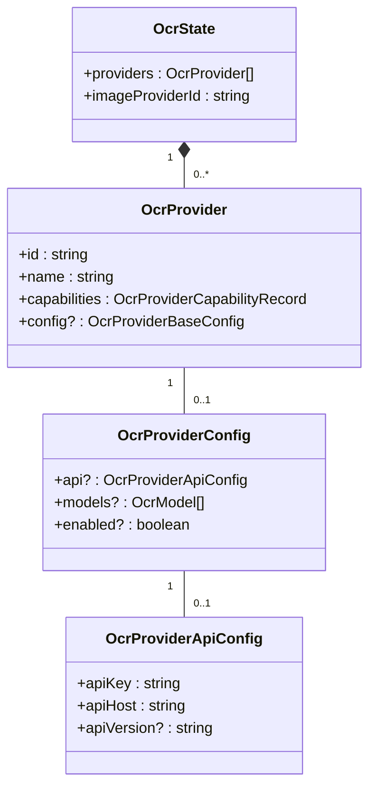
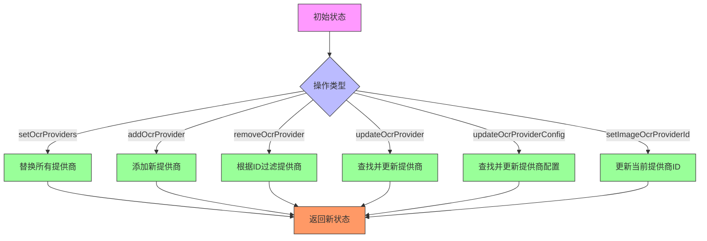
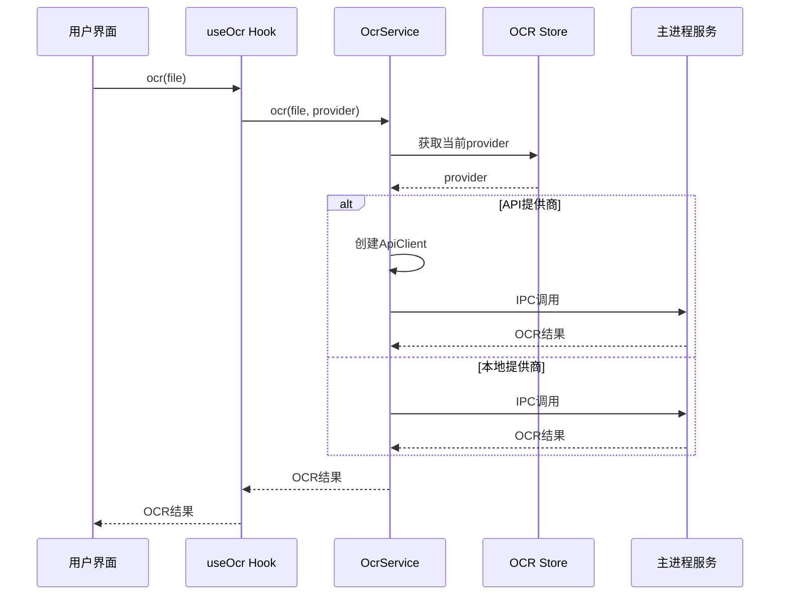
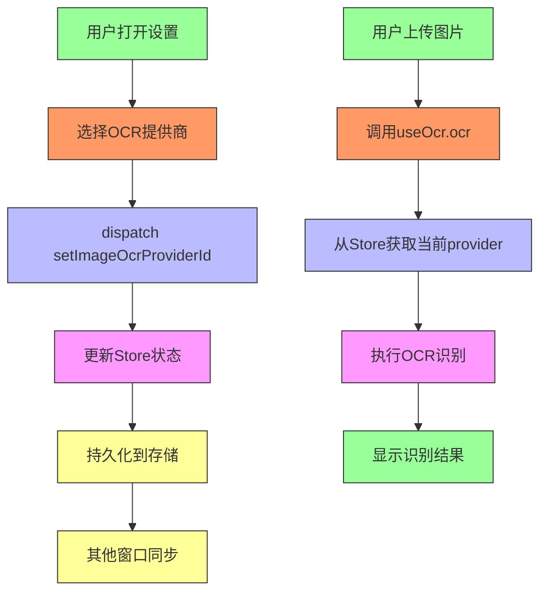
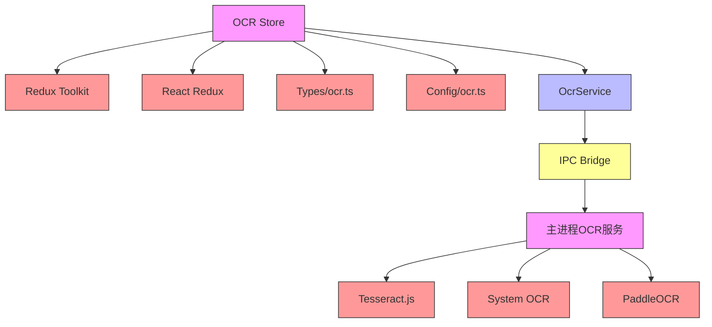

# OCR Store

<cite>
**本文档引用的文件**
- [ocr.ts](file://src/renderer/src/store/ocr.ts)
- [ocr.ts](file://src/renderer/src/types/ocr.ts)
- [ocr.ts](file://src/renderer/src/config/ocr.ts)
- [OcrService.ts](file://src/renderer/src/services/ocr/OcrService.ts)
- [useOcr.ts](file://src/renderer/src/hooks/useOcr.ts)
- [useOcrProvider.tsx](file://src/renderer/src/hooks/useOcrProvider.tsx)
- [TesseractService.ts](file://src/main/services/ocr/builtin/TesseractService.ts)
- [SystemOcrService.ts](file://src/main/services/ocr/builtin/SystemOcrService.ts)
- [OcrBaseService.ts](file://src/main/services/ocr/builtin/OcrBaseService.ts)
- [OcrApiClientFactory.ts](file://src/renderer/src/services/ocr/clients/OcrApiClientFactory.ts)
- [OcrBaseApiClient.ts](file://src/renderer/src/services/ocr/clients/OcrBaseApiClient.ts)
</cite>

## 目录
1. [简介](#简介)
2. [项目结构](#项目结构)
3. [核心组件](#核心组件)
4. [架构概述](#架构概述)
5. [详细组件分析](#详细组件分析)
6. [依赖分析](#依赖分析)
7. [性能考虑](#性能考虑)
8. [故障排除指南](#故障排除指南)
9. [结论](#结论)

## 简介
本文档详细说明了Cherry Studio中OCR Store模块的设计和功能。该模块负责管理OCR服务配置、识别状态和处理队列，为图像文字识别功能提供状态管理支持。文档将深入分析OCR reducer的结构和逻辑，解释其如何与OCR服务组件交互，并展示在图像文字识别过程中的状态管理策略。

## 项目结构
OCR Store模块主要位于项目的`src/renderer/src/store`目录下，与其他Redux store模块共同构成应用程序的状态管理系统。该模块与`src/renderer/src/services/ocr`目录下的服务层、`src/renderer/src/hooks`目录下的React Hooks以及`src/main/services/ocr`目录下的主进程服务紧密协作。

```mermaid
graph TB
subgraph "渲染进程"
A[OCR Store] --> B[OCR Service]
B --> C[OCR Hooks]
C --> D[UI Components]
end
subgraph "主进程"
E[Main OCR Services]
end
B < --> F[IPC Bridge]
F < --> E
style A fill:#f9f,stroke:#333
style B fill:#bbf,stroke:#333
style C fill:#f96,stroke:#333
style D fill:#9f9,stroke:#333
style E fill:#f9f,stroke:#333
style F fill:#ff9,stroke:#333
```

**图表来源**
- [ocr.ts](file://src/renderer/src/store/ocr.ts)
- [OcrService.ts](file://src/renderer/src/services/ocr/OcrService.ts)
- [useOcr.ts](file://src/renderer/src/hooks/useOcr.ts)

**章节来源**
- [ocr.ts](file://src/renderer/src/store/ocr.ts)
- [project_structure](file://project_structure#L1-L100)

## 核心组件
OCR Store模块的核心是`ocrSlice`，它定义了OCR功能的状态结构和状态更新逻辑。该reducer管理着OCR服务提供商的配置、当前任务状态和处理队列。通过Redux Toolkit的createSlice函数创建，它提供了类型安全的action creators和reducers。

**章节来源**
- [ocr.ts](file://src/renderer/src/store/ocr.ts#L1-L69)

## 架构概述
OCR Store模块采用Redux状态管理模式，通过单一状态树管理所有OCR相关的状态。该架构分为三个主要层次：状态层（Store）、服务层（Service）和用户界面层（UI）。状态层负责存储和管理OCR配置和状态；服务层负责与底层OCR引擎通信；用户界面层通过Hooks访问状态和操作。



**图表来源**
- [ocr.ts](file://src/renderer/src/store/ocr.ts)
- [OcrService.ts](file://src/renderer/src/services/ocr/OcrService.ts)
- [useOcr.ts](file://src/renderer/src/hooks/useOcr.ts)

## 详细组件分析

### OCR状态结构分析
OCR Store的状态结构设计精巧，主要包含providers和imageProviderId两个字段。providers数组存储所有可用的OCR服务提供商及其配置，而imageProviderId记录当前用于图像识别的提供商ID。这种设计支持多提供商管理和动态切换。



**图表来源**
- [ocr.ts](file://src/renderer/src/store/ocr.ts#L6-L9)
- [types/ocr.ts](file://src/renderer/src/types/ocr.ts#L82-L87)
- [config/ocr.ts](file://src/renderer/src/config/ocr.ts#L15-L71)

### Reducer逻辑分析
OCR reducer的逻辑设计遵循Redux的最佳实践，通过纯函数更新状态。它提供了多个reducers来处理不同的状态更新场景，包括设置提供商列表、添加/删除提供商、更新提供商配置以及设置当前图像识别提供商。



**图表来源**
- [ocr.ts](file://src/renderer/src/store/ocr.ts#L24-L55)

### Action Creators分析
Action creators为组件提供了类型安全的方式来触发状态更新。每个reducer都有对应的action creator，它们接受适当的payload并返回具有正确类型的action对象。这种设计确保了类型安全和代码可维护性。

**章节来源**
- [ocr.ts](file://src/renderer/src/store/ocr.ts#L58-L65)

### OCR服务交互分析
OCR Store模块通过服务层与底层OCR引擎交互。当需要执行OCR操作时，UI组件通过Hooks调用服务，服务根据当前状态选择合适的OCR提供商并执行识别任务。



**图表来源**
- [useOcr.ts](file://src/renderer/src/hooks/useOcr.ts#L13-L60)
- [OcrService.ts](file://src/renderer/src/services/ocr/OcrService.ts#L16-L24)
- [ocr.ts](file://src/renderer/src/store/ocr.ts)

### 状态管理策略分析
在图像文字识别过程中，OCR Store采用了一种高效的状态管理策略。它通过持久化存储记住用户的提供商选择，支持动态配置更新，并提供了选择器函数来优化组件重渲染。



**图表来源**
- [useOcrProvider.tsx](file://src/renderer/src/hooks/useOcrProvider.tsx#L114-L148)
- [useOcr.ts](file://src/renderer/src/hooks/useOcr.ts)
- [ocr.ts](file://src/renderer/src/store/ocr.ts)

**章节来源**
- [useOcrProvider.tsx](file://src/renderer/src/hooks/useOcrProvider.tsx#L114-L148)
- [useOcr.ts](file://src/renderer/src/hooks/useOcr.ts#L13-L60)

## 依赖分析
OCR Store模块依赖于多个其他模块和外部库。它依赖Redux Toolkit进行状态管理，依赖React Redux进行React集成，依赖类型定义文件进行类型安全，并通过IPC与主进程通信。



**图表来源**
- [ocr.ts](file://src/renderer/src/store/ocr.ts)
- [package.json](file://package.json)

## 性能考虑
OCR Store模块在设计时考虑了性能优化。通过Redux的不可变更新模式和选择器函数，它最小化了不必要的组件重渲染。状态持久化减少了应用重启时的初始化时间，而提供商配置的缓存避免了重复的网络请求。

## 故障排除指南
当OCR功能出现问题时，可以检查以下方面：确保OCR提供商配置正确，验证API密钥有效性，检查网络连接，确认文件格式支持，以及查看控制台错误日志。Store的状态可以通过Redux DevTools进行检查和调试。

**章节来源**
- [useOcr.ts](file://src/renderer/src/hooks/useOcr.ts#L46-L50)
- [OcrBaseApiClient.ts](file://src/renderer/src/services/ocr/clients/OcrBaseApiClient.ts#L22-L42)

## 结论
Cherry Studio的OCR Store模块提供了一个健壮、可扩展的状态管理解决方案，用于处理图像文字识别功能。通过清晰的状态结构、类型安全的action creators和高效的更新逻辑，它为用户提供了一致且可靠的OCR体验。该模块的设计支持多种OCR提供商，允许灵活的配置和动态切换，同时通过与主进程服务的紧密集成确保了高性能的识别能力。