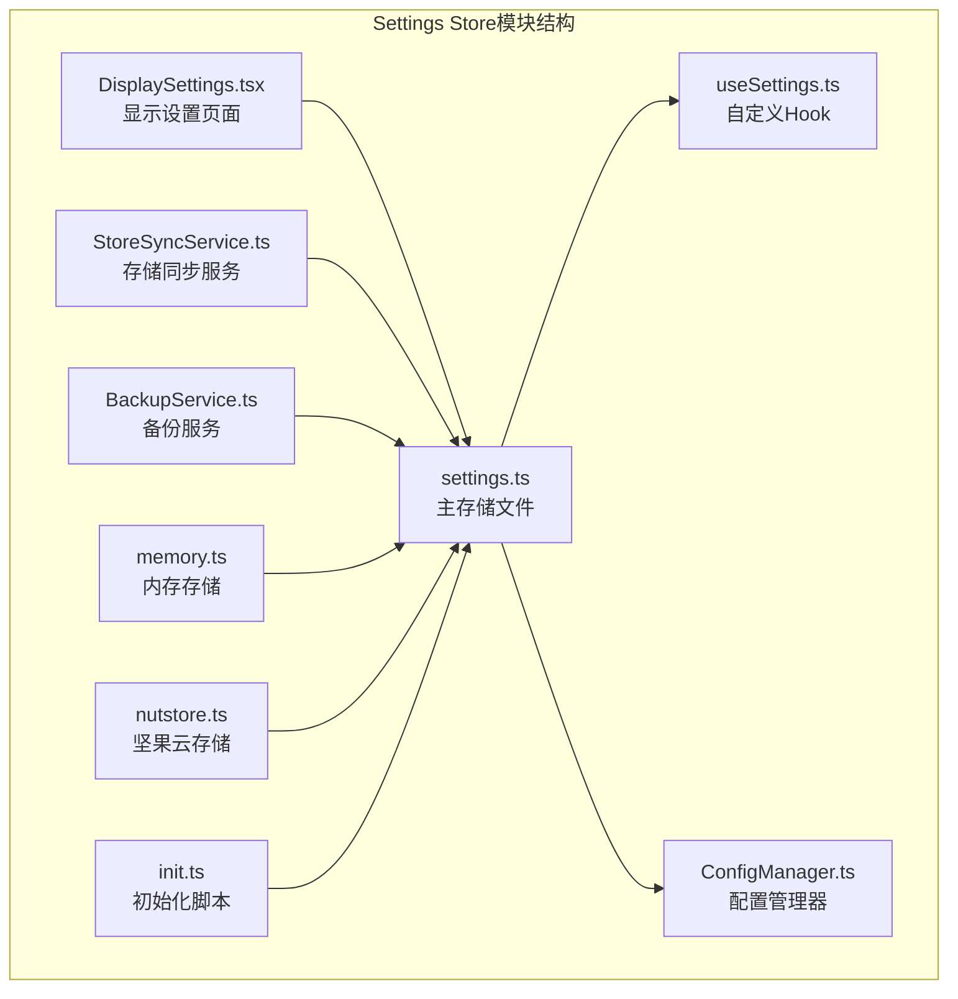
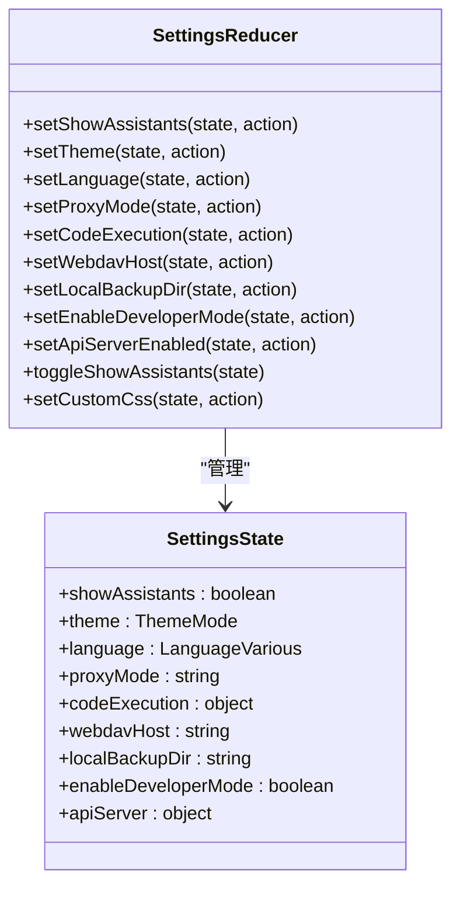
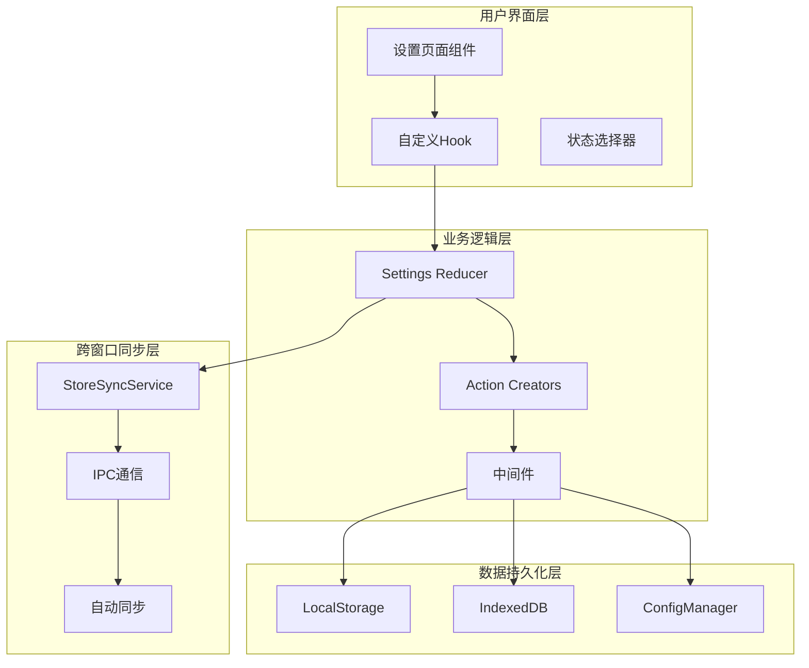
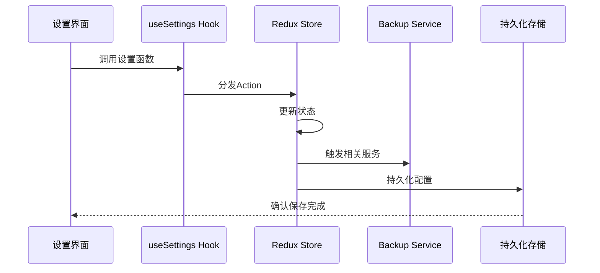
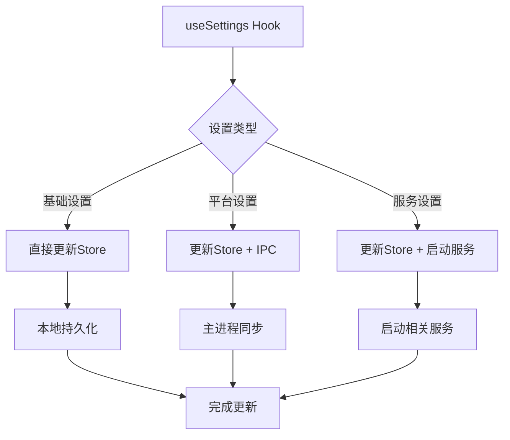
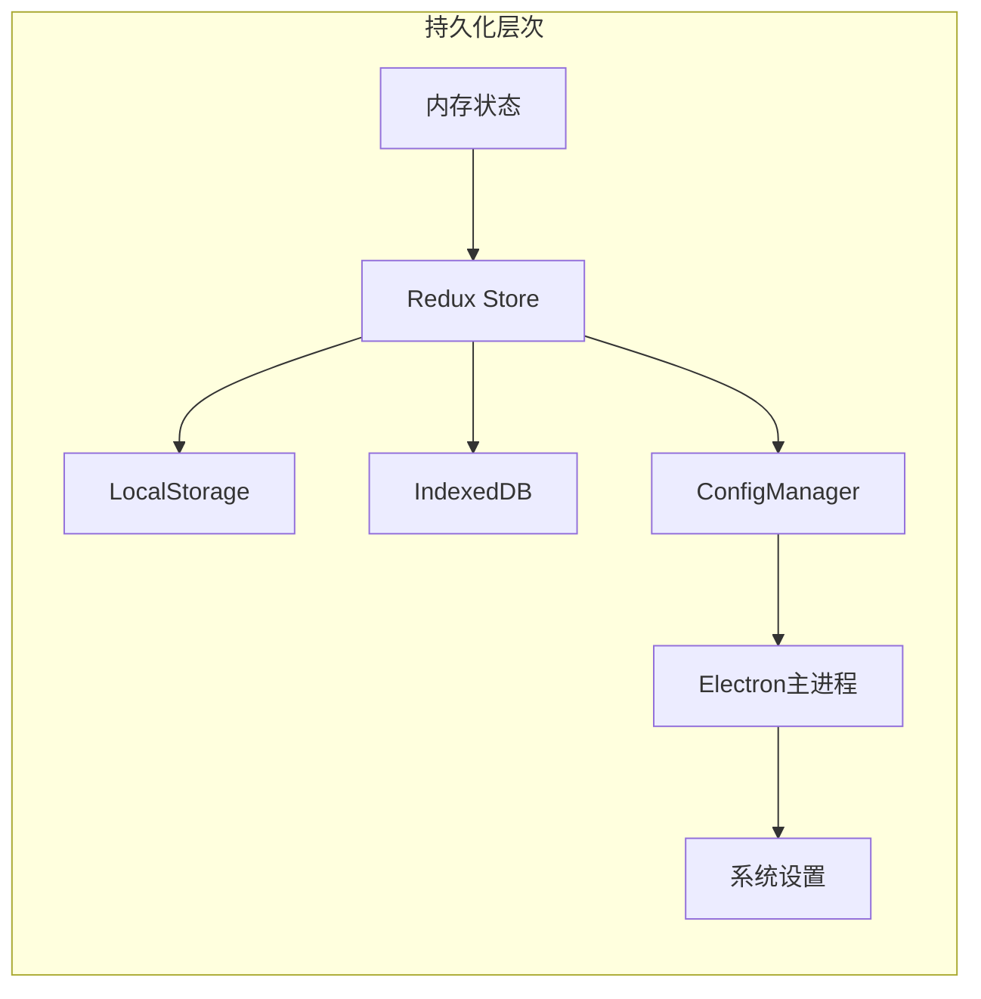
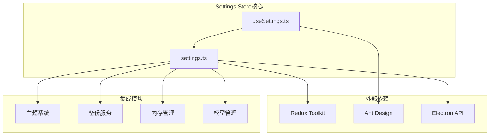

# Cherry Studio Settings Store模块文档

<cite>
**本文档中引用的文件**
- [settings.ts](file://src/renderer/src/store/settings.ts)
- [useSettings.ts](file://src/renderer/src/hooks/useSettings.ts)
- [ConfigManager.ts](file://src/main/services/ConfigManager.ts)
- [DisplaySettings.tsx](file://src/renderer/src/pages/settings/DisplaySettings/DisplaySettings.tsx)
- [StoreSyncService.ts](file://src/renderer/src/services/StoreSyncService.ts)
- [BackupService.ts](file://src/renderer/src/services/BackupService.ts)
- [memory.ts](file://src/renderer/src/store/memory.ts)
- [nutstore.ts](file://src/renderer/src/store/nutstore.ts)
- [init.ts](file://src/renderer/src/init.ts)
</cite>

## 目录
1. [简介](#简介)
2. [项目结构](#项目结构)
3. [核心组件](#核心组件)
4. [架构概览](#架构概览)
5. [详细组件分析](#详细组件分析)
6. [依赖关系分析](#依赖关系分析)
7. [性能考虑](#性能考虑)
8. [故障排除指南](#故障排除指南)
9. [结论](#结论)

## 简介

Cherry Studio的Settings Store模块是一个基于Redux Toolkit构建的集中式状态管理系统，负责管理应用程序的所有用户配置、界面设置和功能偏好。该模块采用分层架构设计，支持配置的持久化、跨窗口同步以及与主题系统、模型管理等其他模块的深度集成。

## 项目结构

Settings Store模块的核心文件组织如下：

**图表来源**
- [settings.ts](file://src/renderer/src/store/settings.ts#L1-L50)
- [useSettings.ts](file://src/renderer/src/hooks/useSettings.ts#L1-L30)

**章节来源**
- [settings.ts](file://src/renderer/src/store/settings.ts#L1-L100)
- [useSettings.ts](file://src/renderer/src/hooks/useSettings.ts#L1-L50)

## 核心组件

### SettingsState接口

SettingsState是整个设置系统的数据结构定义，包含了应用程序的所有可配置选项：

| 配置类别 | 主要配置项 | 类型 | 默认值 |
|---------|-----------|------|--------|
| 基础设置 | showAssistants, showTopics | boolean | true |
| 用户界面 | theme, fontSize, language | ThemeMode, number, LanguageVarious | system, 14, navigator.language |
| 助手配置 | assistantsTabSortType, assistantIconType | AssistantsSortType, AssistantIconType | 'list', 'emoji' |
| 代理设置 | proxyMode, proxyUrl | 'system' \| 'custom' \| 'none', string | 'system', undefined |
| 备份设置 | webdavAutoSync, localBackupAutoSync | boolean | false |
| 开发者模式 | enableDeveloperMode | boolean | false |

### Reducer结构设计

settings reducer采用createSlice API构建，包含以下主要功能组：

**图表来源**
- [settings.ts](file://src/renderer/src/store/settings.ts#L420-L500)

**章节来源**
- [settings.ts](file://src/renderer/src/store/settings.ts#L40-L220)

## 架构概览

Settings Store模块采用分层架构设计，确保配置管理的灵活性和可扩展性：

**图表来源**
- [settings.ts](file://src/renderer/src/store/settings.ts#L420-L450)
- [StoreSyncService.ts](file://src/renderer/src/services/StoreSyncService.ts#L50-L100)

## 详细组件分析

### Action Creators实现

Settings Store提供了丰富的action creators来处理各种配置更新：

#### 基础设置Action Creators
- `setShowAssistants`: 控制助手面板的显示状态
- `setTheme`: 设置应用主题模式（浅色、深色、系统）
- `setLanguage`: 切换应用语言
- `setProxyMode`: 配置网络代理模式

#### 代码编辑器Action Creators
- `setCodeEditor`: 配置代码编辑器的各种选项
- `setCodeViewer`: 设置代码查看器的主题
- `setCodeExecution`: 启用或禁用代码执行功能

#### 备份系统Action Creators
- `setWebdavHost`: 配置WebDAV服务器地址
- `setLocalBackupDir`: 设置本地备份目录
- `setS3`: 完整配置S3存储选项

**图表来源**
- [useSettings.ts](file://src/renderer/src/hooks/useSettings.ts#L26-L105)
- [settings.ts](file://src/renderer/src/store/settings.ts#L424-L500)

**章节来源**
- [settings.ts](file://src/renderer/src/store/settings.ts#L424-L989)
- [useSettings.ts](file://src/renderer/src/hooks/useSettings.ts#L26-L105)

### 自定义Hook系统

useSettings Hook提供了便捷的设置访问和修改接口：

#### 核心Hook功能
- **统一设置访问**: 通过单一hook获取所有设置
- **批量设置**: 支持同时更新多个相关设置
- **平台集成**: 自动同步到Electron主进程设置

#### 特殊Hook示例
- `useNavbarPosition`: 导航栏位置控制
- `useMessageStyle`: 消息样式切换
- `useEnableDeveloperMode`: 开发者模式管理

**图表来源**
- [useSettings.ts](file://src/renderer/src/hooks/useSettings.ts#L26-L105)

**章节来源**
- [useSettings.ts](file://src/renderer/src/hooks/useSettings.ts#L1-L149)

### 配置持久化策略

Settings Store采用了多层次的持久化策略：

#### 1. 内存持久化
- 使用Redux DevTools进行实时调试
- 支持热重载和时间旅行调试

#### 2. 浏览器存储
- **LocalStorage**: 存储用户偏好的快速访问
- **IndexedDB**: 存储大型配置数据

#### 3. 主进程同步
- 通过ConfigManager与Electron主进程同步
- 支持系统级设置（如启动项、托盘行为）

**图表来源**
- [ConfigManager.ts](file://src/main/services/ConfigManager.ts#L228-L269)
- [BackupService.ts](file://src/renderer/src/services/BackupService.ts#L796-L844)

**章节来源**
- [ConfigManager.ts](file://src/main/services/ConfigManager.ts#L228-L269)
- [BackupService.ts](file://src/renderer/src/services/BackupService.ts#L796-L844)

### 跨窗口同步机制

StoreSyncService实现了多窗口间的设置同步：

#### 同步策略
- **白名单过滤**: 只同步必要的设置变更
- **防循环同步**: 避免重复广播导致的无限循环
- **版本控制**: 确保同步的一致性和完整性

#### 自动同步触发
- 应用启动时自动检测同步需求
- 延迟初始化避免阻塞主流程
- 条件性启动同步服务

**章节来源**
- [StoreSyncService.ts](file://src/renderer/src/services/StoreSyncService.ts#L51-L137)
- [init.ts](file://src/renderer/src/init.ts#L17-L27)

## 依赖关系分析

Settings Store模块与系统其他组件存在复杂的依赖关系：

**图表来源**
- [settings.ts](file://src/renderer/src/store/settings.ts#L1-L20)
- [DisplaySettings.tsx](file://src/renderer/src/pages/settings/DisplaySettings/DisplaySettings.tsx#L1-L30)

### 与其他模块的交互

#### 主题系统集成
- 通过`setTheme`和`setUserTheme`控制主题切换
- 支持动态CSS变量更新
- 实现主题预设和自定义颜色方案

#### 备份系统集成
- 通过`setWebdavHost`等配置WebDAV连接
- 通过`setLocalBackupDir`设置本地备份路径
- 通过`setS3`配置S3云存储

#### 内存管理集成
- 通过`updateMemoryConfig`配置记忆服务
- 通过`setCurrentUserId`设置用户上下文
- 通过`setGlobalMemoryEnabled`控制全局记忆功能

**章节来源**
- [DisplaySettings.tsx](file://src/renderer/src/pages/settings/DisplaySettings/DisplaySettings.tsx#L58-L75)
- [memory.ts](file://src/renderer/src/store/memory.ts#L47-L80)

## 性能考虑

### 状态更新优化
- **批量更新**: 使用immer库实现不可变更新
- **选择器缓存**: 通过selectors减少不必要的重新计算
- **延迟加载**: 按需加载大型配置数据

### 内存管理
- **状态清理**: 自动清理不再使用的配置项
- **弱引用**: 对大型对象使用弱引用避免内存泄漏
- **垃圾回收**: 定期清理临时配置数据

### 网络优化
- **配置压缩**: 对大型配置进行压缩传输
- **增量同步**: 只同步变更的部分
- **错误恢复**: 实现断点续传机制

## 故障排除指南

### 常见问题及解决方案

#### 设置无法保存
**症状**: 修改设置后重启应用恢复默认值
**原因**: 持久化存储失败
**解决**: 检查浏览器存储权限和磁盘空间

#### 跨窗口同步失效
**症状**: 在一个窗口修改设置，其他窗口不更新
**原因**: StoreSyncService未正确初始化
**解决**: 重启应用或检查IPC通信状态

#### 主题切换异常
**症状**: 主题切换后界面元素未更新
**原因**: CSS变量未正确应用
**解决**: 强制刷新页面或清除缓存

**章节来源**
- [StoreSyncService.ts](file://src/renderer/src/services/StoreSyncService.ts#L99-L137)
- [init.ts](file://src/renderer/src/init.ts#L17-L41)

## 结论

Cherry Studio的Settings Store模块是一个设计精良的状态管理系统，具有以下特点：

### 优势
- **模块化设计**: 清晰的职责分离和可维护性
- **类型安全**: 完整的TypeScript类型定义
- **扩展性强**: 易于添加新的配置选项
- **跨平台兼容**: 支持桌面和Web环境

### 最佳实践
- 使用自定义Hook简化状态访问
- 实现适当的错误处理和回退机制
- 保持配置的向后兼容性
- 提供清晰的配置文档和示例

### 发展方向
- 增强配置验证和约束检查
- 实现更智能的配置迁移机制
- 扩展对第三方插件的支持
- 优化大型配置集的性能表现

通过深入理解Settings Store模块的设计原理和实现细节，开发者可以更好地利用其功能，为用户提供更加个性化和稳定的使用体验。