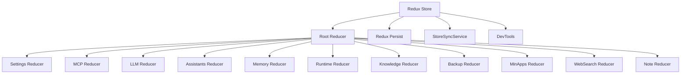
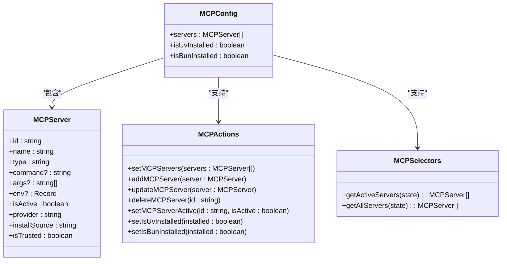
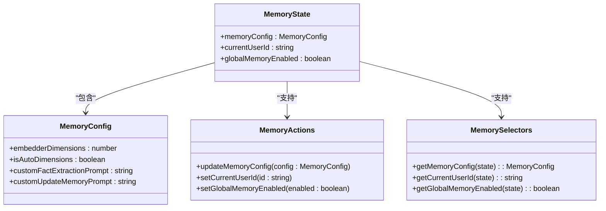
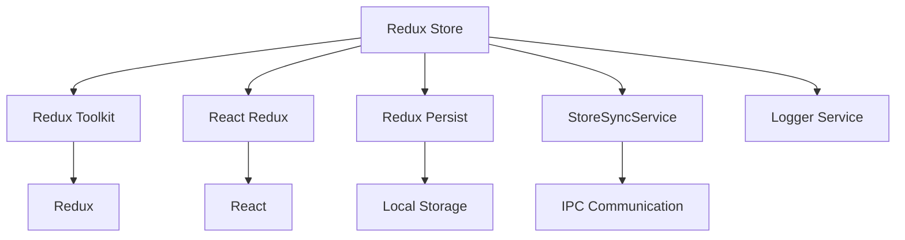

# Store结构

<cite>
**本文档引用的文件**   
- [index.ts](file://src/renderer/src/store/index.ts)
- [settings.ts](file://src/renderer/src/store/settings.ts)
- [mcp.ts](file://src/renderer/src/store/mcp.ts)
- [llm.ts](file://src/renderer/src/store/llm.ts)
- [assistants.ts](file://src/renderer/src/store/assistants.ts)
- [memory.ts](file://src/renderer/src/store/memory.ts)
- [runtime.ts](file://src/renderer/src/store/runtime.ts)
- [knowledge.ts](file://src/renderer/src/store/knowledge.ts)
- [backup.ts](file://src/renderer/src/store/backup.ts)
- [minapps.ts](file://src/renderer/src/store/minapps.ts)
- [websearch.ts](file://src/renderer/src/store/websearch.ts)
- [note.ts](file://src/renderer/src/store/note.ts)
- [StoreSyncService.ts](file://src/renderer/services/StoreSyncService.ts)
</cite>

## 目录
1. [Store结构](#store结构)
2. [核心组件](#核心组件)
3. [架构概述](#架构概述)
4. [详细组件分析](#详细组件分析)
5. [依赖分析](#依赖分析)
6. [性能考虑](#性能考虑)
7. [故障排除指南](#故障排除指南)
8. [结论](#结论)

## 核心组件

Cherry Studio的Redux Store结构采用模块化设计，通过多个reducer来管理不同的应用状态。根reducer通过combineReducers函数将各个子reducer组合在一起，形成一个统一的状态树。每个reducer负责管理特定领域的状态，如用户设置、MCP服务、大语言模型配置等。Store配置中使用了redux-persist来实现状态持久化，确保应用重启后能恢复之前的状态。同时，通过StoreSyncService实现了多窗口间的状态同步，确保用户在不同窗口操作时能获得一致的体验。

**核心组件**
- [index.ts](file://src/renderer/src/store/index.ts#L1-L137)
- [settings.ts](file://src/renderer/src/store/settings.ts#L1-L990)
- [mcp.ts](file://src/renderer/src/store/mcp.ts#L1-L198)
- [llm.ts](file://src/renderer/src/store/llm.ts#L1-L264)

## 架构概述

Cherry Studio的Redux Store架构采用分层设计，通过根reducer将多个子reducer组合成一个完整的状态树。Store的配置包含了状态持久化、中间件集成和开发工具支持等功能。状态持久化通过redux-persist实现，将关键状态保存到本地存储中。StoreSyncService作为中间件被集成到Store中，负责在多个应用窗口间同步特定的状态片段。



**图表来源**
- [index.ts](file://src/renderer/src/store/index.ts#L38-L64)
- [StoreSyncService.ts](file://src/renderer/services/StoreSyncService.ts)

## 详细组件分析

### Settings Reducer分析

Settings Reducer管理应用的用户配置和偏好设置。它包含了界面显示、消息样式、代码编辑、数学公式渲染等多种配置选项。该reducer通过createSlice创建，定义了大量用于更新不同设置项的action。初始状态包含了各种默认值，如显示助手列表、主题模式、字体大小等。

```mermaid
classDiagram
class SettingsState {
+showAssistants : boolean
+showTopics : boolean
+assistantsTabSortType : AssistantsSortType
+sendMessageShortcut : SendMessageShortcut
+language : LanguageVarious
+targetLanguage : TranslateLanguageCode
+proxyMode : 'system' | 'custom' | 'none'
+proxyUrl? : string
+theme : ThemeMode
+fontSize : number
+topicPosition : 'left' | 'right'
+codeExecution : { enabled : boolean, timeoutMinutes : number }
+codeEditor : { enabled : boolean, themeLight : string, themeDark : string }
+codeViewer : { themeLight : CodeStyleVarious, themeDark : CodeStyleVarious }
+mathEngine : MathEngine
+messageStyle : 'plain' | 'bubble'
+webdavHost : string
+webdavUser : string
+webdavPass : string
+translateModelPrompt : string
+autoTranslateWithSpace : boolean
+enableTopicNaming : boolean
+sidebarIcons : { visible : SidebarIcon[], disabled : SidebarIcon[] }
+maxKeepAliveMinapps : number
+enableDataCollection : boolean
+exportMenuOptions : ExportMenuOptions
+openAI : OpenAIConfig
+apiServer : ApiServerConfig
}
class SettingsActions {
+setShowAssistants(show : boolean)
+toggleShowAssistants()
+setShowTopics(show : boolean)
+toggleShowTopics()
+setAssistantsTabSortType(sortType : AssistantsSortType)
+setSendMessageShortcut(shortcut : SendMessageShortcut)
+setLanguage(language : LanguageVarious)
+setTargetLanguage(language : TranslateLanguageCode)
+setProxyMode(mode : 'system' | 'custom' | 'none')
+setProxyUrl(url : string | undefined)
+setTheme(theme : ThemeMode)
+setFontSize(size : number)
+setTopicPosition(position : 'left' | 'right')
+setCodeExecution(config : { enabled? : boolean, timeoutMinutes? : number })
+setCodeEditor(config : { enabled? : boolean, themeLight? : string, themeDark? : string })
+setCodeViewer(config : { themeLight? : string, themeDark? : string })
+setMathEngine(engine : MathEngine)
+setMessageStyle(style : 'plain' | 'bubble')
+setWebdavHost(host : string)
+setWebdavUser(user : string)
+setWebdavPass(pass : string)
+setTranslateModelPrompt(prompt : string)
+setAutoTranslateWithSpace(enable : boolean)
+setEnableTopicNaming(enable : boolean)
+setSidebarIcons(icons : { visible? : SidebarIcon[], disabled? : SidebarIcon[] })
+setMaxKeepAliveMinapps(count : number)
+setEnableDataCollection(enable : boolean)
+setExportMenuOptions(options : ExportMenuOptions)
+setOpenAISummaryText(text : OpenAISummaryText)
+setOpenAIVerbosity(verbosity : OpenAIVerbosity)
+setApiServerConfig(config : ApiServerConfig)
}
SettingsState --> SettingsActions : "包含"
```

**图表来源**
- [settings.ts](file://src/renderer/src/store/settings.ts#L40-L418)

### MCP Reducer分析

MCP Reducer管理MCP（Model Context Protocol）服务的状态。它负责存储和管理所有配置的MCP服务器，包括内置服务器和用户自定义服务器。该reducer提供了添加、更新、删除服务器的功能，以及设置服务器激活状态的action。同时，它还跟踪uv和bun等依赖工具的安装状态。



**图表来源**
- [mcp.ts](file://src/renderer/src/store/mcp.ts#L7-L71)

### LLM Reducer分析

LLM Reducer管理大语言模型相关的配置和状态。它负责存储所有可用的模型提供商、默认模型、快速模型、翻译模型等配置。该reducer还包含了针对不同LLM平台（如Ollama、LMStudio、GPUStack、VertexAI、AWS Bedrock）的特定设置。

```mermaid
classDiagram
class LlmState {
+providers : Provider[]
+defaultModel : Model
+quickModel : Model
+translateModel : Model
+quickAssistantId : string
+settings : LlmSettings
}
class LlmSettings {
+ollama : { keepAliveTime : number }
+lmstudio : { keepAliveTime : number }
+gpustack : { keepAliveTime : number }
+vertexai : { serviceAccount : { privateKey : string, clientEmail : string }, projectId : string, location : string }
+awsBedrock : { authType : AwsBedrockAuthType, accessKeyId : string, secretAccessKey : string, apiKey : string, region : string }
}
class LlmActions {
+updateProvider(provider : Partial<Provider> & { id : string })
+updateProviders(providers : Provider[])
+addProvider(provider : Provider)
+removeProvider(provider : Provider)
+addModel(providerId : string, model : Model)
+removeModel(providerId : string, model : Model)
+setDefaultModel(model : Model)
+setQuickModel(model : Model)
+setTranslateModel(model : Model)
+setQuickAssistantId(id : string)
+setOllamaKeepAliveTime(time : number)
+setLMStudioKeepAliveTime(time : number)
+setGPUStackKeepAliveTime(time : number)
+setVertexAIProjectId(id : string)
+setVertexAILocation(location : string)
+setVertexAIServiceAccountPrivateKey(key : string)
+setVertexAIServiceAccountClientEmail(email : string)
+setAwsBedrockAuthType(type : AwsBedrockAuthType)
+setAwsBedrockAccessKeyId(id : string)
+setAwsBedrockSecretAccessKey(key : string)
+setAwsBedrockApiKey(key : string)
+setAwsBedrockRegion(region : string)
+updateModel(providerId : string, model : Model)
}
LlmState --> LlmSettings : "包含"
LlmState --> LlmActions : "支持"
```

**图表来源**
- [llm.ts](file://src/renderer/src/store/llm.ts#L36-L263)

### Assistants Reducer分析

Assistants Reducer管理助手（Assistant）和代理（Agent）的状态。它负责存储所有助手的配置、话题（Topic）、预设（Preset）等信息。该reducer提供了完整的CRUD操作来管理助手和话题，以及管理助手标签的排序和折叠状态。

```mermaid
classDiagram
class AssistantsState {
+defaultAssistant : Assistant
+assistants : Assistant[]
+tagsOrder : string[]
+collapsedTags : Record<string, boolean>
+presets : AssistantPreset[]
+unifiedListOrder : Array<{ type : 'agent' | 'assistant', id : string }>
}
class Assistant {
+id : string
+name : string
+model : Model
+settings : AssistantSettings
+topics : Topic[]
+tags : string[]
}
class Topic {
+id : string
+title : string
+createdAt : string
+updatedAt : string
+messages : Message[]
}
class AssistantPreset {
+id : string
+name : string
+model : Model
+settings : AssistantSettings
+icon : string
}
class AssistantActions {
+updateDefaultAssistant(assistant : Assistant)
+updateAssistants(assistants : Assistant[])
+addAssistant(assistant : Assistant)
+insertAssistant(index : number, assistant : Assistant)
+removeAssistant(id : string)
+updateAssistant(assistant : Partial<Assistant> & { id : string })
+updateAssistantSettings(assistantId : string, settings : Partial<AssistantSettings>)
+setTagsOrder(tags : string[])
+updateTagCollapse(tag : string)
+setUnifiedListOrder(order : Array<{ type : 'agent' | 'assistant', id : string }>)
+addTopic(assistantId : string, topic : Topic)
+removeTopic(assistantId : string, topic : Topic)
+updateTopic(assistantId : string, topic : Topic)
+updateTopics(assistantId : string, topics : Topic[])
+removeAllTopics(assistantId : string)
+updateTopicUpdatedAt(topicId : string)
+setModel(assistantId : string, model : Model)
+setAssistantPresets(presets : AssistantPreset[])
+addAssistantPreset(preset : AssistantPreset)
+removeAssistantPreset(id : string)
+updateAssistantPreset(preset : AssistantPreset)
+updateAssistantPresetSettings(assistantId : string, settings : Partial<AssistantSettings>)
}
AssistantsState --> Assistant : "包含"
AssistantsState --> Topic : "包含"
AssistantsState --> AssistantPreset : "包含"
AssistantsState --> AssistantActions : "支持"
```

**图表来源**
- [assistants.ts](file://src/renderer/src/store/assistants.ts#L12-L265)

### Memory Reducer分析

Memory Reducer管理应用的记忆功能配置。它负责存储记忆系统的配置参数，如嵌入维度、事实提取提示词、更新记忆提示词等。该reducer还管理当前用户ID和全局记忆启用状态。



**图表来源**
- [memory.ts](file://src/renderer/src/store/memory.ts#L9-L119)

## 依赖分析

Cherry Studio的Redux Store依赖于多个第三方库和内部服务。主要依赖包括Redux Toolkit用于简化reducer和action的创建，React Redux用于连接React组件和Redux Store，以及redux-persist用于实现状态持久化。StoreSyncService作为自定义中间件被集成到Store中，负责在多个应用窗口间同步状态。



**图表来源**
- [index.ts](file://src/renderer/src/store/index.ts#L2-L5)
- [StoreSyncService.ts](file://src/renderer/services/StoreSyncService.ts)

## 性能考虑

Cherry Studio的Redux Store在性能方面做了多项优化。首先，通过redux-persist的blacklist配置，将不需要持久化的状态（如runtime、messages等）排除在外，减少了持久化操作的开销。其次，StoreSyncService只同步必要的状态片段，避免了不必要的跨窗口通信。此外，Store的初始化过程采用了延迟加载策略，在应用启动后异步加载持久化状态，避免阻塞主线程。

Store还通过合理的设计减少了不必要的渲染。例如，将频繁变化的状态（如runtime）与静态配置状态分离，避免了因频繁状态更新导致的组件重渲染。同时，使用createSelector创建记忆化选择器，避免了重复的计算开销。

## 故障排除指南

在使用Cherry Studio的Redux Store时，可能会遇到一些常见问题。以下是针对这些问题的排查和解决方案：

1. **状态未正确持久化**：检查redux-persist的配置，确保需要持久化的reducer没有被加入blacklist。同时确认persistor已正确初始化并在应用启动时调用。

2. **多窗口状态不同步**：检查StoreSyncService的syncList配置，确保需要同步的状态片段已正确添加。同时确认每个窗口都已调用storeSyncService.subscribe()进行订阅。

3. **Store初始化失败**：检查根reducer的组合是否正确，确保所有子reducer都已正确导入和注册。同时检查initialState的结构是否符合预期。

4. **性能问题**：如果发现应用响应缓慢，检查是否有不必要的状态更新导致频繁渲染。可以使用Redux DevTools分析action的触发频率和payload大小。

5. **类型错误**：由于使用了TypeScript，确保所有action和state的类型定义正确。特别注意PayloadAction的泛型参数是否与实际payload类型匹配。

**故障排除指南**
- [index.ts](file://src/renderer/src/store/index.ts#L66-L75)
- [StoreSyncService.ts](file://src/renderer/services/StoreSyncService.ts)

## 结论

Cherry Studio的Redux Store结构设计合理，采用了模块化的reducer组织方式，每个reducer负责管理特定领域的状态。通过combineReducers将各个子reducer组合成根reducer，形成了清晰的状态树结构。Store的配置集成了状态持久化、多窗口同步和开发工具支持等重要功能，为应用提供了稳定的状态管理基础。

Store的设计体现了关注点分离的原则，将不同功能领域的状态管理分离到不同的reducer中，提高了代码的可维护性和可测试性。同时，通过合理的性能优化策略，确保了应用的响应速度和用户体验。整体而言，Cherry Studio的Redux Store架构为应用的稳定运行和功能扩展提供了坚实的基础。