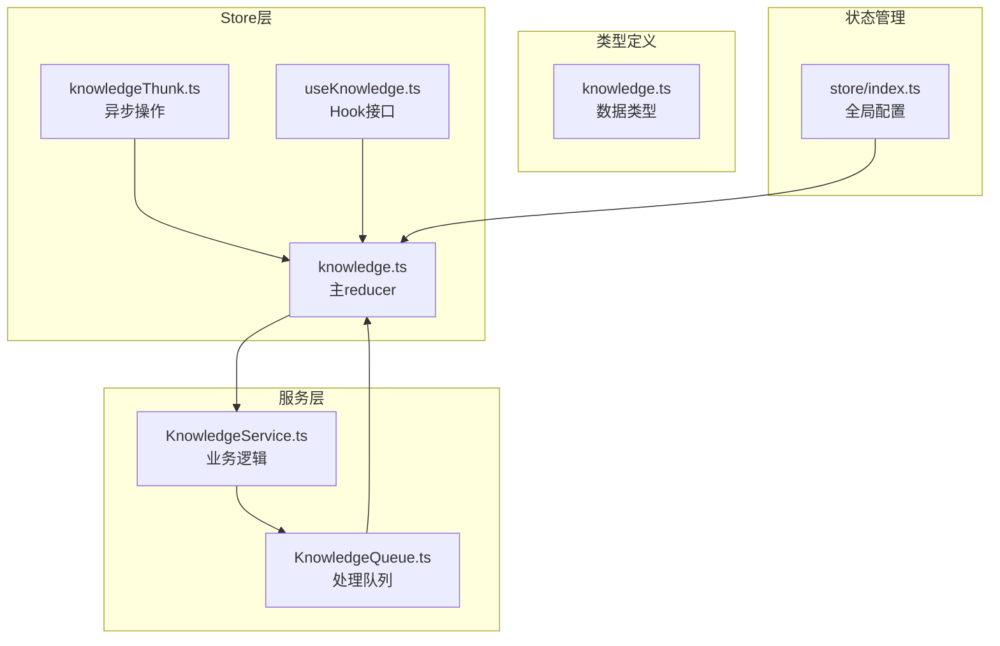
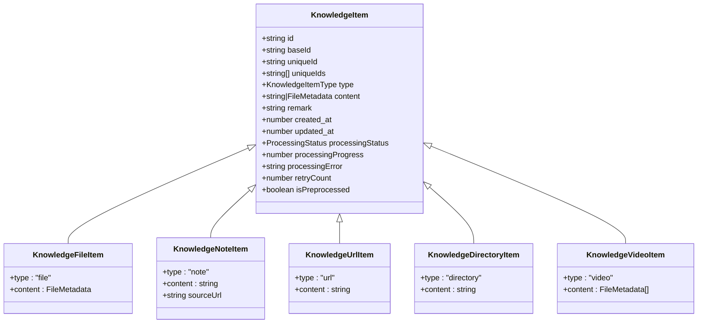
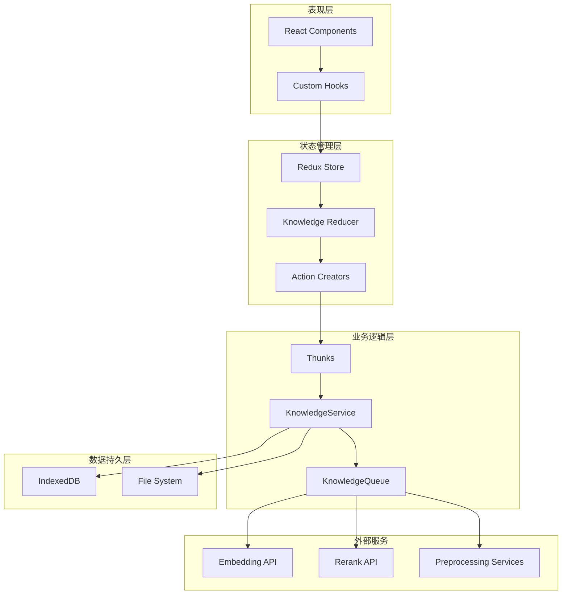
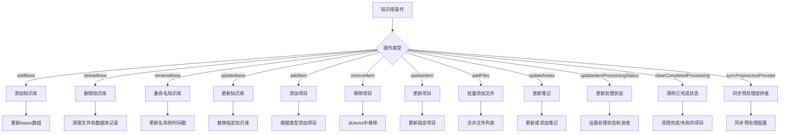
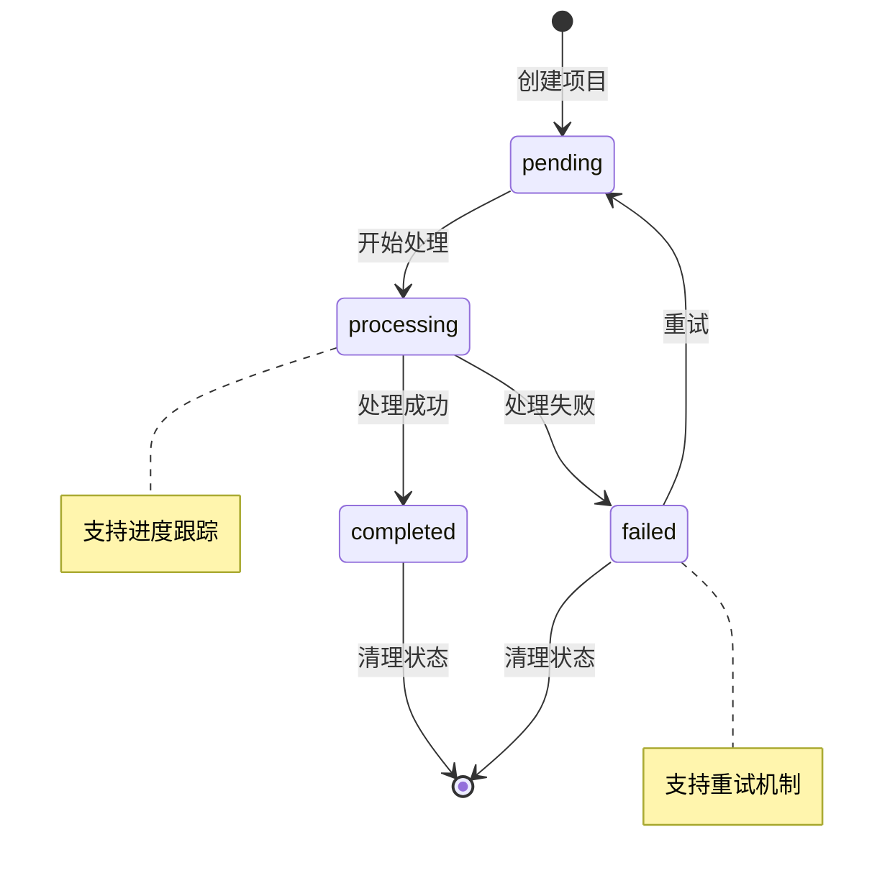
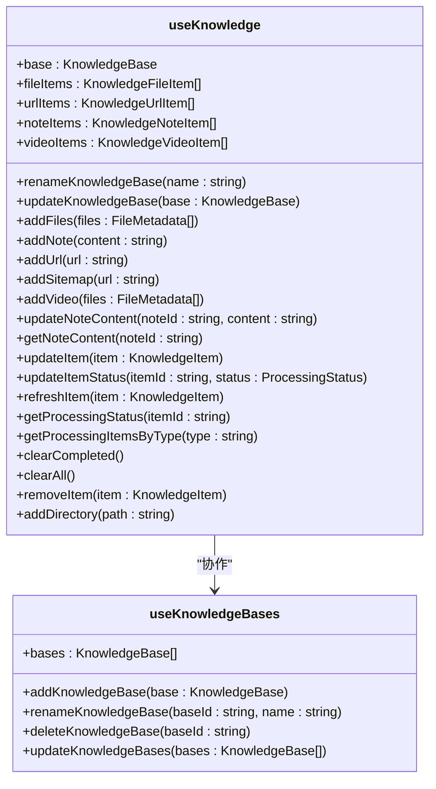
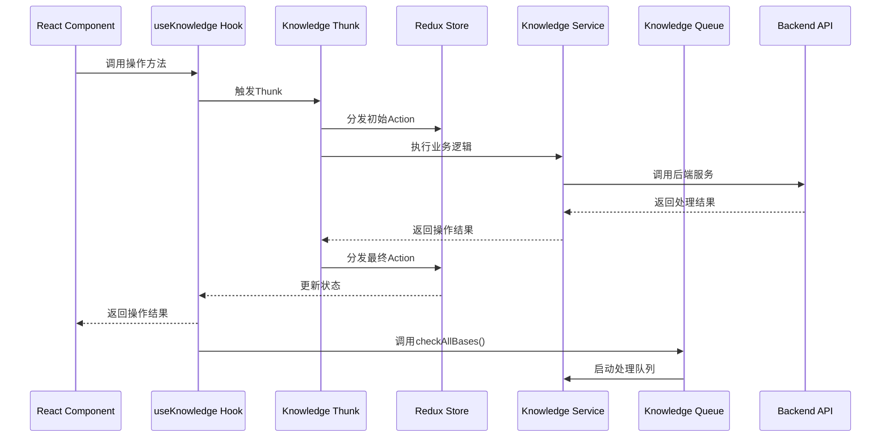
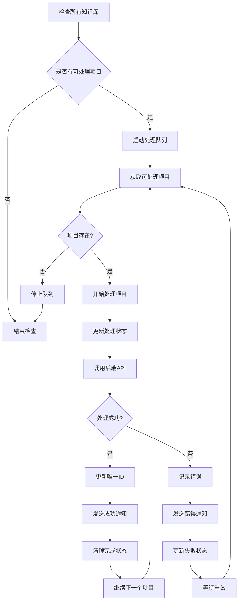
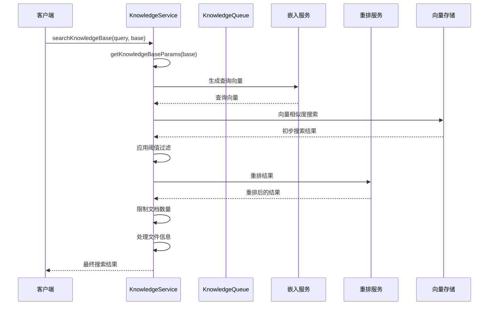
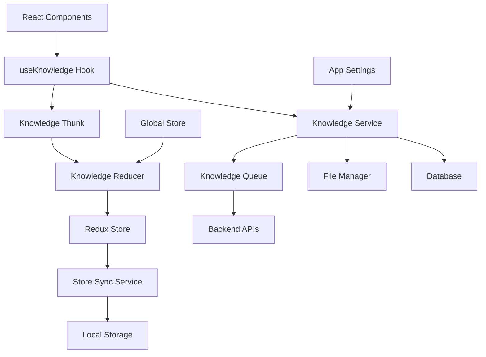

# 知识库Store模块文档

<cite>
**本文档中引用的文件**
- [knowledge.ts](file://src/renderer/src/store/knowledge.ts)
- [useKnowledge.ts](file://src/renderer/src/hooks/useKnowledge.ts)
- [KnowledgeService.ts](file://src/renderer/src/services/KnowledgeService.ts)
- [knowledge.ts](file://src/renderer/src/types/knowledge.ts)
- [KnowledgeQueue.ts](file://src/renderer/src/queue/KnowledgeQueue.ts)
- [knowledgeThunk.ts](file://src/renderer/src/store/thunk/knowledgeThunk.ts)
- [index.ts](file://src/renderer/src/store/index.ts)
</cite>

## 目录
1. [简介](#简介)
2. [项目结构](#项目结构)
3. [核心组件](#核心组件)
4. [架构概览](#架构概览)
5. [详细组件分析](#详细组件分析)
6. [依赖关系分析](#依赖关系分析)
7. [性能考虑](#性能考虑)
8. [故障排除指南](#故障排除指南)
9. [结论](#结论)

## 简介

Cherry Studio的知识库Store模块是一个基于Redux Toolkit构建的状态管理系统，专门用于管理知识库的配置、文件索引和搜索状态。该模块提供了完整的知识库生命周期管理功能，包括知识库的创建、更新、删除、文件处理、嵌入生成和检索等功能。

该模块的核心设计理念是通过统一的状态管理接口，协调前端UI组件、后端服务和异步处理队列之间的交互，确保知识库操作的一致性和可靠性。

## 项目结构

知识库Store模块在项目中的组织结构如下：



**图表来源**
- [knowledge.ts](file://src/renderer/src/store/knowledge.ts#L1-L245)
- [useKnowledge.ts](file://src/renderer/src/hooks/useKnowledge.ts#L1-L396)
- [KnowledgeService.ts](file://src/renderer/src/services/KnowledgeService.ts#L1-L337)

**章节来源**
- [knowledge.ts](file://src/renderer/src/store/knowledge.ts#L1-L245)
- [index.ts](file://src/renderer/src/store/index.ts#L1-L137)

## 核心组件

### 状态结构设计

知识库Store模块采用简洁而高效的状态结构设计：

```typescript
export interface KnowledgeState {
  bases: KnowledgeBase[]
}
```

其中，`KnowledgeBase`包含以下关键字段：
- `id`: 唯一标识符
- `name`: 知识库名称
- `model`: 嵌入模型配置
- `items`: 知识库项目列表
- `created_at` 和 `updated_at`: 时间戳
- `version`: 版本号
- `documentCount`: 文档数量限制
- `chunkSize`: 分块大小
- `threshold`: 相似度阈值
- `rerankModel`: 重排模型
- `preprocessProvider`: 预处理提供者

### 数据类型系统

模块支持多种知识库项目类型：



**图表来源**
- [knowledge.ts](file://src/renderer/src/types/knowledge.ts#L7-L22)
- [knowledge.ts](file://src/renderer/src/types/knowledge.ts#L24-L36)

**章节来源**
- [knowledge.ts](file://src/renderer/src/types/knowledge.ts#L1-L159)

## 架构概览

知识库Store模块采用分层架构设计，确保关注点分离和模块化：



**图表来源**
- [index.ts](file://src/renderer/src/store/index.ts#L38-L64)
- [KnowledgeQueue.ts](file://src/renderer/src/queue/KnowledgeQueue.ts#L20-L239)

## 详细组件分析

### Knowledge Reducer实现

Knowledge Reducer是状态管理的核心，负责处理所有知识库相关的状态变更：

#### 主要Reducer函数



**图表来源**
- [knowledge.ts](file://src/renderer/src/store/knowledge.ts#L17-L222)

#### 处理状态管理

模块提供了完整的处理状态管理机制：



**图表来源**
- [knowledge.ts](file://src/renderer/src/types/knowledge.ts#L105-L106)
- [KnowledgeQueue.ts](file://src/renderer/src/queue/KnowledgeQueue.ts#L97-L235)

**章节来源**
- [knowledge.ts](file://src/renderer/src/store/knowledge.ts#L17-L222)

### Knowledge Hook接口

useKnowledge Hook提供了丰富的知识库操作接口：

#### 核心功能接口



**图表来源**
- [useKnowledge.ts](file://src/renderer/src/hooks/useKnowledge.ts#L32-L336)
- [useKnowledge.ts](file://src/renderer/src/hooks/useKnowledge.ts#L339-L395)

**章节来源**
- [useKnowledge.ts](file://src/renderer/src/hooks/useKnowledge.ts#L1-L396)

### 异步操作处理

Knowledge Thunk提供了异步操作的标准化处理：

#### Thunk操作流程



**图表来源**
- [knowledgeThunk.ts](file://src/renderer/src/store/thunk/knowledgeThunk.ts#L44-L89)
- [useKnowledge.ts](file://src/renderer/src/hooks/useKnowledge.ts#L55-L65)

**章节来源**
- [knowledgeThunk.ts](file://src/renderer/src/store/thunk/knowledgeThunk.ts#L1-L89)

### 知识库处理队列

KnowledgeQueue实现了智能的异步处理队列：

#### 队列处理机制



**图表来源**
- [KnowledgeQueue.ts](file://src/renderer/src/queue/KnowledgeQueue.ts#L24-L235)

**章节来源**
- [KnowledgeQueue.ts](file://src/renderer/src/queue/KnowledgeQueue.ts#L1-L239)

### 知识服务集成

KnowledgeService提供了与后端服务的集成接口：

#### 搜索和检索流程



**图表来源**
- [KnowledgeService.ts](file://src/renderer/src/services/KnowledgeService.ts#L130-L202)

**章节来源**
- [KnowledgeService.ts](file://src/renderer/src/services/KnowledgeService.ts#L1-L337)

## 依赖关系分析

### 组件间依赖关系



**图表来源**
- [index.ts](file://src/renderer/src/store/index.ts#L38-L64)
- [useKnowledge.ts](file://src/renderer/src/hooks/useKnowledge.ts#L1-L20)

### 外部依赖

模块依赖的关键外部服务：

| 服务类型 | 用途 | 实现方式 |
|---------|------|----------|
| 嵌入服务 | 文本向量化 | OpenAI、Gemini、Azure等 |
| 重排服务 | 结果排序优化 | 专用重排模型 |
| 预处理服务 | 文档预处理 | Doc2X、Mistral等 |
| 文件存储 | 本地文件管理 | IndexedDB + 文件系统 |
| 向量存储 | 向量索引 | 后端向量数据库 |

**章节来源**
- [KnowledgeService.ts](file://src/renderer/src/services/KnowledgeService.ts#L28-L89)

## 性能考虑

### 状态更新优化

1. **批量操作**: 支持批量添加文件和项目，减少状态更新频率
2. **选择性更新**: 只更新变化的部分，避免不必要的重新渲染
3. **延迟加载**: 笔记内容按需加载，减少初始状态大小

### 异步处理优化

1. **队列管理**: 智能队列调度，避免并发冲突
2. **重试机制**: 支持失败重试，提高处理成功率
3. **进度跟踪**: 实时显示处理进度，提升用户体验

### 内存管理

1. **状态清理**: 自动清理已完成的处理状态
2. **懒加载**: 按需加载知识库内容
3. **缓存策略**: 合理缓存搜索结果和处理状态

## 故障排除指南

### 常见问题及解决方案

#### 处理失败问题

**问题**: 知识库项目处理失败
**原因**: 嵌入生成失败、网络连接问题、模型配置错误
**解决方案**: 
1. 检查网络连接
2. 验证模型配置
3. 查看错误日志
4. 重试处理

#### 状态不同步问题

**问题**: UI状态与实际数据不一致
**原因**: 状态更新延迟、事件监听失效
**解决方案**:
1. 调用`checkAllBases()`强制刷新
2. 检查状态订阅
3. 重启应用

#### 性能问题

**问题**: 大量项目处理缓慢
**原因**: 并发限制、资源不足
**解决方案**:
1. 调整并发数量
2. 优化模型配置
3. 增加系统资源

**章节来源**
- [KnowledgeQueue.ts](file://src/renderer/src/queue/KnowledgeQueue.ts#L97-L235)
- [useKnowledge.ts](file://src/renderer/src/hooks/useKnowledge.ts#L144-L188)

## 结论

Cherry Studio的知识库Store模块是一个设计精良、功能完备的状态管理系统。它通过以下特点实现了高效的知识库管理：

1. **模块化设计**: 清晰的分层架构，职责分离明确
2. **类型安全**: 完整的TypeScript类型定义，编译时错误检测
3. **异步处理**: 智能队列机制，支持并发和重试
4. **状态管理**: Redux Toolkit简化开发，性能优化到位
5. **扩展性**: 易于添加新的知识库类型和处理逻辑

该模块为Cherry Studio提供了强大的知识库管理能力，支持文档嵌入、智能检索、实时处理等核心功能，是整个应用的重要基础设施。