# 数据流

<cite>
**本文档引用的文件**
- [src/main/ipc.ts](file://src/main/ipc.ts)
- [packages/shared/IpcChannel.ts](file://packages/shared/IpcChannel.ts)
- [src/preload/index.ts](file://src/preload/index.ts)
- [src/main/services/ReduxService.ts](file://src/main/services/ReduxService.ts)
- [src/renderer/src/store/index.ts](file://src/renderer/src/store/index.ts)
- [src/renderer/src/services/StoreSyncService.ts](file://src/renderer/src/services/StoreSyncService.ts)
- [src/main/services/StoreSyncService.ts](file://src/main/services/StoreSyncService.ts)
- [src/main/services/WebSocketService.ts](file://src/main/services/WebSocketService.ts)
- [src/renderer/src/services/db/AgentMessageDataSource.ts](file://src/renderer/src/services/db/AgentMessageDataSource.ts)
- [src/main/apiServer/services/mcp.ts](file://src/main/apiServer/services/mcp.ts)
- [src/main/services/MCPService.ts](file://src/main/services/MCPService.ts)
- [src/renderer/src/store/thunk/messageThunk.ts](file://src/renderer/src/store/thunk/messageThunk.ts)
</cite>

## 目录
1. [概述](#概述)
2. [系统架构](#系统架构)
3. [IPC通信机制](#ipc通信机制)
4. [Redux状态管理](#redux状态管理)
5. [数据流序列图](#数据流序列图)
6. [异步操作处理](#异步操作处理)
7. [错误处理机制](#错误处理机制)
8. [性能优化策略](#性能优化策略)
9. [实际代码示例](#实际代码示例)
10. [故障排除指南](#故障排除指南)

## 概述

Cherry Studio是一个基于Electron框架的桌面应用程序，采用主进程-渲染进程分离架构。其数据流设计围绕IPC（进程间通信）机制构建，实现了从用户界面到后端服务的完整数据传递链路。系统通过Redux进行状态管理，并提供了强大的异步操作处理能力和完善的错误恢复机制。

## 系统架构

Cherry Studio采用三层架构设计，确保了良好的模块化和可维护性：

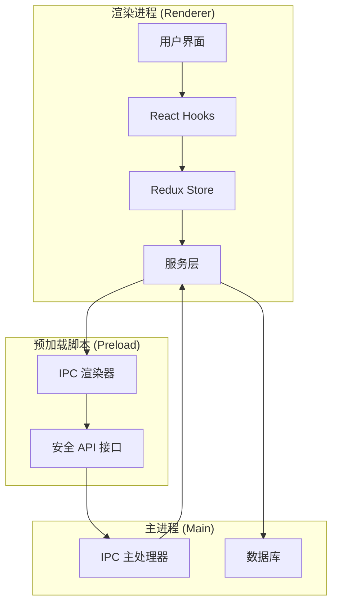

**图表来源**
- [src/renderer/src/store/index.ts](file://src/renderer/src/store/index.ts#L1-L137)
- [src/preload/index.ts](file://src/preload/index.ts#L1-L594)
- [src/main/ipc.ts](file://src/main/ipc.ts#L1-L1084)

## IPC通信机制

### IPC通道定义

Cherry Studio定义了完整的IPC通道枚举，涵盖了所有主要功能模块：

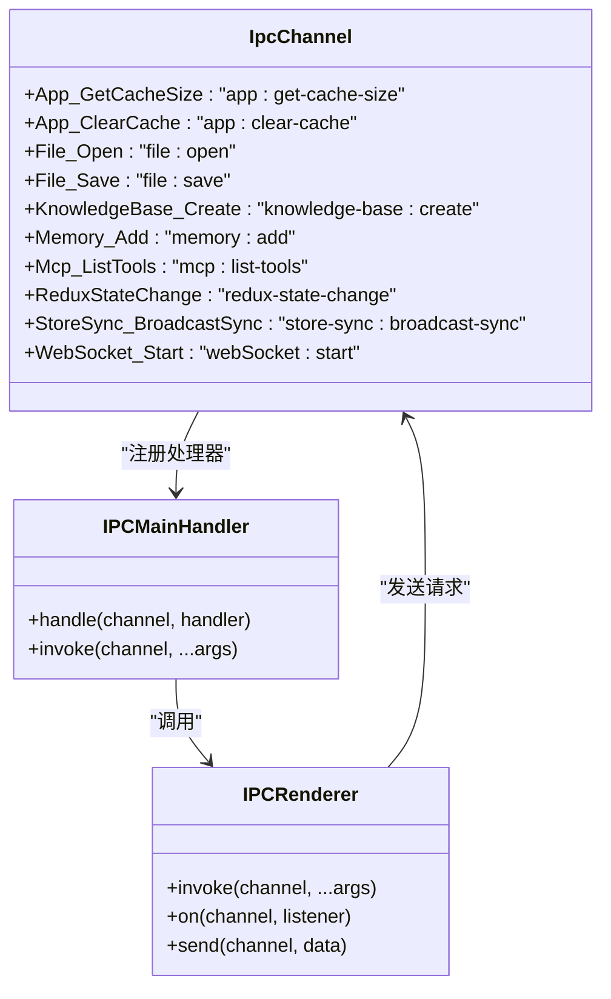

**图表来源**
- [packages/shared/IpcChannel.ts](file://packages/shared/IpcChannel.ts#L1-L379)
- [src/main/ipc.ts](file://src/main/ipc.ts#L115-L1084)

### IPC通信流程

主进程和渲染进程之间的IPC通信遵循严格的双向通信模式：

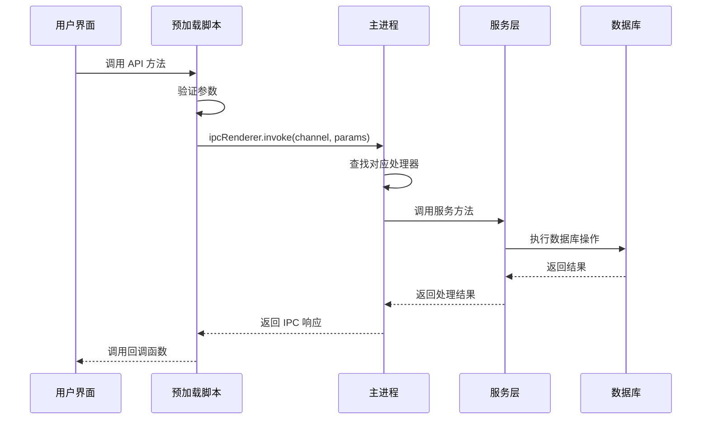

**节来源**
- [src/preload/index.ts](file://src/preload/index.ts#L1-L594)
- [src/main/ipc.ts](file://src/main/ipc.ts#L115-L1084)

## Redux状态管理

### 状态结构设计

Cherry Studio使用Redux Toolkit构建状态管理，支持持久化存储和跨窗口同步：

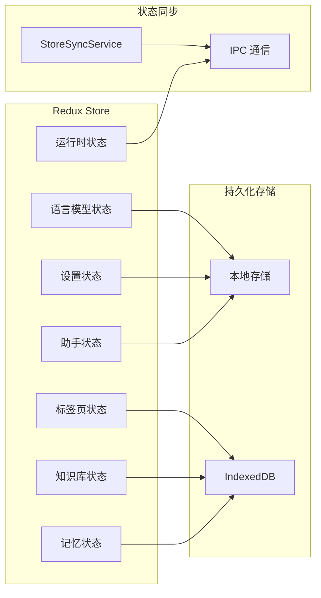

**图表来源**
- [src/renderer/src/store/index.ts](file://src/renderer/src/store/index.ts#L38-L64)
- [src/renderer/src/services/StoreSyncService.ts](file://src/renderer/src/services/StoreSyncService.ts#L1-L138)

### 状态同步机制

StoreSyncService负责在多个窗口之间同步状态变更：

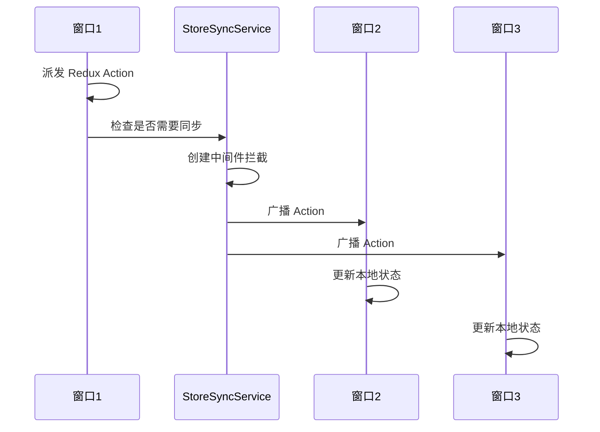

**图表来源**
- [src/renderer/src/services/StoreSyncService.ts](file://src/renderer/src/services/StoreSyncService.ts#L55-L137)
- [src/main/services/StoreSyncService.ts](file://src/main/services/StoreSyncService.ts#L90-L133)

**节来源**
- [src/renderer/src/store/index.ts](file://src/renderer/src/store/index.ts#L1-L137)
- [src/renderer/src/services/StoreSyncService.ts](file://src/renderer/src/services/StoreSyncService.ts#L1-L138)

## 数据流序列图

### 用户操作到渲染进程

当用户在界面上执行操作时，数据流经过以下步骤：

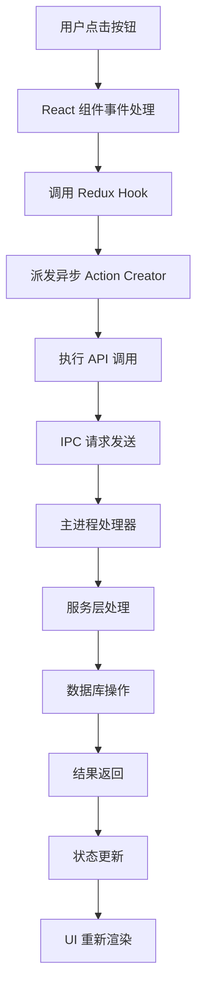

### 渲染进程到主进程

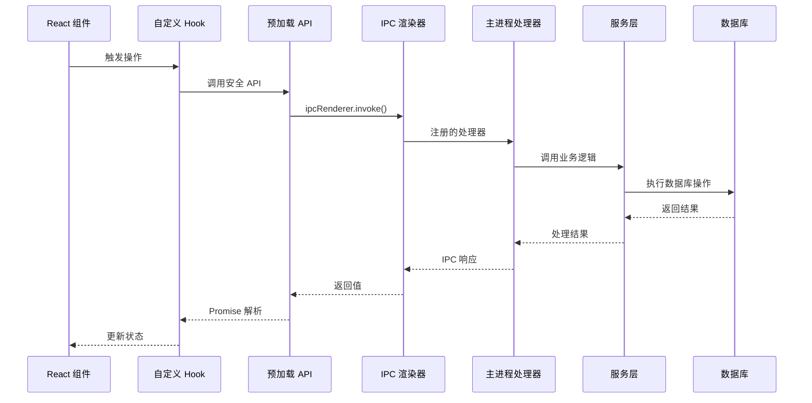

**节来源**
- [src/preload/index.ts](file://src/preload/index.ts#L1-L594)
- [src/main/ipc.ts](file://src/main/ipc.ts#L115-L1084)

## 异步操作处理

### Redux Thunk 实现

Cherry Studio使用Redux Thunk处理复杂的异步操作，特别是在消息流处理中：

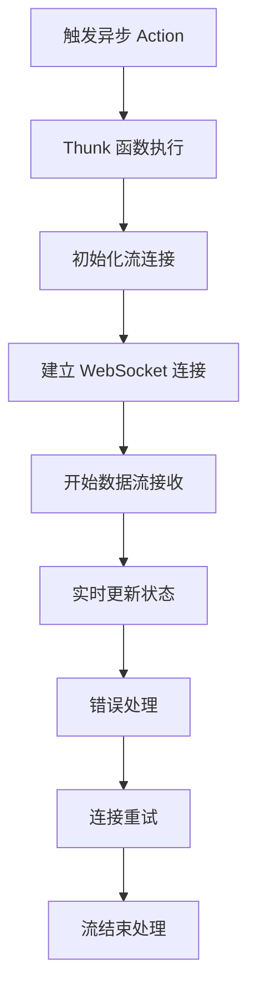

### 流式数据处理

对于长时间运行的操作，如AI对话生成，系统实现了流式数据处理：

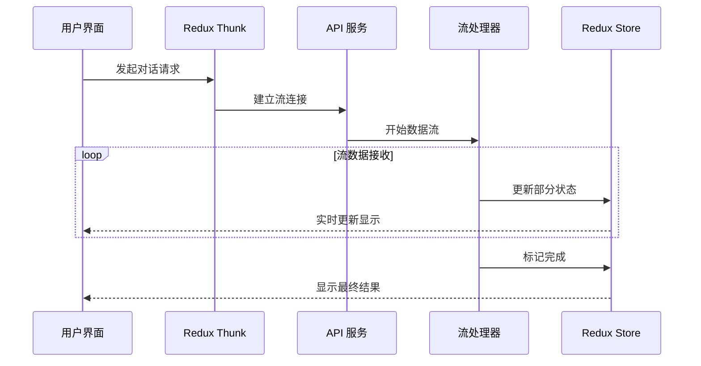

**图表来源**
- [src/renderer/src/store/thunk/messageThunk.ts](file://src/renderer/src/store/thunk/messageThunk.ts#L277-L322)
- [src/renderer/src/services/db/AgentMessageDataSource.ts](file://src/renderer/src/services/db/AgentMessageDataSource.ts#L1-L137)

**节来源**
- [src/renderer/src/store/thunk/messageThunk.ts](file://src/renderer/src/store/thunk/messageThunk.ts#L1-L322)
- [src/renderer/src/services/db/AgentMessageDataSource.ts](file://src/renderer/src/services/db/AgentMessageDataSource.ts#L1-L137)

## 错误处理机制

### 分层错误处理

Cherry Studio实现了多层错误处理机制，确保系统的稳定性和用户体验：

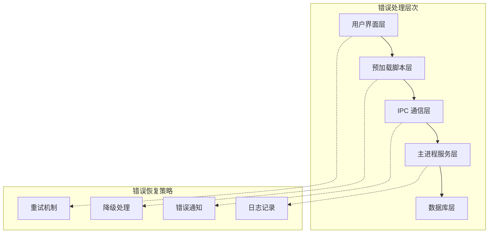

### 具体错误处理场景

1. **IPC超时处理**：ReduxService包含超时检测和重试机制
2. **网络连接错误**：MCP服务提供连接状态检查和自动重连
3. **数据库异常**：AgentMessageDataSource实现事务回滚和状态恢复
4. **WebSocket断开**：WebSocketService处理连接丢失和自动重连

**节来源**
- [src/main/services/ReduxService.ts](file://src/main/services/ReduxService.ts#L41-L231)
- [src/main/services/MCPService.ts](file://src/main/services/MCPService.ts#L592-L613)

## 性能优化策略

### 缓存机制

Cherry Studio实现了多层次的缓存策略：

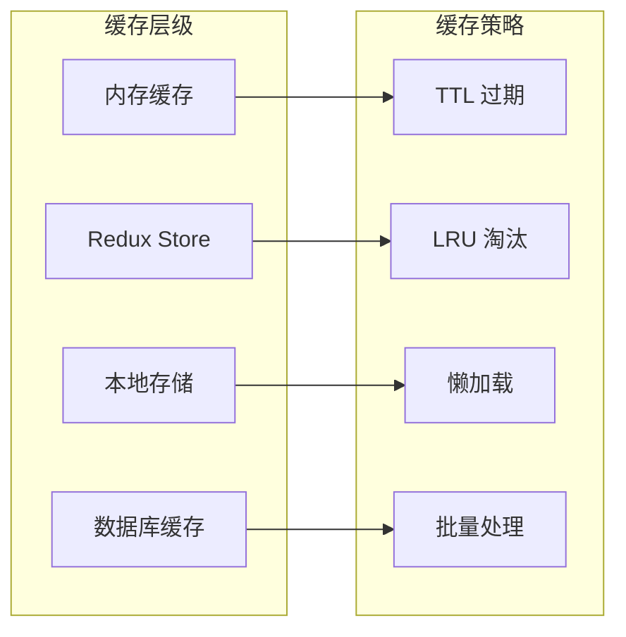

### 优化技术

1. **状态选择器缓存**：ReduxService提供同步状态选择器
2. **流式数据处理**：避免大量数据一次性加载
3. **连接池管理**：复用网络连接减少资源消耗
4. **智能重试**：指数退避算法处理临时故障

**节来源**
- [src/main/services/ReduxService.ts](file://src/main/services/ReduxService.ts#L60-L104)
- [src/main/services/WebSocketService.ts](file://src/main/services/WebSocketService.ts#L1-L200)

## 实际代码示例

### 发送IPC消息

以下是发送IPC消息的实际代码模式：

```typescript
// 预加载脚本中的API封装
const api = {
  knowledgeBase: {
    search: ({ search, base }: { search: string; base: KnowledgeBaseParams }, context?: SpanContext) =>
      tracedInvoke(IpcChannel.KnowledgeBase_Search, context, { search, base }),
    add: ({ base, item, userId, forceReload = false }: {
      base: KnowledgeBaseParams
      item: KnowledgeItem
      userId?: string
      forceReload?: boolean
    }) => ipcRenderer.invoke(IpcChannel.KnowledgeBase_Add, { base, item, forceReload, userId })
  }
}
```

### 接收IPC消息

主进程中的处理器实现：

```typescript
// 主进程中的IPC处理器
ipcMain.handle(IpcChannel.KnowledgeBase_Search, async (_event, { search, base }) => {
  try {
    return await knowledgeService.search(search, base)
  } catch (error) {
    logger.error('Failed to search knowledge base:', error as Error)
    throw error
  }
})
```

### Redux异步操作

Redux Thunk的典型实现：

```typescript
// 异步Action Creator
export const createKnowledgeBase = (base: KnowledgeBaseParams) => async (dispatch: AppDispatch) => {
  try {
    dispatch(knowledgeBaseActions.creating())
    const result = await window.api.knowledgeBase.create(base)
    dispatch(knowledgeBaseActions.created(result))
    return result
  } catch (error) {
    dispatch(knowledgeBaseActions.createFailed(error as Error))
    throw error
  }
}
```

**节来源**
- [src/preload/index.ts](file://src/preload/index.ts#L269-L276)
- [src/main/ipc.ts](file://src/main/ipc.ts#L262-L269)
- [src/renderer/src/store/thunk/index.ts](file://src/renderer/src/store/thunk/index.ts#L1-L50)

## 故障排除指南

### 常见问题诊断

1. **IPC通信失败**
   - 检查预加载脚本是否正确注入
   - 验证IPC通道名称是否匹配
   - 确认主进程处理器已注册

2. **状态同步问题**
   - 检查StoreSyncService配置
   - 验证同步白名单设置
   - 确认窗口ID注册状态

3. **异步操作超时**
   - 检查网络连接状态
   - 验证服务可用性
   - 调整超时配置

### 调试工具

Cherry Studio提供了丰富的调试功能：

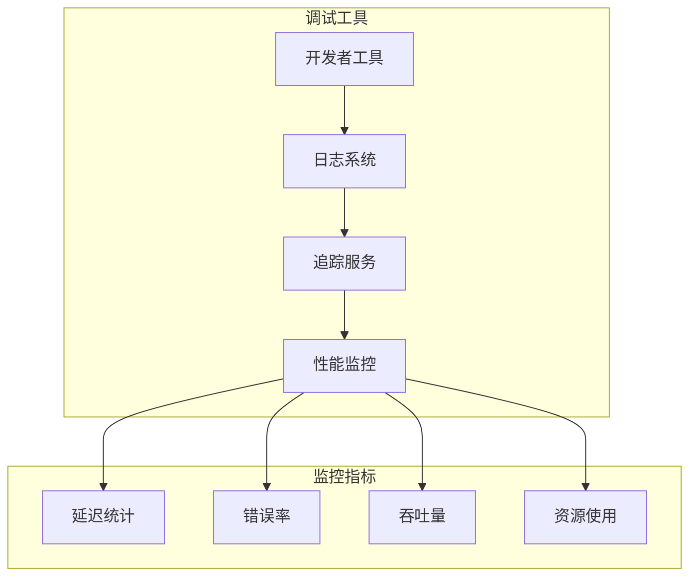

**节来源**
- [src/main/services/ReduxService.ts](file://src/main/services/ReduxService.ts#L41-L56)
- [src/main/services/WebSocketService.ts](file://src/main/services/WebSocketService.ts#L100-L200)

## 结论

Cherry Studio的数据流设计体现了现代桌面应用的最佳实践，通过精心设计的IPC通信、Redux状态管理和异步操作处理，实现了高性能、高可靠性的用户体验。系统的模块化架构使得扩展和维护变得简单，而完善的错误处理和性能优化策略确保了应用的稳定性。

这种数据流架构不仅适用于当前的功能需求，也为未来的功能扩展提供了坚实的基础。通过持续的监控和优化，系统能够适应不断变化的用户需求和技术发展。