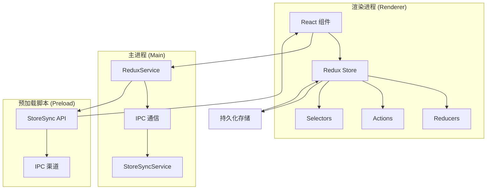
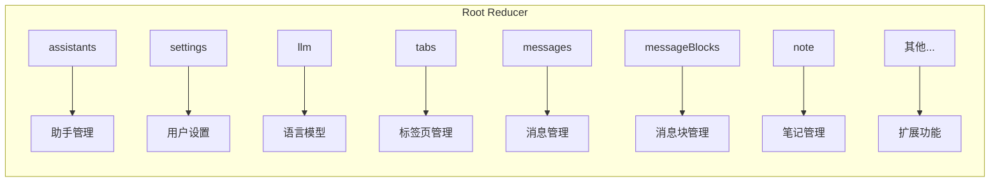
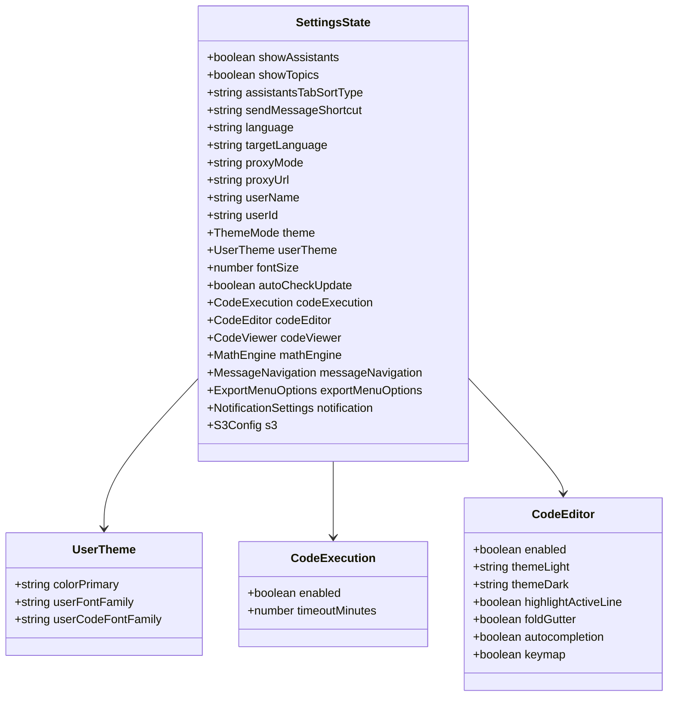
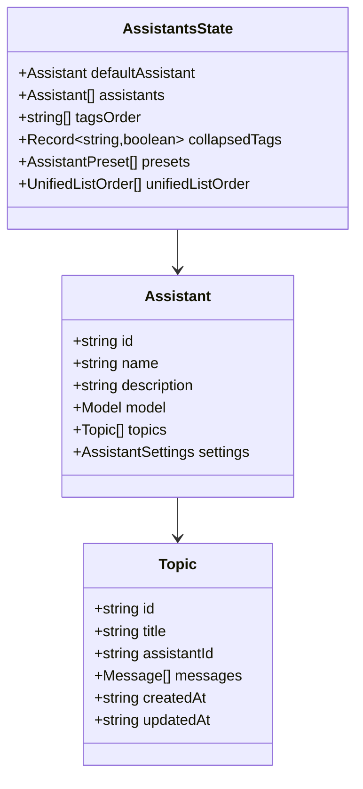
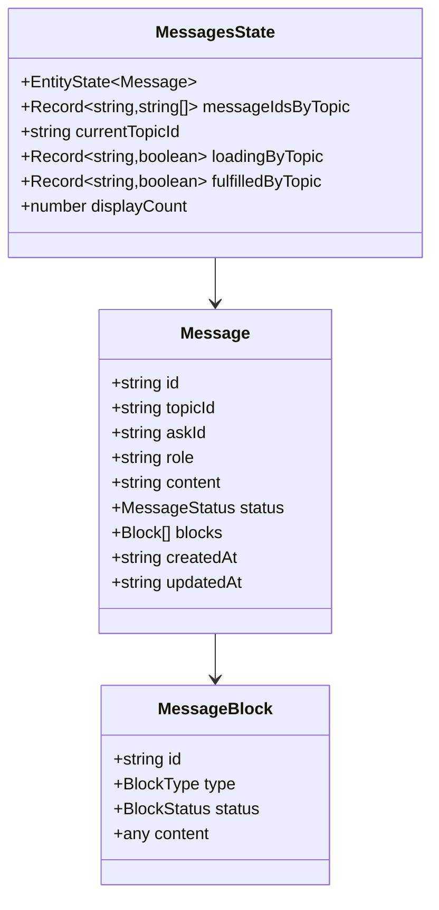
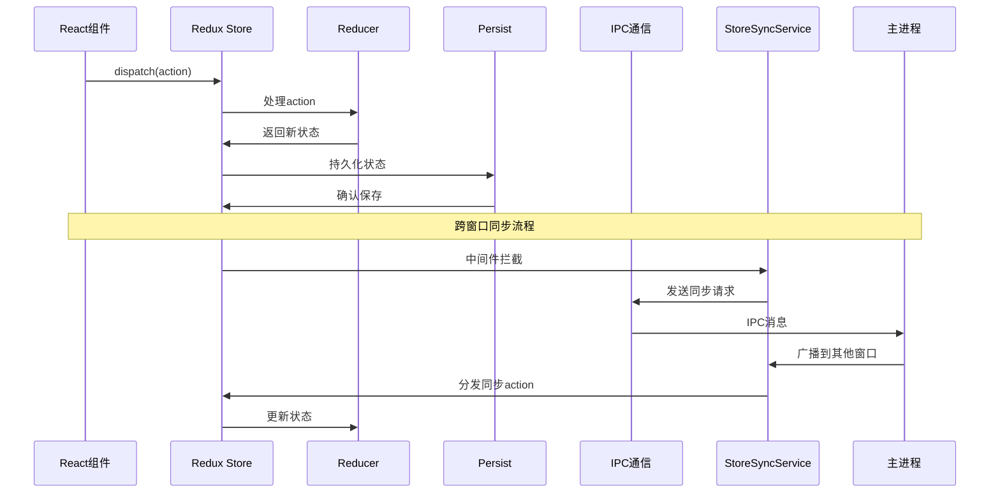
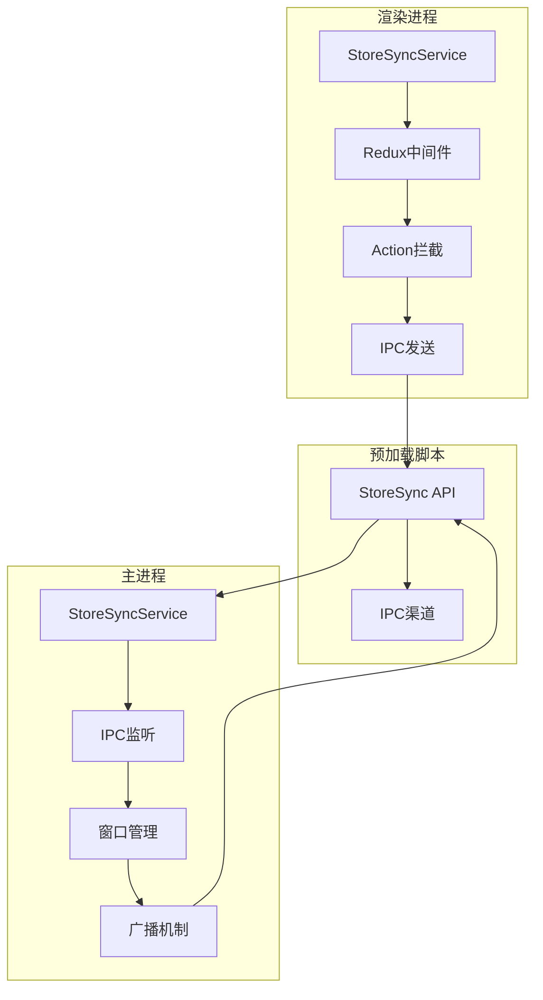

# Cherry Studio状态管理系统文档

<cite>
**本文档引用的文件**
- [src/renderer/src/store/index.ts](file://src/renderer/src/store/index.ts)
- [src/renderer/src/store/settings.ts](file://src/renderer/src/store/settings.ts)
- [src/renderer/src/store/assistants.ts](file://src/renderer/src/store/assistants.ts)
- [src/renderer/src/store/llm.ts](file://src/renderer/src/store/llm.ts)
- [src/renderer/src/store/tabs.ts](file://src/renderer/src/store/tabs.ts)
- [src/renderer/src/store/newMessage.ts](file://src/renderer/src/store/newMessage.ts)
- [src/renderer/src/store/messageBlock.ts](file://src/renderer/src/store/messageBlock.ts)
- [src/renderer/src/store/note.ts](file://src/renderer/src/store/note.ts)
- [src/renderer/src/hooks/useStore.ts](file://src/renderer/src/hooks/useStore.ts)
- [src/renderer/src/services/StoreSyncService.ts](file://src/renderer/src/services/StoreSyncService.ts)
- [src/main/services/ReduxService.ts](file://src/main/services/ReduxService.ts)
- [src/main/services/StoreSyncService.ts](file://src/main/services/StoreSyncService.ts)
- [src/preload/index.ts](file://src/preload/index.ts)
</cite>

## 目录
1. [简介](#简介)
2. [系统架构概览](#系统架构概览)
3. [Redux Store设计](#redux-store设计)
4. [核心数据模型](#核心数据模型)
5. [状态管理流程](#状态管理流程)
6. [跨进程通信机制](#跨进程通信机制)
7. [最佳实践](#最佳实践)
8. [实际应用示例](#实际应用示例)
9. [性能优化策略](#性能优化策略)
10. [故障排除指南](#故障排除指南)

## 简介

Cherry Studio采用基于Redux Toolkit的现代化状态管理架构，实现了完整的全局状态管理解决方案。该系统支持多窗口状态同步、跨进程通信以及复杂的数据流管理，为AI助手应用提供了稳定可靠的状态管理基础设施。

## 系统架构概览

Cherry Studio的状态管理系统采用分层架构设计，包含以下核心组件：



**图表来源**
- [src/renderer/src/store/index.ts](file://src/renderer/src/store/index.ts#L1-L137)
- [src/main/services/ReduxService.ts](file://src/main/services/ReduxService.ts#L1-L181)

**章节来源**
- [src/renderer/src/store/index.ts](file://src/renderer/src/store/index.ts#L1-L137)
- [src/main/services/ReduxService.ts](file://src/main/services/ReduxService.ts#L1-L181)

## Redux Store设计

### Store结构与组织

Cherry Studio的Redux Store采用模块化设计，每个功能域都有独立的reducer：



**图表来源**
- [src/renderer/src/store/index.ts](file://src/renderer/src/store/index.ts#L38-L64)

### 持久化配置

Store使用redux-persist进行状态持久化，支持选择性黑名单：

| 配置项 | 值 | 说明 |
|--------|-----|------|
| 存储键 | 'cherry-studio' | 唯一标识符 |
| 版本号 | 179 | 状态迁移版本 |
| 黑名单 | ['runtime', 'messages', 'messageBlocks', 'tabs', 'toolPermissions'] | 不持久化的状态切片 |
| 存储引擎 | localStorage | 浏览器本地存储 |

**章节来源**
- [src/renderer/src/store/index.ts](file://src/renderer/src/store/index.ts#L66-L75)

## 核心数据模型

### 用户配置模型 (SettingsState)

用户配置是系统最重要的状态之一，包含丰富的配置选项：



**图表来源**
- [src/renderer/src/store/settings.ts](file://src/renderer/src/store/settings.ts#L40-L222)

### 助手管理模型 (AssistantsState)

助手管理系统维护AI助手及其相关主题的状态：



**图表来源**
- [src/renderer/src/store/assistants.ts](file://src/renderer/src/store/assistants.ts#L12-L27)

### 消息管理系统

消息系统采用Entity Adapter模式，支持高效的消息管理和查询：



**图表来源**
- [src/renderer/src/store/newMessage.ts](file://src/renderer/src/store/newMessage.ts#L14-L29)
- [src/renderer/src/store/messageBlock.ts](file://src/renderer/src/store/messageBlock.ts#L12-L25)

**章节来源**
- [src/renderer/src/store/settings.ts](file://src/renderer/src/store/settings.ts#L40-L800)
- [src/renderer/src/store/assistants.ts](file://src/renderer/src/store/assistants.ts#L12-L266)
- [src/renderer/src/store/newMessage.ts](file://src/renderer/src/store/newMessage.ts#L14-L306)

## 状态管理流程

### 数据流向图

Cherry Studio的状态管理遵循严格的单向数据流原则：



**图表来源**
- [src/renderer/src/services/StoreSyncService.ts](file://src/renderer/src/services/StoreSyncService.ts#L55-L70)
- [src/main/services/StoreSyncService.ts](file://src/main/services/StoreSyncService.ts#L59-L67)

### 状态更新流程

1. **用户交互触发**：组件通过hooks调用dispatch
2. **Action派发**：Redux Store接收action
3. **Reducer处理**：纯函数计算新状态
4. **状态更新**：Store更新内部状态
5. **组件重新渲染**：依赖的组件重新渲染
6. **持久化保存**：状态自动保存到localStorage
7. **跨窗口同步**：通过StoreSyncService广播

**章节来源**
- [src/renderer/src/services/StoreSyncService.ts](file://src/renderer/src/services/StoreSyncService.ts#L55-L70)
- [src/main/services/StoreSyncService.ts](file://src/main/services/StoreSyncService.ts#L59-L67)

## 跨进程通信机制

### IPC通信架构

Cherry Studio实现了完整的跨进程状态同步机制：



**图表来源**
- [src/renderer/src/services/StoreSyncService.ts](file://src/renderer/src/services/StoreSyncService.ts#L94-L118)
- [src/main/services/StoreSyncService.ts](file://src/main/services/StoreSyncService.ts#L76-L88)

### ReduxService主进程服务

ReduxService提供了完整的主进程状态管理能力：

| 方法 | 功能 | 参数 | 返回值 |
|------|------|------|--------|
| getState() | 获取当前状态 | 无 | Promise<any> |
| dispatch() | 派发action | action: any | Promise<void> |
| select() | 选择状态片段 | selector: string | Promise<T> |
| subscribe() | 订阅状态变化 | selector, callback | Unsubscribe |
| batch() | 批量执行actions | actions: any[] | Promise<void> |

### 状态同步配置

系统支持白名单机制控制哪些状态切片需要同步：

```typescript
// 同步列表配置
syncList: [
  'assistants/',    // 助手状态
  'settings/',      // 设置状态  
  'llm/',           // 模型状态
  'selectionStore/',// 选择状态
  'note/'           // 笔记状态
]
```

**章节来源**
- [src/main/services/ReduxService.ts](file://src/main/services/ReduxService.ts#L1-L181)
- [src/renderer/src/services/StoreSyncService.ts](file://src/renderer/src/services/StoreSyncService.ts#L8-L21)

## 最佳实践

### 避免直接修改状态

Redux的核心原则是不可变性，所有状态更新必须通过纯函数：

```typescript
// ✅ 正确：使用对象展开运算符
updateAssistant: (state, action: PayloadAction<Partial<Assistant> & { id: string }>) => {
  const { id, ...update } = action.payload
  state.assistants = state.assistants.map((c) => 
    c.id === id ? { ...c, ...update } : c
  )
}

// ❌ 错误：直接修改状态
updateAssistant: (state, action) => {
  const assistant = state.assistants.find(a => a.id === action.payload.id)
  if (assistant) {
    assistant.name = action.payload.name  // 直接修改
  }
}
```

### 使用createSelector进行高效选择

对于复杂的状态选择，使用createSelector提高性能：

```typescript
// 高效的选择器
export const selectAllTopics = createSelector(
  [(state: RootState) => state.assistants.assistants], 
  (assistants) => assistants.flatMap((assistant: Assistant) => assistant.topics)
)

// 缓存计算结果，只有当输入发生变化时才重新计算
export const selectTopicsMap = createSelector(
  [selectAllTopics], 
  (topics) => {
    return topics.reduce((map, topic) => {
      map.set(topic.id, topic)
      return map
    }, new Map())
  }
)
```

### 异步操作处理

使用thunk处理异步操作：

```typescript
// 异步action creator
export const loadSettingsAsync = createAsyncThunk(
  'settings/loadSettings',
  async (userId: string, { rejectWithValue }) => {
    try {
      const response = await api.getSettings(userId)
      return response.data
    } catch (error) {
      return rejectWithValue(error.message)
    }
  }
)
```

**章节来源**
- [src/renderer/src/store/assistants.ts](file://src/renderer/src/store/assistants.ts#L56-L81)
- [src/renderer/src/store/newMessage.ts](file://src/renderer/src/store/newMessage.ts#L275-L306)

## 实际应用示例

### 组件中使用Redux状态

以下是组件中使用Redux状态的典型模式：

```typescript
// 使用自定义hook访问状态
const useAssistantSettings = () => {
  const showAssistants = useAppSelector((state) => state.settings.showAssistants)
  const dispatch = useAppDispatch()
  
  return {
    showAssistants,
    setShowAssistants: (show: boolean) => dispatch(setShowAssistants(show)),
    toggleShowAssistants: () => dispatch(toggleShowAssistants())
  }
}

// 在组件中使用
const AssistantSettings = () => {
  const { showAssistants, setShowAssistants, toggleShowAssistants } = useAssistantSettings()
  
  return (
    <div>
      <Switch 
        checked={showAssistants} 
        onChange={setShowAssistants} 
      />
      <button onClick={toggleShowAssistants}>
        切换显示状态
      </button>
    </div>
  )
}
```

### 跨组件状态共享

通过Redux实现跨组件状态共享：

```typescript
// 全局状态访问
const GlobalStateConsumer = () => {
  const settings = useAppSelector((state) => state.settings)
  const llmState = useAppSelector((state) => state.llm)
  
  return (
    <div>
      <p>当前主题: {settings.theme}</p>
      <p>默认模型: {llmState.defaultModel?.name}</p>
    </div>
  )
}
```

### 状态订阅模式

使用订阅模式监听特定状态变化：

```typescript
// 订阅特定状态变化
useEffect(() => {
  const unsubscribe = reduxService.subscribe('state.settings.theme', (newTheme) => {
    console.log('主题已更改:', newTheme)
    // 执行主题更新逻辑
  })
  
  return () => unsubscribe()
}, [])
```

**章节来源**
- [src/renderer/src/hooks/useStore.ts](file://src/renderer/src/hooks/useStore.ts#L1-L47)
- [src/main/services/ReduxService.ts](file://src/main/services/ReduxService.ts#L124-L164)

## 性能优化策略

### 状态结构优化

1. **扁平化状态结构**：避免深层嵌套
2. **使用Entity Adapter**：对于列表数据使用Entity模式
3. **选择器缓存**：利用createSelector缓存计算结果
4. **状态分割**：按功能域分割状态

### 渲染性能优化

```typescript
// 使用React.memo防止不必要的重渲染
const AssistantList = React.memo(({ assistants }: { assistants: Assistant[] }) => {
  return (
    <div>
      {assistants.map(assistant => (
        <AssistantItem key={assistant.id} assistant={assistant} />
      ))}
    </div>
  )
})

// 使用useCallback缓存回调函数
const useAssistantActions = () => {
  const dispatch = useAppDispatch()
  
  const updateAssistant = useCallback((id: string, updates: Partial<Assistant>) => {
    dispatch(updateAssistant({ id, ...updates }))
  }, [dispatch])
  
  return { updateAssistant }
}
```

### 内存管理

1. **及时清理订阅**：使用useEffect返回清理函数
2. **避免内存泄漏**：正确管理事件监听器
3. **状态压缩**：对大型状态进行压缩存储

## 故障排除指南

### 常见问题及解决方案

#### 状态不更新问题

**症状**：组件没有响应状态变化

**原因**：
1. 状态更新逻辑错误
2. 选择器缓存问题
3. 组件未正确订阅状态

**解决方案**：
```typescript
// 检查状态更新是否正确
console.log('当前状态:', store.getState())

// 使用严格相等检查
const isEqual = (a, b) => JSON.stringify(a) === JSON.stringify(b)

// 调试选择器
const debugSelector = createSelector(
  [state => state.assistants],
  (assistants) => {
    console.log('选择器触发:', assistants)
    return assistants
  }
)
```

#### 跨窗口同步失败

**症状**：多窗口状态不同步

**原因**：
1. StoreSyncService未正确初始化
2. IPC通道中断
3. 白名单配置错误

**解决方案**：
```typescript
// 检查StoreSyncService状态
const storeSync = StoreSyncService.getInstance()
console.log('同步配置:', storeSync.options)

// 手动测试同步功能
storeSync.syncToRenderer('test/action', { data: 'test' })
```

#### 性能问题

**症状**：应用响应缓慢

**原因**：
1. 状态过大
2. 频繁的状态更新
3. 选择器计算复杂

**解决方案**：
```typescript
// 状态分割
const splitLargeState = () => {
  // 将大状态拆分为多个小状态
  // 避免单一状态过于庞大
}

// 使用防抖
const debouncedDispatch = debounce(dispatch, 100)

// 优化选择器
const optimizedSelector = createSelector(
  [state => state.largeArray],
  (largeArray) => {
    // 只处理必要的部分
    return largeArray.slice(0, 100)
  }
)
```

### 调试工具

#### Redux DevTools集成

```typescript
// 开发环境启用Redux DevTools
const store = configureStore({
  reducer: rootReducer,
  middleware: (getDefaultMiddleware) => 
    getDefaultMiddleware().concat(devToolsEnhancer()),
  devTools: process.env.NODE_ENV !== 'production'
})
```

#### 状态监控

```typescript
// 状态变更日志
const loggingMiddleware = (store) => (next) => (action) => {
  console.group(`Action: ${action.type}`)
  console.info('dispatching', action)
  const result = next(action)
  console.log('next state', store.getState())
  console.groupEnd()
  return result
}
```

**章节来源**
- [src/renderer/src/store/index.ts](file://src/renderer/src/store/index.ts#L102-L103)
- [src/renderer/src/services/StoreSyncService.ts](file://src/renderer/src/services/StoreSyncService.ts#L73-L88)

## 结论

Cherry Studio的状态管理系统展现了现代前端应用的最佳实践，通过Redux Toolkit提供了类型安全、可维护的状态管理方案。系统支持复杂的跨进程通信、多窗口状态同步以及高性能的状态查询，为构建大型AI助手应用奠定了坚实的基础。

该架构的主要优势包括：
- **类型安全**：完整的TypeScript支持
- **可扩展性**：模块化设计便于功能扩展
- **性能优化**：高效的缓存和选择器机制
- **跨进程支持**：完整的IPC通信链路
- **开发体验**：丰富的调试和监控工具

通过遵循本文档中的最佳实践和指导原则，开发者可以有效地利用Cherry Studio的状态管理系统，构建高质量的AI应用界面。