# Cherry Studio状态管理最佳实践

<cite>
**本文档引用的文件**
- [src/renderer/src/store/index.ts](file://src/renderer/src/store/index.ts)
- [src/renderer/src/store/assistants.ts](file://src/renderer/src/store/assistants.ts)
- [src/renderer/src/store/settings.ts](file://src/renderer/src/store/settings.ts)
- [src/renderer/src/store/newMessage.ts](file://src/renderer/src/store/newMessage.ts)
- [src/renderer/src/store/messageBlock.ts](file://src/renderer/src/store/messageBlock.ts)
- [src/renderer/src/store/thunk/messageThunk.ts](file://src/renderer/src/store/thunk/messageThunk.ts)
- [src/renderer/src/store/thunk/messageThunk.v2.ts](file://src/renderer/src/store/thunk/messageThunk.v2.ts)
- [src/renderer/src/hooks/useStore.ts](file://src/renderer/src/hooks/useStore.ts)
- [src/renderer/src/hooks/useTemporaryValue.ts](file://src/renderer/src/hooks/useTemporaryValue.ts)
- [src/renderer/src/services/StoreSyncService.ts](file://src/renderer/src/services/StoreSyncService.ts)
- [src/main/services/ReduxService.ts](file://src/main/services/ReduxService.ts)
- [src/renderer/src/utils/error.ts](file://src/renderer/src/utils/error.ts)
- [src/renderer/src/aiCore/legacy/middleware/composer.ts](file://src/renderer/src/aiCore/legacy/middleware/composer.ts)
</cite>

## 目录
1. [概述](#概述)
2. [项目架构概览](#项目架构概览)
3. [核心状态管理模式](#核心状态管理模式)
4. [状态管理最佳实践](#状态管理最佳实践)
5. [异步操作处理](#异步操作处理)
6. [性能优化策略](#性能优化策略)
7. [错误处理机制](#错误处理机制)
8. [常见陷阱与解决方案](#常见陷阱与解决方案)
9. [实际应用示例](#实际应用示例)
10. [总结](#总结)

## 概述

Cherry Studio采用现代化的Redux Toolkit架构，结合TypeScript类型安全和React Hooks模式，构建了一个功能强大且可维护的状态管理系统。该系统支持跨窗口状态同步、复杂的异步操作处理、以及高度优化的性能表现。

### 核心特性

- **模块化状态设计**：按功能领域拆分状态切片
- **类型安全**：完整的TypeScript类型定义
- **跨窗口同步**：支持多窗口间状态共享
- **高性能**：智能缓存和节流机制
- **错误恢复**：完善的错误处理和恢复机制

## 项目架构概览

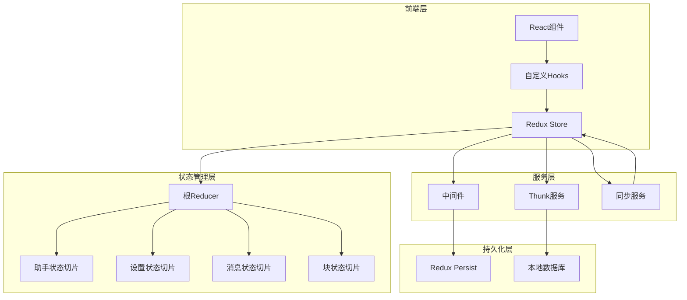

**图表来源**
- [src/renderer/src/store/index.ts](file://src/renderer/src/store/index.ts#L38-L64)
- [src/renderer/src/store/assistants.ts](file://src/renderer/src/store/assistants.ts#L30-L33)
- [src/renderer/src/store/settings.ts](file://src/renderer/src/store/settings.ts#L420-L423)

## 核心状态管理模式

### 1. 分层状态架构

Cherry Studio采用分层的状态管理架构，每个状态切片专注于特定的功能领域：

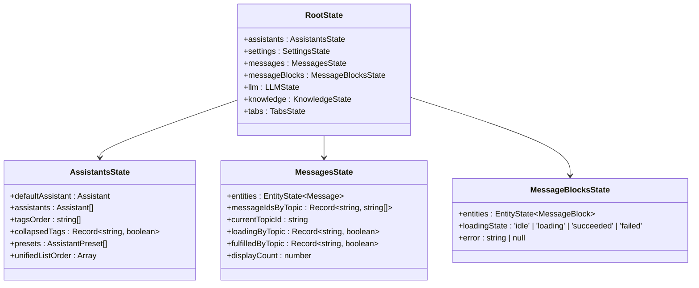

**图表来源**
- [src/renderer/src/store/index.ts](file://src/renderer/src/store/index.ts#L105-L106)
- [src/renderer/src/store/assistants.ts](file://src/renderer/src/store/assistants.ts#L12-L19)
- [src/renderer/src/store/newMessage.ts](file://src/renderer/src/store/newMessage.ts#L14-L20)

### 2. 类型安全的状态定义

系统使用TypeScript确保类型安全，每个状态切片都有明确的类型定义：

**章节来源**
- [src/renderer/src/store/assistants.ts](file://src/renderer/src/store/assistants.ts#L12-L19)
- [src/renderer/src/store/settings.ts](file://src/renderer/src/store/settings.ts#L40-L226)
- [src/renderer/src/store/newMessage.ts](file://src/renderer/src/store/newMessage.ts#L14-L20)

### 3. 状态切片模式

每个状态切片都遵循统一的模式：

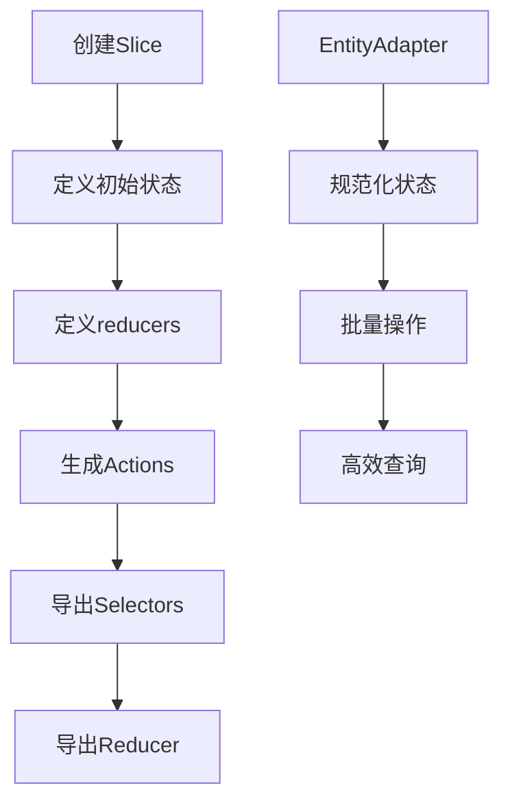

**图表来源**
- [src/renderer/src/store/newMessage.ts](file://src/renderer/src/store/newMessage.ts#L83-L272)
- [src/renderer/src/store/messageBlock.ts](file://src/renderer/src/store/messageBlock.ts#L27-L66)

## 状态管理最佳实践

### 1. 避免直接修改状态

Cherry Studio严格遵循不可变性原则，所有状态更新都通过Redux Toolkit提供的工具函数完成：

#### 良好实践：
```typescript
// ✅ 正确：使用createSlice自动处理不可变更新
const assistantsSlice = createSlice({
  name: 'assistants',
  initialState,
  reducers: {
    updateAssistant: (state, action: PayloadAction<Partial<Assistant> & { id: string }>) => {
      const { id, ...update } = action.payload
      state.assistants = state.assistants.map((c) => 
        c.id === id ? { ...c, ...update } : c
      )
    }
  }
})
```

#### 错误实践：
```typescript
// ❌ 错误：直接修改状态
state.assistants[index].name = newName // 直接修改会导致不可预测的行为
```

**章节来源**
- [src/renderer/src/store/assistants.ts](file://src/renderer/src/store/assistants.ts#L56-L59)

### 2. 使用纯函数进行状态更新

所有reducer必须是纯函数，不包含副作用：

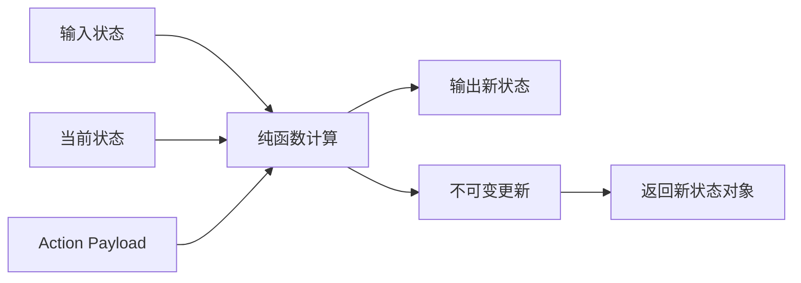

**图表来源**
- [src/renderer/src/store/assistants.ts](file://src/renderer/src/store/assistants.ts#L34-L82)

### 3. 合理拆分reducer

根据功能边界合理拆分状态切片，避免单一切片过于复杂：

| 状态切片 | 职责范围 | 主要功能 |
|---------|----------|----------|
| assistants | 助手和对话管理 | 助手配置、话题管理、预设管理 |
| settings | 应用配置管理 | 用户偏好、主题设置、代理配置 |
| messages | 消息内容管理 | 消息存储、排序、过滤 |
| messageBlocks | 块级内容管理 | 代码块、图片、文件块处理 |
| llm | 大语言模型管理 | 模型配置、API密钥管理 |

**章节来源**
- [src/renderer/src/store/index.ts](file://src/renderer/src/store/index.ts#L8-L34)

### 4. 使用middleware处理副作用

系统使用Redux Toolkit的middleware机制处理异步操作和副作用：

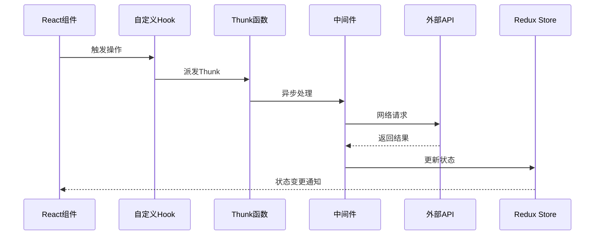

**图表来源**
- [src/renderer/src/store/thunk/messageThunk.ts](file://src/renderer/src/store/thunk/messageThunk.ts#L740-L800)
- [src/renderer/src/services/StoreSyncService.ts](file://src/renderer/src/services/StoreSyncService.ts#L55-L71)

**章节来源**
- [src/renderer/src/store/thunk/messageThunk.ts](file://src/renderer/src/store/thunk/messageThunk.ts#L1-L50)

## 异步操作处理

### 1. Thunk模式的应用

Cherry Studio广泛使用Redux Toolkit的Thunk模式处理复杂的异步操作：

#### 标准异步操作流程：

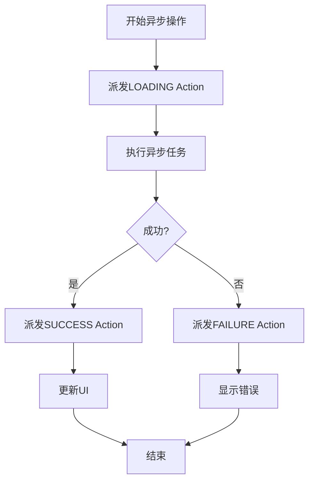

**图表来源**
- [src/renderer/src/store/thunk/messageThunk.ts](file://src/renderer/src/store/thunk/messageThunk.ts#L60-L64)

### 2. 状态选择器的使用规范

系统提供了高效的Selector机制，支持复杂的派生状态计算：

#### 高效Selector模式：

```typescript
// ✅ 推荐：使用createSelector进行高效计算
export const selectMessagesForTopic = createSelector(
  [selectMessageEntities, (state: RootState, topicId: string) => state.messages.messageIdsByTopic[topicId]],
  (messageEntities, topicMessageIds) => {
    if (!topicMessageIds) {
      return []
    }
    return topicMessageIds.map((id) => messageEntities[id]).filter((m): m is Message => !!m)
  }
)
```

#### 错误的Selector使用：

```typescript
// ❌ 不推荐：在组件中直接进行复杂计算
const messages = useMemo(() => {
  return Object.values(messagesState.entities)
    .filter(m => m && m.topicId === topicId)
    .sort((a, b) => a.timestamp - b.timestamp)
}, [messagesState.entities, topicId])
```

**章节来源**
- [src/renderer/src/store/newMessage.ts](file://src/renderer/src/store/newMessage.ts#L291-L305)

### 3. 异步操作的错误处理

系统实现了完善的异步操作错误处理机制：

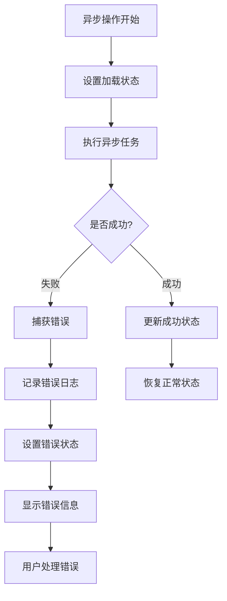

**图表来源**
- [src/renderer/src/store/thunk/messageThunk.ts](file://src/renderer/src/store/thunk/messageThunk.ts#L54-L56)
- [src/renderer/src/utils/error.ts](file://src/renderer/src/utils/error.ts#L52-L86)

**章节来源**
- [src/renderer/src/store/thunk/messageThunk.ts](file://src/renderer/src/store/thunk/messageThunk.ts#L54-L56)
- [src/renderer/src/utils/error.ts](file://src/renderer/src/utils/error.ts#L37-L86)

## 性能优化策略

### 1. 状态缓存机制

系统实现了多层次的缓存策略：

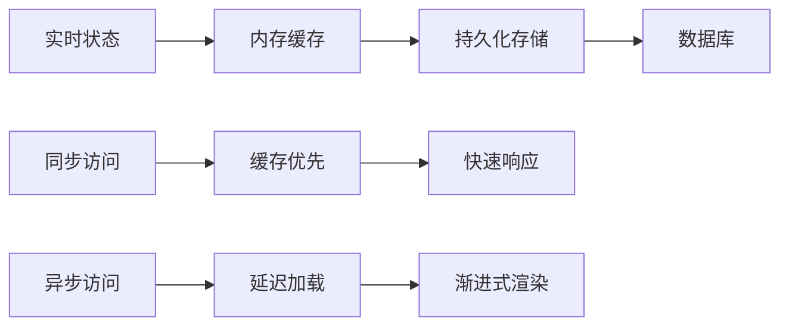

**图表来源**
- [src/main/services/ReduxService.ts](file://src/main/services/ReduxService.ts#L60-L75)

### 2. 节流和防抖技术

对于频繁更新的状态，系统使用节流和防抖技术优化性能：

#### 消息块更新节流：

```typescript
// 节流器管理
const blockUpdateThrottlers = new LRUCache<string, ReturnType<typeof throttle>>({
  max: 100,
  ttl: 1000 * 60 * 5,
  updateAgeOnGet: true
})

// 节流更新函数
export const throttledBlockUpdate = (id: string, blockUpdate: any) => {
  const throttler = getBlockThrottler(id)
  throttler(blockUpdate)
}
```

**章节来源**
- [src/renderer/src/store/thunk/messageThunk.ts](file://src/renderer/src/store/thunk/messageThunk.ts#L387-L427)

### 3. 智能状态订阅

系统提供智能的状态订阅机制，只在必要时触发重新渲染：

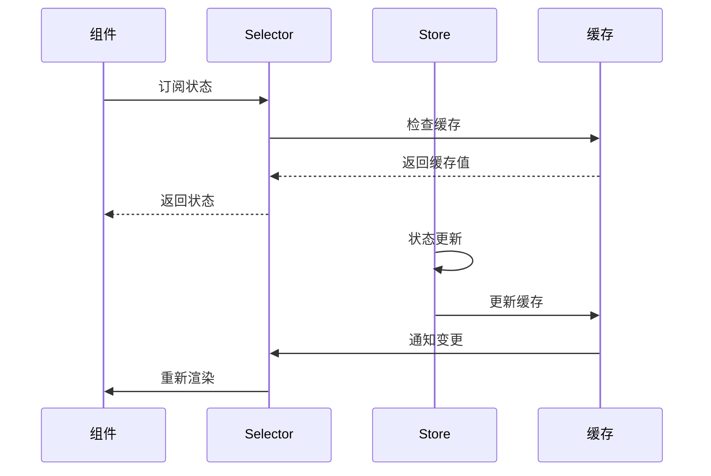

**图表来源**
- [src/main/services/ReduxService.ts](file://src/main/services/ReduxService.ts#L124-L164)

### 4. 内存管理优化

系统实现了智能的内存管理策略：

| 优化策略 | 实现方式 | 效果 |
|---------|----------|------|
| LRU缓存 | 使用LRUCache限制缓存大小 | 防止内存泄漏 |
| 延迟加载 | 按需加载大型数据集 | 减少初始内存占用 |
| 对象池 | 复用临时对象 | 减少GC压力 |
| 弱引用 | 使用WeakMap避免循环引用 | 自动垃圾回收 |

**章节来源**
- [src/renderer/src/store/thunk/messageThunk.ts](file://src/renderer/src/store/thunk/messageThunk.ts#L387-L401)

## 错误处理机制

### 1. 分层错误处理

系统采用分层的错误处理策略：

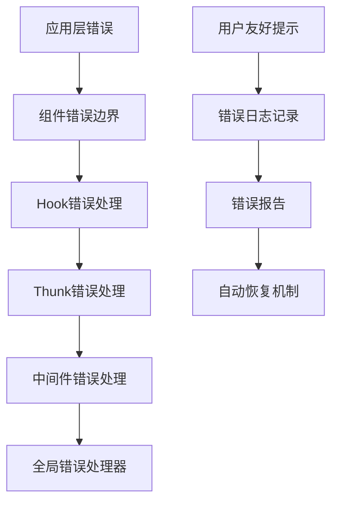

**图表来源**
- [src/renderer/src/utils/error.ts](file://src/renderer/src/utils/error.ts#L52-L86)

### 2. 错误恢复策略

系统实现了多种错误恢复机制：

#### 自动重试机制：
```typescript
// 网络请求重试
const retryOperation = async <T>(
  operation: () => Promise<T>,
  maxRetries: number = 3
): Promise<T> => {
  let lastError: Error;
  
  for (let i = 0; i < maxRetries; i++) {
    try {
      return await operation();
    } catch (error) {
      lastError = error as Error;
      if (i < maxRetries - 1) {
        await new Promise(resolve => setTimeout(resolve, 1000 * (i + 1)));
      }
    }
  }
  
  throw lastError!;
}
```

#### 状态回滚机制：
```typescript
// 状态变更前备份
const backupState = store.getState();

// 异步操作失败时回滚
try {
  await performAsyncOperation();
  // 操作成功，保留新状态
} catch (error) {
  // 恢复备份状态
  store.dispatch(restoreState(backupState));
}
```

**章节来源**
- [src/renderer/src/utils/error.ts](file://src/renderer/src/utils/error.ts#L37-L86)

### 3. 错误监控和报告

系统集成了完善的错误监控机制：

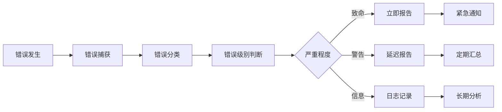

**图表来源**
- [src/renderer/src/utils/error.ts](file://src/renderer/src/utils/error.ts#L52-L86)

## 常见陷阱与解决方案

### 1. 状态更新时机问题

#### 问题描述：
在异步操作中，状态更新时机不当导致竞态条件。

#### 解决方案：
```typescript
// ✅ 正确：使用正确的状态更新时机
const fetchData = createAsyncThunk(
  'data/fetch',
  async (payload, { dispatch, getState }) => {
    // 1. 开始加载
    dispatch(setLoading(true));
    
    try {
      // 2. 执行异步操作
      const data = await api.getData(payload);
      
      // 3. 更新状态（在异步操作完成后）
      dispatch(setData(data));
    } catch (error) {
      // 4. 处理错误
      dispatch(setError(error));
    } finally {
      // 5. 结束加载
      dispatch(setLoading(false));
    }
  }
);
```

### 2. 内存泄漏问题

#### 问题描述：
未正确清理事件监听器和定时器导致内存泄漏。

#### 解决方案：
```typescript
// ✅ 正确：使用useEffect清理资源
const useSubscription = (selector: string, callback: Function) => {
  useEffect(() => {
    const unsubscribe = reduxService.subscribe(selector, callback);
    
    return () => {
      unsubscribe(); // 清理订阅
    };
  }, [selector, callback]);
};
```

### 3. 性能问题

#### 问题描述：
频繁的状态更新导致不必要的重新渲染。

#### 解决方案：
```typescript
// ✅ 正确：使用memoization优化性能
const MemoizedComponent = memo(Component, (prevProps, nextProps) => {
  return isEqual(prevProps.data, nextProps.data);
});

// 或者使用useCallback
const handleUpdate = useCallback((newData) => {
  dispatch(updateData(newData));
}, [dispatch]);
```

### 4. 类型安全问题

#### 问题描述：
类型定义不完整或不准确导致运行时错误。

#### 解决方案：
```typescript
// ✅ 正确：使用严格的类型定义
interface MessageState {
  entities: Record<string, Message>;
  ids: string[];
  currentTopicId: string | null;
  loading: boolean;
}

// 使用类型保护
const isMessage = (obj: any): obj is Message => {
  return obj && typeof obj.id === 'string';
};
```

**章节来源**
- [src/renderer/src/hooks/useTemporaryValue.ts](file://src/renderer/src/hooks/useTemporaryValue.ts#L27-L39)

## 实际应用示例

### 1. 复杂消息处理流程

以下是一个完整的消息处理示例，展示了状态管理的最佳实践：

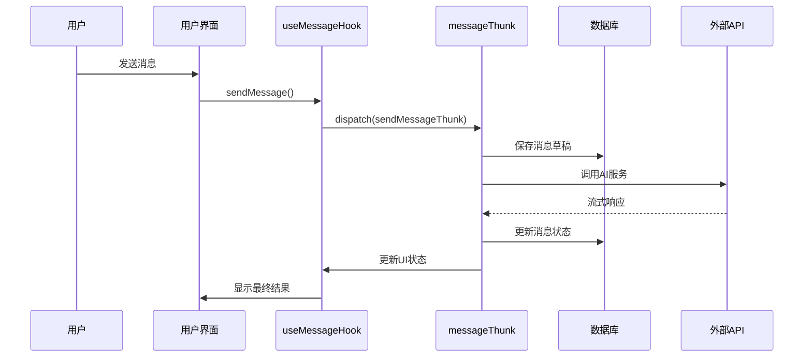

**图表来源**
- [src/renderer/src/store/thunk/messageThunk.ts](file://src/renderer/src/store/thunk/messageThunk.ts#L740-L800)

### 2. 跨窗口状态同步

系统支持多窗口间的状态同步：

```typescript
// 主窗口初始化同步
export const initializeStoreSync = () => {
  storeSyncService.setOptions({
    syncList: ['assistants/', 'settings/', 'llm/', 'selectionStore/', 'note/']
  });
  
  storeSyncService.subscribe();
};

// 在窗口入口点调用
initializeStoreSync();
```

**章节来源**
- [src/renderer/src/services/StoreSyncService.ts](file://src/renderer/src/services/StoreSyncService.ts#L89-L138)

### 3. 复杂状态选择器示例

```typescript
// 高效的消息选择器
export const selectOptimizedMessages = createSelector(
  [
    selectMessageEntities,
    (state: RootState, topicId: string) => state.messages.messageIdsByTopic[topicId],
    (state: RootState) => state.settings.messageDisplayMode
  ],
  (entities, messageIds, displayMode) => {
    if (!messageIds) return [];
    
    return messageIds
      .map(id => entities[id])
      .filter(isDefined)
      .filter(msg => shouldDisplayMessage(msg, displayMode))
      .sort(compareTimestamp);
  }
);
```

### 4. 错误处理示例

```typescript
// 完整的错误处理Thunk
export const fetchUserData = createAsyncThunk(
  'user/fetch',
  async (userId: string, { rejectWithValue }) => {
    try {
      // 1. 验证输入
      if (!userId) {
        throw new Error('User ID is required');
      }
      
      // 2. 执行网络请求
      const response = await api.getUser(userId);
      
      // 3. 验证响应
      if (!response.data) {
        throw new Error('Invalid user data received');
      }
      
      return response.data;
    } catch (error) {
      // 4. 格式化错误
      const formattedError = formatErrorMessage(error);
      
      // 5. 记录错误
      logger.error('Failed to fetch user data:', {
        userId,
        error: formattedError
      });
      
      // 6. 返回错误信息
      return rejectWithValue(formattedError);
    }
  }
);
```

**章节来源**
- [src/renderer/src/store/thunk/messageThunk.ts](file://src/renderer/src/store/thunk/messageThunk.ts#L54-L56)
- [src/renderer/src/utils/error.ts](file://src/renderer/src/utils/error.ts#L52-L86)

## 总结

Cherry Studio的状态管理系统展现了现代前端应用的最佳实践，主要体现在以下几个方面：

### 核心优势

1. **类型安全**：完整的TypeScript类型定义确保了开发时的类型安全
2. **模块化设计**：清晰的状态切片划分便于维护和扩展
3. **性能优化**：多层次的缓存和优化策略保证了良好的用户体验
4. **错误处理**：完善的错误处理和恢复机制提高了应用的稳定性
5. **跨窗口同步**：支持多窗口间的状态共享和同步

### 最佳实践要点

1. **遵循不可变性原则**：所有状态更新都通过Redux Toolkit的工具函数完成
2. **合理拆分状态**：根据功能边界拆分状态切片，保持单一职责
3. **使用纯函数**：确保所有reducer都是纯函数，无副作用
4. **智能缓存**：实现多层次的缓存策略，提升性能
5. **完善错误处理**：建立分层的错误处理机制，提供良好的用户体验

### 发展方向

随着应用规模的增长，系统还可以在以下方面进一步优化：

1. **状态序列化优化**：改进大型状态的序列化和传输效率
2. **增量更新机制**：实现更细粒度的状态更新策略
3. **分布式状态管理**：支持更复杂的分布式状态同步场景
4. **性能监控增强**：集成更详细的性能监控和分析工具

通过遵循这些最佳实践，开发者可以构建出既稳定又高效的前端应用，为用户提供优秀的使用体验。