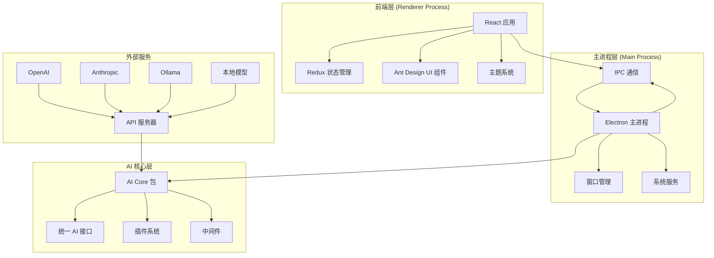
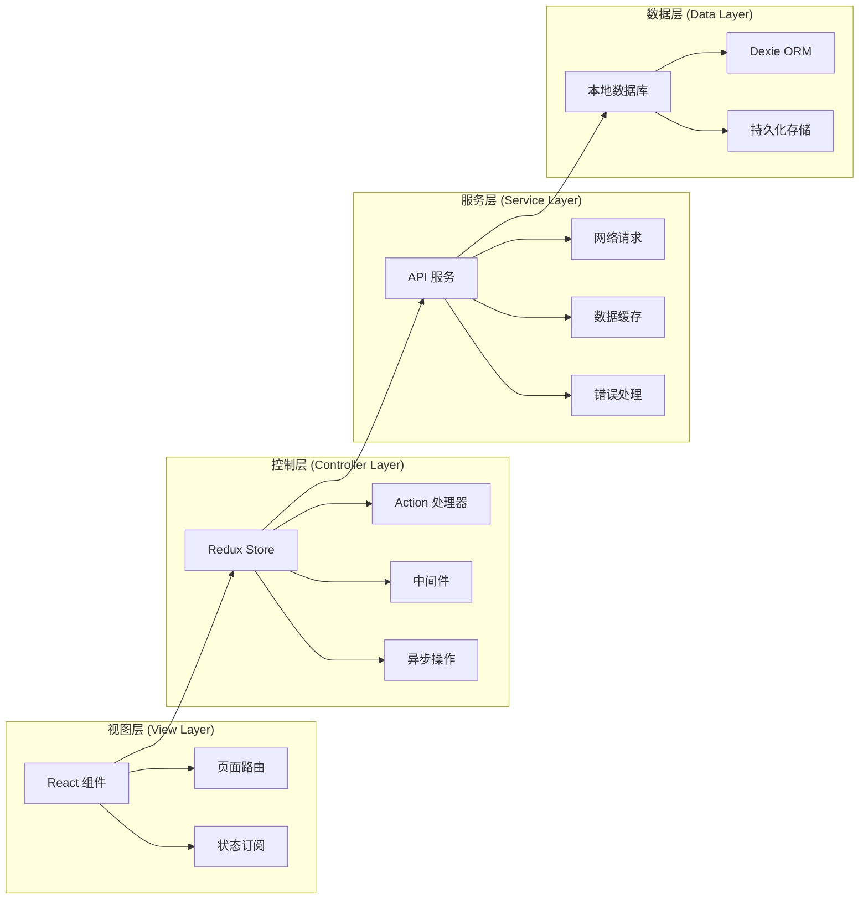
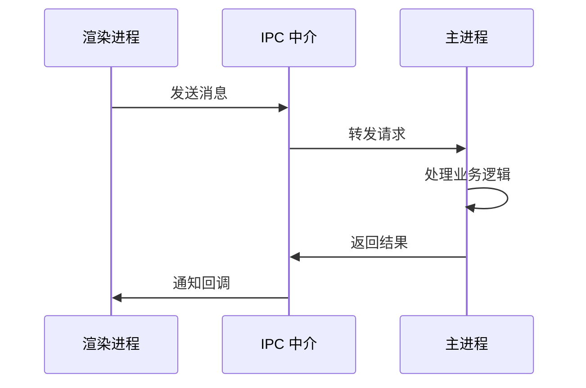

# Cherry Studio 项目概述

<cite>
**本文档引用的文件**
- [README.md](file://README.md)
- [package.json](file://package.json)
- [electron.vite.config.ts](file://electron.vite.config.ts)
- [src/main/index.ts](file://src/main/index.ts)
- [src/renderer/src/App.tsx](file://src/renderer/src/App.tsx)
- [src/main/services/ApiServerService.ts](file://src/main/services/ApiServerService.ts)
- [src/main/services/MCPService.ts](file://src/main/services/MCPService.ts)
- [src/renderer/src/config/providers.ts](file://src/renderer/src/config/providers.ts)
- [packages/aiCore/src/index.ts](file://packages/aiCore/src/index.ts)
- [src/renderer/src/store/index.ts](file://src/renderer/src/store/index.ts)
- [src/main/services/agents/index.ts](file://src/main/services/agents/index.ts)
- [src/main/ipc.ts](file://src/main/ipc.ts)
- [src/main/services/WindowService.ts](file://src/main/services/WindowService.ts)
</cite>

## 目录
1. [项目简介](#项目简介)
2. [技术架构概览](#技术架构概览)
3. [核心功能模块](#核心功能模块)
4. [AI 提供商支持](#ai-提供商支持)
5. [系统架构设计](#系统架构设计)
6. [技术栈详解](#技术栈详解)
7. [项目特色与优势](#项目特色与优势)
8. [目标用户群体](#目标用户群体)
9. [总结](#总结)

## 项目简介

Cherry Studio 是一个基于 Electron 框架构建的多 LLM（大语言模型）提供商桌面客户端，专为现代 AI 助手使用场景而设计。该项目旨在为用户提供统一的 AI 助手平台，支持多种 AI 模型提供商，包括云端服务和本地模型，同时提供丰富的文档处理和实用工具功能。

作为一款跨平台应用程序，Cherry Studio 支持 Windows、Mac 和 Linux 系统，采用现代化的前端技术栈和 Electron 进程间通信机制，为用户带来流畅的 AI 交互体验。

**章节来源**
- [README.md](file://README.md#L66-L70)
- [package.json](file://package.json#L1-L10)

## 技术架构概览

Cherry Studio 采用了现代化的分层架构设计，基于 Electron 框架实现桌面应用，结合 TypeScript、React 和 Redux 等核心技术栈。

**图表来源**
- [src/renderer/src/App.tsx](file://src/renderer/src/App.tsx#L1-L56)
- [src/main/index.ts](file://src/main/index.ts#L1-L257)
- [packages/aiCore/src/index.ts](file://packages/aiCore/src/index.ts#L1-L47)

**章节来源**
- [electron.vite.config.ts](file://electron.vite.config.ts#L1-L130)
- [src/main/services/ApiServerService.ts](file://src/main/services/ApiServerService.ts#L1-L115)

## 核心功能模块

Cherry Studio 提供了七大核心功能模块，每个模块都经过精心设计以满足不同用户的使用需求：

### 1. AI 助手与对话系统

- **300+ 预配置 AI 助手**：内置大量预设助手，涵盖各种专业领域
- **自定义助手创建**：支持用户根据需求创建个性化 AI 助手
- **多模型并发对话**：同时使用多个 AI 模型进行对话，提升效率

### 2. 文档与数据处理

- **多格式文件支持**：支持文本、图片、Office、PDF 等多种文件格式
- **WebDAV 文件管理**：提供云端文件同步和备份功能
- **Mermaid 图表可视化**：支持流程图、时序图等图表生成
- **代码语法高亮**：完整的编程语言支持和代码美化

### 3. 实用工具集成

- **全局搜索功能**：跨平台内容搜索和快速定位
- **话题管理系统**：结构化知识组织和管理
- **AI 翻译功能**：智能语言翻译服务
- **拖拽排序**：直观的内容管理和组织

### 4. MCP（Model Context Protocol）服务器

- **插件生态支持**：完整的 MCP 协议实现
- **第三方工具集成**：支持外部工具和服务接入
- **自动化工作流**：构建复杂的 AI 工作流程

### 5. 知识管理体系

- **文档预处理**：智能文档解析和处理
- **知识库管理**：结构化知识存储和检索
- **OCR 文字识别**：图像文字提取和识别

### 6. 用户体验优化

- **跨平台支持**：Windows、Mac、Linux 全平台覆盖
- **主题系统**：明暗主题切换和透明窗口效果
- **Markdown 渲染**：完整的 Markdown 语法支持
- **内容分享**：便捷的内容导出和分享功能

**章节来源**
- [README.md](file://README.md#L80-L117)
- [src/renderer/src/config/providers.ts](file://src/renderer/src/config/providers.ts#L1-L800)

## AI 提供商支持

Cherry Studio 支持超过 100 家 AI 提供商，涵盖了从主流云服务到本地部署的各种选择：

### 主要云服务提供商

| 提供商 | 类型 | 特色功能 |
|--------|------|----------|
| OpenAI | 通用 AI | GPT 系列模型、函数调用 |
| Anthropic | Claude 系列 | 安全性优先、长上下文 |
| Google Gemini | 多模态 | 视觉理解、语音交互 |
| Azure OpenAI | 企业级 | 合规性、私有化部署 |

### 本地模型支持

| 平台 | 特点 | 适用场景 |
|------|------|----------|
| Ollama | 轻量级 | 个人开发者、边缘计算 |
| LM Studio | 易用性 | 快速原型开发 |
| Intel OpenVINO | 硬件加速 | 边缘设备部署 |

### 第三方集成

- **Poe**：一站式 AI 服务平台
- **Perplexity**：智能搜索引擎
- **GitHub Copilot**：代码辅助工具

**章节来源**
- [src/renderer/src/config/providers.ts](file://src/renderer/src/config/providers.ts#L65-L700)

## 系统架构设计

Cherry Studio 采用了模块化的 MVC 类似架构模式，结合 Electron 的进程分离机制实现高效的功能组织：

**图表来源**
- [src/renderer/src/store/index.ts](file://src/renderer/src/store/index.ts#L1-L137)
- [src/main/services/WindowService.ts](file://src/main/services/WindowService.ts#L26-L685)

### 架构特点

1. **模块化设计**：功能按模块划分，便于维护和扩展
2. **状态管理**：使用 Redux 进行全局状态管理
3. **进程隔离**：主进程和渲染进程分离，提高稳定性
4. **插件系统**：支持功能扩展和第三方集成

### IPC 通信机制

Electron 的 IPC（进程间通信）机制是系统架构的核心：

**图表来源**
- [src/main/ipc.ts](file://src/main/ipc.ts#L1-L800)

**章节来源**
- [src/main/services/ApiServerService.ts](file://src/main/services/ApiServerService.ts#L1-L115)
- [src/main/services/MCPService.ts](file://src/main/services/MCPService.ts#L1-L800)

## 技术栈详解

### 前端技术栈

| 技术 | 版本 | 用途 |
|------|------|------|
| React | 19.2.0 | 用户界面框架 |
| TypeScript | 5.8.2 | 类型安全 |
| Ant Design | 5.27.0 | UI 组件库 |
| Redux Toolkit | 2.2.5 | 状态管理 |
| Tailwind CSS | 4.1.13 | 样式框架 |

### 后端技术栈

| 技术 | 版本 | 用途 |
|------|------|------|
| Electron | 38.7.0 | 桌面应用框架 |
| Express | 5.1.0 | Web 服务器 |
| Vite | 7.1.5 | 构建工具 |
| TypeScript | 5.8.2 | 类型安全 |

### AI 核心技术

| 技术 | 版本 | 用途 |
|------|------|------|
| Vercel AI SDK | - | 统一 AI 接口 |
| LangChain | 1.0.2 | AI 应用框架 |
| OpenAI SDK | 6.5.0 | OpenAI 集成 |

### 数据存储

| 技术 | 用途 |
|------|------|
| Dexie | 浏览器数据库 |
| LibSQL | 本地数据存储 |
| SQLite | 关系型数据 |

**章节来源**
- [package.json](file://package.json#L83-L429)
- [electron.vite.config.ts](file://electron.vite.config.ts#L1-L130)

## 项目特色与优势

### 技术创新

1. **统一 AI 接口**：通过 AI Core 包实现 19+ AI 提供商的统一访问
2. **插件化架构**：支持第三方插件和工具集成
3. **实时协作**：多窗口状态同步和实时更新
4. **离线支持**：本地模型和缓存机制

### 功能完整性

- **全链路 AI 服务**：从模型选择到结果输出的完整流程
- **多模态支持**：文本、图像、音频等多种输入形式
- **企业级特性**：备份恢复、权限管理、审计日志

### 用户体验

- **响应式设计**：适配不同屏幕尺寸和分辨率
- **无障碍支持**：键盘导航和屏幕阅读器兼容
- **国际化**：多语言界面支持

**章节来源**
- [packages/aiCore/src/index.ts](file://packages/aiCore/src/index.ts#L1-L47)
- [README.md](file://README.md#L118-L155)

## 目标用户群体

### 主要用户

1. **开发者和技术人员**
   - 需要代码辅助和智能问答
   - 使用多种编程语言和工具
   - 对 AI 工具集成有需求

2. **内容创作者**
   - 需要写作辅助和创意激发
   - 处理大量文档和资料
   - 需要高效的编辑和整理工具

3. **研究人员和学者**
   - 进行学术研究和论文写作
   - 需要知识管理和文献处理
   - 对多语言支持有需求

4. **企业用户**
   - 需要团队协作和知识共享
   - 对数据安全和隐私保护重视
   - 需要定制化的解决方案

### 使用场景

- **日常办公**：文档撰写、邮件回复、会议记录
- **学习教育**：作业辅导、知识查询、语言学习
- **创意工作**：写作、设计、项目规划
- **专业应用**：代码开发、数据分析、技术咨询

## 总结

Cherry Studio 作为一个基于 Electron 框架的多 LLM 提供商桌面客户端，在 AI 助手领域具有显著的技术优势和市场定位。项目通过模块化的架构设计、统一的 AI 接口和丰富的功能集成，为用户提供了完整的 AI 助手解决方案。

### 核心价值

1. **技术先进性**：采用最新的前端技术和 Electron 框架
2. **功能完整性**：覆盖 AI 助手使用的各个方面
3. **用户体验**：注重易用性和跨平台一致性
4. **扩展性**：支持插件和第三方集成

### 发展前景

随着 AI 技术的不断发展和应用场景的拓展，Cherry Studio 将继续在以下几个方面进行优化和扩展：

- **AI 模型支持**：持续增加新的 AI 提供商和模型类型
- **功能增强**：完善知识管理和协作功能
- **性能优化**：提升应用响应速度和资源利用率
- **生态建设**：构建更加完善的插件和工具生态系统

Cherry Studio 致力于成为最优秀的 AI 助手桌面平台，为用户提供智能化、高效化的工作体验，推动 AI 技术在日常工作中的普及和应用。